# C4 Model Diagrams

The C4 model provides a hierarchical way to visualize software architecture at different levels of abstraction: Context, Containers, Components, and Code.

## C4 Model Levels

1. **System Context** - Shows the system and its users/external systems
2. **Container** - Shows applications, databases, and services within the system
3. **Component** - Shows internal structure of containers
4. **Code** - Class diagrams showing implementation details (use regular class diagrams)

## C4 Context Diagram

Shows the big picture: your system and its relationships with users and external systems.

### Basic Syntax

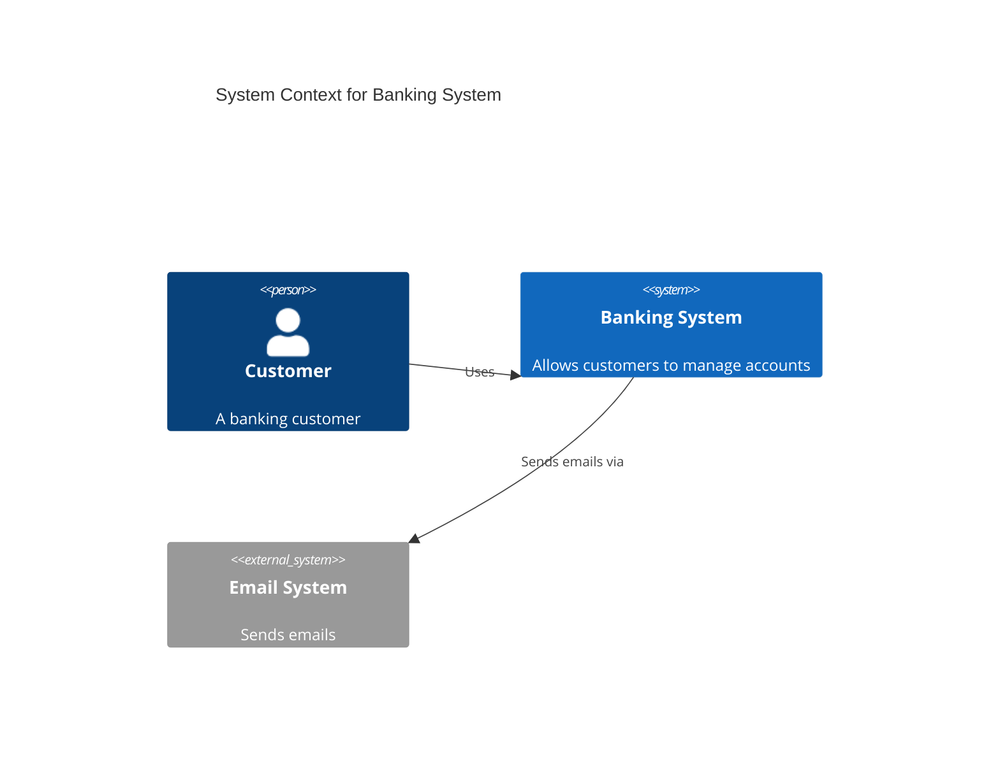

### Elements

**People:**
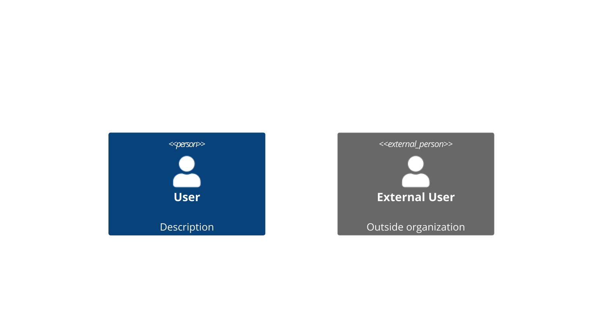

**Systems:**
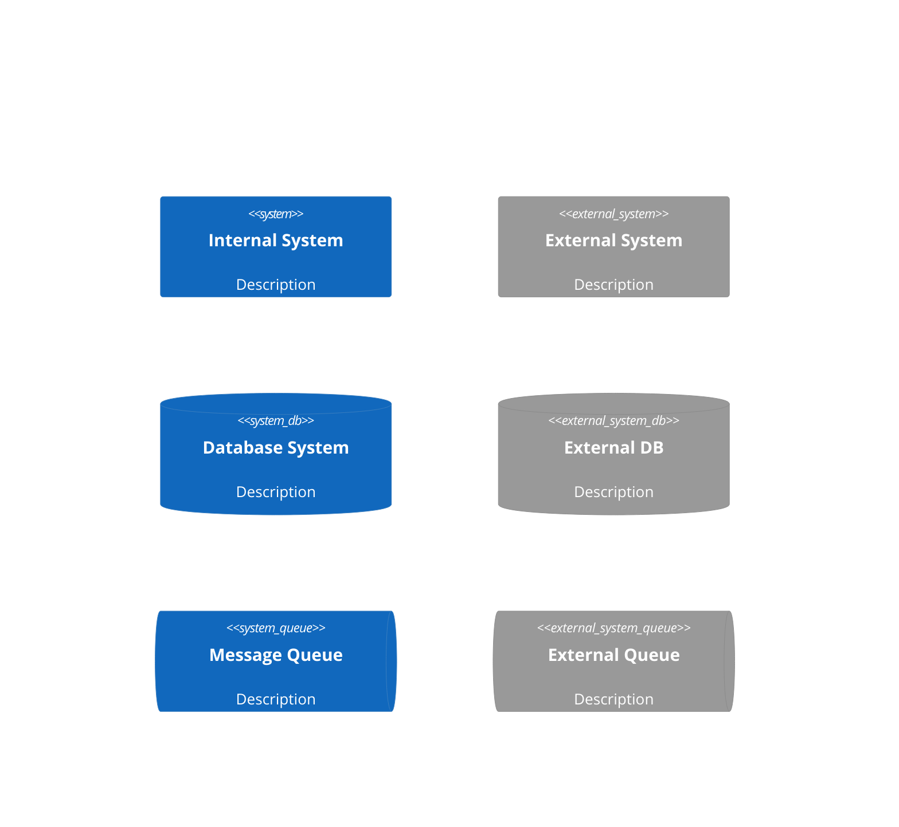

**Relationships:**
```mermaid
C4Context
    Rel(from, to, "Label")
    Rel(from, to, "Label", "Optional Technology")
    BiRel(system1, system2, "Bidirectional")
```

### Comprehensive Context Example

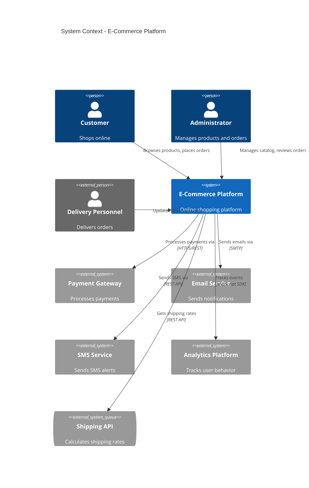

## C4 Container Diagram

Zooms into the system to show containers (applications, databases, services).

### Basic Syntax

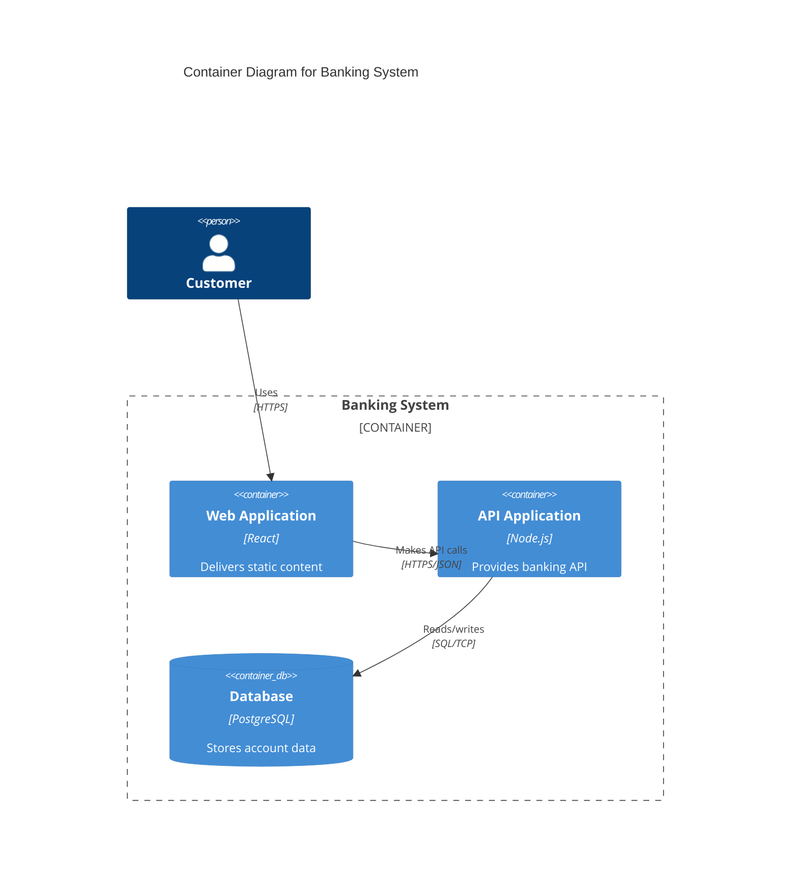

### Container Elements

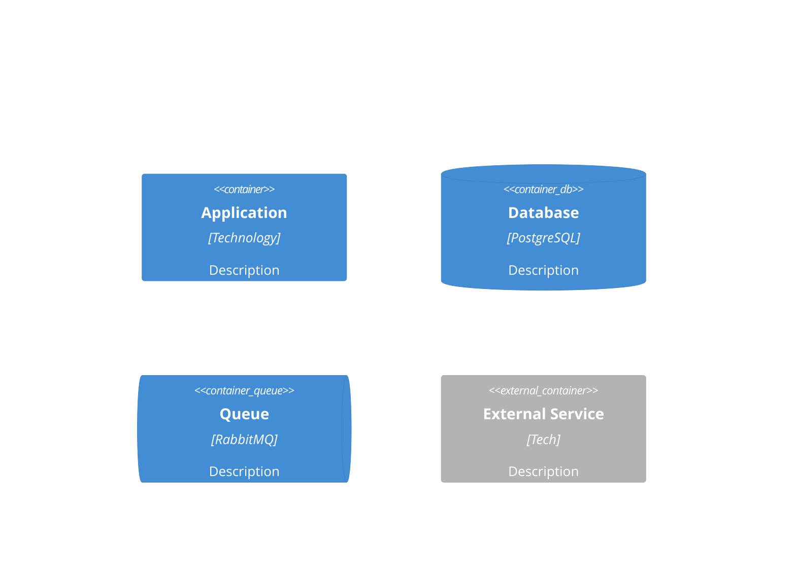

### Container Boundaries

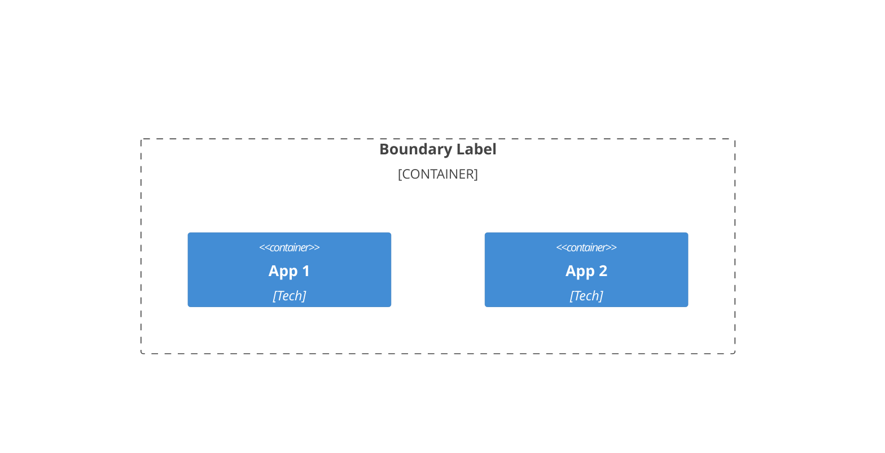

### Comprehensive Container Example

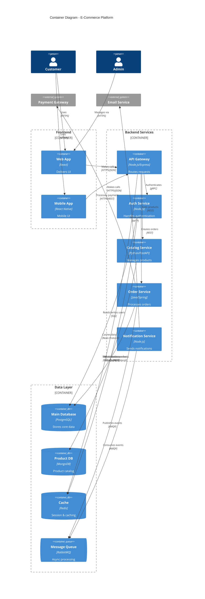

## C4 Component Diagram

Zooms into a container to show its internal components.

### Basic Syntax

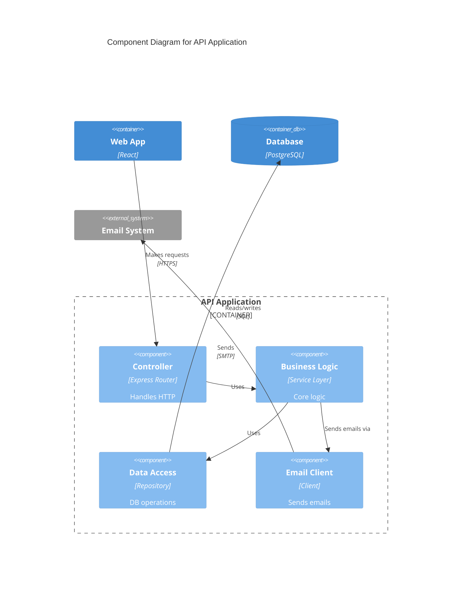

### Comprehensive Component Example

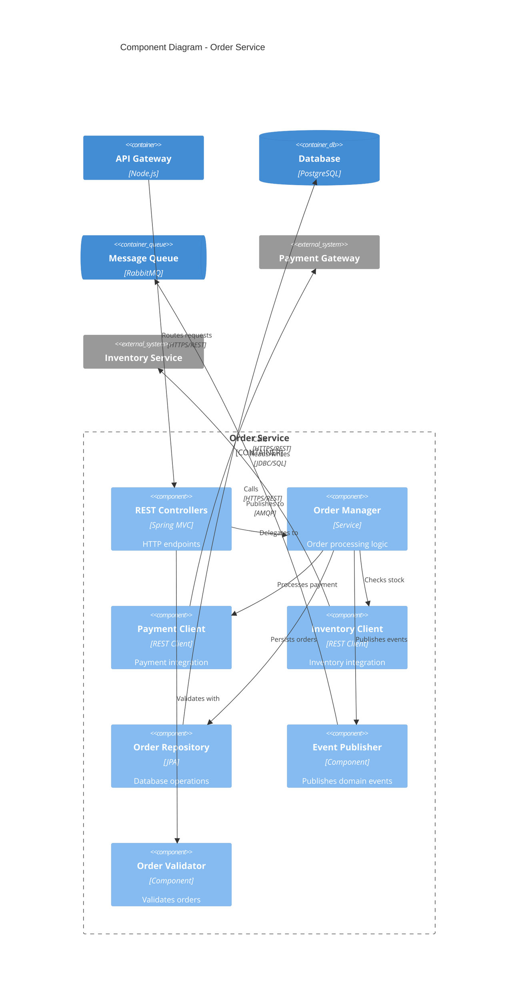

## Microservices Architecture Example

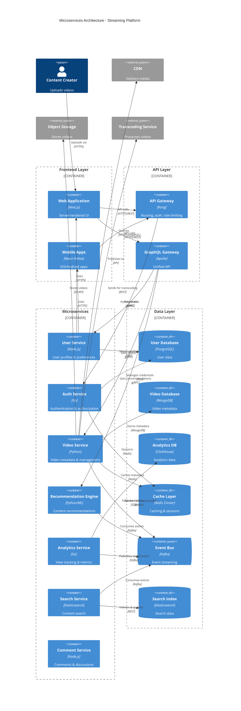

## Best Practices

1. **Use appropriate level** - Context for stakeholders, Container for architects, Component for developers
2. **Keep it focused** - One system per Context diagram, one container per Component diagram
3. **Show key relationships** - Don't clutter with every possible connection
4. **Use consistent naming** - Same names across all diagram levels
5. **Add technology details** - Specify frameworks, languages, protocols at Container/Component level
6. **Update regularly** - Keep diagrams in sync with architecture
7. **Use boundaries** - Group related containers/components logically
8. **Document protocols** - Show communication methods (REST, gRPC, messaging)
9. **Highlight external systems** - Use *_Ext variants for clarity
10. **Start simple** - Begin with Context, drill down as needed

## Common Architecture Patterns

### Monolithic Application
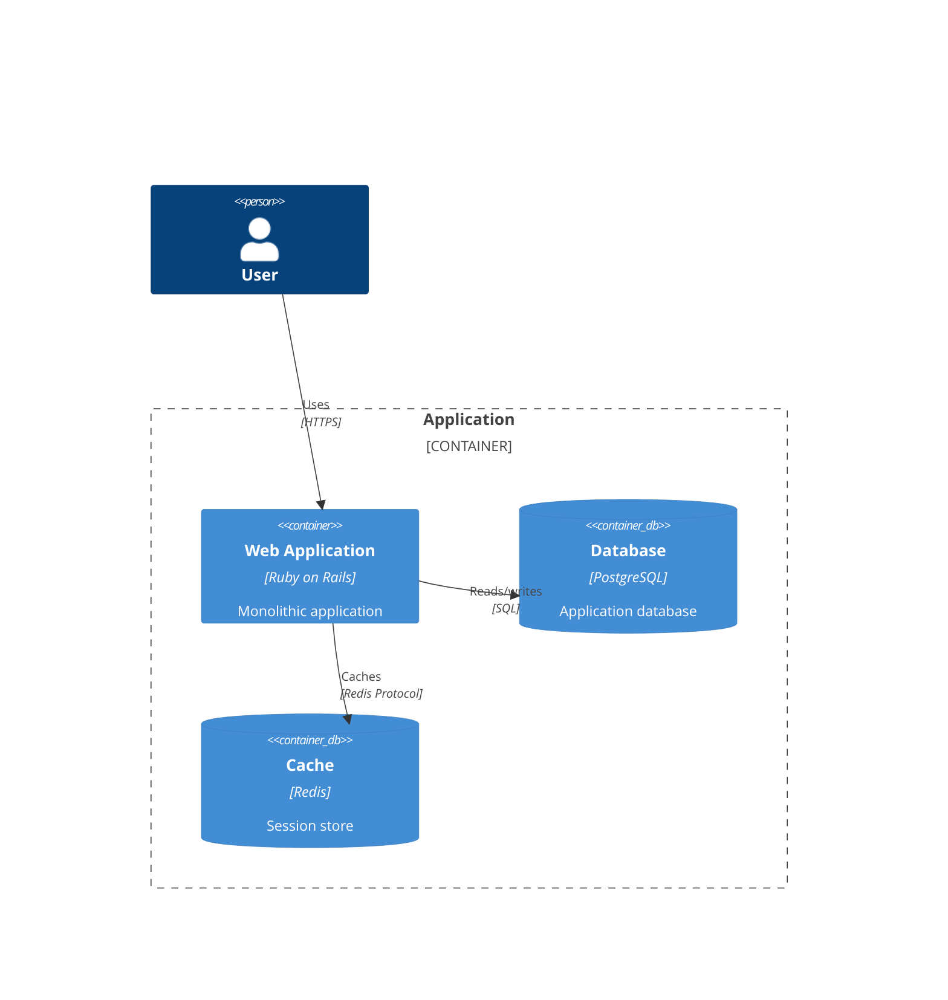

### Three-Tier Architecture
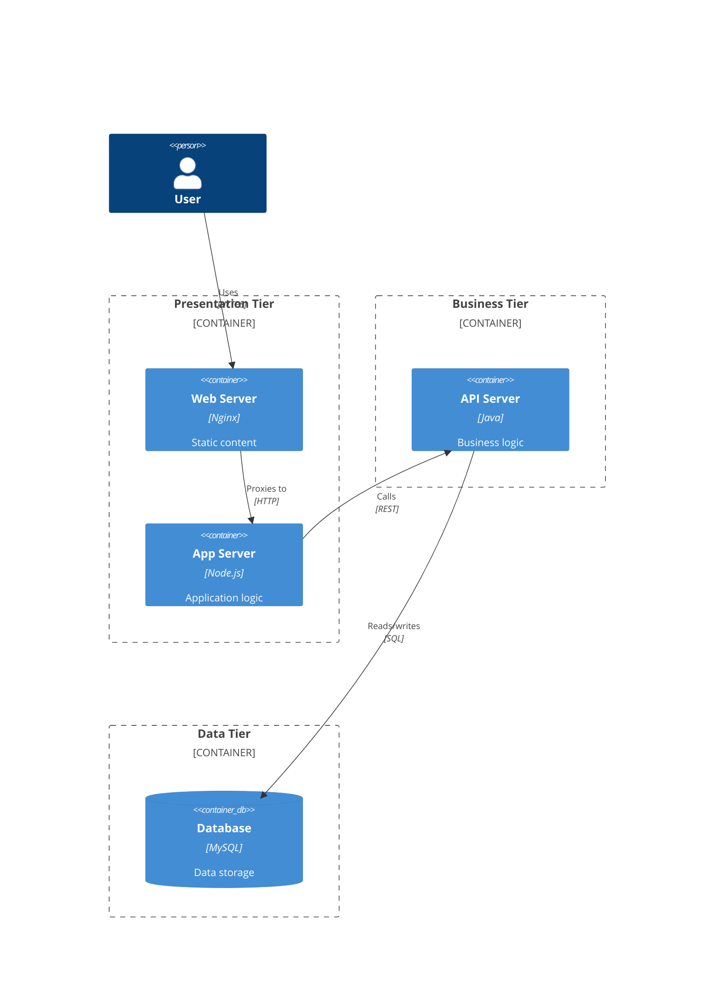

### Event-Driven Architecture
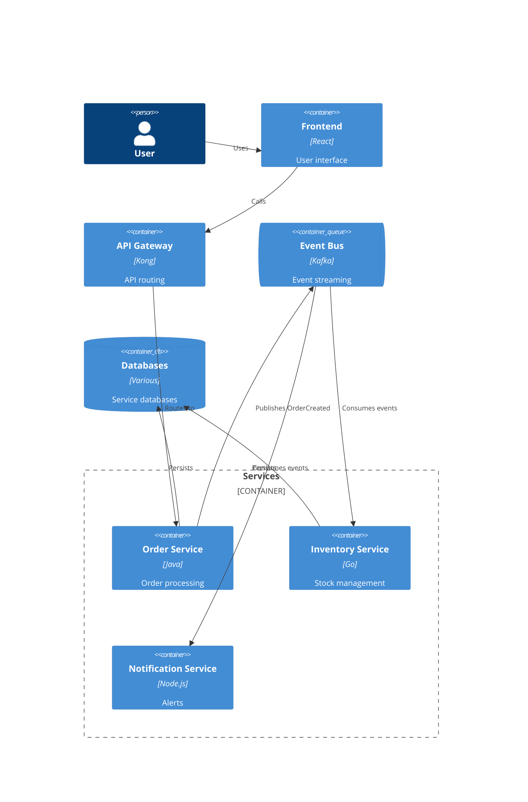
