# Entity Relationship Diagrams (ERD)

ERDs model database schemas, showing tables (entities), their columns (attributes), and relationships between tables. Essential for database design and documentation.

## Basic Syntax

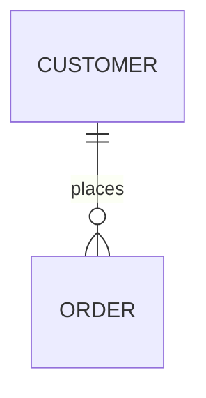

## Defining Entities

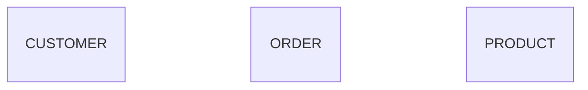

## Entity Attributes

Define columns with type and constraints:

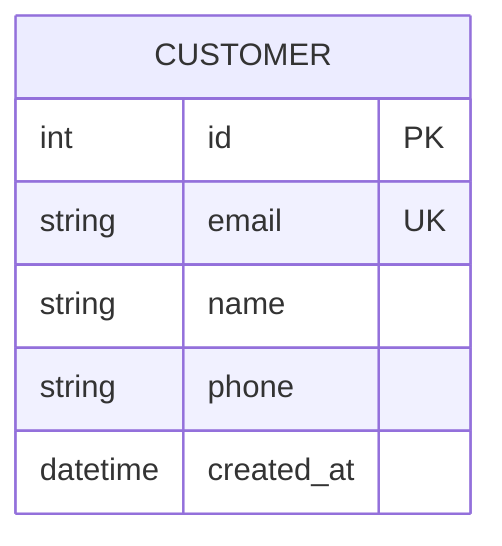

**Attribute format:** `type name constraints`

**Common constraints:**
- `PK` - Primary Key
- `FK` - Foreign Key
- `UK` - Unique Key
- `NN` - Not Null

## Relationships

### Relationship Symbols

**Cardinality indicators:**
- `||` - Exactly one
- `|o` - Zero or one
- `}{` - One or many
- `}o` - Zero or many

**Relationship line:**
- `--` - Non-identifying relationship
- `..` - Identifying relationship (rare in practice)

### Common Relationships

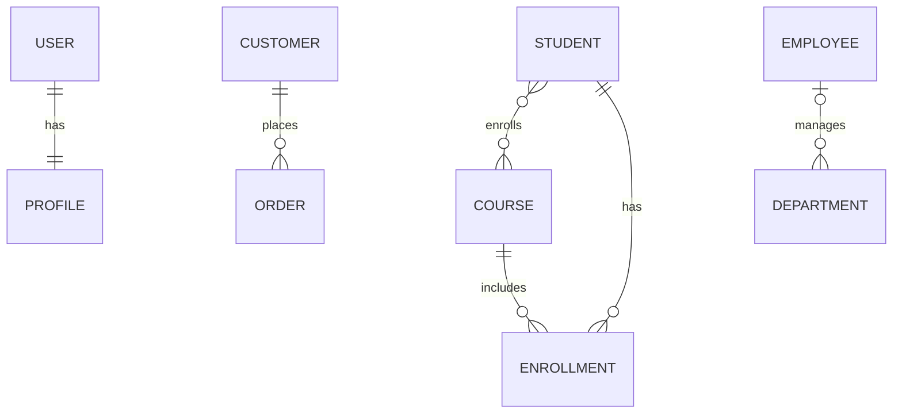

### Relationship with Labels

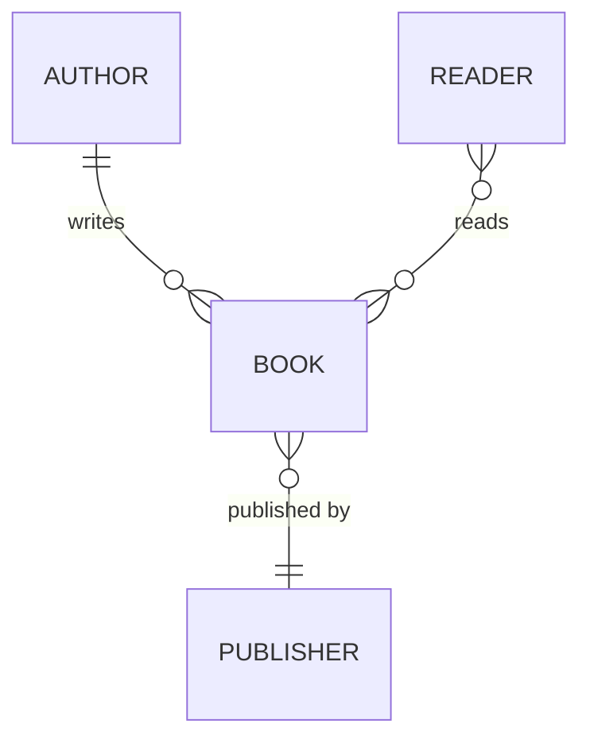

## Data Types

Use standard database types:
- `int`, `bigint`, `smallint`
- `varchar`, `text`, `char`
- `decimal`, `float`, `double`
- `boolean`, `bool`
- `date`, `datetime`, `timestamp`
- `json`, `jsonb`
- `uuid`
- `blob`, `bytea`

## Comprehensive Example: E-Commerce Database

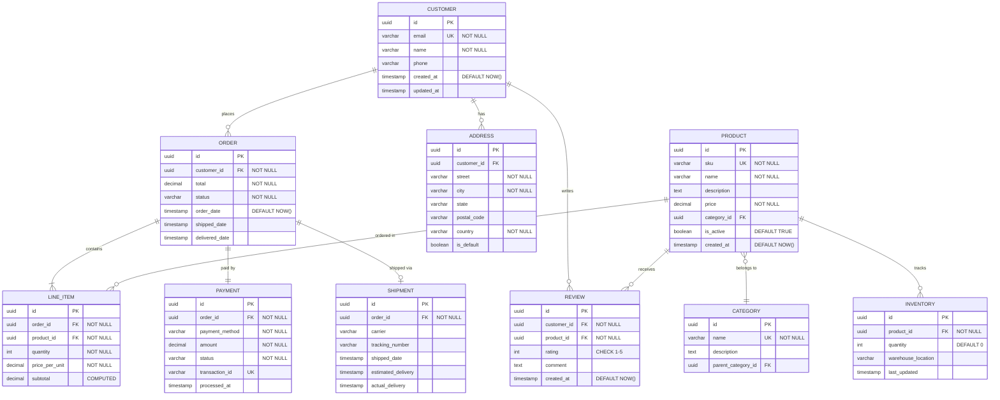

## Blog Platform Schema

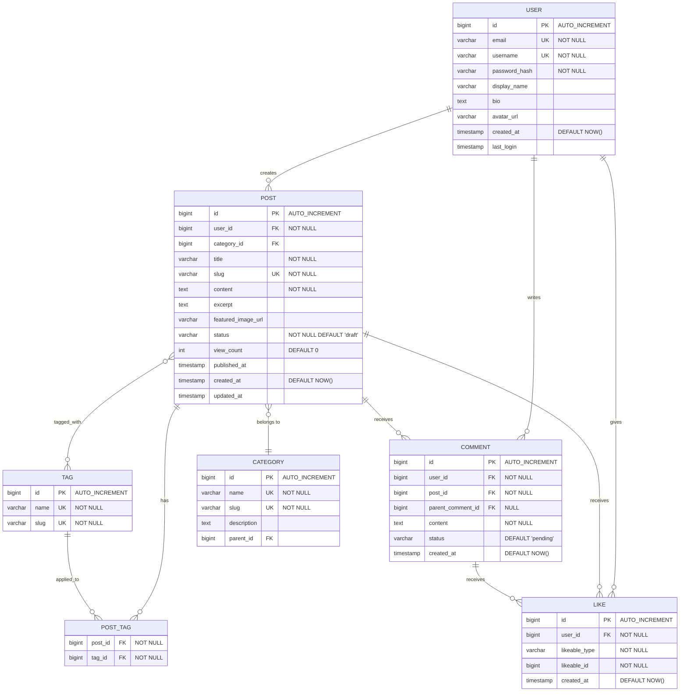

## Social Media Schema

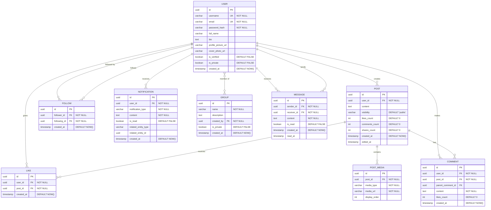

## Best Practices

1. **Name entities in UPPERCASE** - Convention for clarity
2. **Use singular names** - `USER` not `USERS`, `ORDER` not `ORDERS`
3. **Define all constraints** - Document PKs, FKs, UKs, NOT NULL
4. **Show cardinality accurately** - Be precise about one-to-many vs many-to-many
5. **Include timestamps** - created_at, updated_at for auditing
6. **Document computed columns** - Mark calculated/derived values
7. **Add meaningful comments** - Use quotes for constraints and descriptions
8. **Consider junction tables** - Explicitly model many-to-many relationships
9. **Use appropriate types** - Match database-specific types
10. **Show indexes** - Document UK (unique keys) beyond PKs

## Common Patterns

### Self-Referencing (Hierarchical)
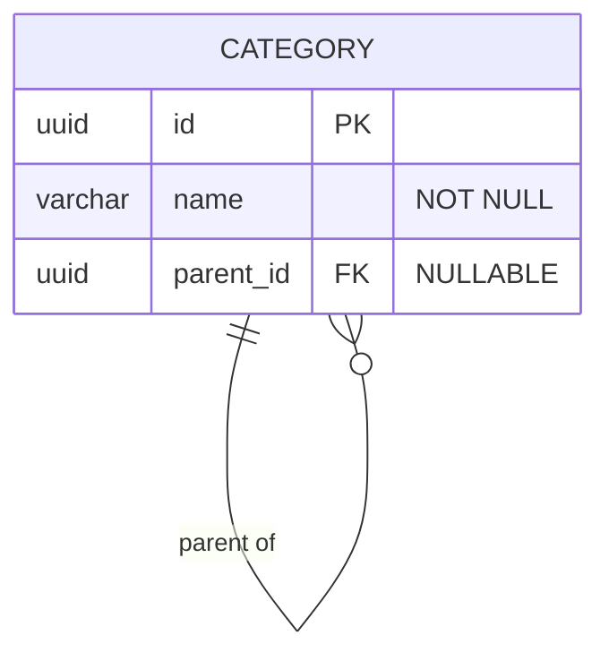

### Junction Table (Many-to-Many)
```mermaid
erDiagram
    STUDENT }o--o{ COURSE : enrolls
    STUDENT ||--o{ ENROLLMENT : has
    COURSE ||--o{ ENROLLMENT : includes
    
    STUDENT {
        uuid id PK
        varchar name "NOT NULL"
    }
    
    ENROLLMENT {
        uuid student_id FK PK
        uuid course_id FK PK
        date enrolled_date
        varchar grade
    }
    
    COURSE {
        uuid id PK
        varchar title "NOT NULL"
    }
```

### Polymorphic Relationship
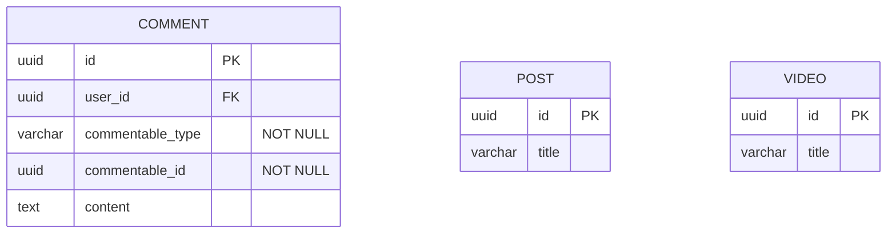

### Soft Deletes
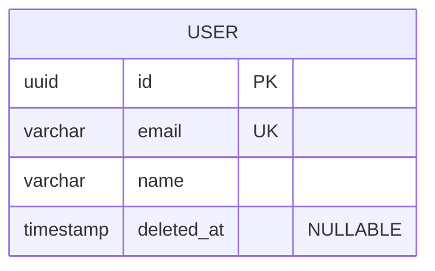

### Audit Trail
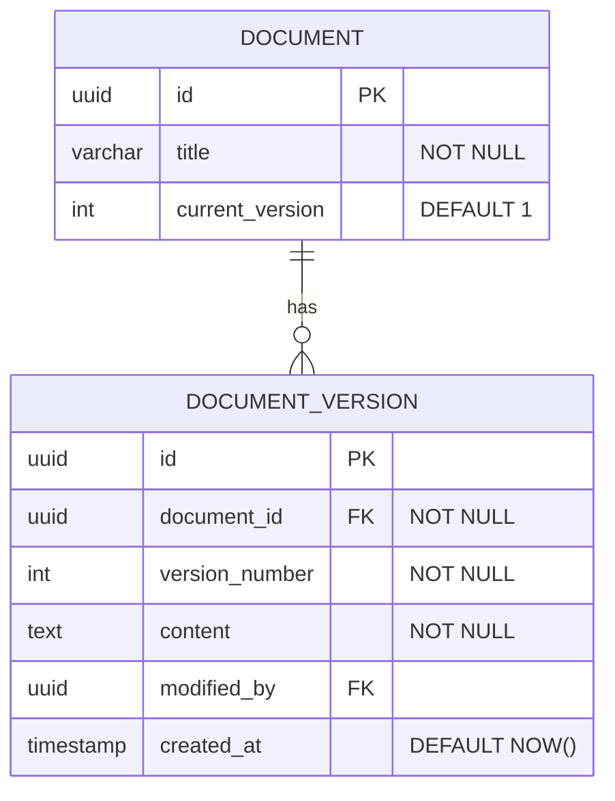

## Tips for Database Design

1. **Normalize appropriately** - Balance normalization with query performance
2. **Use surrogate keys** - UUID or auto-increment integers as PKs
3. **Index foreign keys** - Essential for join performance
4. **Plan for soft deletes** - Add deleted_at columns instead of hard deletes
5. **Version critical data** - Maintain history for important entities
6. **Set appropriate defaults** - created_at, status, boolean flags
7. **Consider denormalization** - Counts and cached values for performance
8. **Use enum/check constraints** - Enforce valid values at database level
