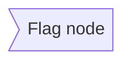

# Flowcharts

Flowcharts visualize processes, algorithms, decision trees, and user journeys. They show step-by-step progression through a system or workflow.

## Basic Syntax


**Directions:**
- `TD` or `TB` - Top to Bottom (default)
- `BT` - Bottom to Top
- `LR` - Left to Right
- `RL` - Right to Left

## Node Shapes

### Rectangle (default)


### Rounded Rectangle


### Stadium/Pill Shape


### Subroutine (Double Border)


### Cylindrical (Database)


### Circle


### Asymmetric/Flag


### Rhombus (Decision)


### Hexagon


### Parallelogram (Input/Output)


### Trapezoid


## Connections

### Basic Arrow


### Open Link (No Arrow)


### Text on Links


### Dotted Links


### Thick Links


### Chaining


### Multi-directional


## Subgraphs

Group related nodes:


### Nested Subgraphs
```mermaid
flowchart TB
    subgraph Outer
        A[Node A]
        
        subgraph Inner
            B[Node B]
            C[Node C]
        end
    end
```

### Subgraph Direction
```mermaid
flowchart LR
    subgraph one
        direction TB
        A1 --> A2
    end
    
    subgraph two
        direction TB
        B1 --> B2
    end
    
    one --> two
```

## Styling

### Individual Node Styling
```mermaid
flowchart LR
    A[Normal]
    B[Styled]
    
    style B fill:#ff6b6b,stroke:#333,stroke-width:4px,color:#fff
```

### Class-based Styling
```mermaid
flowchart LR
    A[Node 1]:::className
    B[Node 2]:::className
    C[Node 3]
    
    classDef className fill:#f9f,stroke:#333,stroke-width:2px
```

### Link Styling
```mermaid
flowchart LR
    A --> B
    linkStyle 0 stroke:#ff3,stroke-width:4px,color:red
```

## Comprehensive Example: User Registration Flow

```mermaid
flowchart TD
    Start([User visits registration page]) --> Form[Show registration form]
    Form --> Input[User enters details]
    Input --> Validate{Valid input?}
    
    Validate -->|No| ShowError[Show validation errors]
    ShowError --> Form
    
    Validate -->|Yes| CheckEmail{Email exists?}
    
    CheckEmail -->|Yes| EmailError[Show 'Email already registered']
    EmailError --> Form
    
    CheckEmail -->|No| CreateAccount[Create user account]
    CreateAccount --> Hash[Hash password]
    Hash --> SaveDB[(Save to database)]
    SaveDB --> GenerateToken[Generate verification token]
    GenerateToken --> SendEmail[Send verification email]
    SendEmail --> ShowSuccess[Show success message]
    ShowSuccess --> End([Redirect to login])
    
    style Start fill:#90EE90,stroke:#333,stroke-width:2px
    style End fill:#90EE90,stroke:#333,stroke-width:2px
    style CreateAccount fill:#87CEEB,stroke:#333,stroke-width:2px
    style SaveDB fill:#FFD700,stroke:#333,stroke-width:2px
```

## Algorithm Example: Binary Search

```mermaid
flowchart TD
    Start([Start Binary Search]) --> Init[Set low = 0, high = array.length - 1]
    Init --> Check{low <= high?}
    
    Check -->|No| NotFound[Return -1: Not found]
    NotFound --> End([End])
    
    Check -->|Yes| CalcMid[mid = low + (high - low) / 2]
    CalcMid --> Compare{array[mid] == target?}
    
    Compare -->|Yes| Found[Return mid: Found]
    Found --> End
    
    Compare -->|No| CheckLess{array[mid] < target?}
    
    CheckLess -->|Yes| MoveLow[low = mid + 1]
    MoveLow --> Check
    
    CheckLess -->|No| MoveHigh[high = mid - 1]
    MoveHigh --> Check
    
    style Start fill:#90EE90
    style End fill:#90EE90
    style Found fill:#FFD700
    style NotFound fill:#FF6B6B
```

## CI/CD Pipeline

```mermaid
flowchart LR
    subgraph Development
        Commit[Developer commits code] --> Push[Push to repository]
    end
    
    subgraph CI
        Push --> Trigger[Trigger CI pipeline]
        Trigger --> Checkout[Checkout code]
        Checkout --> Install[Install dependencies]
        Install --> Lint[Run linters]
        Lint --> Test[Run tests]
        Test --> Build[Build application]
    end
    
    subgraph QA
        Build --> DeployStaging[Deploy to staging]
        DeployStaging --> E2E[Run E2E tests]
        E2E --> ManualQA{Manual QA approval?}
    end
    
    subgraph Production
        ManualQA -->|Approved| DeployProd[Deploy to production]
        DeployProd --> HealthCheck{Health check passed?}
        HealthCheck -->|Yes| Success([Deployment successful])
        HealthCheck -->|No| Rollback[Rollback deployment]
        Rollback --> Alert[Alert team]
    end
    
    ManualQA -->|Rejected| FixIssues[Fix issues]
    FixIssues --> Development
    
    Test -->|Failed| NotifyDev[Notify developer]
    NotifyDev --> FixIssues
```

## E-Commerce Checkout Flow

```mermaid
flowchart TD
    Start([User clicks Checkout]) --> Auth{Authenticated?}
    
    Auth -->|No| Login[Redirect to login]
    Login --> Auth
    
    Auth -->|Yes| Cart{Cart empty?}
    Cart -->|Yes| EmptyCart[Show empty cart message]
    EmptyCart --> Browse[Redirect to products]
    
    Cart -->|No| Address[Show shipping address form]
    Address --> ValidateAddr{Valid address?}
    ValidateAddr -->|No| Address
    ValidateAddr -->|Yes| Shipping[Select shipping method]
    
    Shipping --> Payment[Enter payment details]
    Payment --> ValidatePayment{Valid payment info?}
    ValidatePayment -->|No| Payment
    
    ValidatePayment -->|Yes| Review[Show order review]
    Review --> Confirm{Confirm order?}
    
    Confirm -->|No| Edit{Edit what?}
    Edit -->|Address| Address
    Edit -->|Shipping| Shipping
    Edit -->|Payment| Payment
    
    Confirm -->|Yes| ProcessPayment[Process payment]
    ProcessPayment --> PaymentResult{Payment successful?}
    
    PaymentResult -->|No| PaymentError[Show payment error]
    PaymentError --> RetryPayment{Retry?}
    RetryPayment -->|Yes| Payment
    RetryPayment -->|No| Cancel([Order cancelled])
    
    PaymentResult -->|Yes| CreateOrder[(Create order record)]
    CreateOrder --> ReduceStock[Reduce inventory]
    ReduceStock --> SendConfirmation[Send confirmation email]
    SendConfirmation --> Success([Order complete - Show confirmation])
    
    style Start fill:#90EE90
    style Success fill:#90EE90
    style Cancel fill:#FF6B6B
    style CreateOrder fill:#FFD700
```

## Decision Matrix Example

```mermaid
flowchart TD
    Start([Select deployment strategy]) --> Env{Environment?}
    
    Env -->|Development| DevDecision{Automated tests?}
    DevDecision -->|Pass| DevDeploy[Auto-deploy to dev]
    DevDecision -->|Fail| Block[Block deployment]
    
    Env -->|Staging| StageDecision{All checks pass?}
    StageDecision -->|Yes| StageDeploy[Deploy to staging]
    StageDecision -->|No| Block
    
    Env -->|Production| ProdDecision{Change type?}
    
    ProdDecision -->|Hotfix| Urgent{Critical bug?}
    Urgent -->|Yes| FastTrack[Emergency approval + deploy]
    Urgent -->|No| NormalProcess
    
    ProdDecision -->|Feature| NormalProcess{Approval status?}
    NormalProcess -->|Approved| Schedule{Deploy window?}
    NormalProcess -->|Pending| Wait[Wait for approval]
    NormalProcess -->|Rejected| Block
    
    Schedule -->|Now| ImmediateDeploy[Deploy immediately]
    Schedule -->|Scheduled| QueueDeploy[Queue for deploy window]
    
    DevDeploy --> Monitor[Monitor metrics]
    StageDeploy --> Monitor
    FastTrack --> Monitor
    ImmediateDeploy --> Monitor
    QueueDeploy --> Monitor
    
    Monitor --> End([Deployment complete])
    Block --> End
    Wait --> End
```

## Best Practices

1. **Use meaningful labels** - Node text should be clear and action-oriented
2. **Consistent node shapes** - Same shapes for same types of actions
3. **Decision nodes as diamonds** - Standard convention for yes/no decisions
4. **Flow top-to-bottom or left-to-right** - Natural reading direction
5. **Start and end nodes** - Use stadium/pill shapes to mark entry/exit
6. **Group related steps** - Use subgraphs for logical groupings
7. **Color code** - Use colors to highlight different types of actions
8. **Minimize crossing lines** - Reorganize for clarity
9. **Keep it focused** - One process per diagram

## Common Patterns

### Simple Linear Flow
```mermaid
flowchart LR
    A[Step 1] --> B[Step 2] --> C[Step 3] --> D[Step 4]
```

### Branching Decision
```mermaid
flowchart TD
    A[Input] --> B{Condition?}
    B -->|True| C[Path 1]
    B -->|False| D[Path 2]
    C --> E[Merge]
    D --> E
```

### Loop Pattern
```mermaid
flowchart TD
    A[Initialize] --> B[Process]
    B --> C{Continue?}
    C -->|Yes| B
    C -->|No| D[Exit]
```

### Error Handling
```mermaid
flowchart TD
    A[Try operation] --> B{Success?}
    B -->|Yes| C[Continue]
    B -->|No| D[Handle error]
    D --> E{Retry?}
    E -->|Yes| A
    E -->|No| F[Abort]
```
