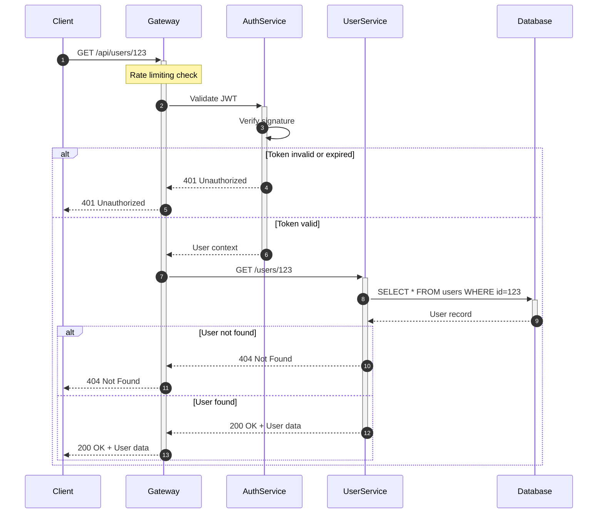

# Sequence Diagrams

Sequence diagrams show interactions between participants over time. They're ideal for API flows, authentication sequences, and system component interactions.

## Basic Syntax

## Participants and Actors

**Difference:**
- `participant` - System components (services, classes, databases)
- `actor` - External entities (users, external systems)

## Message Types

### Solid Arrow (Synchronous)

- `->>`  Solid arrow (request)
- `-->>`  Dotted arrow (response/return)

### Open Arrow (Asynchronous)

- `-)` Solid open arrow
- `--)` Dotted open arrow

### Cross/X (Delete)

## Activations

Show when a participant is actively processing:

- `+` after arrow activates
- `-` before arrow deactivates

## Alt/Else (Conditional Logic)

## Opt (Optional)

## Par (Parallel)

Show concurrent operations:

## Loop

**Loop with condition:**

## Break (Early Exit)

## Notes

### Note over single participant

### Note spanning participants

### Right/Left notes

## Sequence Numbers

Automatically number messages:

## Links and Tooltips

Add clickable links:

## Comprehensive Example: User Authentication Flow

## API Request/Response Example

## Microservices Communication

## Best Practices

1. **Order participants logically** - Typically: User → Frontend → Backend → Database
2. **Use activations** - Shows when components are actively processing
3. **Group related logic** - Use alt/opt/par to organize conditional flows
4. **Add descriptive notes** - Explain complex logic or important details
5. **Keep diagrams focused** - One scenario per diagram
6. **Number messages** - Use autonumber for complex flows
7. **Show error paths** - Document failure scenarios with alt/else
8. **Indicate async operations** - Use open arrows for fire-and-forget messages

## Common Use Cases

### Authentication
- Login flows
- OAuth/SSO flows
- Token refresh
- Password reset

### API Operations
- CRUD operations
- Search and filtering
- Batch processing
- Webhook handling

### System Integration
- Microservice communication
- Third-party API calls
- Message queue processing
- Event-driven architecture

### Business Processes
- Order fulfillment
- Payment processing
- Approval workflows
- Notification chains
