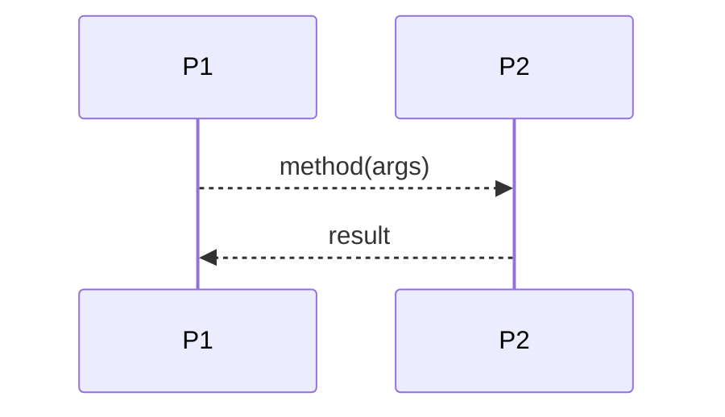

# Sequence Diagram Actor Simulation

Make a small executable scenario look like the Markdown sequence diagram from
which it was read. Use the exercise to expose authority, knowledge, and causal
ordering—not to claim a complete state-machine or semantic model.

## Governing principles

### POLA first

Treat the diagram as a capability graph. If `A` sends to `B`, the simulation
must show how `A` obtained a capability for `B`. Give each actor only the narrow
facet implied by its arrows. In particular, never give a read-only observer a
portfolio, contract, or service capability merely because it makes the test
easy; give it a read or published-state facet.

Ask again during review: who can reach this operation, and why do they need that
authority?

### Track how every actor learns

An actor may emit information only if it:

- received the information when constructed;
- learned it through an incoming call or returned result; or
- derived it from information already available to it.

For each arrow, ask what the sender knew before and after it. Watch especially
for an actor emitting a value it was neither created with nor told through a
method. A submitted claim may select what an oracle observes, but cannot become
the oracle's independent observation. If a callee allocates an identifier, the
callee returns it; the caller does not supply a convenient future identifier.

Use an assignment self-arrow to bind a diagram-local name at the point an actor
learns or derives a bulky value. This is primarily a visual abbreviation:
later arrows can use the name instead of copying the payload. It may correspond
to an actual assignment in code, but does not assert that one exists. Factor a
non-trivial real derivation into a named function only when the simulation needs
to exercise that semantics.

### Preserve causal order

A call arrow corresponds to invoking the receiving actor. A reply arrow is the
value returned to the caller, not a fabricated callback method. If the method
returns before validation, publication, or other consequences, put the reply
first and model the later work on a subsequent turn.

Do not equate causality with eventual delivery. If local versus eventual send
matters, keep it visible in code, for example `E(target).method(...)` or
`EV(target).method(...)`.

## Read a sequence out of a story

- Preserve the story's intent and level of abstraction. Reconcile it with the
  current implementation only when the task calls for that.
- Choose actors by authority and knowledge boundaries. UI pages, services,
  contracts, people, and external data sources are separate when the story
  depends on the boundary.
- Turn boundary crossings into messages. Use self-messages for important
  internal work or to introduce a diagram-local name for a bulky value. Split
  long journeys at new user actions, scheduled triggers, or materially
  different outcomes.
- Label software calls as `method(args)` or the actual protocol operation such
  as `GET /path`. Label replies with values. Human-agent conversation stays
  prose; a person's operation on a UI is still a software call.

Keep enough surrounding prose to connect the diagram to its source story. The
diagram becomes simulation input; the story remains the source of design
intent.

Put diagram-reading conventions in a Mermaid `%%` comment inside the block. A
project may use `->>` for a spontaneous initiating action and `-->>` for a
consequence, but the glyphs have only the meaning the project declares.

## Read the simulation from the diagram

For:

write `p2.method(args)` in `P1`'s behavior, record receipt in `P2`, return the
result from `P2`, and record that result in `P1`. Use arrows to determine actor
construction dependencies; do not give every actor every capability.

The driver invokes only the first spontaneous action. All later arrows arise
from actor calls, returns, self-work, and deferred consequences. Pass initial
state and external facts through construction; pass story-created values
through calls and returns. Avoid hard-coded story values inside infrastructure
factories.

When reconciling with an implementation, inspect and reuse the current types,
validation functions, public protocol or OpenAPI description, representation
details such as bigint and branded amounts, and diagnostic symbols. Keep
proposed names distinct from current catalog entries.

## Synchronize the Markdown and simulation

Read the Markdown file as test input, select the relevant heading and Mermaid
fence, and parse its arrows. Prefer small helpers:

- `skipToH(level, title)` returns the section following a heading.
- `eachFence(language, lines)` yields fenced blocks as arrays of lines.
- `extractArrows(lines, nodePattern = /\w+/)` returns
  `{ from, kind, to, label }`.
- Let the caller supply the node-name pattern. Ignore Mermaid decoration unless
  the test explicitly covers it.

Use a recorder that actors call from their own behavior. The test constructs
the capability graph and invokes the initiating action; it must not append the
expected trace directly. If actors name themselves or their senders while
recording, acknowledge that the simulation relies on truthful topology
reporting.

Compare the projection the test promises. Topology and order are the minimum.
Do not compare prose labels by default; exact labels are appropriate when they
encode calls, returns, diagram-local bindings, public requests, or diagnostics
exercised by the simulation.

## Review checklist

- Reapply POLA: does each actor hold only the capabilities its arrows require?
- Can every emitted value be traced to construction, a received message or
  result, or a visible derivation? If a self-arrow abbreviates a value, is its
  underlying source still clear?
- Are calls, returns, self-work, and deferred consequences in their real order?
- Are independent observations owned by the observer rather than copied from
  the subject's claims?
- Are allocated identifiers and diagnostic values produced by the actor that
  owns them?
- Does the simulation use real interfaces where the design says they are
  settled?
- Does the test claim only the trace properties it actually compares?

Classify mismatches before editing: stale diagram, incorrect simulation,
parser limitation, deliberate omission, or unresolved design disagreement.
Preserve a useful red/green history when practical.

## Mermaid syntax

The arrow extractor does not validate Mermaid grammar. Until a browser-free
parser check is available, use the editor preview. Avoid literal semicolons in
message labels because Mermaid treats them as statement separators; use normal
prose punctuation or an escaped entity.

TODO: Add a parser-only Mermaid syntax check that works from Node without a
browser or Chromium.

## Examples

- **Agentic planning:** [`agentic-planning-sim.test.ts`](../../../packages/portfolio-contract/test/agentic-planning-sim.test.ts) parses [`agentic-planning.md`](../../../packages/portfolio-contract/docs-design/agentic-planning.md) and compares diagram topology with an actor trace.
- **Pendle:** [PR #12578](https://github.com/Agoric/agoric-sdk/pull/12578) and [`pendle-sim.test.ts` at `8adcd72`](https://github.com/Agoric/agoric-sdk/blob/8adcd72b939ffae71773ae5d1a526ab7def53513/packages/portfolio-contract/test/pendle-sim.test.ts) state explicitly that each non-return arrow is a method call on the receiving actor.
