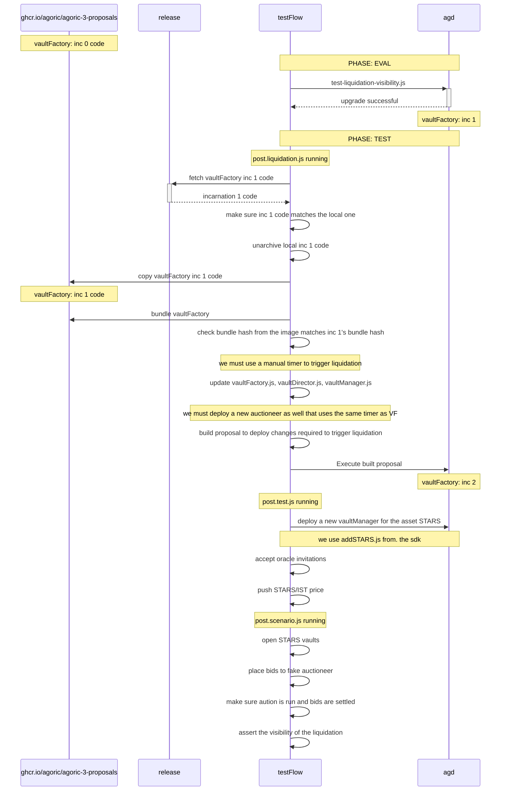

# Liquidation Visibility
This proposal aims to perform a `core-eval` upgrade to `vaultFactory`. The purpose of the upgrade is to 
improve the visibility of liquidating vaults. For the full spec please see [this issue](https://github.com/Jorge-Lopes/liquidation-visibility/issues/2)
and for minor additional specs see [this one](https://github.com/Jorge-Lopes/agoric-sdk/issues/36).

## Work Backlog
* Main workspace => https://github.com/Jorge-Lopes/agoric-sdk
* PR => https://github.com/Agoric/agoric-sdk/pull/8994
* Release => https://github.com/Jorge-Lopes/agoric-sdk/releases/tag/liq-visibility-a3p-v0.2
 
## Test Structure
We follow the usual `a3p` flow where we first perform our upgrade at `EVAL` phase then run our tests in `TEST`
phase. Notice that we don't run anything under `USE` phase as we don't want the changes we make to create the 
appropriate test circumstances to effect future builds.

To execute our core-eval we use;
* [test-liquidation-visibility.js](./test-liquidation-visibility.js)

Our main challenge in testing the visibility of liquidations is to trigger an actual liquidation in our post
eval tests. Below files are used to set up that environment;
* [post.liquidation.js](./post.liquidation.js)
* [post.test.js](./post.test.js)

And test our desired behavior we use;
* [post.scenario.js](./post.scenario.js)

## How to trigger liquidation?
In the below diagram, we describe the steps we go thorough to trigger a fake liquidation.
The reason why it is problematic subject is;
1. We need to be able to control the time and `chainTimerService` does not allow that
2. Auctioneer at this version is not upgradable so we have to deploy a new one
3. We have to make sure `vaultFactory` does use our fake auctioneer and the timer we want
   * The problem with this one is with making sure while we adjust the code base to serve
our needs to create a suitable liquidation environment, we also have to make sure our tests
are actually reliable(we test what we will be deploying to the mainnet).
   

### Addressing problem #3
In order to get around this problem we've created a tarball file ([visibilityFeaturesProof.tar](./visibilityFeaturesProof.tar))
that has what we've developed and put the same file in both the [relase](https://github.com/Jorge-Lopes/agoric-sdk/releases/tag/liq-visibility-a3p-v0.2). 
Basically what we do with that file is;
* Check the local and remote versions match using `cksum`
* Move the incarnation 1 code to `/usr/src/agoric-sdk`
* Bundle `inter-protocol` again
* Make sure the vaultFactory bundle hash matches the one we use to perform our core-eval
* At this stage we're sure that the version we have in `/usr/src/agoric-sdk` is the same
as the one we deployed
* Adjust VF code programmatically in [post.liquidation.js](./post.liquidation.js) to 
make sure it uses the fake auctioneer and manual timer so that we can trigger the liquidation

### The whole proposal flow

