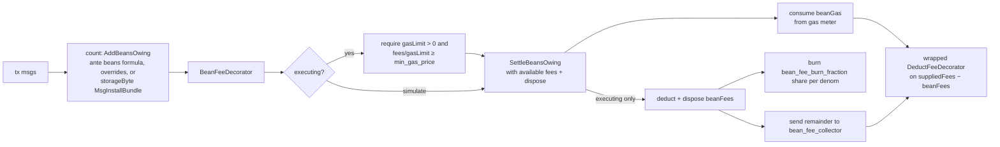

# Beans v2 as a governance-tunable deflationary mechanism

| | |
| --- | --- |
| Status | draft |
| Date | 2026-07-07 |
| Scope | `golang/cosmos/x/swingset`, `golang/cosmos/ante`, `packages/cosmic-swingset` |

## Problem

SwingSet already bills the scheduling of asynchronous JS work in *beans*, a unit distinct from Cosmos gas. The cosmos-side fee path today has three properties this design changes:

1. **Latent, invisible deduction.** `Keeper.ChargeBeans` (`golang/cosmos/x/swingset/keeper/keeper.go`) accrues a per-address `beansOwing` balance in vstorage and only debits coins when the balance crosses an integer multiple of `beans_per_unit["minFeeDebit"]` (default 2e11 beans, roughly $0.20). The debit is a bank send from the signer to the `vbank/reserve` module account (`vbanktypes.ReservePoolName`, wired as the SwingSet keeper's `feeCollectorName` in `golang/cosmos/app/app.go`). The client signs a tx whose `fee` field says nothing about this; some later transaction crosses the threshold and pays for its predecessors.
2. **Charge shape is code, not parameters.** The bean *prices* are already governance parameters (`Params.BeansPerUnit`, `Params.FeeUnitPrice` in `golang/cosmos/proto/agoric/swingset/swingset.proto`, mutable via a param-change proposal with no software upgrade), but the set of message types (each with its own hardcoded formula) is fixed in Go. `chargeAdmission` (`golang/cosmos/x/swingset/types/msgs.go`) happens to charge every covered type using the same underlying `inboundTx + message×num(message) + messageByte×num(messageByte) + storageByte×num(storageByte)` shape, but it is only driven by messages implementing `vm.ControllerAdmissionMsg` (`MsgDeliverInbound`, `MsgWalletAction`, `MsgWalletSpendAction`, `MsgInstallBundle`, chunk messages), and each type hardcodes its own choice of what counts as `messageByte` and `storageByte` for itself. Charging a non-SwingSet message type, re-weighting one message type, or changing how a type derives `num(<unit>)` all require a chain software upgrade.
3. **No burn.** Proceeds always land in `vbank/reserve`. There is no governance-selectable disposition, so the mechanism cannot be made deflationary without an upgrade.

## Requirements

1. All deflation-related parameters tunable by staker governance, no software upgrade required.
2. Per-message-type overrides, a parameter such as `msg_type_beans_per_unit` letting different message types carry different bean charges.
3. Bean fees folded into simulation and gas estimation so clients see the combined cost before signing.
4. Deduction happens before standard Cosmos processing, with proceeds burned or redirected per a governance parameter.

## Design

Counting stays an accounting-only act against the existing `beansOwing` balance, and the deduction moves into the ante handler, expressed in gas-meter terms. `ChargeBeans` splits into `AddBeansOwing` (track debt, never touch the bank) and `SettleBeansOwing` (settle the debt at the ante-handler charging point through its caller-supplied disposition). A minimum-gas-price parameter ties the two worlds together: during simulation it translates bean fees into extra `gas_used` so the client's estimate covers them; during execution it is an enforced floor on the tx's effective gas price, so the extra gas consumed corresponds to real fee value. The per-type bean calculations currently hardcoded in Go collapse into one generic ante beans formula (`inboundTx`, `message`, `messageByte`) that `BeanFeeDecorator` applies to every message whose `typeUrl` is a key found in `msg_type_beans_per_unit`, the corresponding value is a price menu (same shape as `beans_per_unit`, possibly empty): looking up a bean count for a unit tries that message's price menu first, and falls back to the master `beans_per_unit` parameter only for a unit the entry omits. So which units are charged and at what rate — not the units' underlying derivation — is a governance parameter.

### New `x/swingset` parameters

Extend `Params` in `swingset.proto`; these fields are governed through the module's `MsgUpdateParams` authority, so requirement 1 is satisfied by the same governance path that controls the rest of the `x/swingset` parameter set:

```protobuf
// Per-message-type bean price menu, keyed by proto type URL. Each entry's
// value is a price menu (same shape as `beans_per_unit`): looking up a
// bean count for a unit tries the message's own price menu first, and
// falls back to the master `beans_per_unit` parameter only for a unit the
// entry omits. A present `[unit, value]` pair REPLACES the master price
// for that unit only — not the set of units counted or how each unit's
// value is derived — and reads as `value` beans charged per occurrence of
// `unit` (1 for `message`, the byte count for `messageByte`, …) with NO
// scaling by the global `beans_per_unit` rate. A pair `[unit, "0"]`
// removes that unit's influence on the cost entirely. An entry may also
// name a message type that carries no default admission charge at all
// (for example
// "/cosmos.distribution.v1beta1.MsgWithdrawDelegatorReward"), which
// introduces a bean charge for a message that is otherwise free.
repeated MsgTypeBeans msg_type_beans_per_unit = 11;

// Disposition of collected bean fees: the fraction burned PER DENOM, with
// the remainder sent to bean_fee_collector. DecCoins (the cosmos-sdk type
// `cosmos.base.v1beta1.DecCoin` repeated, Go `sdk.DecCoins` — already used
// in this file via sdk.NewDecCoinsFromCoins), so a native denom like BLD
// can burn while e.g. USDC, which is an IBC-transferred asset from an
// external chain, does not. Each denom's
// decimal is a burn fraction in [0,1]; a denom absent from the list burns
// nothing. Default [] (burn nothing) preserves current behavior.
repeated cosmos.base.v1beta1.DecCoin bean_fee_burn_fraction = 12;

// Module account receiving the unburned remainder.
// Default "vbank/reserve" preserves current behavior.
string bean_fee_collector = 13;

// Minimum gas price, DecCoins (`cosmos.base.v1beta1.DecCoin` repeated).
// Dual role: during simulation it translates bean fees into extra gas
// (gas += bean fee ÷ min_gas_price) so the client's (gas × gas-price)
// estimate covers the bean deduction; during execution it is an enforced
// floor on supplied_fees / supplied_gas_limit, so the bean gas counted
// against the meter corresponds to at least the bean fee in real coins.
// Cosmos-sdk today exposes only a NODE-LOCAL `minimum-gas-prices` server
// config (set to "0ubld" in golang/cosmos/daemon/cmd/root.go), which is
// per-validator and not a chain-consensus value, so there is nothing to
// reuse; this is a dedicated governance param. Named `min_gas_price`
// (not `bean_gas_price`) so a future consensus-level min gas price can
// subsume it.
repeated cosmos.base.v1beta1.DecCoin min_gas_price = 14;

// A complete substitute price for one fee quantum. The wrapper preserves the
// existing fee_unit_price wire shape (a repeated Coin) for each alternative.
message FeeUnitPriceAlternative {
  repeated cosmos.base.v1beta1.Coin price = 1
      [(gogoproto.castrepeated) = "github.com/cosmos/cosmos-sdk/types.Coins", (gogoproto.nullable) = false];
}

// Complete substitute prices, in descending preference after fee_unit_price.
// Empty by default, which preserves the existing fee_unit_price behavior.
repeated FeeUnitPriceAlternative fee_unit_price_alternatives = 15;
```

`MsgTypeBeans` is `{ string msg_type_url; repeated StringBeans beans; }`, reusing the existing `StringBeans` shape so JS mirrors (`packages/cosmic-swingset/src/sim-params.js`, which today mirrors `default-params.go`) extend naturally.

### Splitting `ChargeBeans`: counting is accounting, charging is in ante

Today the charge rides `AdmissionDecorator` → `CheckAdmissibility` → `chargeAdmission` → `ChargeBeans`, which both tracks the debt and (past the `minFeeDebit` threshold) moves coins. Split `Keeper.ChargeBeans` (`golang/cosmos/x/swingset/keeper/keeper.go`) in two:

- **`AddBeansOwing(ctx, addr, msgType, unit, amount)`** — accounting only: record bean debt in the `x/swingset` KVStore (`beansOwing`), never touch a bank account. The `msgType`/`unit` arguments let the keeper consult `msg_type_beans_per_unit` (a matching entry is a price menu that replaces the default per-unit price for that message type) and emit a typed provenance event per charge.
- **`SettleBeansOwing(ctx, addr, feeBudget, dispose) error`** — settle the address's `beansOwing` record, where `feeBudget` is immutable `sdk.Coins` (or `nil` during simulation) and `dispose` has type `func(beanGas uint64, beanFees sdk.Coins) error`. It drains the accumulated balance down to dust or nothing (rather than waiting for the `minFeeDebit` threshold), but changes the record only after its caller accepts the calculated charge. `fee_unit_price` remains one composite `sdk.Coins` price for a fee quantum, preserving its current meaning. `fee_unit_price_alternatives` is an ordered `[]sdk.Coins` list of complete substitute prices. The preferred composite price precedes the alternatives in the selection order. In abstract pseudocode:

  ```text
  feeUnits = beansOwing / beans_per_unit["feeUnit"]
  feeQuantumPrices = [fee_unit_price, ...fee_unit_price_alternatives]
  if feeBudget == nil:
      # Simulation quotes the whole debt at the preferred composite price.
      beanFees = quoteFeeAtPrice(feeUnits, fee_unit_price)
  else:
      beanFees = selectFeeQuantaFromBudget(
          feeUnits, feeQuantumPrices, feeBudget)
  if beanFees is an error:
      return insufficient funds

  beanGas = 0
  for each nonzero coin in beanFees:
      price = min_gas_price[coin.denom]
      if price > 0:
          beanGas += ceil(coin.amount / price)

  if err = dispose(beanGas, beanFees); err != nil:
      return err
  beansOwing -= feeUnits * beans_per_unit["feeUnit"]
  return nil
  ```

  `selectFeeQuantaFromBudget` makes the menu semantics and its mutation boundary explicit:

  ```text
  selectFeeQuantaFromBudget(feeUnits, feeQuantumPrices, feeBudget):
      remainingFees = mutable copy of feeBudget
      remainingFeeUnits = feeUnits
      beanFees = empty Coins
      for each non-empty quantum price in feeQuantumPrices, in preference order:
          payableUnits = remainingFeeUnits
          for each coin in price:
              payableUnits = min(
                  payableUnits, remainingFees[coin.denom] / coin.amount)
          if payableUnits == 0:
              continue
          payment = scale every coin in price by payableUnits
          beanFees += payment
          remainingFees -= payment
          remainingFeeUnits -= payableUnits
          if remainingFeeUnits == 0:
              return beanFees
      return insufficient funds

  quoteFeeAtPrice(feeUnits, price):
      if price is empty:
          return invalid fee_unit_price configuration
      return scale every coin in price by feeUnits
  ```

  Thus each selected alternative pays a whole fee quantum. Every coin in its composite price is required, so a multi-denom `fee_unit_price` cannot be reinterpreted as a menu of single-denom choices. The helper returns only the selected `beanFees` (or an error); its mutable `remainingFees` copy never escapes.

  Thus the keeper neither moves coins nor consumes gas itself. The caller implements that policy in `dispose` (consume the gas, deduct the fee, burn, redirect). The whole-number conversion deliberately leaves fewer than one fee unit of beans as dust.

Only `MsgInstallBundle` needs an explicit `AddBeansOwing` call: it's the only required `vm.ControllerAdmissionMsg` implementation that needs a `storageByte` component (`msg.ExpectedUncompressedSize()`), the one unit that requires message-specific data no generic accessor exposes. `MsgSendChunk` needs no such call: its `storageByte` component was already accounted for by `MsgInstallBundle`, and `BeanFeeDecorator`'s generic formula already covers `MsgSendChunk`'s own `inboundTx`/`message`/`messageByte` charge like any other `vm.ControllerAdmissionMsg`. Every other charge — `inboundTx`, `message`, `messageByte`, for `vm.ControllerAdmissionMsg` types and for arbitrary Cosmos messages named only in `msg_type_beans_per_unit` (such as `MsgWithdrawDelegatorReward`) alike — is counted directly by `BeanFeeDecorator` itself, which iterates `tx.GetMsgs()` and keys `sdk.MsgTypeURL(msg)` into the overrides (requirement 2: any message type can carry a charge). `chargeAdmission` is dropped, along with the `vm.ControllerAdmissionMsg` implementations (or parts thereof) that existed only to feed the calculations aside from `MsgInstallBundle.CheckAdmissibility`.

Because `SettleBeansOwing` drains the *whole* balance, it also sweeps debt accrued under the old batching model by earlier transactions — the `minFeeDebit` threshold stops governing tx-submitter charges the moment this lands, with no state migration.

#### Every `ChargeBeans` caller, retargeted

There are exactly two live `ChargeBeans` call sites in non-test code; each becomes bean accounting. `BeanFeeDecorator` is the single place that calls `SettleBeansOwing` after those calls have recorded the transaction's debt:

- **`chargeAdmission`** (`golang/cosmos/x/swingset/types/msgs.go`) — this admission-formula helper is dropped. Its `inboundTx`/`message`/`messageByte` accumulation becomes `AddBeansOwing` calls made directly by `BeanFeeDecorator` (see above), which afterwards calls `SettleBeansOwing`; only `MsgInstallBundle` keeps its own explicit `AddBeansOwing` call for `storageByte`, the one component `chargeAdmission` computed from data only each message type has.
- **`AddBeansOwingForSmartWallet`** (`golang/cosmos/x/swingset/keeper/keeper.go`, reached from `checkSmartWalletProvisioned` during wallet-action admission) — renamed from `ChargeForSmartWallet` because it only calls `AddBeansOwing` for `beans_per_unit["smartWalletProvision"]`. It does not call `SettleBeansOwing`; the same transaction's `BeanFeeDecorator` drains the accumulated debt.

`ChargeForProvisioning` / `calculateFees` (`PowerFlagFees`) converts too, though it was never a `ChargeBeans` caller: today it moves coins directly with `bankKeeper.SendCoinsFromAccountToModule`. `calculateFees` still prices provisioning in coins via the existing `PowerFlagFees` governance menu, but `ChargeForProvisioning` no longer moves those coins itself — it converts the priced `sdk.Coins` into a bean amount (dividing by the current `fee_unit_price` — or an entry of `fee_unit_price_alternatives` — and multiplying by `beans_per_unit["feeUnit"]`, the inverse of the `SettleBeansOwing` price lookup) and calls `AddBeansOwing`; the same transaction's `BeanFeeDecorator` settles it like any other charge, through `min_gas_price` and the usual burn/redirect disposition, rather than through a bank move private to provisioning. The `provisionpass` balance check (`privilegedProvisioningCoins`, `bankKeeper.GetAllBalances`) is a balance *read*, not a charge, and is unaffected. Bean accounting is exposed as a dedicated `BeanAccountant` value created once, at construction time, rather than growing `SwingSetKeeper` ad hoc or a keeper method any caller could reach: `swingsetKeeper, beanAccountant := swingset.NewKeeperAndBeanAccountant(...)` constructs the keeper and its `BeanAccountant` (`AddBeansOwing`, `SettleBeansOwing`, and helpers other modules need, such as `GetBeansPerUnit(ctx, msgTypeUrl, unit)`) together. Only `app.go` calls this constructor, wiring `beanAccountant` directly into `BeanFeeDecorator`; the existing `swingset.NewKeeper(...)` constructor becomes a thin wrapper that discards the second return value (`func NewKeeper(...) Keeper { keeper, _ := NewKeeperAndBeanAccountant(...); return keeper }`), so every other caller is unaffected. `expected_keepers.go` and generated mocks update to depend on `BeanAccountant` in place of `ChargeBeans`.

This narrows, rather than drops, `x/swingset`'s dependency on `x/bank`. The provisionpass balance check keeps reading balances, but through an expected `BankKeeper` interface pared down to a balance-checking slice (`GetAllBalances`/`GetBalance`); `app/app.go` satisfies it with a concrete read-only bank keeper facet, since a read-only facet trivially satisfies a balance-only interface. `x/swingset` itself never holds `BurnCoins` or `SendCoinsFromModuleToModule` authority: like the bean accountant, the disposition callback is built once at app initialization rather than exposed as a keeper method, `vbankKeeper, beanDisposer := vbank.NewKeeperAndBeanDisposer(...)`, and the `beanDisposer` is what performs the burn/redirect split (below). `x/vbank`'s own expected keepers gain a `BankKeeper` capable of `BurnCoins` and `SendCoinsFromModuleToModule`. What changes is that `ChargeForProvisioning` stops moving coins on its own account and instead settles through the same bean pipeline as every other charge in this design, with `x/vbank`, not `x/swingset`, holding the coin-moving authority.

### `BeanFeeDecorator`: enforcement and disposition (requirement 4)

The builtin Cosmos SDK `DeductFeeDecorator` (`ante.NewDeductFeeDecoratorWithName`) is **removed from the ante chain** in `golang/cosmos/ante/ante.go`. In its place, a new `BeanFeeDecorator` **explicitly wraps** the builtin decorator — it constructs the builtin `DeductFeeDecorator` internally and calls it directly. This gives the bean logic a place to stand: it can convert and dispose of `beanFees` and then hand the builtin decorator `suppliedFees − beanFees`, so the builtin operates on the net-of-beans fee without any modification to the decorator-chain driver (`sdk.ChainAnteDecorators`) or to the builtin decorator itself.

Ordering follows from the wrap: the admission/counting controllers run first (so `AddBeansOwing` has recorded the debt), then `BeanFeeDecorator` runs a single, self-contained "convert beans, then deduct the net fee" stage. The admission-counting decorator therefore moves ahead of `BeanFeeDecorator` in the chain; because `BeanFeeDecorator` wraps the builtin, no further chain reordering is needed to interleave bean conversion with fee deduction.



- **Floor check (executing only):** require `suppliedGasLimit > 0` and effective gas price `suppliedFees / suppliedGasLimit ≥ min_gas_price`. This is what makes the gas-meter expression of bean fees sound: gas consumed at a floored price is worth at least the corresponding coins.
- **Convert and dispose:** call `beanAccountant.SettleBeansOwing(ctx, feePayer, suppliedFees, beanDisposer)`. Both `beanAccountant` (`swingsetKeeper, beanAccountant := swingset.NewKeeperAndBeanAccountant(...)`) and `beanDisposer` (`vbankKeeper, beanDisposer := vbank.NewKeeperAndBeanDisposer(...)`) are created once during app initialization and wired directly into `BeanFeeDecorator`, not derived from a keeper method per call. The `beanDisposer` callback counts `beanGas` against the context's gas meter (so the bean charge occupies part of the supplied gas limit), then applies the execution-only fee disposition below. If either action fails, the `beanAccountant.SettleBeansOwing(...)` leaves `beansOwing` unchanged.
- **Dispose (executing only):** `beanDisposer(...)` deducts `beanFees` from the fee payer and splits it per params — for each denom, `bean_fee_burn_fraction`'s share of the coins destroyed with `BankKeeper.BurnCoins` via the `x/vbank` module account (the deflationary arm), the remainder forwarded `SendCoinsFromModuleToModule` to `bean_fee_collector` (default `vbank/reserve`; other useful values: `authtypes.FeeCollectorName` so vbank's reward smoothing pays validators, or `vbank/giveaway`). `x/vbank`'s expected keepers gain the `BankKeeper` slice (`BurnCoins`, `SendCoinsFromModuleToModule`) that this requires. Insufficient funds reject the tx up front instead of mid-execution.
- **Deduct the net fee:** invoke the wrapped builtin `DeductFeeDecorator` on `suppliedFees − beanFees`, so the standard Cosmos fee deduction never double-charges the bean portion.
- **Transparency events:** the decorator emits a typed event per charge (msg type URL, beans, coins, disposition split) so explorers and wallets can display what was deducted and why.

The fee payer is charged for all of this synchronous work. Because bean fees are folded into the gas simulation (below), the automatic gas estimate the client signs already covers them, so charging the tx fee payer — the same account that pays Cosmos gas, and that can be a feegrant — is correct and needs no per-message submitter bookkeeping. (If later work adds *asynchronous* bean accounting and conversion with no signing tx to attribute, deciding which account it bills is a separate problem to solve then.)

### Simulation and gas estimates (requirement 3)

`AdmissionDecorator.AnteHandle` already special-cases `simulate` (it swallows admission errors "otherwise our gas estimation will be too low"). Under `simulate`, `BeanFeeDecorator` passes `nil` as `feeBudget`, skips the floor check and all bank movements, and still calls `SettleBeansOwing` with a simulation `dispose` callback that consumes `beanGas` (`beanGas = bean fee coins ÷ min_gas_price`) — so the standard Cosmos simulate RPC returns a `gas_used` that already includes the bean charge. A client that multiplies that estimate by its own gas price (which the execution-time floor forces to be at least `min_gas_price`) covers the bean fee with no new API; existing wallets see the combined fee up front. The simulate response's message logs additionally carry the typed charge event for clients that want to itemize.

### Exemptions

The exemptions that exist today continue to be allowed. Privileged provisioning via the `provisionpass` balance (`privilegedProvisioningCoins` in `golang/cosmos/x/swingset/keeper/keeper.go`) and existing high-priority-queue carve-outs keep waiving SwingSet message charges as they do now. A governance-set override charge on an arbitrary Cosmos message type (say `MsgWithdrawDelegatorReward`) rides the ante path and is not subject to those SwingSet-specific carve-outs, but the SwingSet message charges retain their existing exemptions unchanged.

### Migration

- Genesis/upgrade default: `msg_type_beans_per_unit` seeded with an empty-menu entry for each existing `vm.ControllerAdmissionMsg` type (`MsgDeliverInbound`, `MsgWalletAction`, `MsgWalletSpendAction`, `MsgInstallBundle`, chunk messages), opting them into the generic ante beans formula at the master `beans_per_unit` prices, exactly as `chargeAdmission` charges them today; otherwise empty. `bean_fee_burn_fraction = []`, `bean_fee_collector = "vbank/reserve"`, `min_gas_price` unset (simulation folding and floor off), and `fee_unit_price_alternatives = []`. With those defaults the chain behaves exactly as today; every deviation is a later governance act.
- **Go formula → ante beans formula:** `chargeAdmission`'s hardcoded per-type charge is replaced by a single generic **ante beans formula** (`inboundTx`, `message`, `messageByte`, all at the default `beans_per_unit` prices) that `BeanFeeDecorator` applies only to the message types that have opted in to that formula's charges via a `msg_type_beans_per_unit` entry (even if the entry contains an empty override price menu). The genesis/upgrade seeding above opts in the existing `vm.ControllerAdmissionMsg` types; any other type joins later purely through a governance param change adding its own (possibly empty) entry. A non-empty `msg_type_beans_per_unit` entry for an already-opted-in type replaces the ante beans formula's charges for that type with the entry's own price menu (or, via a `[unit, "0"]` pair, drops one). From then on re-weighting or dropping a message type's charge is a param change, no software upgrade.
- `UpdateParams` in `golang/cosmos/x/swingset/types/params.go` already appends missing entries with defaults; the new fields follow the same pattern, so the upgrade handler needs no bespoke state migration beyond the seeding above.
- JS mirror: extend `sim-params.js` and the `ParamsSDKType` usage in `packages/cosmic-swingset` so simulated chains exercise the same shape.

### `fee_unit_price` compatibility and alternatives

`fee_unit_price` retains its existing `sdk.Coins` composite-price semantics. The settlement path charges every coin in that price together, so existing multi-denom governance values retain their meaning. Add `fee_unit_price_alternatives` as an empty-by-default `[]sdk.Coins` parameter. The protobuf representation is a repeated composite-price wrapper, each containing the existing repeated `Coin` shape; generated Go presents it as `[]sdk.Coins`. Its elements are complete alternatives to `fee_unit_price` in descending governance preference. An empty alternatives list preserves current behavior exactly. Governance may add alternatives later without changing the preferred price or reinterpreting historic values.

## Out of scope

- Computron accounting (`xsnapComputron`, `blockComputeLimit`, `vatCreation` beans consumed by `computronCounter` in `packages/cosmic-swingset/src/launch-chain.js`): that is a block run policy, not a per-account fee, and is untouched here.
- The `PowerFlagFees` price menu itself (which power flag costs what): still a coin-denominated governance parameter, unchanged. Only how `ChargeForProvisioning` settles that price changes (see above); the menu's shape and values do not.
- Contract-level (Zoe/IST) fee policy: this design is chain-layer only.

## Resolved review decisions

The following points, raised as open questions in earlier drafts, were decided in review and are now settled in the design above:

- **Override entry semantics.** Each override entry is a per-message-type price menu: `value` beans per occurrence of `unit`, with no scaling by the global `beans_per_unit` rate. `[unit, "0"]` removes that unit's influence on the cost.
- **Interplay with the builtin `DeductFeeDecorator`.** The builtin is removed from the chain and wrapped by `BeanFeeDecorator`, which feeds it `suppliedFees − beanFees`; the net-of-beans reading avoids double-charging.
- **Decorator ordering.** Because `BeanFeeDecorator` wraps the builtin, the chain needs only "admission controllers, then `BeanFeeDecorator`"; no other chain-driver modification is required.
- **Minimum gas price.** A dedicated `min_gas_price` DecCoins param (no chain-consensus min gas price exists to reuse; the cosmos-sdk `minimum-gas-prices` is node-local only).
- **Residual `beansOwing` charges.** `BeanFeeDecorator` calls `SettleBeansOwing(ctx, addr, suppliedFees, dispose)` after every transaction's accounting calls, draining as much of the address's accumulated bean debt as possible to coins immediately (leaving dust), so no charge waits for the old threshold-debit.
- **Fee-unit price selection.** `fee_unit_price` is the preferred composite fee quantum, and `fee_unit_price_alternatives` is the descending-preference list of composite substitutes. Execution selects enough whole quanta from the immutable fee budget in that order; simulation supplies no budget and quotes the entire debt at the preferred composite price.
- **Burn per-denom.** `bean_fee_burn_fraction` is DecCoins, so the burn fraction is per-denom (a native denom like BLD burns, an IBC-transferred asset like USDC need not).
- **Lingering `ChargeBeans` callers.** The two live callers are retargeted to bean accounting only: `chargeAdmission` is dropped (its `inboundTx`/`message`/`messageByte` accumulation moves into `BeanFeeDecorator` itself; `MsgInstallBundle`'s `storageByte` charge and `MsgDeliverInbound`'s inner-message count move into `BeanFeeDecorator`'s special-charge table), and `ChargeForSmartWallet` is renamed `AddBeansOwingForSmartWallet`. `BeanFeeDecorator` is the sole `SettleBeansOwing` caller.
- **Fee-payer identity.** Synchronous work charges the tx fee payer, which the automatic gas simulation has already estimated. All tx-synchronous `AddBeansOwing` calls record debt against the resolved fee payer, not a message submitter or owner. Async attribution is deferred to future work.
- **Parameter plumbing.** Beans v2 is stacked on the `MsgUpdateParams` migration, so the new parameters are plumbed through `MsgUpdateParams` rather than the legacy `x/params` subspace.
- **Override entry replaces price, not formula.** A `msg_type_beans_per_unit` entry opts a message type into the generic **ante beans formula** (`inboundTx`, `message`, `messageByte`) — even an empty entry does this, at the master `beans_per_unit` prices — and does not redefine which units apply or how each unit's value is derived from the message. A non-empty entry only replaces the default per-unit `beans_per_unit` *price* for that message type (or, via a `[unit, "0"]` pair, zeroes a unit out).
- **`inboundTx` boundary.** `BeanFeeDecorator` charges `beans_per_unit["inboundTx"]` at most once per transaction, only after it sees the first message whose type has opted into the generic ante beans formula via `msg_type_beans_per_unit`. The charge is recorded with an empty `msgTypeURL`, so message-specific price-menu overrides cannot reprice the transaction-wide overhead. Transactions containing no opted-in message types do not accrue `inboundTx` dust.
- **`ChargeForProvisioning` folds into beans.** It converts its coin-priced `PowerFlagFees` charge into beans (via the current `fee_unit_price` / `fee_unit_price_alternatives` and `beans_per_unit["feeUnit"]`) and calls `AddBeansOwing` instead of moving coins itself; `BeanFeeDecorator` settles it like any other charge. `x/swingset` keeps a `x/bank` reference, but narrowed to a read-only balance-checking interface for the `provisionpass` check; burn/redirect authority moves to `x/vbank` (see below).
- **Keeper interfaces: `NewKeeperAndBeanAccountant` and `NewKeeperAndBeanDisposer`, create-only-on-new.** Bean accounting is exposed as a value created once, at construction time, rather than a method any caller could reach on `SwingSetKeeper`: `swingsetKeeper, beanAccountant := swingset.NewKeeperAndBeanAccountant(...)` (a `BeanAccountant` with `AddBeansOwing`, `SettleBeansOwing`, and helpers like `GetBeansPerUnit(ctx, msgTypeUrl, unit)`), with the existing `swingset.NewKeeper(...)` kept as a thin wrapper that discards the accountant. Only `app.go` calls the `...AndBeanAccountant` constructor, wiring `beanAccountant` directly into `BeanFeeDecorator`. The `beanDisposer` callback `BeanFeeDecorator` passes to `SettleBeansOwing` is built the same way, `vbankKeeper, beanDisposer := vbank.NewKeeperAndBeanDisposer(...)`, so `x/vbank`, not `x/swingset`, holds `BurnCoins`/`SendCoinsFromModuleToModule` authority; `x/vbank`'s expected keepers gain that `BankKeeper` slice. `x/swingset`'s own expected `BankKeeper` narrows to a balance-checking interface (`GetAllBalances`/`GetBalance`) for the `provisionpass` check, and `app/app.go` wires it to a concrete read-only bank keeper facet.
- **Generic accessor for `message`/`messageByte`.** `BeanFeeDecorator`'s `AnteHandle(ctx sdk.Context, tx sdk.Tx, simulate bool, next sdk.AnteHandler)` (shaped like `golang/cosmos/app/ante/vm_admission.go`) already has enough information to count these two units itself, with no `vm.ControllerAdmissionMsg` accessor needed: `num(message)` counts directly off `tx.GetMsgs()`, and `num(messageByte)` comes from each message's encoded proto binary size while `BeanFeeDecorator` processes them. `GetInboundMsgCount` keeps its current congestion-control meaning and caller unchanged. The one compatibility carve-out: `BeanFeeDecorator`'s special-charge table adds `beans_per_unit["message"] * len(msg.Messages)` for `MsgDeliverInbound`, because its outer message wraps a batch of inner messages that a generic per-tx-message count would otherwise undercount as one.
- **Immediate settlement starts at upgrade.** The migration intentionally switches tx-submitter bean charges to immediate whole-fee-unit settlement when the upgrade lands. The old `minFeeDebit` threshold stops delaying tx-synchronous charges at upgrade time.
- **Provisioning conversion rounds up.** `ChargeForProvisioning` converts its coin-denominated `PowerFlagFees` charge to bean fee quanta by rounding up. Fee quanta are expected to be epsilon-sized dust, so this preserves collection without material overcharge.
- **Feegrant accounting.** Bean fees charged to a fee payer under feegrant must consume the grant exactly like normal Cosmos transaction fees. The split between bean fees and net SDK fees must not bypass feegrant limits.
- **Burn rounding.** `bean_fee_burn_fraction` multiplication truncates the burned integer coin amount per denom. Any fractional dust remains on the collector side with the unburned remainder.
- **JS mirror scope.** `packages/cosmic-swingset/src/params.js` and `sim-params.js` mirror the expanded `x/swingset` parameter schema for bootstrap/begin-block parsing and simulated-chain defaults. They do not implement Beans v2 fee settlement; fee accounting, feegrant consumption, burning, and collector forwarding are all Go-side ante/keeper behavior.
