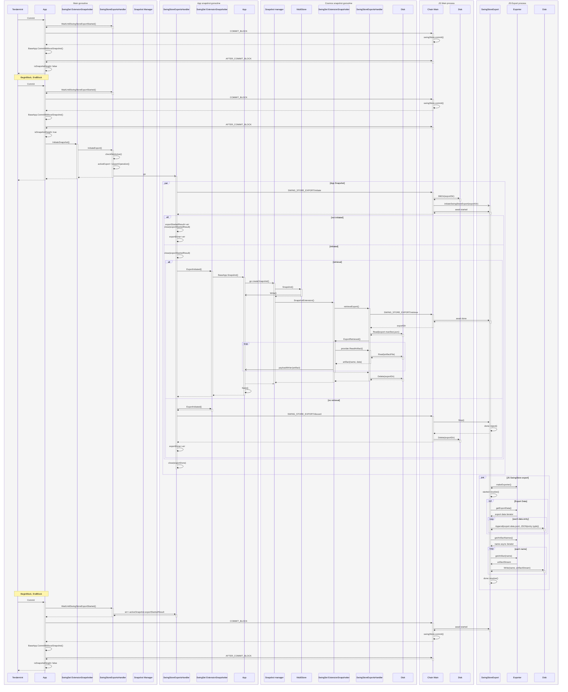

# State-sync

## Creating Snapshot

```mermaid
sequenceDiagram
  box whitesmoke Main goroutine
    participant TM as Tendermint
    participant A-M as App
    participant SSES-M as SwingSet ExtensionSnapshotter
    participant SSEH-M as SwingStoreExportsHandler
    participant SM-M as Snapshot Manager
  end

  box whitesmoke App snapshot goroutine
    participant SSEH-AS as SwingStoreExportsHandler
    participant SSES-AS as SwingSet ExtensionSnapshotter
    participant A-AS as App
  end

  box whitesmoke Cosmos snapshot goroutine
    participant SM-CS as Snapshot manager
    participant MS-CS as MultiStore
    participant SSES-CS as SwingSet ExtensionSnapshotter
    participant SSEH-CS as SwingStoreExportsHandler
    participant D-CS as Disk
  end

  box whitesmoke JS Main process
    participant CM as Chain Main
    participant D as Disk
  end

  box whitesmoke JS Export process
    participant SSE as SwingStoreExport 
    participant Exporter as Exporter 
    participant D-E as Disk
  end

  TM->>+A-M: Commit
  A-M->>+SSEH-M: WaitUntilSwingStoreExportStarted()
  SSEH-M-->>-A-M: 
  A-M->>+CM: COMMIT_BLOCK
  CM->>CM: swingStore.commit()
  CM-->>-A-M: 
  A-M->>A-M: BaseApp.CommitWithoutSnapshot()
  A-M->>+CM: AFTER_COMMIT_BLOCK
  CM-->>-A-M: 
  A-M->>A-M: isSnapshotHeight: false
  A-M-->>-TM: 

  Note over TM, A-M: BeginBlock, EndBlock

  TM->>+A-M: Commit
  A-M->>+SSEH-M: WaitUntilSwingStoreExportStarted()
  SSEH-M-->>-A-M: 
  A-M->>+CM: COMMIT_BLOCK
  CM->>CM: swingStore.commit()
  CM-->>-A-M: 
  A-M->>A-M: BaseApp.CommitWithoutSnapshot()
  A-M->>+CM: AFTER_COMMIT_BLOCK
  CM-->>-A-M: 
  A-M->>A-M: isSnapshotHeight: true
  A-M->>+SSES-M: InitiateSnapshot()
  SSES-M->>+SSEH-M: InitiateExport()
  SSEH-M->>SSEH-M: checkNotActive()
  SSEH-M->>SSEH-M: activeExport = exportOperation{}
  SSEH-M-)+SSEH-AS: go
  SSEH-M-->>-SSES-M: 
  SSES-M-->>-A-M: 
  A-M-->>-TM: 

  par App Snapshot
    SSEH-AS->>+CM: SWING_STORE_EXPORT/initiate
    CM->>+D: MkDir(exportDir)
    D-->>-CM: 
    CM-)+SSE: initiateSwingStoreExport(exportDir)
    CM->>+SSE: await started
    SSE-->>-CM: 
    CM-->>-SSEH-AS: 
    alt not initiated
      SSEH-AS->>SSEH-AS: exportStartedResult<-err<br/>close(exportStartedResult)
      SSEH-AS->>SSEH-AS: exportDone<-err
    else initiated
    SSEH-AS->>SSEH-AS: close(exportStartedResult)
    alt retrieval
    SSEH-AS->>+SSES-AS: ExportInitiated()
    SSES-AS->>+A-AS: BaseApp.Snapshot()
    A-AS-)+SM-CS: go createSnapshot()
    SM-CS->>+MS-CS: Snapshot()
    MS-CS-)A-AS: Write()
    MS-CS-->>-SM-CS: 
    SM-CS->>+SSES-CS: SnapshotExtension()
    SSES-CS->>+SSEH-CS: retrieveExport()
    SSEH-CS->>+CM: SWING_STORE_EXPORT/retrieve
    CM->>+SSE: await done
    SSE-->>-CM: 
    CM-->>-SSEH-CS: exportDir
    SSEH-CS->>+D-CS: Read(export-manifest.json)
    D-CS-->>-SSEH-CS: 
    SSEH-CS->>+SSES-CS: ExportRetrieved()
    loop
      SSES-CS->>+SSEH-CS: provider.ReadArtifact()
      SSEH-CS->>+D-CS: Read(artifactFile)
      D-CS-->>-SSEH-CS: 
      SSEH-CS-->>-SSES-CS: artifact{name, data}
      SSES-CS-)A-AS: payloadWriter(artifact)
    end
    SSES-CS-->>-SSEH-CS: 
    SSEH-CS->>+D-CS: Delete(exportDir)
    D-CS-->>-SSEH-CS: 
    SSEH-CS-->>-SSES-CS: 
    SSES-CS-->>-SM-CS: 
    A-AS--xSM-CS: 
    deactivate SM-CS
    A-AS->>A-AS: Save()
    A-AS-->>-SSES-AS: 
    SSES-AS-->>-SSEH-AS: 
    else no retrieval
      SSEH-AS->>+SSES-AS: ExportInitiated()
      SSES-AS-->>-SSEH-AS: 
      SSEH-AS->>+CM: SWING_STORE_EXPORT/discard
      CM->>SSE: Stop()
      SSE->>SSE: done::reject()
      SSE-->>CM: 
      CM->>+D: Delete(exportDir)
      D-->-CM: 
      CM-->>-SSEH-AS: 
      SSEH-AS->>SSEH-AS: exportDone<-err
    end
    end
    SSEH-AS->>SSEH-AS: close(exportDone)
    deactivate SSEH-AS
  end

  par JS SwingStore export
    SSE->>Exporter: makeExporter()
    Exporter->>SSE: 
    SSE->>SSE: started::resolve()
    opt Export Data
    SSE->>Exporter: getExportData()
    Exporter-)SSE: export data iterator
    loop each data entry
      SSE->>+D-E: Append(export-data.jsonl, JSON(entry typle))
      D-E-->>-SSE: 
    end
    end
    SSE->>Exporter: getArtifactNames()
    Exporter-)SSE: name async iterator
    loop each name
      SSE->>Exporter: getArtifact(name)
      Exporter-)SSE: artifactStream
      SSE->>+D-E: Write(name, artifactStream)
      D-E-->>-SSE: 
    end
    SSE->>SSE: done::resolve()
    deactivate SSE
  end

  Note over TM, A-M: BeginBlock, EndBlock

  TM->>+A-M: Commit
  A-M->>+SSEH-M: WaitUntilSwingStoreExportStarted()
  SSEH-M->>+SSEH-AS: err<-activeSnapshot.exportStartedResult
  SSEH-AS-->>-SSEH-M: 
  SSEH-M-->>-A-M: 
  A-M->>+CM: COMMIT_BLOCK
  CM->>+SSE: await started
  SSE-->>-CM: 
  CM->>CM: swingStore.commit()
  CM-->>-A-M: 
  A-M->>A-M: BaseApp.CommitWithoutSnapshot()
  A-M->>+CM: AFTER_COMMIT_BLOCK
  CM-->>-A-M: 
  A-M->>A-M: isSnapshotHeight: false
  A-M-->>-TM: 
```
