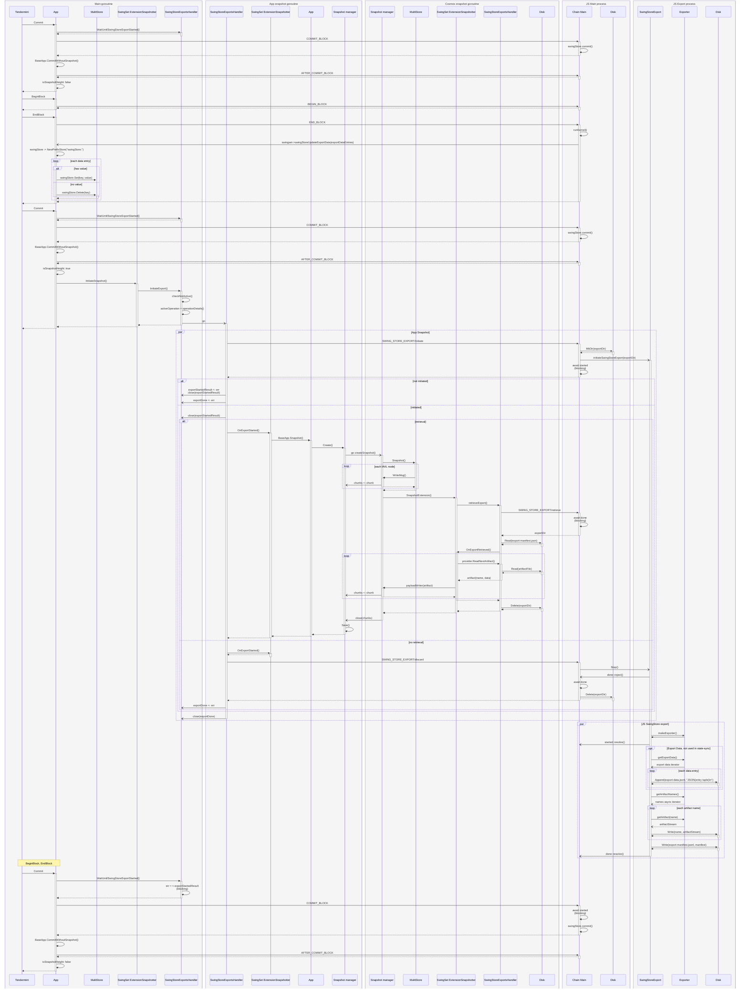
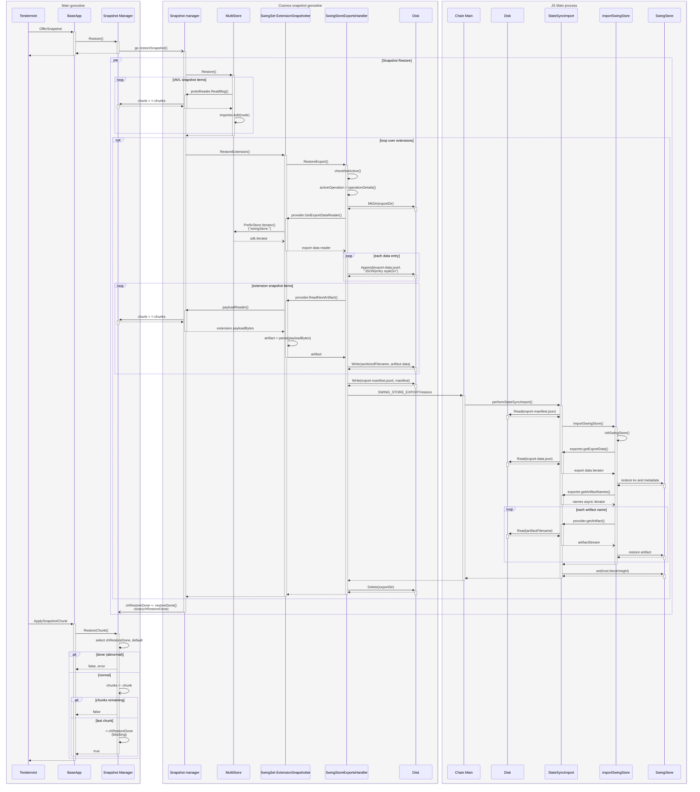

# State-sync

## Creating Snapshot

```mermaid
sequenceDiagram
  box whitesmoke Main goroutine
    participant TM as Tendermint
    participant A-M as App
    participant MS-M as MultiStore
    participant SSES-M as SwingSet ExtensionSnapshotter
    participant SSEH-M as SwingStoreExportsHandler
  end

  box whitesmoke App snapshot goroutine
    participant SSEH-AS as SwingStoreExportsHandler
    participant SSES-AS as SwingSet ExtensionSnapshotter
    participant A-AS as App
    participant SM-AS as Snapshot manager
  end

  box whitesmoke Cosmos snapshot goroutine
    participant SM-CS as Snapshot manager
    participant MS-CS as MultiStore
    participant SSES-CS as SwingSet ExtensionSnapshotter
    participant SSEH-CS as SwingStoreExportsHandler
    participant D-CS as Disk
  end

  box whitesmoke JS Main process
    participant CM as Chain Main
    participant D as Disk
  end

  box whitesmoke JS Export process
    participant SSE as SwingStoreExport 
    participant Exporter as Exporter 
    participant D-E as Disk
  end

  TM->>+A-M: Commit
  A-M->>+SSEH-M: WaitUntilSwingStoreExportStarted()
  SSEH-M-->>-A-M: 
  A-M->>+CM: COMMIT_BLOCK
  CM->>CM: swingStore.commit()
  CM-->>-A-M: 
  A-M->>A-M: BaseApp.CommitWithoutSnapshot()
  A-M->>+CM: AFTER_COMMIT_BLOCK
  CM-->>-A-M: 
  A-M->>A-M: isSnapshotHeight: false
  A-M-->>-TM: 

  TM->>+A-M: BeginBlock
  A-M->>+CM: BEGIN_BLOCK
  CM-->>-A-M: 
  A-M-->>-TM: 

  TM->>+A-M: EndBlock
  A-M->>+CM: END_BLOCK
  CM->>CM: runKernel()
  CM-)A-M: swingset->swingStoreUpdateExportData(exportDataEntries)
  A-M->>A-M: swingStore := NewPrefixStore("swingStore.")
  loop each data entry
    alt has value
      A-M->>+MS-M: swingStore.Set(key, value)
    else no value
      A-M->>+MS-M: swingStore.Delete(key)
    end
    MS-M-->>-A-M: 
  end
  CM-->>-A-M: 
  A-M-->>-TM: 

  TM->>+A-M: Commit
  A-M->>+SSEH-M: WaitUntilSwingStoreExportStarted()
  SSEH-M-->>-A-M: 
  A-M->>+CM: COMMIT_BLOCK
  CM->>CM: swingStore.commit()
  CM-->>-A-M: 
  A-M->>A-M: BaseApp.CommitWithoutSnapshot()
  A-M->>+CM: AFTER_COMMIT_BLOCK
  CM-->>-A-M: 
  A-M->>A-M: isSnapshotHeight: true
  A-M->>+SSES-M: InitiateSnapshot()
  SSES-M->>+SSEH-M: InitiateExport()
  SSEH-M->>SSEH-M: checkNotActive()
  SSEH-M->>SSEH-M: activeOperation = operationDetails{}
  SSEH-M-)+SSEH-AS: go
  SSEH-M-->>-SSES-M: 
  SSES-M-->>-A-M: 
  A-M-->>-TM: 

  par App Snapshot
    SSEH-AS->>+CM: SWING_STORE_EXPORT/initiate
    CM->>+D: MkDir(exportDir)
    D-->>-CM: 
    CM-)+SSE: initiateSwingStoreExport(exportDir)
    CM->>CM: await started<br/>(blocking)
    CM-->>-SSEH-AS: 
    alt not initiated
      SSEH-AS-)SSEH-M: exportStartedResult <- err<br/>close(exportStartedResult)
      SSEH-AS-)SSEH-M: exportDone <- err
    else initiated
    SSEH-AS-)SSEH-M: close(exportStartedResult)
    alt retrieval
    SSEH-AS->>+SSES-AS: OnExportStarted()
    SSES-AS->>+A-AS: BaseApp.Snapshot()
    A-AS->>+SM-AS: Create()
    SM-AS-)+SM-CS: go createSnapshot()
    SM-CS->>+MS-CS: Snapshot()
    loop each IAVL node
      MS-CS->>+SM-CS: WriteMsg()
      SM-CS-)SM-AS: chunks <- chunk
      SM-CS-->>-MS-CS: 
    end
    MS-CS-->>-SM-CS: 
    SM-CS->>+SSES-CS: SnapshotExtension()
    SSES-CS->>+SSEH-CS: retrieveExport()
    SSEH-CS->>+CM: SWING_STORE_EXPORT/retrieve
    CM->>CM: await done<br/>(blocking)
    CM-->>-SSEH-CS: exportDir
    SSEH-CS->>+D-CS: Read(export-manifest.json)
    D-CS-->>-SSEH-CS: 
    SSEH-CS->>+SSES-CS: OnExportRetrieved()
    loop
      SSES-CS->>+SSEH-CS: provider.ReadNextArtifact()
      SSEH-CS->>+D-CS: Read(artifactFile)
      D-CS-->>-SSEH-CS: 
      SSEH-CS-->>-SSES-CS: artifact{name, data}
      SSES-CS->>+SM-CS: payloadWriter(artifact)
      SM-CS-)SM-AS: chunks <- chunk
      SM-CS-->>-SSES-CS: 
    end
    SSES-CS-->>-SSEH-CS: 
    SSEH-CS->>+D-CS: Delete(exportDir)
    D-CS-->>-SSEH-CS: 
    SSEH-CS-->>-SSES-CS: 
    SSES-CS-->>-SM-CS: 
    SM-CS-)-SM-AS: close(chunks)
    SM-AS->>SM-AS: Save()
    SM-AS-->>-A-AS: 
    A-AS-->>-SSES-AS: 
    SSES-AS-->>-SSEH-AS: 
    else no retrieval
      SSEH-AS->>+SSES-AS: OnExportStarted()
      SSES-AS-->>-SSEH-AS: 
      SSEH-AS->>+CM: SWING_STORE_EXPORT/discard
      CM-)SSE: Stop()
      SSE-)CM: done::reject()
      CM->>CM: await done
      CM->>+D: Delete(exportDir)
      D-->-CM: 
      CM-->>-SSEH-AS: 
      SSEH-AS-)SSEH-M: exportDone <- err
    end
    end
    SSEH-AS-)SSEH-M: close(exportDone)
    deactivate SSEH-AS
  end

  par JS SwingStore export
    SSE->>Exporter: makeExporter()
    Exporter->>SSE: 
    SSE-)CM: started::resolve()
    opt Export Data, not used in state-sync
    SSE->>Exporter: getExportData()
    Exporter-)SSE: export data iterator
    loop each data entry
      SSE->>+D-E: Append(export-data.jsonl, "JSON(entry tuple)\n")
      D-E-->>-SSE: 
    end
    end
    SSE->>Exporter: getArtifactNames()
    Exporter--)SSE: names async iterator
    loop each artifact name
      SSE->>Exporter: getArtifact(name)
      Exporter--)SSE: artifactStream
      SSE->>+D-E: Write(name, artifactStream)
      D-E-->>-SSE: 
    end
    SSE->>+D-E: Write(export-manifest.jsonl, manifest)
    D-E-->>-SSE: 
    SSE-)CM: done::resolve()
    deactivate SSE
  end

  Note over TM, A-M: BeginBlock, EndBlock

  TM->>+A-M: Commit
  A-M->>+SSEH-M: WaitUntilSwingStoreExportStarted()
  SSEH-M->>SSEH-M: err = <-exportStartedResult<br/>(blocking)
  SSEH-M-->>-A-M: 
  A-M->>+CM: COMMIT_BLOCK
  CM->>CM: await started<br/>(blocking)
  CM->>CM: swingStore.commit()
  CM-->>-A-M: 
  A-M->>A-M: BaseApp.CommitWithoutSnapshot()
  A-M->>+CM: AFTER_COMMIT_BLOCK
  CM-->>-A-M: 
  A-M->>A-M: isSnapshotHeight: false
  A-M-->>-TM: 
```

## Restoring Snapshot

```mermaid
sequenceDiagram
  box whitesmoke Main goroutine
    participant TM as Tendermint
    participant A-M as BaseApp
    participant SM-M as Snapshot Manager
  end

  box whitesmoke Cosmos snapshot goroutine
    participant SM-CS as Snapshot manager
    participant MS-CS as MultiStore
    participant SSES-CS as SwingSet ExtensionSnapshotter
    participant SSEH-CS as SwingStoreExportsHandler
    participant D-CS as Disk
  end

  box whitesmoke JS Main process
    participant CM as Chain Main
    participant D as Disk
    participant SSI as StateSyncImport
    participant ISS as importSwingStore
    participant SS as SwingStore
  end

  TM->>+A-M: OfferSnapshot
  A-M->>+SM-M: Restore()
  SM-M-)+SM-CS: go restoreSnapshot()
  SM-M-->>-A-M: 
  A-M-->>-TM: 

  par Snapshot Restore
    SM-CS->>+MS-CS: Restore()
    loop IAVL snapshot items
      MS-CS->>+SM-CS: protoReader.ReadMsg()
      SM-CS->>+SM-M: chunk = <-chunks
      SM-M-->>-SM-CS: 
      SM-CS-->>-MS-CS: 
      MS-CS->>MS-CS: importer.Add(node)
    end
    MS-CS-->>-SM-CS: 

    opt loop over extensions
      SM-CS->>+SSES-CS: RestoreExtension()
      SSES-CS->>+SSEH-CS: RestoreExport()
      SSEH-CS->>SSEH-CS: checkNotActive()
      SSEH-CS->>SSEH-CS: activeOperation = operationDetails{}
      SSEH-CS->>+D-CS: MkDir(exportDir)
      D-CS-->>-SSEH-CS: 
      SSEH-CS->>+SSES-CS: provider.GetExportDataReader()
      SSES-CS->>MS-CS: PrefixStore.Iterator()<br/>("swingStore.")
      MS-CS--)SSES-CS: sdk.Iterator
      SSES-CS--)-SSEH-CS: export data reader
      loop each data entry
        SSEH-CS->>+D-CS: Append(export-data.jsonl, <br/>"JSON(entry tuple)\n")
        D-CS-->>-SSEH-CS: 
      end
      loop extension snapshot items
        SSEH-CS->>+SSES-CS: provider.ReadNextArtifact()
        SSES-CS->>+SM-CS: payloadReader()
        SM-CS->>+SM-M: chunk = <-chunks
        SM-M-->>-SM-CS: 
        SM-CS-->>-SSES-CS: extension payloadBytes
        SSES-CS->>SSES-CS: artifact = parse(payloadBytes)
        SSES-CS->>-SSEH-CS: artifact
        SSEH-CS->>+D-CS: Write(sanitizedFilename, artifact.data)
        D-CS-->>-SSEH-CS: 
      end
      SSEH-CS->>+D-CS: Write(export-manifest.jsonl, manifest)
      D-CS-->>-SSEH-CS: 
      SSEH-CS->>+CM: SWING_STORE_EXPORT/restore
      CM->>+SSI: performStateSyncImport()
      SSI->>+D: Read(export-manifest.json)
      D-->>-SSI: 
      SSI->>+ISS: importSwingStore()
      ISS->>ISS: initSwingStore()
      ISS->>+SSI: exporter.getExportData()
      SSI->>+D: Read(export-data.json)
      D-->>-SSI: 
      SSI-->>-ISS: export data iterator
      ISS->>+SS: restore kv and metadata
      SS-->>-ISS: 
      ISS->>+SSI: exporter.getArtifactNames()
      SSI--)-ISS: names async iterator
      loop each artifact name
        ISS->>+SSI: provider.getArtifact()
        SSI->>+D: Read(artifactFilename)
        D-->>-SSI: 
        SSI--)-ISS: artifactStream
        ISS->>+SS: restore artifact
        SS-->>-ISS: 
      end
      ISS-->>-SSI: 
      SSI->>+SS: set(host.blockHeight)
      SS-->>-SSI: 
      SSI-->>-CM: 
      CM-->>-SSEH-CS: 
      SSEH-CS->>+D-CS: Delete(exportDir)
      D-CS-->>-SSEH-CS: 
      SSEH-CS-->>-SSES-CS: 
      SSES-CS-->>-SM-CS: 
    end
    SM-CS-)-SM-M: chRestoreDone <- restoreDone{}<br/>close(chRestoreDone)
  end

  TM->>+A-M: ApplySnapshotChunk
  A-M->>+SM-M: RestoreChunk()
  SM-M->>SM-M: select chRestoreDone, default
  alt done (abnormal)
    SM-M-->>A-M: false, error
  else normal
    SM-M-)SM-M: chunks <- chunk
    alt chunks remaining
      SM-M-->>A-M: false
    else last chunk
      SM-M->>SM-M: <-chRestoreDone<br/>(blocking)
      SM-M-->>-A-M: true
    end
  end
  A-M-->>-TM: 

```
