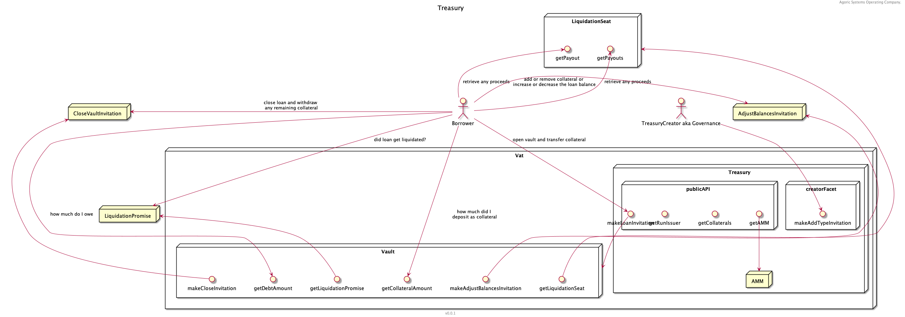

# Threat Model Diagrams
## ./smart_contracts/multipool_autoswap/mpas_component.png

## ./smart_contracts/multipool_autoswap/mpas_sequence.png

## ./smart_contracts/multipool_autoswap/mpas_sequence_001.png

## ./smart_contracts/multipool_autoswap/mpas_sequence_002.png

## ./smart_contracts/multipool_autoswap/mpas_sequence_003.png

## ./treasury/treasury.png

