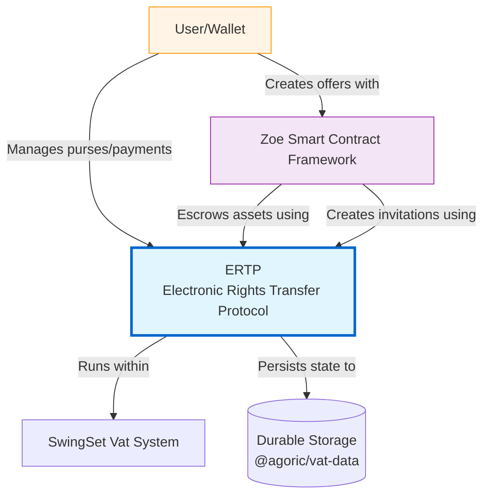
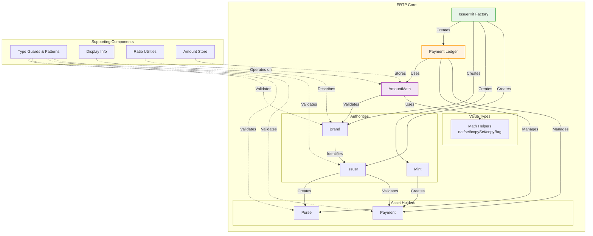
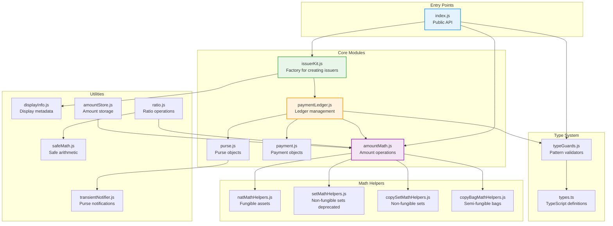
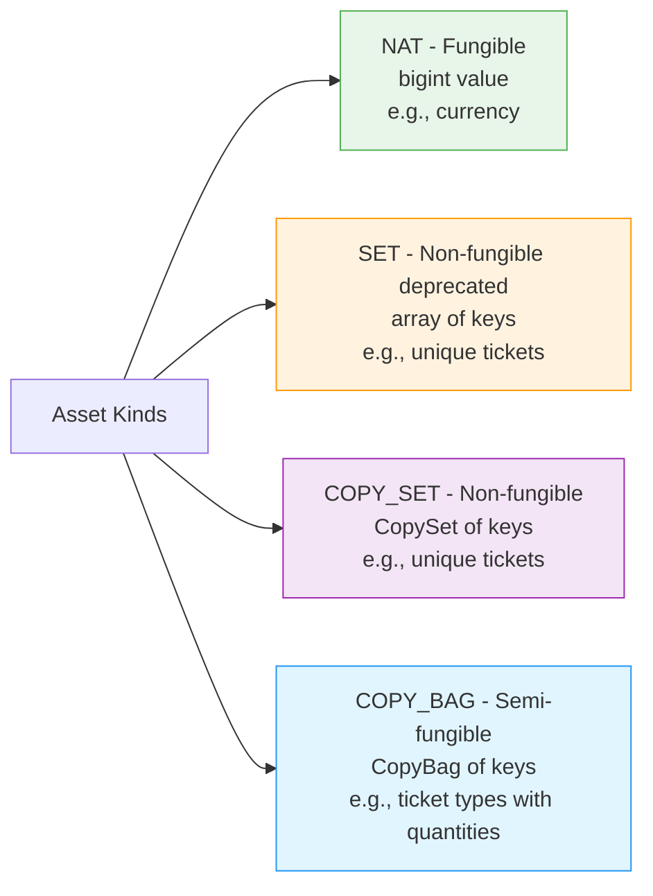
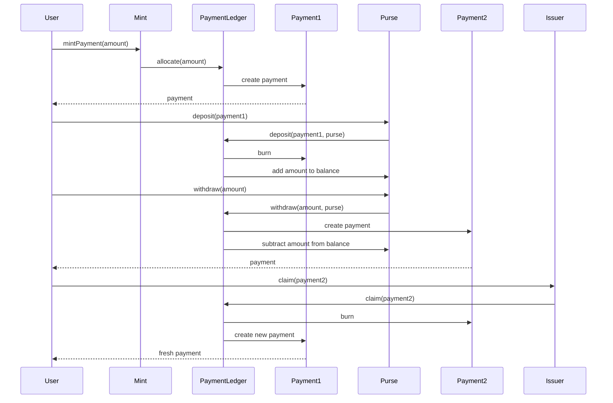
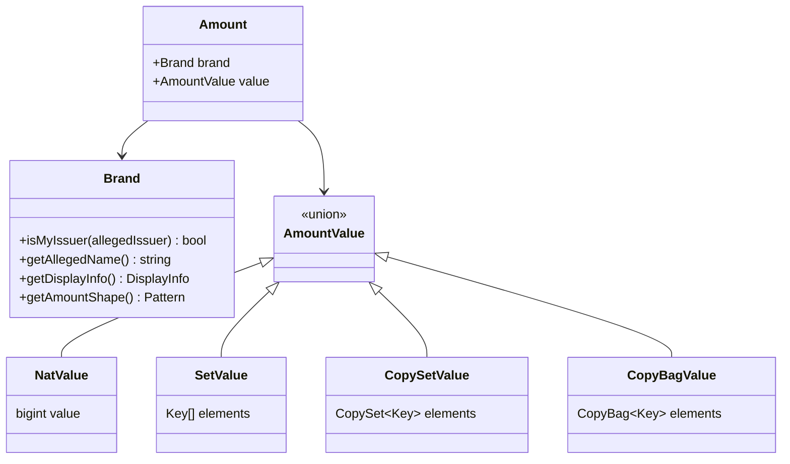
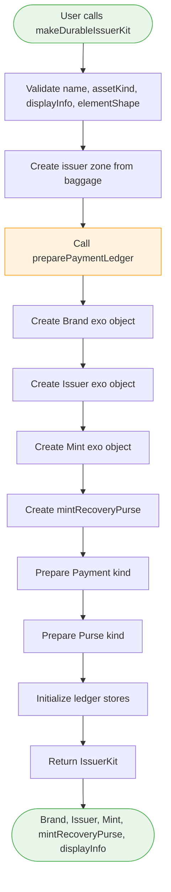
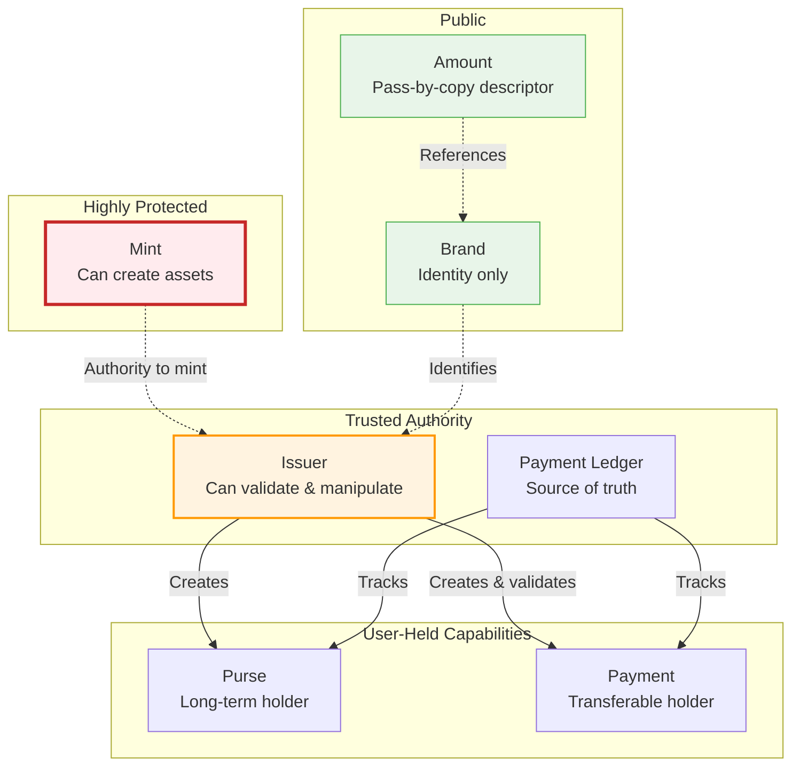

# ERTP Design Documentation

> **Status:** Active  
> **Author:** Agoric Engineering  
> **Date:** February 2026  
> **Related:** [@agoric/ertp](https://www.npmjs.com/package/@agoric/ertp), [ERTP Guide](https://agoric.com/documentation/ertp/guide/)

## Executive Summary

ERTP (Electronic Rights Transfer Protocol) is Agoric's digital asset standard. This document describes the architecture of ERTP using the C4 model, providing visibility into the design at multiple levels of abstraction.

ERTP is both a protocol specification and an implementation. It provides a uniform way to create and transfer digital assets in JavaScript with consistent security properties across all asset types.

---

## Table of Contents

1. [Context - System Level](#1-context---system-level)
2. [Container - High-Level Components](#2-container---high-level-components)
3. [Component - Module Relationships](#3-component---module-relationships)
4. [Code - Implementation Details](#4-code---implementation-details)
5. [Security Architecture](#5-security-architecture)

---

## 1. Context - System Level

This diagram shows how ERTP fits into the broader Agoric ecosystem.

**Key Relationships:**
- **Users** interact with ERTP to manage digital assets through purses and payments
- **Zoe** uses ERTP to escrow assets for smart contracts and create contract invitations
- **SwingSet** provides the hardened JavaScript execution environment
- **Durable Storage** enables ERTP objects to persist across vat upgrades

---

## 2. Container - High-Level Components

This diagram shows the major logical components within ERTP and their relationships.

**Component Descriptions:**

- **IssuerKit Factory**: Entry point for creating a new asset type with its associated mint, issuer, and brand
- **Payment Ledger**: Central authority that tracks all payments and purses, maintaining the invariant that total assets equal minted assets
- **AmountMath**: Provides arithmetic operations on amounts (add, subtract, compare) with brand validation
- **Authorities**: 
  - **Mint**: Object capability to create new assets (highly protected)
  - **Issuer**: Trusted authority to validate and manipulate payments
  - **Brand**: Identity of an asset type
- **Asset Holders**:
  - **Payment**: Short-lived, transferable holder of assets
  - **Purse**: Long-term holder of assets with deposit/withdraw operations
- **Math Helpers**: Polymorphic implementations for different asset kinds (fungible, non-fungible, semi-fungible)

---

## 3. Component - Module Relationships

This diagram shows the detailed relationships between source files in the ERTP package.

**Module Categories:**

1. **Entry Points**: Public API surface
2. **Core Modules**: Main business logic for issuers, ledgers, amounts, and asset holders
3. **Math Helpers**: Asset-kind-specific implementations for amount operations
4. **Type System**: Type definitions and runtime pattern validators
5. **Utilities**: Supporting functionality for display, ratios, storage, and notifications

---

## 4. Code - Implementation Details

### 4.1 Asset Kinds

ERTP supports four kinds of digital assets:

**Note on SET deprecation**: The SET asset kind (using plain arrays) is deprecated in favor of COPY_SET (using proper CopySet data structures). The SET representation had issues with duplicate detection and consistency. New code should use COPY_SET for non-fungible assets. The SET kind remains supported for backward compatibility with existing assets.

### 4.2 Payment Lifecycle

### 4.3 Amount Structure

### 4.4 IssuerKit Creation Flow

### 4.5 Key Invariants

The Payment Ledger maintains critical invariants:

1. **Conservation of Assets**: `sum(all payments) + sum(all purses) == sum(all minted) - sum(all burned)`
2. **Unique Payment Identity**: Each payment exists exactly once; claiming/depositing burns the old payment
3. **Brand Integrity**: All amounts associated with an issuer have the correct brand
4. **No Forgery**: Only the mint can create new assets

---

## 5. Security Architecture

### 5.1 Object Capability Model

### 5.2 Trust Boundaries

**What Users Must Trust:**
- **Issuer**: The sole authority for validating payments and creating purses
- **Brand**: The identity of an asset type (but brands can be spoofed, so verify issuer source)

**What Users Should NOT Trust:**
- **Payments from others**: Always validate through a trusted issuer before accepting
- **Purses from others**: Never accept; create your own from a trusted issuer
- **Brands from strangers**: Verify the brand comes from a trusted source
- **Amounts**: Descriptive only; validate brand is from expected issuer

### 5.3 Input Validation Strategy

ERTP protects against malicious code in the same vat through:

1. **Pass-by-copy amounts**: Amounts are records with no getters/methods, validated via `passStyleOf`
2. **Brand identity checks**: Amounts must have the exact brand instance (using `===`)
3. **Value validation**: Values are checked using math helpers specific to asset kind
4. **No proxy leaks**: `passStyleOf` throws on proxies with getters
5. **Hardened JavaScript**: All objects are frozen deeply via `harden()`

For detailed information, see [INPUT_VALIDATION.md](docs/INPUT_VALIDATION.md) and [user-safety.md](docs/user-safety.md).

---

## Key Design Decisions

### 1. Why Pass-by-Copy Amounts?

Amounts are pass-by-copy records (not objects with methods) to:
- Enable safe sharing across vat boundaries
- Prevent getter-based attacks
- Allow anyone to create amounts for negotiation
- Make amounts immutable descriptors

### 2. Why Separate Issuer and Brand?

- **Issuer**: Trusted authority that must be carefully chosen
- **Brand**: Public identifier that can be freely shared for communication
- This separation allows parties to negotiate using brands without exposing issuer authority

### 3. Why Math Helpers?

Different asset kinds (fungible, non-fungible, semi-fungible) require different arithmetic:
- **NAT**: Simple bigint addition/subtraction
- **SET/COPY_SET**: Set union/difference operations
- **COPY_BAG**: Multiset operations with element counts

Math helpers provide polymorphic implementations for each kind.

### 4. Why Payment Ledger?

The ledger is the single source of truth that:
- Tracks all payments and purses
- Enforces conservation of assets
- Prevents double-spending
- Enables atomic transfers

### 5. Why Durable Storage?

Using `@agoric/vat-data` and zones enables:
- Vat upgrades without losing asset state
- Recovery of purses after failures
- Persistent brand and issuer identities

---

## Related Documentation

- [ERTP Guide](https://agoric.com/documentation/ertp/guide/) - User-facing documentation
- [INPUT_VALIDATION.md](docs/INPUT_VALIDATION.md) - Detailed walkthrough of input validation
- [user-safety.md](docs/user-safety.md) - Guidelines for accepting issuers, payments, and amounts
- [README.md](README.md) - Package overview

---

## Revision History

| Date | Version | Changes |
|------|---------|---------|
| 2026-02-06 | 1.0 | Initial design documentation with C4 diagrams |
