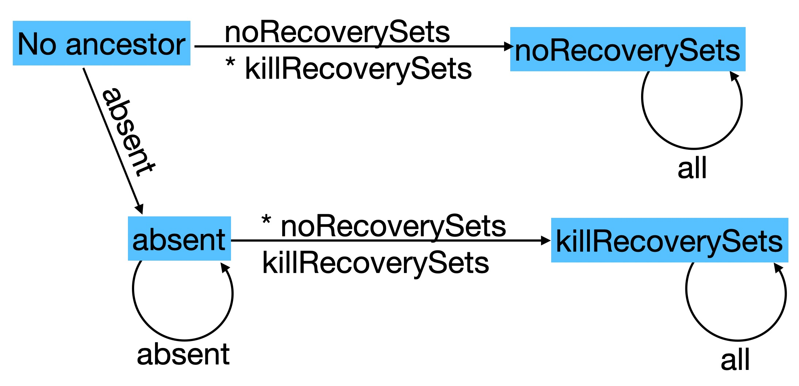

# Recovery Sets Upgrade State Machine

Before recovery sets were introduced, issuers always supported recovery sets.
This remains the default. But we wish to provide the option both to make new
issuers without recovery sets, as well as to revive old issuers whose recovery
sets we want to empty, and to ensure that no new payments are placed into these
recovery sets.

* ***absent*** - means either absent or `undefined`
* ***\**** - may be good to emit a diagnostic
* As `provide` parameters, `'noRecoverySets'` and `'killRecoverySets'` mean the same thing, except for the possible diagnostic
* As stored states, each is different.
   * absent - normal recovery sets
   * `'noRecoverySets'` - no recovery sets
   * `'killRecoverySets'` - emptying and suppressing recovery sets

Once we have good support for schema evolution, we might upgrade empty `'killRecoverySets'` ancestors into `'noRecoverySets'` descendants.
