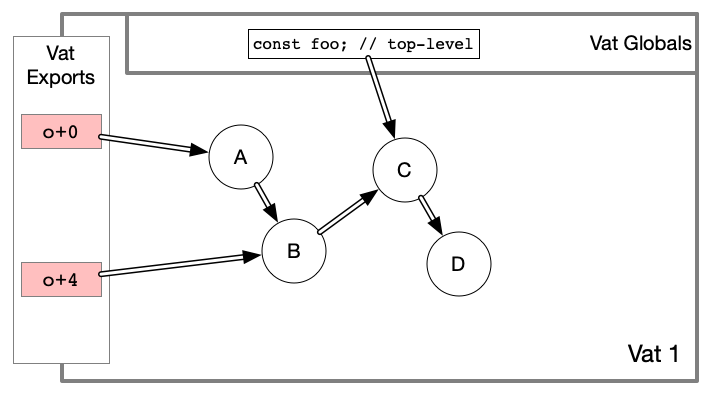
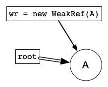
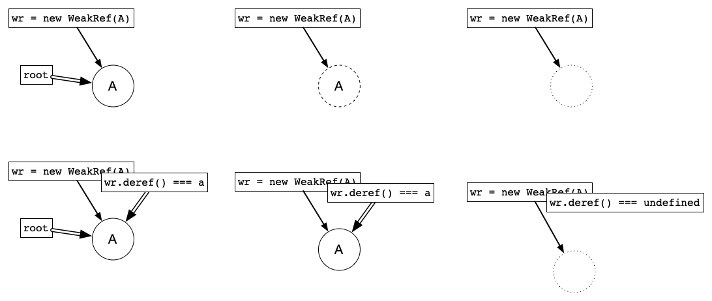
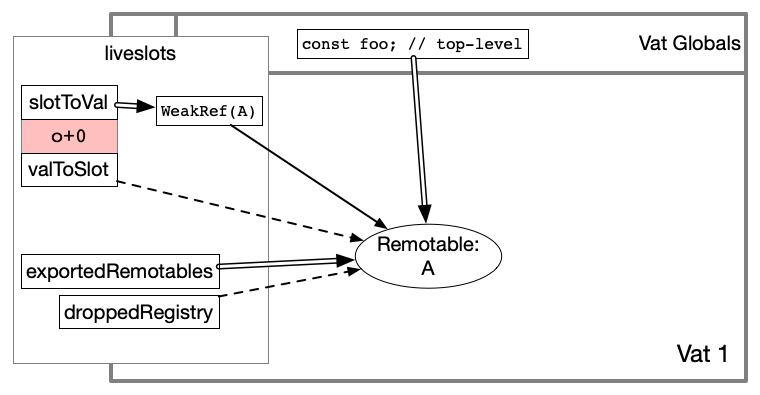
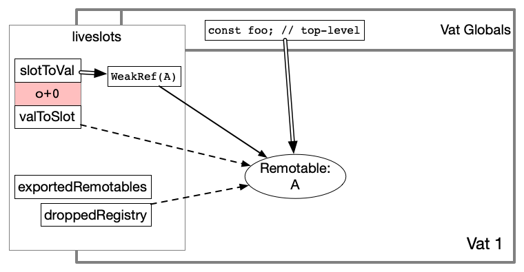
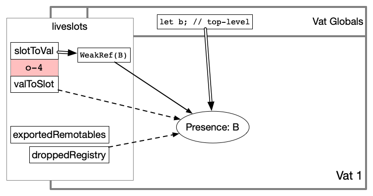
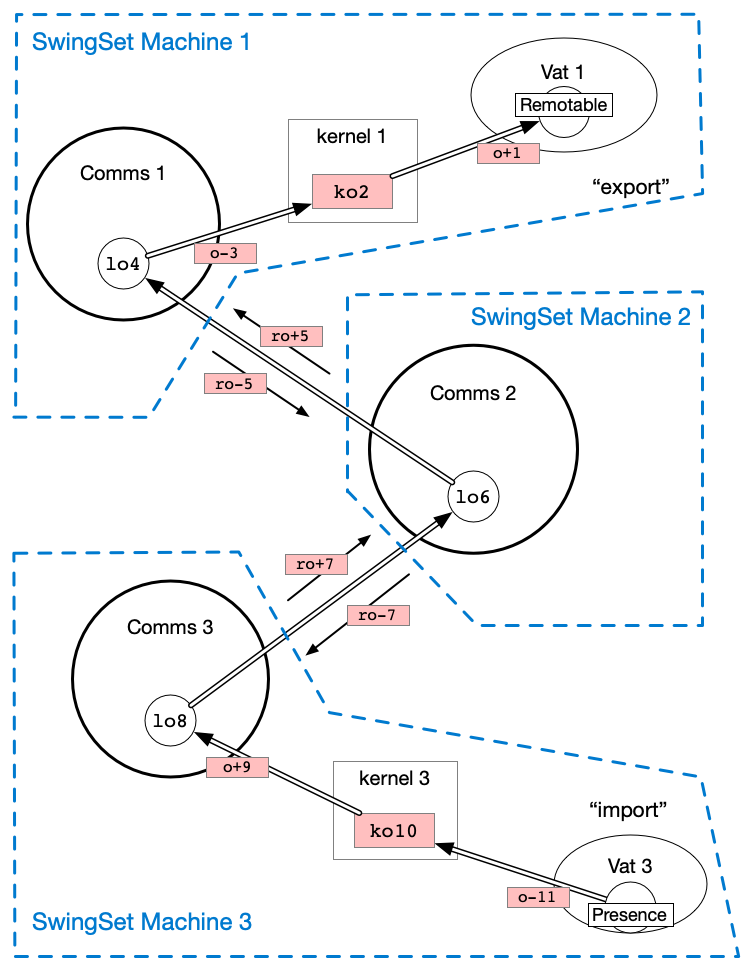
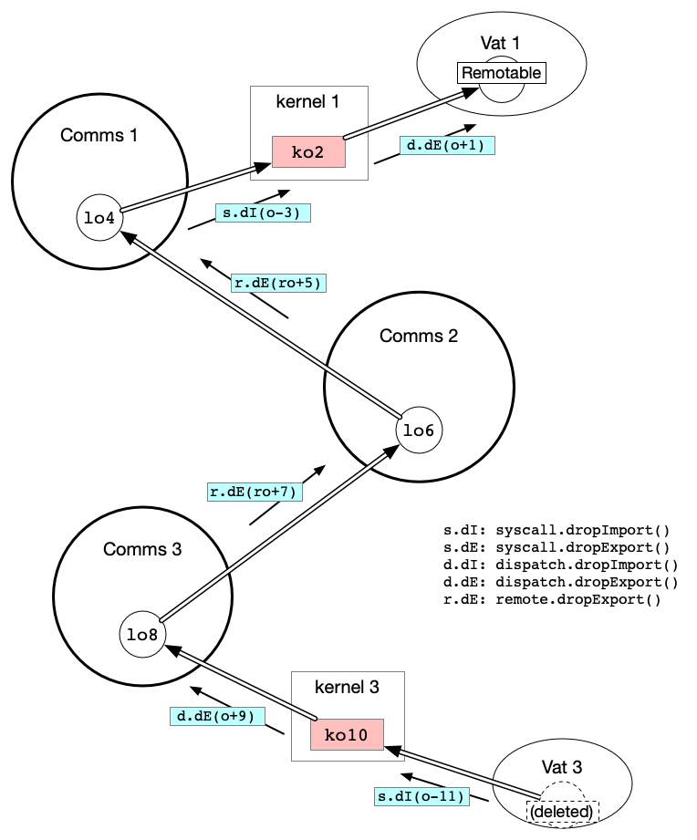

# Garbage Collection in SwingSet

JavaScript is an object-oriented language, and includes automatic garbage collection as part of the specification. When an object becomes unreferenced, the engine will (eventually) delete it and reclaim the memory it used for other purposes. The language provides a small number of tools that can interact with this collection mechanism:

* `WeakMap` and `WeakSet`: like regular `Map` and `Set` except they hold their keys weakly, not strongly
* `WeakRef`: holds a weak reference to its target, and allows the target to be retrieved if still alive
* `FinalizationRegistry`: run a callback after an object has been garbage collected

SwingSet provides an environment in which vat code works "as expected", including automatic garbage collection. This includes cross-vat and cross-host references, and some (but not all) of the language's GC primitives. To maintain deterministic execution, we deny vat code access to `WeakRef` and `FinalizationRegistry`. Vats can use `WeakMap` and `WeakSet` as usual (however SwingSet replaces them with modified versions to maintain their expected properties).

This document describes the details of SwingSet's implementation, starting with a definition of terms.

# Preliminaries

## Reachability

"Reachable" means a given piece of code has some way to produce the target object. In the following example, when a caller invokes `store(thing)`, the stash can now "reach" `thing` in the closed-over `stash` variable, and `retrieve()` can be called to exercise this ability:

```js
function makeStash() {
  let stash;
  return harden({
    store(thing) {
      stash = thing;
    },
    retrieve() {
      return stash;
    }
  });
}
```

"Reachable" doesn't necessarily mean the target object can be accessed from the outside: closely-held references are still "reachable" by the holder. In this example `counter` is reachable by the incrementer, but is not revealed in its entirety to callers:

```js
function makeIncrementer() {
  const counter = { count: 0, reads: 0 };
  return harden({
    increment() {
      counter.count += 1;
    },
    read() {
      counter.reads += 1;
      return counter.count;
    }
  });
}
```

For garbage-collection purposes, the incrementer can reach the counter. The platform must keep `counter` alive for at least as long as `incrementer` remain alive.

## References

Objects reference other objects in several ways:

* Object properties
* the Object's prototype, which is effectively another property for GC purposes
* code which closes over variable bindings from an enclosing scope (including methods: object properties which are functions)

And of course most data structures (Arrays, Maps) hold strong references to their members.

## Vat Roots

Each vat has a set of "root references": these keep all other objects alive. These are the only starting points: if there is no pathway from a root reference to a target object, the target object is unreachable and will eventually be deleted.

Vats have two kinds of root references. "Vat Globals" are top-level declarations (`const` and `let` declarations that appear in the highest scope of any module, outside any function definition). Top-level `const` declarations eternally reference the same value, while `let` declarations are mutable and their reference targets change as the value is modified. These references are controlled entirely by the code that makes up a vat.

"Vat Exports" are the subset of objects that have been used exported through the kernel to other vats. Such objects are added to the export table when they are used as an argument in an outbound message, or in the resolution of a Promise that some other vat is following. Each exported object is allocated a new integer and assigned a "vref" (vat-reference ID), in the form `o+NN`. A special initial "root object" is defined when the vat is first constructed (the return object of `buildRootObject()`) and assigned vref `o+0` (see [How Liveslots Uses the Vatstore](../../swingset-liveslots/src/vatstore-usage.md)).

Objects are removed from the export table when no other vat retains a reference. If an object is not exported, and not a global, and not transitively reachable by any object in either of those two categories, then the object is unreachable and will be deleted.



In this example, A is the "root object", A and B are vat exports, and C is a Vat Global. D is kept alive by virtue of the reference from C. If C were modified and dropped its reference to D, D would be deleted.

## Weak References

JavaScript, like many languages, offers the notion of a "Weak Reference". In JS, this is exposed in the `WeakRef` object. A weak reference can be used to reach the target *if* it is still around, but does not keep its target alive on its own.



JavaScript `WeakRef` objects have a `.deref()` method: this will either return the target of the weak reference, or return `undefined` if the target was deleted. We describe the WeakRef as either being "alive" or "dead" depending upon the availability of its target.

When the last strong reference to a target object is removed, we define the object to be "unreachable", however the JS engine does not necessarily delete it right away. As a result, there is a time window (after reference deletion, before a garbage collection sweep) during which a WeakRef might be able to resurrect the unreachable object. In the following diagram, the left-hand case is where the target is strongly reachable, the right-hand case is where the object was fully deleted, and the middle case is where the object was unreachable but not collected (and `deref` creates and returns the only strong reference to the target).



`WeakRef`'s ability to resurrect an otherwise unreachable object depends upon the internal activity of the JS engine's garbage collector. This activity is not a part of the JS specification, and will vary depending upon memory pressure and other details that vat behavior should not be sensitive to. Therefore, to maintain deterministic execution, vats are not allowed to access `WeakRef` (it is removed from global scope, and cannot be implemented from scratch). We describe it here because the "liveslots" code which helps to implement the vat platform depends heavily upon `WeakRef`.

## Finalization Registry

`WeakRef` provides the ability to "poll" whether a given object has been garbage-collected or not, but it does not provide any sort of notification when collection happens. To enable more proactive reactions to object collection, JavaScript provides the `FinalizationRegistry`, which will run a callback some time after a given object is collected. This callback will always happen on its own turn (just like Promise `.then` callbacks), however no guarantees are made as to exactly when it is run.

Swingset makes use of a `FinalizationRegistry` to implement its garbage collection code. However, it is denied to vats for the same reason that `WeakRef` is withheld.

## Recognizability

JavaScript offers `WeakMap` and `WeakSet` collections, which behave much like the regular `Map` and `Set`, but do not hold strong references to the objects used as keys. In addition, they are not enumerable, meaning there is no way to use them to retrieve a key object, even if that object is still alive (held by a strong reference elsewhere).

This makes them a form of "recognizer": despite not being usable to *reach* a given object, they can still be used to *recognize* that object. `weakmap.has(target)`, `weakmap.get(target)`, and `weakset.has(target)` are all effectively predicates that ask the question "is this a `target` that I've seen before?".

In this example, a `WeakSet` is used as a recognizer. Once the target has been submitted to `remember()`, the stash cannot produce the target object (it has no strong reference). However it can still tell if `ask()` is called with the same `thing` as before, or some unrelated object.

```js
function makeStash() {
  let recognizer = new WeakSet();
  return harden({
    remember(thing) {
      recognizer.add(thing);
    },
    ask(thing) {
      return recognizer.has(thing);
    }
  });
}
```

These predicates must be invoked with a strong reference to an object, so the target must be strongly reachable for the question to even be asked. However, we'll soon introduce the notion of abstract "swingset objects" (as opposed to the normal JavaScript `Object` type), and we want the predicate to answer a question about the abstract identity, even though the question is being asked with the concrete `Object` type. Hence, we must establish the difference between A being able to "reach" B, and A merely being able to "recognize" B.

We use a visual notation in which (strong) reachability is marked with a double line, weak references use a single line, and recognizability is marked with a dotted line:


SwingSet allows vats to use `WeakMap` and `WeakSet` as usual, however the semantics they provide are defined in terms of "swingset objects" instead of strictly using JavaScript `Object` objects.

## JS Object States: REACHABLE / UNREACHABLE / COLLECTED / FINALIZED / UNKNOWN

We'll set aside the notion of "recognizability" for a moment, and focus strictly on reachability.

When tracking the reachability state of a JavaScript `Object`, we define five states:

* UNKNOWN: the boring initial and final state
* REACHABLE: userspace has some way to produce the object
* UNREACHABLE: userspace has no way to produce the object
* COLLECTED: the JS engine has realized the object is gone
* FINALIZED: a `FinalizationRegistry` callback is being run

If you had a `WeakRef` for the object, it would be "alive" (i.e. `.deref()` returns a value) in the REACHABLE and UNREACHABLE states, and "dead" (`wr.deref() === undefined`) in COLLECTED and FINALIZED.


Note that there's no actual state machine with those values, and we can't observe all of the transitions from JavaScript. But we *can* describe what operations could cause a transition, and what our observations allow us to deduce about the state:

* UNKNOWN moves to REACHABLE when a delivery introduces a new import
  * or the vat exports/stores a newly created object
  * userspace holds a reference only in REACHABLE
* REACHABLE moves to UNREACHABLE only during a userspace crank
* UNREACHABLE moves to COLLECTED when GC runs, which queues the finalizer callback
* COLLECTED moves to FINALIZED when a new turn runs the finalizer
* liveslots moves from FINALIZED to UNKNOWN by doing `syscall.dropImports`

We have several subtle challenges to keep in mind:

* we cannot sense the difference between REACHABLE and UNREACHABLE, although we know it can only happen as userspace runs
* the transition from UNREACHABLE to COLLECTED can happen spontaneously, at any moment, whenever the engine experiences memory pressure and decides to run GC
* a new delivery might re-import an object that was already on its way out
  * the liveslots `slotToVal` WeakRef will re-use the old Presence if present (REACHABLE or UNREACHABLE)
  * if we're in COLLECTED, then a finalizer callback is already queued, and will run sooner or later, so the callback must not clobber a re-import

## Within-Vat vs Between-Vat

The SwingSet kernel manages a set of abstract entities known as "SwingSet objects" and "SwingSet promises". Within a vat, the "liveslots" layer uses concrete JavaScript `Object`s (Presences, Remotables, and Representatives) and the JavaScript `Promise` to give vat code the means to manipulate the kernel-managed objects. Vats create a Remotable, or obtain a Representative, when they want to "export" an object into the kernel (and on to some other vat). Vats receive a Presence when they "import" an object from the kernel (which was first exported by some other vat). Vats can both export a Promise and receive an imported Promise.

Within a single vat, the "liveslots" layer uses WeakRefs and a FinalizationRegistry to track when Presence, Remotable, and Representative JS `Object`s transition between the different states listed above. Armed with this information, liveslots can update its notion of whether the abstract SwingSet entity is REACHABLE, RECOGNIZABLE, or neither by the vat as a whole. Liveslots then issues syscalls to notify the kernel of the transition. If/when this results in an object becoming unreachable and/or unrecognizable by all vats, the kernel will notify the exporting vat with a delivery like `dispatch.dropExports` or `dispatch.retireExports`.

## Vat States: REACHABLE vs RECOGNIZABLE

To help explain the swingset garbage-collection algorithm, we define an importing vat's relationship to a given swingset object in one of three states:

* REACHABLE means the vat can both reach and recognize the object
* RECOGNIZABLE means the vat can recognize the object, but cannot reach it
* UNKNOWN means the vat does not know anything about the object

REACHABLE happens if the object is held anywhere in the vat, in a form that is reachable from one of the roots (an export or a global). This is the most common state.

RECOGNIZABLE happens when the object is used as a key in a `WeakMap` or `WeakSet` entry, but not stored elsewhere. If the vat held a copy of the object to compare against (e.g. with `===`), the object would also be reachable, and we'd be in the REACHABLE state, not RECOGNIZABLE. We do not give userspace code access to the JavaScript `WeakRef` or `FinalizationRegistry` objects, so `WeakMap` and `WeakSet` are the only tools they can use to achieve recognizability without also reachability.

RECOGNIZABLE is significant because we want a WeakMap in one vat to accept keys which are Presences associated with an exported Remotable from some other vat, and we want to clean up the entries when they go away. We cannot rely upon the JavaScript engine's GC code to perform this cross-vat collection, because the inter-vat links are just data (vrefs and krefs), which are opaque to the JS engine.

The previous distinctions are only for the zero or more vats which *import* a SwingSet object. Every SwingSet object is exported by exactly one vat. This exporting vat might know that the kernel can still reach the object, or it might know the importing vats can merely recognize the object. As a result, from the kernel's point of view, a given vat's relationship to a "SwingSet object" is in one of five states:

* exported (REACHABLE)
* exported (RECOGNIZABLE)
* imported (REACHABLE)
* exported (RECOGNIZABLE)
* unknown

The kernel is responsible for managing these per-vat states, and reacting to syscalls that the vat emits to change their state (which may result in deliveries to other vats, to inform them to update their own states). Vats, through [liveslots.js](../../swingset-liveslots/src/liveslots.js), are responsible for managing their internal JS `Object` states, and emitting syscalls to notify the kernel about changes.

## Virtualized Data

To move large data out of RAM and onto disk, SwingSet gives vats a handful of "virtualized data" tools. The most basic is a "virtual object", which is a SwingSet object whose state (properties) are kept on disk when not in active use (see [Virtual and Durable Objects](./virtual-objects.md)). The second is a "virtual collection", which is like a Map or Set or WeakMap or WeakSet (see [Store-making Functions](../../store/docs/store-taxonomy.md)).

Instead of Remotables, virtual objects use "Representatives" as the handle with which the object is sent, received, and manipulated. The Representative is a JS `Object`, however it goes away when userspace drops the last strong reference. But a new one might be created the next time the object is received (or retrieved from offline data), As a result, a virtual object might be defined and populated, and even reachable/recognizable by other vats (or serialized local data), even though there is no local Representative object at that moment.

Liveslots and the virtual object manager cooperate to ensure these abstract objects (and their state) are retained even if the concrete JS `Object` Representative is not.


# Within-Vat Tracking

(TODO): describe `slotToVal` (WeakRefs), `valToSlot`, `exportedRemotables`, `pendingPromises`, `importedDevices`, the `deadSet`, the `droppedRegistry` and its finalizer callbacks, the implementation of of `processDeadSet`, and the implementation of `dispatch.dropExports`, `retireExports`, and `retireImports`.

Within a Vat, and for the purpose of SwingSet objects, liveslots and the virtual object manager interact with three kinds of JS `Objects` for use by vat code:

* `Remotable`: vat code creates this with `Far(interfacename, methods)` to expose identity and behavior to external callers. Remotables are held in RAM for their entire lifetime, and exist only within the exporting vat. The `Remotable` object is "precious": the lifetime of the  "SwingSet object" is the same as that of the `Remotable`, and liveslots is responsible for keeping the Remotable alive until all other vats have lost reachability to it. At any given moment, each non-virtual SwingSet object exported by a given vat has exactly one Remotable.
* `Representative`: vat code defines a "Kind" by calling `makeKind()` to define how new instances of the Kind should be created, and how they behave. `makeKind()` returns a "kind constructor", which vat code then uses to make new instances. These instances are represented by a single `Representative` object, however this object is *not* precious: the `Representative` can be dropped without deleting the abstract SwingSet object (or its state). At any given moment, each virtual SwingSet object exported by a given vat has either no Representative or one Representative.
* `Presence`: vats which import a SwingSet object are given a `Presence` to serve as a proxy for the remote object. This Presence can be used as the target of an `E(presence)[methodName](...args)` call such as `E(remoteMap).get(key)`, or it can be passed around in method arguments, or within the resolution of a promise. At any given moment, each SwingSet object imported by a given vat has either no Presence or one Presence.
  * this Presence might be used as a key of a WeakMap or WeakSet, and the Presence might be dropped within the importing vat and then re-introduced by some other vat
  * hence the vat might retain recognizability of the SwingSet object even if it drops the Presence (and perhaps also loses reachability of the object)
  * therefore we modify the WeakMap/WeakSet made available to userspace code to act upon the SwingSet object identity of the Presence, rather than the JS `Object` identity, and to remember the recognizability status independently of the reachability status

Within a Vat, liveslots uses four data structures to keep track of JS `Objects` and their relationship to the kernel:

* `slotToVal`: a `Map` in which each key is a vref and the corresponding value is a `WeakRef` which points (while alive) at a Remotable, Representative, or Presence
* `valToslot`: the logical inversion of `slotToVal`, a `WeakMap` in which each key is a Remotable/Representative/Presence and the corresponding value is a vref
* `exportedRemotables`: a `Set` whose members are `Remotables`
* `droppedRegistry`: a `FinalizationRegistry` whose subjects are a Remotable/Representative/Presence

## Exported Remotables

When a Remotable is first exported, the tables look like this:



Liveslots holds a strong reference in `exportedRemotables` while the object might be reachable by the kernel (meaning it is reachable by some importing vat, or from a kernel data structure like the run-queue or a resolved promise). This reference is held until the kernel uses `dispatch.dropExports` to release it. The Remotable might also be held by a vat global, or something reachable from there.

Even after the kernel drops the Remotable, some downstream vat might still be able to recognize the object (if a local reference kept it alive, and it were ever re-exported). Hence `dispatch.dropExports` does not delete the `valToSlot` or `slotToVal` entries. If the Remotable survives and is re-exported, it will get the same vref as before (via `valToSlot`), retaining its identity.



Later, if/when the Remotable is released by any remaining local references, and after the next GC sweep occurs, the WeakRef will die (along with the `valToSlot` entry, since it's a WeakMap), and eventually the finalizer callback will be run. Liveslots reacts to this by sending a `syscall.retireExport` and deleting the lame-duck `slotToVal` entry. This informs the kernel that the SwingSet object identity is gone, so any remaining downstream vats can give up their ability to recognize the object (and delete their WeakMap values, if any).

The virtual object manager must keep track of Remotables that are used in virtualized data, and hold onto an additional strong reference for as long as the vref is referenced by that data. A table of refcounts is maintained in the DB, incremented for each virtual object state property, virtual collection value, and non-weak virtual collection key that includes the Remotable's vref.

## Imported Presences

When the kernel makes a delivery into the vat which introduces a vref for the first time, liveslots creates a Presence for it, and populates `slotToVal`, `valToSlot`, and the `droppedRegistry`. It does *not* put the Presence in `exportedRemotables`, because it should not retain a strong reference to the Presence (only userspace should do that, so we can sense when that reference is released).



The SwingSet object is kept "reachable" by two sources: a live Presence, and the vref being reachable from any of the vat's virtualized data (i.e. in a property of a virtual object, or as the value of a `makeScalarWeakMapStore` instance). Liveslots uses the `droppedRegistry` to keep track of the former, and the virtual object manager can be queried about the state of the latter. When both sources have gone away, liveslots uses `syscall.dropImports` to inform the kernel that this vat can no longer reach the vref. If the vref is not also recognizable at that time (i.e. it is not in used as a *key* of a `WeakMap`, `WeakStore` or a `makeScalarWeakMapStore` instance), liveslots also calls `syscall.retireImports` to inform the kernel that the vat can't recognize the vref either.

## Virtual Objects, Virtualized Data

When a virtual object is created for the first time, a vref is allocated just like for an exported Remotable, and the "initial representative" is created to give back to the caller. The slotToVal/valToSlot tables track the Representative `Object`. The Representative is *not* added to `exportedRemotables` (because we *want* it to be dropped once userspace is not actively using it), but we still use `droppedRegistry` to remain aware of the Representative's presence in (or absence from) memory.

Later, if the vat receives a message from the kernel that references the virtual object's vref, or if it appears in virtualized data being unserialized, the virtual object manager will first use slotToVal to see if there is an existing Representative to use. This maintains the "at most one Representative at a time" invariant. If not, a new Representative is created, and slotToVal/valToSlot are populated.

If/when this Representative `Object` is no longer referenced by userspace and becomes collected, the `droppedRegistry` finalizer will run, and liveslots will learn of its disappearance. At that point, liveslots checks with the VOM to see if the vref is truly unreachable, and perhaps call `syscall.dropExports`. If the vref is also unrecognizable, it will also call `syscall.retireExports`.

The full flowchart for tracking the reachable/recognizable state of virtual objects is complex. See ticket [#2724](https://github.com/Agoric/agoric-sdk/issues/2724) for details.

## deadSet, processDeadSet

There is a temporal gap between the moment a JS `Object` becomes UNREACHABLE, and the point at which the engine finally notices (moving it to COLLECTED, so a WeakRef could be polled). There is a further delay before a finalizer callback is run (moving it to FINALIZED), and liveslots is notified about the change in status. During this gap, a replacement object might be created, negating whatever reaction should have taken place.

To deal with this correctly, the finalizer callback merely adds the dead object's vref in the `deadSet`. Once all userspace activity has finished, liveslots calls `processDeadSet()` to examine this set and see what work (if any) needs to be done. If an object is re-introduced during the crank, `processDeadSet()` will see a new+live WeakRef in `slotToVal`, and the vref is ignored. But otherwise, `processDeadSet()` treats the vref as recently dropped, and figures out what must be done.

When the vref identified a Presence, we now know that there is no Presence supporting the vat's reachability of the imported vref. If the VOM also disavows reachability (tracked in `reachableVrefs`), liveslots adds the vref to a list for `syscall.dropImports`. If the VOM then disavows recognizability as well, the vref is also scheduled for `syscall.retireImports`.

When the vref identified a Remotable, liveslots schedules the vref for `dropExports`, which signals the kernel that the object's identity has been destroyed, and any downstream recognizers should give up. Remotables are precious, and once they're gone, the SwingSet object they represent is also gone. If the VOM needed the Remotable as the value of virtualized data, it should have kept a strong reference (this is managed in the `reachableRemotables` `Set`).

If the vref identified a virtual object (i.e. the late `Object` was a Representative), `processDeadSet()` consults with the VOM to figure out the new state. The loss of the Representative is one of three pins that support reachability: the presence of a kernel reference is the second, and a virtualized-data value holding the vref is the third. The latter two are kept on disk, rather than in RAM. When all three are gone, the vat can signal `syscall.retireExports` just like it would if a Remotable were collected.

## Other Object Types

Vats can import three kinds of things: objects, promises, and device nodes. Most GC is about objects.

Objects have a strict and immutable notion of "importer" vs "exporter". Each object is exported by exactly one vat, and imported by zero or more vats (and/or referenced by kernel tables, independently of any vat).

In contrast, Promises have a single "decider", which is either the one vat which currently holds decision-making authority, or the kernel itself (in the case of result promises for queued messages). The decider can move around over time, as the promise is used in the result of messages passed from one vat to another.

In addition, the GC behavior of JS `Promise` objects is non-trivial. For unresolved Promises, vats need to remain prepared to handle a resolution as long as any `.then` callback is scheduled, but we have no way to sense whether `.then` has been called or not. Our general approach is to remove promise identifiers from each vat's c-list once they've been resolved, but keep a copy of the resolution data in the kernel until the promise ID has been fully retired.

As a result, we track `Promise` objects in the liveslots `slotToVal` and `valToSlot` tables for the sake of serialization, but not in `exportedRemotables` or the `droppedRegistry`. We use a separate table named `pendingPromises` to keep the `Promise` objects alive until they are resolved.

Vats can also import device nodes, however there are very few of them in the system (only a handful per device). Like Promises, we use `slotToVal` and `valToSlot`, and a special `importedDevices` table, but not the others. Devices nodes are immortal: vats never announce their drop or retirement.

The `dropImports`, `retireImports`, and `retireExports` syscalls/deliveries only mention object references, never promises or device nodes.

## Vat GC Cycle

Within a vat, liveslots runs each delivery in two phases. The first phase is for userspace: a message or promise resolution is delivered, which causes arbitrary userspace code to run. Eventually that userspace code comes to a halt: userspace can use Promises to span multiple turns, but it does not get `setImmediate` or any other form of IO, so eventually control will return to liveslots, and userspace has no way to regain agency until liveslots makes another delivery.

The second phase then begins with a call to the platform's `gc()` primitive, and enough delay to allow any activated finalizer callbacks to run. The necessary calls were determined experimentally for each JS engine we use: the winning combination for both Node.js and XS appears to be two `setImmediate` calls, followed by `gc()`, followed by a third `setImmediate`.

Liveslots then uses `processDeadSet()` to examine everything turned up by the finalizer callbacks during the delivery, and emits some number of `syscall.dropImports`, `syscall.retireImports` and `syscall.retireExports` calls.

When the vat delivery is a GC action (`dispatch.dropExports`, `dispatch.retireExports`, or `dispatch.retireImports`), liveslots gets control immediately, and never calls into userspace. Since userspace does not have access to `FinalizationRegistry`, it cannot sense objects going away, userspace never gets control during these deliveries (and because userspace does not get `WeakRef` either, it cannot even poll to see whether an object has been collected or not).


# Cross-Vat (kernel) Tracking

(TODO): describe the c-list entry "reachable" flag, the "reachable" and "recognizable" refcounts on all kernel objects, how these are updated by clist manipulation like `mapKernelSlotToVatSlot` and `mapVatSlotToKernelSlot`. Describe how syscalls are translated from vat space to kernel space, then processed by `kernelSyscall.js` in their kernel-space form. Describe the kernelKeeper `maybeFreeKrefs` ephemeral set, `processRefcounts()`, the durable "GC actions" set, `processOneGCAction()` and how it fits into the run-queue, and how the resulting deliveries like `dispatch.dropExports` are processed by translating from kernel space into vat space (and the refcount/reachable manipulation that occurs during translation). Describe vat-to-device invocations and how their clist entries are used on both sides of the control transfer.

Because of the work done by liveslots and the comms vat, described above, the kernel can treat each vat as a monolithic importer or exporter of vrefs, and does not need to know anything about the vat's internal state. For each vref, a vat is either the single exporter, one of the (possibly multiple) importers, or neither. The kernel itself may be able to reach the vref (via queued messages, promise resolution data, or auxiliary data), or not.

This section describes how the kernel keeps track of the SwingSet object's state, and the transitions that might occur.

## Vat Reachability

For each vat, the kernel maintains a c-list, which maps vrefs (vat-side reference identifiers, like `o+0` and `o-4`) to and from krefs (kernel-side identifiers, like `ko5` and `ko12`). These c-list entries maintain a stable identity for each SwingSet object, from initial export to final retirement.

Each c-list entry also has a `isReachable` flag. For importing vats, this indicates that the vat can reach the kref. If `isReachable === false`, something inside the vat could recognize a the SwingSet object, but nothing holds a strong reference, so the vat could never include the kref in an outbound message or promise resolution. For exporting vats, the kref is obviously always reachable, so `isReachable` is instead used to remember whether we've sent a `dispatch.dropExport` into the vat or not.

## Kernel Reachability

Beyond vats, SwingSet objects can also be reached by certain kernel-side data structures.

The first is the primary run-queue (or the escalator structure that will eventually replace it). Messages which are waiting their turn for execution can have arguments, and these arguments can reference SwingSet objects. These objects must be retained even though no vats are currently importing them. When the message reaches the front of the queue and is delivered to some vat, the object will be imported by that vat (at least until the delivery is finished, possibly longer). The run-queue's reference will go away, and the vat's c-list entry will replace it. Until that point, each run-queue entry that references a kref will maintain a single "reachable" reference.

The second is the queue of messages for each unresolved promise. When the decider of the promise cannot accept pipelined messages (i.e. everything but the comms vat), those messages are held in the kernel's promise table. When those messages have arguments that include a SwingSet object, the queued message maintains a single "reachable" reference on the kref.

The third is the table of resolved promises. Ideally these promises are quickly retired (since all vats retire their c-list entry once the promise is resolved), but cycles or other kernel-side references might keep them around for a while, and promise resolution data can contain SwingSet objects. Each resolved promise that references a kref will maintain a "reachable" reference.

The fourth and final source of kernel-side references is the upcoming [#2069](https://github.com/Agoric/agoric-sdk/issues/2069) "auxiliary data". This is an immutable capdata structure attached to each SwingSet object. Any other SwingSet objects included in the auxdata must be kept alive until the enclosing object is released. This does enable cycles in the dependency graph, so when we implement this, we must either implement a full mark-and-sweep GC system, find a cheaper hack ([#2870](https://github.com/Agoric/agoric-sdk/issues/2870)), or simply tolerate the indefinite retention of anything involved in a cycle.

## Reference Counters

The kernel maintains a pair of reference counters for each SwingSet object (in addition to the `owner` pointer that indicates which vat should get messages sent to the object).

* `referenceable`: this counts how many importing vats have the kref in their c-list, with the `isReachable` flag set, as well as every kernel-side reference to the kref
* `recognizable`: this counts every importing vats with the kref in their c-list, even the ones with `isReachable === false`, plus all the kernel-side references. The `recognizable` count will always be equal or greater than the `referenceable` count.

The counters are kept in the kernelDB, under keys named `ko${NN}.refCount`, with a value like `${reachable},${recognizable}`.

These counters are incremented and decremented as the kernel moves messages from one queue to another, delivers messages to vats, and accepts syscalls from vats. The kernel refrains from acting upon refcount changes until the delivery is complete, since the state might change as later syscalls are made. In particular, removing a message from the run-queue and delivering it to a vat causes a "break-before-make" transition of the argument krefs, dropping their refcount briefly to zero but then immediately incrementing them back up to one. If we acted too soon, we would drop objects that are still in use.

Each time a refcount drops to zero, the kernel adds the kref to an ephemeral set named `maybeFreeKrefs`. After the delivery is complete, a function named `processRefcounts()` examines this set to see which krefs are truly unreachable/unrecognizable, and takes action. This deferred action mirrors the way liveslots calls `processDeadSet()` at end-of-crank, for similar reasons.

## syscall.dropImport Processing

Importing vats perform `syscall.dropImport` to declare an import as unreachable. The vat will not be able to emit a message (syscall.send or syscall.resolve) that includes the vref, unless and until the kernel first re-imports the vref (by including the vref in a dispatch.deliver or dispatch.notify). The vat does this when the Presence it created to represent the vref has been collected, and when the vref is not referenced by any virtualized data.

The vat may still be able to recognize the vref: the Presence might have been used as the key of a WeakMap or WeakSet. The vat will perform `syscall.retireImport` if/when it ceases to be able to recognize the vref. To preserve its identity, the clist mapping must be maintained until that point.

When the kernel translates the vat's `syscall.dropImport`, it goes through the clist to get a kref. The kernel then clears the clist entry's "reachable" flag, and decrements the kernel object's "reachable" refcount. If the resulting refcount is zero, the kref is pushed onto the `maybeFreeKrefs` set for examination during post-delivery processing as described below. No other work is necessary.

`dropImport` means the vat no longer has a Presence, and therefore its `valToSlot` and `slotToVal` tables will not have an entry for the vref. (Virtualized data may still know the vref in a key somewhere, but there is no Presence for it, nor any way to get one without the kernel's help).

## syscall.retireImport Processing

Importing vats perform `syscall.retireImport` when they can neither reach nor recognize an import. If the Presence was never used in virtualized data or as a weak key, this will happen at the end of the crank in which the Presence is collected. Otherwise, the vat may do `syscall.dropImport` now, and `syscall.retireImport` much later.

The kernel translates `syscall.retireImport` into kernelspace (krefs), deletes the importing vat's clist entry, and decrements the kernel object's "recognizable" refcount (if the object still exists). If this results in zero, the kref is pushed onto the `maybeFreeKrefs` list for post-delivery processing as described below. No other work is necessary.

When `syscall.retireImport` goes to decref "recognizable", the reason the object might not still exist is that the exporter might have already done `syscall.retireExport`, which deletes the kernel object table entry (along with the refcounts). This will queue a `dispatch.retireImport` to all importers, but this importing vat may not have seen it yet. So `syscall.retireImport` must be tolerant of the object being missing. In this case, it merely has to delete the clist entry.

## syscall.retireExport Processing

When a vat exports a Remotable or Representative, that object remains "reachable" until the kernel informs the vat otherwise by calling `dispatch.dropExport`. Once that has happened, liveslots stops holding a strong reference on the export, and if nothing else in the vat is keeping it alive, the Remotable will eventually be collected. When the finalizer fires, the exporting vat knows that it will never again emit a message that references the object.

At this point, the exporting vat performs `syscall.retireExport` to inform the kernel. This means the vat no longer has a Remotable (or a virtual object is no longer reachable), and its `valToSlot` and `slotToVal` tables will not have an entry for the vref. In addition, since this is the *exporting* vat, we know the vref appears nowhere else in the vat (if it were kept alive by virtualized data, it would not retire the export, and if it were used as a key in a weak collection, that collection's entry will be removed once the vref is unreachable).

The kernel translates the `syscall.retireExport` into kernelspace (krefs), and deletes the importing vat's clist entry. Then it consults the kernel object table to get a list of subscribers (vats which have the kref in their own clists). For each subscribing vat, the kernel adds a `retireImport ${vatID} ${kref}` item to the GC action set (described below). Then the kernel decrefs any auxiliary data the kernel object might have had (which may push krefs onto `makybeFreeKrefs`). Finally the kernel deletes the kernel object table entry, and returns control to the exporting vat.

At this point, the kref is only referenced in the queued `retireImport` action and the importing vats' clists. We know these vats cannot export the kref (their "reachable" flag is clear, otherwise the exporting vat couldn't have retired it). So nothing can save the kref. Eventually the `retireImport` actions will be processed, as described below. The kernel will translate the kref through the subscribing vat's clist, delete the clist entry, then deliver the message. The vat reacts to `dispatch.retireImport` by notifying any weak collections about the vref, which can delete the virtual entry indexed by it. This may provoke more drops or retirements.

If the last importing vat had previously called `syscall.retireImport`, there will be no subscribers, but the kernel object data will still be present (a general invariant is that the exporting clist entry and the kernel object table entry are either both present or both missing). A `dispatch.retireExport` will be on the queue for the exporting vat, but it has not yet arrived (otherwise it would be illegal for the exporting vat to call `syscall.retireExport`). That `dispatch.retireExport` GC action will be nullified during `processOneGCAction` because its work was already performed by the exporter's `syscall.retireExport`.

## syscall.abandonExport processing

Although not currently used (see [#6650](https://github.com/Agoric/agoric-sdk/issues/6650)), the kernel still supports vat issuance of `syscall.abandonExports()` with vrefs to be abandoned as part of vat upgrade (i.e., Remotables that live solely in the RAM heap and non-durable merely-virtual objects, and ideally also otherwise-durable objects not stored in baggage and referenced only by other abandoned objects). The kernel reacts to this in roughly the same way it reacts to the entire vat being terminated (which it is, sort of, at least the heap is being terminated). Each vref is deleted from the exporting vat's c-list, because *that* vat isn't going to be referencing it any more. The kernel object table is updated to clear the `owner` field: while the kernel object retains its identity, it is now orphaned, and any messages sent to it will be rejected (by the kernel) with a "vat terminated" error.

No other work needs to be done. Any importing vats will continue to hold their reference as before. They can only tell that the object has been abandoned if they try to send it a message. Eventually, if all the importing vats drop their reference, and nothing else in the kernel is holding one, the kernel object entry will be deleted. In this case, no `dispatch.retireExports` is sent to the old exporting vat, since it's already been removed from their c-list.

## Post-Decref Processing

Those three syscalls may cause some krefs to become eligible for release. The "kernelKeeper" tracks these krefs in an ephemeral `Set` named `maybeFreeKrefs`. Every time a decrement causes the reachable count to transition from 1 to 0, or the recognizable count to transition from 1 to 0, the kref is added to this set.

After the VatManager has completed the delivery (and we've decided to commit the crank, rather than unwind it), the kernel calls `processRefcounts()` to perform any garbage collection that might be possible. This walks `maybeFreeKrefs`, looking for ones that can be collected, and possibly adds actions that must be taken to a durable "GC action Set" (stored in the DB).

The kernel may employ "break before make" transitions, so being placed on this list is not a guarantee that the kref will be released. For example, unpipelined messages sent to an unresolved promise are kept on a per-promise queue, and when the promise is resolved, each message is moved from that queue to the kernel's run-queue. Any arguments in those messages are held alive by a reference count associated with the message. The kernel might decrement the count first, when pulling the message off the promise's queue, before incrementing it again, when pushing it onto the run-queue. Reference counts are not considered authoritative until the current delivery is complete.

As a result, `processRefcounts()` must ignore items whose refcounts are no longer zero. The `maybeFreeKeys` Set is a performance-improving hint, nothing more. It would be correct (although hugely inefficient) for `processRefcounts()` to simply examine every kref in the entire kernel.

The general process of `processRefcounts` is:

* pull a kref from `maybeFreeKrefs`
* examine the state to see if it can actually be dropped and/or retired
* if so, make the necessary state changes to reflect the drop/retire and add the kref to the GC action set for the necessary vat notifications
* those state changes may add more items to `maybeFreeKrefs`
* repeat until `maybeFreeKrefs` is empty
* commit the delivery and the updated GC action set

Then, when the kernel is considering pulling an item off the run-queue, it should first consult the GC action set for notices that can be delivered. These are processed like regular vat deliveries, just at a higher priority. They cause `dispatch.dropExport`, `dispatch.retireImport`, and `dispatch.retireExport` deliveries. These deliveries may cause more drop/retire syscalls, queueing more GC deliveries. As a matter of scheduling policy, the kernel will complete all GC work before doing any normal vat deliveries. However it may hit a block meter limit first, in which case the GC work will be resumed in the next block (possibly with device input events interleaved).

Between deliveries, `maybeFreeKrefs` will be empty (syscalls add to it, post-delivery GC processing in `processRefcounts` drains it). After a delivery, the GC action set may contain work to do. All of this work is completed before beginning a regular `dispatch.deliver`/`.notify` delivery.

The specific sequence is:

* pull an item off `maybeFreeKrefs`, examine its refcounts to see if it really can be released, or if it was caught by some other reference
* any `promise` with a zero refcount can be deleted:
  * we only retire *resolved* promises, so the promise table entry will have no queued messages
  * we delete the resolution data, which decrements both reachable+recognizable counts for any krefs it used to contain
  * no vat needs to be notified about the promise deletion itself, however this might trigger the release of objects, which may eventually cause vats to be notified about something else
* any reachable `object` with a zero reachability count can be dropped (but not retired)
  * we look up the exporting vat (`.owner`) and check the reachability flag in its c-list entry
  * if the flag is clear, the vat already knows the object is unreachable, and we stop processing
  * if set, add `dropExport ${vatID} ${kref}` to the action set (if not already present)
  * you could say the final `syscall.dropImport` creates a tension between the reachable count and the exporting clist's reachability flag
    * this tension is partially relieved by adding a dropExport to the action set
    * it is fully relieved by delivering a `dispatch.dropExport` and clearing the reachability flag
    * the stable state (no work to be done) is a zero reachability count and a cleared reachability flag
* any existing `object` with zero recognizability count can be retired
  * the reachable count should always be zero (a general invariant is that the reachable count is never larger than the recognizable count )
  * either the exporting vat c-list reachability flag should already be clear, or there should be a `dropExport` for it in the action set
    * it is frequently the case that both reachable+recognizable counts reach zero at the same time
    * `processRefcounts` reacts to this by pushing both `dropExport` and `retireExport` to the action set
  * add `retireExport ${vatID} ${kref}` to the action set (if not already present)

When processing the GC action set, the kernel should sort the items and batch them by vatID, to improve determinism. For now, we make up to three deliveries per vat: `retireImports`, `dropExports`, `retireExports`. Eventually we may merge these three into a single delivery. One ordering invariant must be maintained: when both `dropExport` and `retireExport` for the same kref are in the set, the `retireExport` must not be delivered before the `dropExport`.

To allow the actions to span multiple blocks, `processGCActions` needs to take the durable set and choose a single (vatID, action-type) pair to deliver. It should remove those actions from the set and make the delivery, then commit both the removal and the delivery consequences back to the DB. Then it should either return control to the host application (if a block limit has been reached) or repeat, until the durable action set is empty.

The algorithm for a single `processOneGCAction` step is:

* prepare three Sets, one for each action type
* copy the full set out of the durable storage into an ephemeral Set
* iterate through that set, collating into `items[vatID][type] = [krefs..]`
* loop through all vatIDs in sorted order
  * loop through types in priority order: `dropExports` first, then `retireExports`, then `retireImports`
    * loop through all krefs in that list
      * test each kref in various ways
        * "ALREADY" means delete the action from the ephemeral Set, and skip (it should not be done)
        * "NEGATE" means delete the action from the ephemeral Set and skip (it was done already)
      * for `dropExports`:
        * if the kernel object is missing: ALREADY (although this shouldn't happen)
        * if the reachable count is non-zero: NEGATE (the object was re-exported between `processRefcounts` and `processOneGCAction`, and is no longer eligible for drop)
          * this could happen if the block ends before finishing all GC actions, and a timer wakeup message is queued by the timer device between blocks, and that message references some export which was just about to be `dropExport`ed
        * if the clist is missing: ALREADY (although this shouldn't happen)
        * if the isReachable flag is clear: ALREADY
      * for `retireExports`:
        * if the kernel object is missing: ALREADY
          * this could happen if the exporting vat did `syscall.retireExports` before receiving the `dispatch.retireExports`
        * if the reachable or recognizable counts are non-zero: NEGATE
          * "reachable" could be nonzero if the object was re-exported before the `retireExports` was delivered
          * even if "reachable" is zero, "recognizable" could be nonzero, if 1: object is released entirely, 2: `processOneGCAction` delivers the `dropExports`, 3: vat re-exports the reference, 4: importing vats drop, but do not retire, the object, 5: `processOneGCAction` delivers the new `dropExports`, 6: `processOneGCAction` finally gets down to the pending `retireExports`
        * if the clist is missing: ALREADY
      * for `retireImports`:
        * if the clist is missing: ALREADY
    * if any krefs survived these checks, exit the loops with `vatID, type, krefs` tuple
* we now either have a `vatID, type, krefs` set of actions to take, or we know there are no actions to take
* remove the selected actions (if any) from the ephemeral set, leaving the rest for a future call to `processOneGCAction`
* write the ephemeral set back to durable storage
* if there are actions to take:
  * prepare a delivery of the given type
  * execute the delivery in its own crank
* commit the DB results, which will include multiple changes:
  * the removals we made from the durable `gcActions` set (actions taken and re-reachable krefs)
  * vat transcript additions reflecting the delivery
  * syscalls (e.g. `vatstoreDelete`) made during the delivery
  * new `gcActions` additions caused by any GC syscalls the vat made
* finish, with a return value that indicates whether any delivery was made or not

Then `kernel.step()` just calls `processOneGCAction()` first, and only proceeds to pull a regular delivery off the run-queue if it indicated that no GC work was done.

The delivery of each GC action is processed as follows:

* the `dropExport ${vatID} ${kref}` action will:
  * translate the message into vat space (kref to vref)
  * clear the reachable flag in the clist entry
  * deliver the `dropExport` (which might provoke more GC syscalls, but should not run user code)
  * so the vat's notion of dropped-or-not always matches its clist's reachability flag
  * note that we do not delete the `ko$NN` kernelDB data at this point, because:
    * the object retains its identity until retired (which cannot happen until it is fully unrecognizable)
    * any [#2069](https://github.com/Agoric/agoric-sdk/issues/2069) auxiliary data is part of the object's identity, and must be retained until the object is retired
* the `retireExport ${vatID} ${kref}` action will:
  * decref any auxdata slots
  * delete the kernel object table entry and auxdata
  * build the `dispatch.retireExport` object
  * translate it into vatspace through the exporting vat's clist
  * delete the clist entry
  * deliver the `dispatch.retireExport`
  * note that if we're retiring the export, it means that there are no remaining importing vats, which means there's nobody else to notify
* the `retireImport ${vatID} ${kref}` action will:
  * build a `dispatch.retireImport` message
  * translate the kref through the subscribing vat's clist
  * delete the clist entry
  * deliver the message
    * the vat reacts to `dispatch.retireImport` by notifying any weak collections about the vref, which can delete the virtual entry indexed by it
    * this may provoke more drops or retirements

# Comms Tracking

Just as vats within a single SwingSet machine talk to each other through that machine's shared kernel, SwingSet machines talk to each other through the Internet.

On each machine, the "comms vat" is responsible for managing all messages which leave that machine and travel to another. A single comms vat tracks multiple "remotes" (one per distant machine). From the comms point of view, the local kernel is one source of messages, which must be routed out to some number of remotes. A message which arrives from remote 1 might need to be forwarded to remote 2, or to the kernel, or to both (in the case of promise resolution). Comms has an object/promise table, with refcounts, very much like the kernel does. Comms has a c-list for each remote, plus an extra one facing the kernel, and translates object/promise identifiers between these remote- or kernel-facing- numberspaces and the comms internal ("local") numberspace.

The comms vat does not use real JavaScript objects: there are no Remotables, Presences, Representatives, or Promises, which makes the code somewhat simpler than liveslots. However it must deal with asynchronous connections to the remotes, which makes the comms GC protocol more complex than that of the kernel. When it sends a `dropExport` over the wire, that message won't be delivered immediately, and it might receive an arbitrary number of messages that were sent before the `dropExport` arrives. This complicates the reachability tracking.

## Comms Tables

The comms vat has an object table (key-value entries prefixed with `lo$NN`) that tracks an `.owner` for each object: the remote which exported that object (or empty to mean it came from the kernel). It also maintains `.reachable` and a `.recognizable` refcount for each. As with the kernel, these counts are only maintained for the downstream importers, not for the exporter. (Promises also have a refcount, but this only tracks usage by resolved promise data, not remotes: promises are retired when they are resolved, not when importers drop them).

The comms vat has a c-list for each remote, plus one for the kernel. This c-list table has a special "isReachable" flag for each object. On the importer, this describes the state of the importer: `true` means they can reach (and recognize) the object, `false` means they can merely recognize it. On the exporter, it tracks whether we've send a `drop` or not: the flag is set to `true` until we send a `drop`, at which point it is cleared to `false`.

The object table's `reachable` count is the sum of the `isReachable` flags from all importers, plus one for each resolved promise or auxdata that references the object. The `recognizable` count is the count of all importing clist entries (whether `isReachable` or not), plus resolved promises and auxdata.

## Comms GC Messages

Comms vats send three kinds of messages to each other:

* `remote.dropExport`
* `remote.retireExport`
* `remote.retireImport`

The comms protocol is [obsequiously polite](https://github.com/Agoric/agoric-sdk/blob/HEAD/packages/SwingSet/docs/comms.md#over-the-wire-slot-types), and always formats messages for the convenience of the recipient. The comms GC protocol is the same. When a `dropExport` message arrives, it means the recipient of the message was exporting something to the sender, and now the sending side no longer needs it. When kernel A tells comms A to `dispatch.dropExport`, comms A will tell comms B to `remote.dropExport`.

For reference, the following diagram shows the set of object references involved in a downstream vat-3 (inside "machine 3") holding a Presence, which represents the import an object which is ultimately provided by a Remotable exported by vat-1 inside "machine 1".

Remember that comms uses different (reversed-polarity) identifiers on the outbound and inbound directions for a single object, hence Comms-2 sends `ro+5` to talk about the object Comms-1 is exporting to it, but Comms-1 sends `ro-5` to Comms-2 for that same object. Also remember that comms does not yet do path-shortening ([#44](https://github.com/Agoric/agoric-sdk/issues/44), aka "three-party handoff"), so the importing client in machine 3 is using an export of machine 2, and machine 2 is importing from machine 1.



## Comms GC Drops (always upstream)

When Vat-3 drops its Presence, the following messages propagate "upstream" towards the export on machine-1:



When comms-3 receives a `dispatch.dropExport(o+9)`, it reacts by sending a `remote.dropExport(ro+7)` to its upstream neighbor (comms-2). Comms-2 reacts by sending `dropExport(ro+5)` to *its* upstream (comms-1). When comms-1 receives the remote `dropExport(ro+5)`, and assuming that was the last remaining refcount, it will perform a `syscall.dropImport(o-3)` into the kernel (comms is not nearly as polite to the kernel; on the comms/kernel boundary, just as on all vat/kernel boundaries, "import" means "the vat is importing"). At each step, the comms vats have their own local identifier (`lo8`, etc) for the object being dropped.

Once an object ceases to be reachable and is dropped, the next step is to retire the identifier. This importer might do this right away, or (if they used the object as a key in a WeakMap), it might happen much later. If/when this happens, it causes a series of `retireExport` messages to flow upstream, to the exporter, deleting c-list table entries along the way.

Alternatively, the exporter might retire the object itself (typically when the exporter does not have any internal references to the object, so an incoming `dropExport` causes the object to be deleted entirely). When this happens, a cascade of `retireImport` messages will flow *downstream* towards the importers.

These two kinds of messages might cross in the middle, so we must accommodate a variety of exceptional conditions where they meet.

## Comms GC Retirement (upstream)

If Vat-3 is not using a given Presence as a WeakMap key, then when it drops the object, it will immediately retire it as well. The vat will perform `syscall.dropImport` and `syscall.retireImport` in the same crank. This results in two messages being sent to the local comms vat: `dispatch.dropExport` and `dispatch.retireExport`. If instead the object *was* in use as a WeakMap key, the `retire` will not happen unless/until that WeakMap is deleted. So it could occur much later, or not at all.

The importer's retirement causes a sequence of upstream `retireExport` messages to be sent:

")

## Comms GC Retirement (downstream)

Once the exporting vat has received the drop, liveslots deletes the strong reference it held on the Remotable. If nothing else in the vat has an additional strong reference, the Remotable will be garbage-collected and its identity deleted, triggering a downstream retirement message. If the object is actually a "virtual object", then a refcount is adjusted, and the virtual object might be released if it reaches zero, triggering similar downstream retirement.

The upstream comms vat will send `remote.retireImport` messages to its downstream importing systems. This will eventually cause the final importing comms vat to do a `syscall.retireExport` (since that comms vat was exporting the object into the kernel), which eventually makes that kernel do `dispatch.retireImport` into the vat. This will allow the downstream vat to delete the WeakMap/WeakSet entry, releasing any data used as a value.

The sequence of downstream messages looks like this:

")

## Informed vs Ignorant, Seqnum and Acknum

Despite our best efforts, the speed of light is not infinite, and messages sent from one comms vat to another will not arrive immediately. Machine A might send a message to machine B about some object which B is trying to drop, and these two messages might "cross on the wire". We use sequence and acknowledgment numbers to keep track of who knew what, and when, so we can properly handle the race between these crossing messages.

Each outbound message is assigned a sequence number (`seqnum`). The receiver tracks it by simply counting inbound messages, however the wire protocol currently also includes it explicitly in every message. This comms seqnum is independent of the one used by vattp to avoid duplicate deliveries of a single message (however in practice their values always happen to be the same).

The comms receiving code keeps track of the highest seqnum of all processed inbound messages. It attaches this number as the `acknum` on every outbound message. When machine A sends a message to B with `acknum = 12`, it is telling B "I have seen every message you have sent up to (and including) `seqnum = 12`". (Note this comms acknum is again independent of the vattp acknum).

The remote-facing c-lists keep an extra field named `.seqnum` for each exported object entry. Each time comms exports an object reference to a remote machine, it copies the `.seqnum` of the enclosing message into the c-list entry. This remembers the last time an object was introduced (or re-introduced) to the remote system.

When comms receives a GC message (`dropExport`, `retireExport`, or `retireImport`) that references an object ID, it compares the `acknum` of the GC message against the `.seqnum` of the c-list for that ID. If `acknum >= clist[id].seqnum`, the GC message is said to be "informed" about the current state of that object. If not, the message is "ignorant", meaning the sender had not yet seen the re-introduction when it generated and transmitted the GC message.

Comms-to-kernel and kernel-to-comms messages are always "informed", because the comms/kernel boundary is synchronous.

## GC Message Processing

When comms receives an informed `dropExport`, it clears the `isReachable` flag for that importer's clist, which decrements the `reachable` refcount. If `reachable` hits zero, comms sends a `dropExport` to the exporter and clears the `isReachable` flag on the exporter's clist entry (note that clearing this flag may not be necessary).

Comms will ignore an ignorant `dropExport`: this means a re-introduction of the referenced object is in-flight, and the sender (importer) will see it shortly, making it reachable once more.

When comms receives an informed `retireExport`, it deletes the importer's clist entry, which decrements the `recognizable` refcount. If `recognizable` hits zero, comms sends a `retireExport` to the exporter and deletes the clist entry.

Comms will ignore an ignorant `retireExport`: this indicates the same situation as above, but the importer send both a `drop` and a `retire` in quick succession. When the importer sees the re-introduction, they'll add a new c-list entry (creating a new local object ID).

When comms receives an informed(TODO??) `dropImport` (which will always be from an exporter), it does the following sequence:

* comms translates the `dropImport` from sender-space to local (comms) space, then deletes the exporting c-list entry
* the `reachable` count must already be zero, else the sender of `dropImport` did something wrong
* comms locates all importers, then deletes the object table entry
* comms translates a `dropImport` to each importer, then deletes their clist entry
* comms sends the translated `dropImport` to the importer

If comms receives a `retireExport` or `retireImport` for a ref that is not in the c-list, it should just ignore it. There are two reasons/phases where this might happen. The "normal" one is during a race between the importer sending `retireExport` and the exporter sending `retireImport`. We could choose to track this race in the same way we handle the retirement of promises:
* importer sends `retireExport`, and tracks the (sent seqnum, rref) pair in an ordered list
  * if a message arrives that effectively acks that seqnum, delete the pair: the window for a race has closed
  * if a re-introduction arrives before that point, delete the pair: the race has been superseded by a replacement object
  * if a `retireImport` arrives before that point, ignore it: there was a race, no big deal
  * if a `retireImport` arrives after that point (i.e. neither the clist nor the ordered `retireExport`-sent list knows the rref): this is the weird case, we might decide to kill the connection, or log-but-ignore, or just ignore
 * follow the same pattern when the exporter sends `retireImport`

The algorithm for comms is mostly simpler than the kernel because:
* there are no queued messages: no run-queue, and no per-promise message queues (because everything is immediately pipelined)
* we aren't trying to spread GC actions out among multiple cranks, so we don't need to record the upcoming work in a durable fashion: the equivalents of `maybeFreeKrefs` and the durable `gcActions` set can both be ephemeral
* drops and retires appear in separate messages, so we don't need the `processNextGCAction` code that prioritizes one over the other, and actions won't be negated by an earlier re-introduction

However it's slightly more complex because of the need to distinguish between informed and ignorant inbound messages, and the possibility that we choose to log or kill-connection when a `retireImport`/`retireExport` arrives after we know the race window has closed.


(TODO): describe the code which tracks REACHABLE/RECOGNIZABLE for all objects the the comms object table, the "reachable" flag in each c-list entry, the code that computes the overall reachability state, and the creation and processing of remote-side `dropImports`/etc messages.

## Races over the wire

TODO
