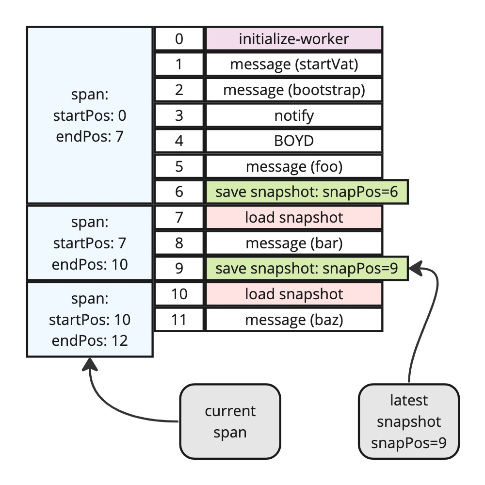
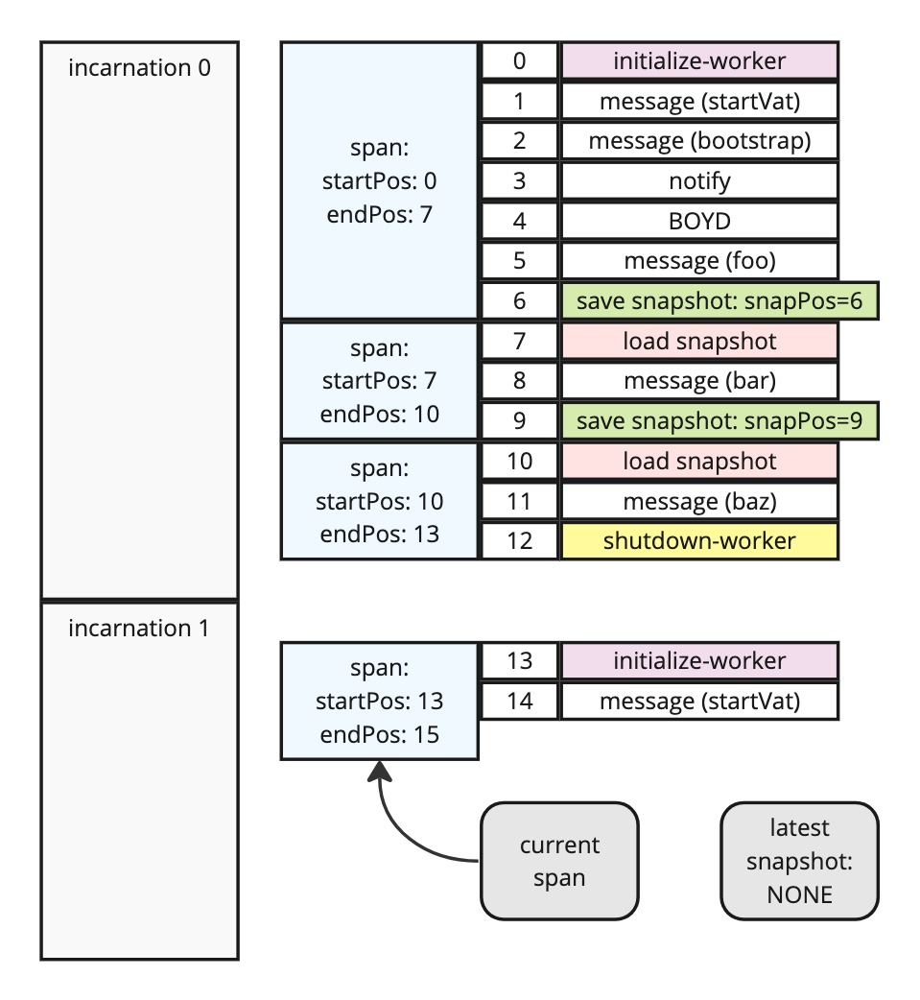
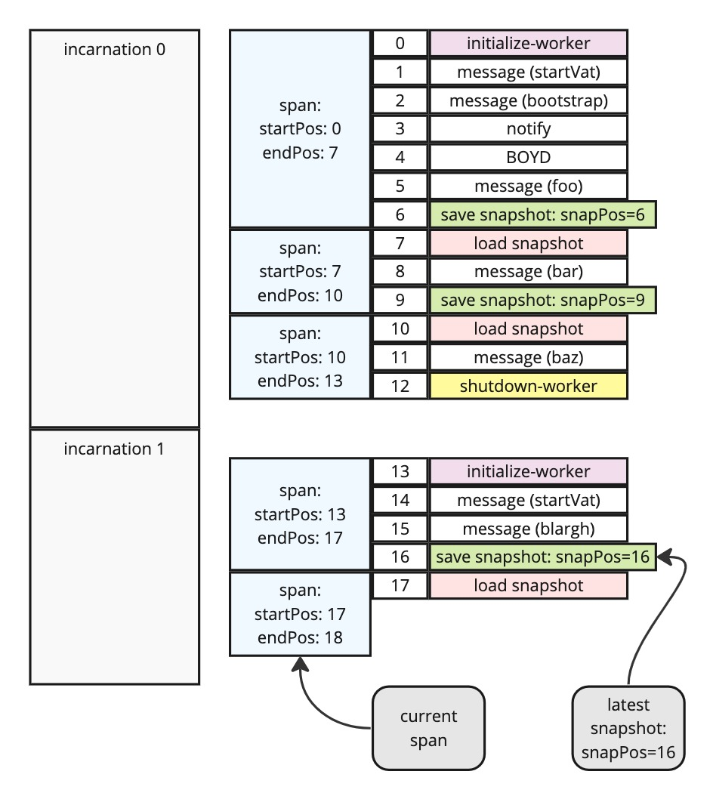

# Vat Transcripts

SwingSet records a "transcript" of each vat's activity, to support orthogonal persistence of the vat image. The transcript basically contains a record of each delivery to the vat, plus all syscalls made by the vat during that delivery, plus the overall results/consequences of the delivery.

The transcript is stored in the swing-store, in a component named `transcriptStore`.

Vat transcripts are broken up into segments which correspond to the various stages of the vat's lifecycle.

Vats are long-lived entities. Each vat has a specific creation point: static vats are created from `config.vats` during `initializeSwingSet()`, while dynamic vats are created when some existing ("parent") vat calls `E(vatAdminService).createVat()`. Vats survive until they make a vat-fatal error, request self-termination (`vatPowers.exitVat()`), or are terminated externally (`E(adminFacet).terminateWithFailure()`).

If the vat is upgraded at any point, this create-to-terminate lifespan is broken up into numbered "incarnations". The newly-created vat is running as "incarnation 0". The first upgrade will cause incarnation 0 to finish, and incarnation 1 to start. The vat retains durable storage between incarnations, but not virtual or ephemeral/RAM -hosted objects. Each new incarnation restarts the JS engine, from a (potentially) new vat bundle, with a call to `buildRootObject`.

Within a single incarnation, we break up the transcript into "spans", which are bounded by heap snapshot saves and reloads. Only the XS/xsnap worker supports heap snapshots, so other kinds of vats have a single span per incarnation. But for an xsnap worker, the kernel periodically instructs the worker to write its JS engine state into a snapshot blob, which is saved in the swing-store DB (in the `snapStore` component). The previous transcript span is ended, and a new one begun.

In parallel with spans, the kernel itself has a per-execution lifetime, which bounds the execution lifetimes of the workers. When the kernel is shut down (e.g. the host computer is rebooted, or the kernel process is terminated in anticipation of a software upgrade), all worker processes also shut down. These events are not part of consensus, and are not recorded in the transcript.

To support orthogonal persistence, each new execution of the kernel must be able to bring each worker process back up to its former state, maintaining the illusion of immortal worker processes. In the absence of heap snapshots, it does this by initializing a new worker, then replaying the entire contents of the current span of transcript entries. Since vat execution is deterministic, replaying the same deliveries will result in the same syscalls, and the same JS engine state.

If the worker *does* support snapshots, then we can bypass most of the replay process by starting from a heap snapshot instead of a blank slate. In this mode, we still replay the entire current span, however this span is much shorter, because all the deliveries before the heap snapshot was taken belong to some earlier span, and do not need to be replayed.

As a result, every span either starts with an `initialize-worker` event, or a `load-snapshot` event. Every non-current span ends with a `save-snapshot` event, or a `shutdown-worker` event.

## One Incarnation

Putting aside vat-upgrade for a moment, a vat which has experienced two snapshot events will have three transcript spans, like this:

The current span is just the last two entries: the `load-snapshot` and the `baz` message. The kerneldb remembers that the most recent snapshot for this vat was recorded as `snapPos = 9`.

Note that the `startPos` bound for each span is inclusive, whereas `endPos` is exclusive. So when the first span uses `{ startPos: 0, endPos: 7}`, that really means `[0,7)` (in math notation), and contains exactly items `0,1,2,3,4,5,6`. The `endPos` of the current span could also be named `nextPosition`, holding the position number at which the next item will be added.

## Vat Upgrade

If we immediately upgrade the vat in the previous example, we'll start a new incarnation. This requires us to shut down the old worker (appending a final entry to the old incarnation's last span). Then we start both a new span and a new incarnation. The `initialize-worker` entry represents the creation of a brand new worker, using the new version's source code bundle. Then we send a `startVat` message into the worker, which allows the new `buildRootObject` to run, which is where all Kinds are redefined and the vat's upgrade code gets to run.

At this point, the vat has no latest snapshot. If we restart here, the new worker will be created from scratch (the first event in the current span is `initialize-worker`).

## Post-Upgrade Snapshot

The vat will evolve further, and eventually enough deliveries will be made to provoke the creation of a heap snapshot. That will establish a "latest snapshot" for this vat, and start a new span. Just after a snapshot, the current span will be very short: just the single `load-snapshot` entry.

