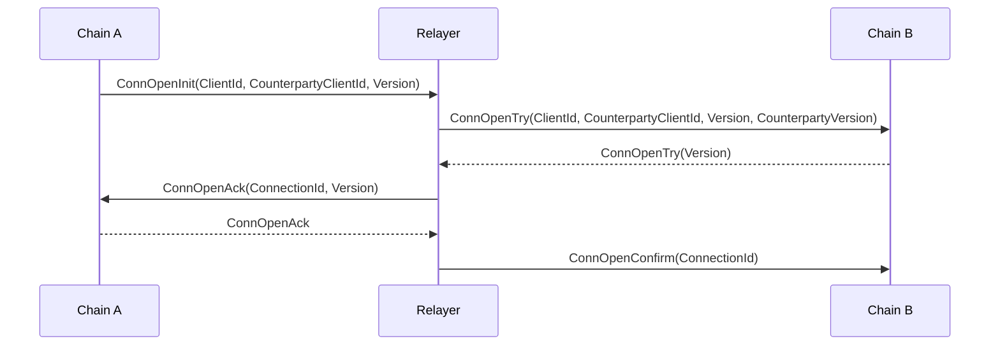
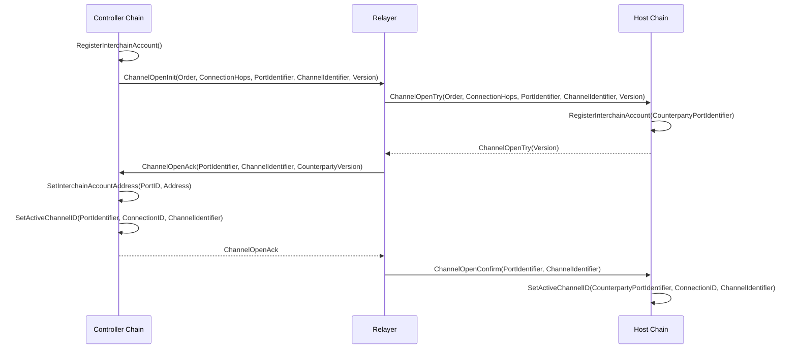
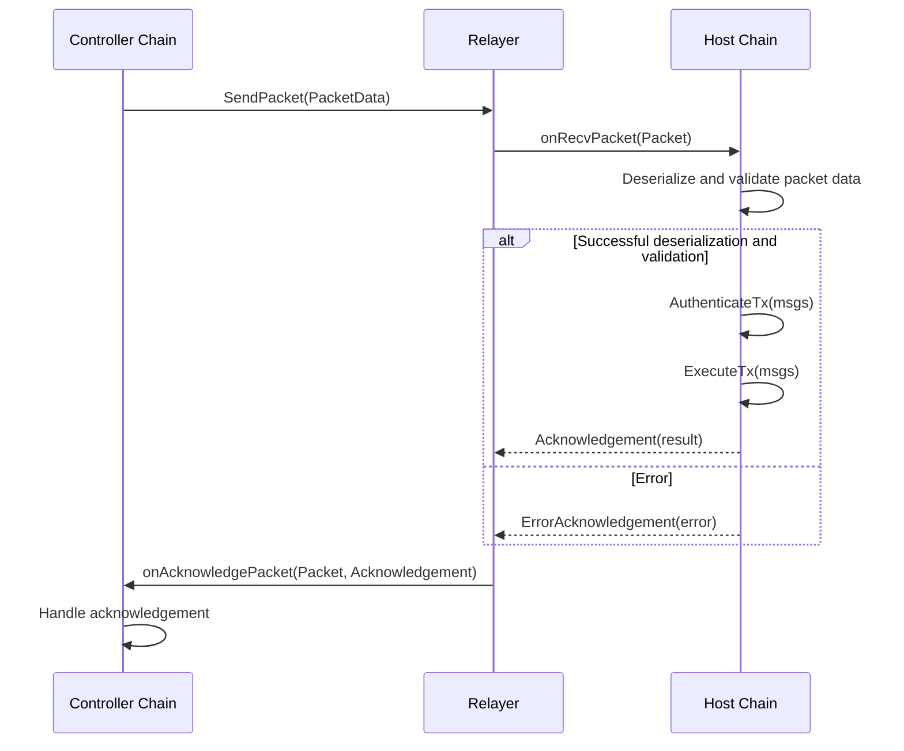
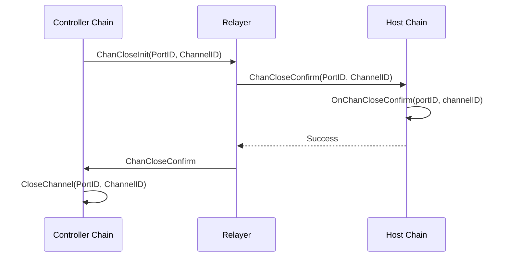
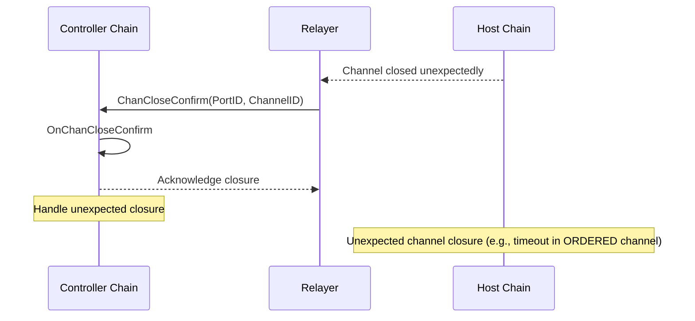
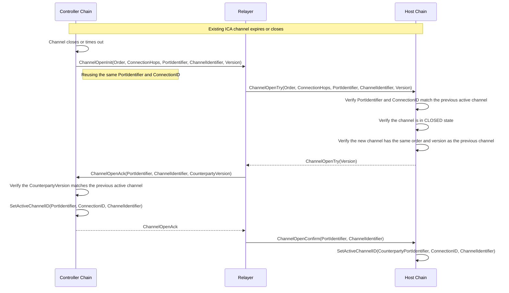

# ICS-27 Interchain Accounts

Sequence diagrams for Interchain Accounts based on [ics-027-interchain-accounts/README.md#9ffb1d2](https://github.com/cosmos/ibc/blob/9ffb1d26d3018b6efda546189ec7e43d56d23da3/spec/app/ics-027-interchain-accounts/README.md).

### IBC Connection Creation

_Prerequisite to creating a channel._

Mock Testing: 
 - on `ConnOpenInit`, return `ConnOpenAck`

### ICA Channel Creation

Mock Testing: 
 - on `ChannelOpenInit`, return `ChannelOpenAck`

### ICA Transaction

Mock Testing: 
 - on `SendPacket`, return `onAcknowledgePacket`

### ICA Channel Closing (from Controller)

Mock Testing: 
 - on `ChanCloseInit`, return `ChanCloseConfirm`

### ICA Channel Closing (from Host - Unexpected closure)

Mock Testing: 
 - `ChanCloseConfirm` event is emitted

### ICA Channel Reactivation

Mock Testing: 
 - on `ChannelOpenInit`, return `ChannelOpenAck`
    - n.b. testing should verify `SetActiveChannelID` flow on CC side

### Testing Mocks Summary

 - IBC Connection Creation: on ConnOpenInit, return ConnOpenAck
 - ICA Channel Creation: on ChannelOpenInit, return ChannelOpenAck
 - ICA Transaction: on SendPacket, return onAcknowledgePacket
 - ICA Channel Reactivation: on ChannelOpenInit, return ChannelOpenAck
    - testing should verify SetActiveChannelID flow on CC side
