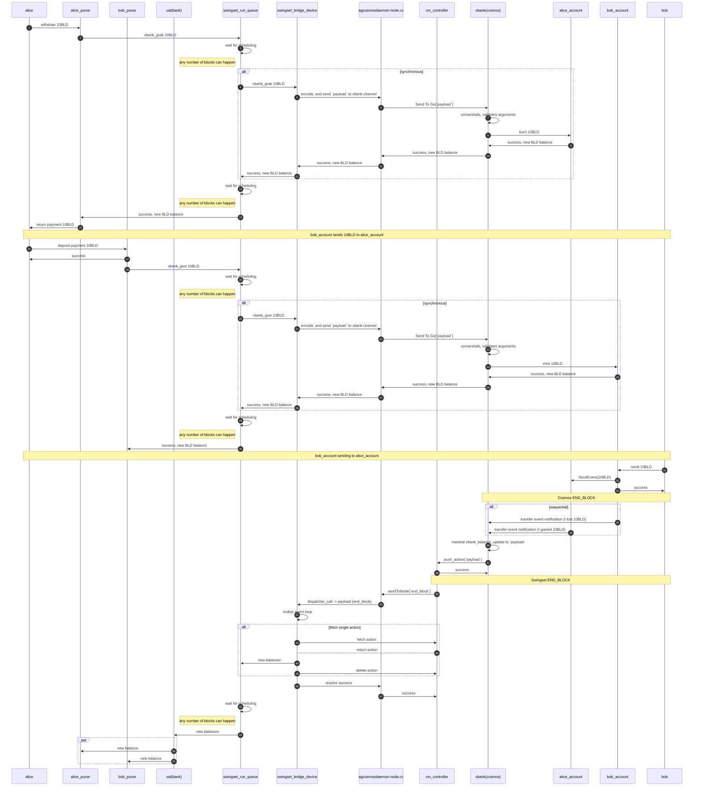
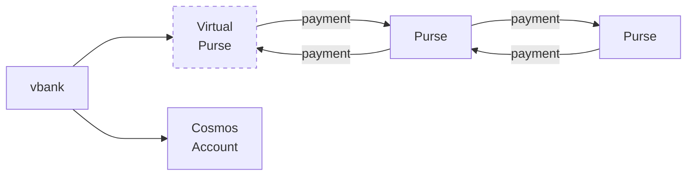

## ERTP Transfer between two virtual purses

```mermaid
sequenceDiagram
    autonumber
    participant alice
    participant alice_purse
    participant bob_purse
    participant vatbank as vat(bank)
    participant swingset_run_queue

    participant swingset_bridge_device as swingset_bridge_device
    participant C as agcosmosdaemon-node.cc
    participant vm as vm_controller
    participant vbank as vbank(cosmos)
    participant alice_account
    participant bob_account
    participant bob

    alice ->> alice_purse: withdraw 10BLD

    alice_purse ->> swingset_run_queue: vbank_grab 10BLD
    swingset_run_queue ->> swingset_run_queue: wait for scheduling
    Note left of swingset_run_queue: any number of blocks can happen

    alt synchronous
    swingset_run_queue ->> swingset_bridge_device: vbank_grab 10BLD
    swingset_bridge_device ->> C: encode, and send `payload` to vbank channel
    C ->> vbank: Send To Go(`payload`)
    vbank ->> vbank: unmarshals, validates arguments
    vbank ->> alice_account: burn 10BLD
    alice_account ->> vbank: success, new BLD balance
    vbank ->> C: success, new BLD balance
    C ->> swingset_bridge_device: success, new BLD balance
    swingset_bridge_device ->> swingset_run_queue: success, new BLD balance
    end

    swingset_run_queue ->> swingset_run_queue: wait for scheduling
    Note left of swingset_run_queue: any number of blocks can happen
    swingset_run_queue ->> alice_purse: success, new BLD balance
    alice_purse ->> alice: return payment 10BLD

note over alice,bob: bob_account sends 10BLD to alice_account

    alice ->> bob_purse: deposit payment 10BLD
        bob_purse ->> alice: success

    bob_purse ->> swingset_run_queue: vbank_give 10BLD
    swingset_run_queue ->> swingset_run_queue: wait for scheduling
    Note left of swingset_run_queue: any number of blocks can happen

    alt synchronous
    swingset_run_queue ->> swingset_bridge_device: vbank_give 10BLD
    swingset_bridge_device ->> C: encode, and send `payload` to vbank channel
    C ->> vbank: Send To Go(`payload`)
    vbank ->> vbank: unmarshals, validates arguments
    vbank ->> bob_account: mint 10BLD
    bob_account ->> vbank: success, new BLD balance
    vbank ->> C: success, new BLD balance
    C ->> swingset_bridge_device: success, new BLD balance
    swingset_bridge_device ->> swingset_run_queue: success, new BLD balance
    end

    swingset_run_queue ->> swingset_run_queue: wait for scheduling
    Note left of swingset_run_queue: any number of blocks can happen
    swingset_run_queue ->> bob_purse: success, new BLD balance

note over alice,bob: bob_account sending to alice_account
    bob ->> bob_account: send 10BLD
    bob_account ->> alice_account: SendCoins(10BLD)
    bob_account ->> bob: success
    Note over vbank,bob: Cosmos END_BLOCK
    alt sequential
        bob_account ->> vbank: transfer event notification (I lost 10BLD)
        alice_account ->> vbank: transfer event notification (I gained 10BLD)
    end
    vbank ->> vbank: marshal vbank_balance_update to `payload`
    vbank ->> vm: push_action(`payload`)
    vm ->> vbank: success
    Note over vm,bob: Swingset END_BLOCK

    vm ->> C: sendToNode(`end_block`)
    C ->> swingset_bridge_device:dispatcher_call -> payload (end_block)

    swingset_bridge_device ->> swingset_bridge_device: nodejs event loop
    alt fetch single action
    swingset_bridge_device ->> vm: fetch action
    vm --> swingset_bridge_device: return action
    swingset_bridge_device ->> swingset_run_queue: new balances
    swingset_bridge_device ->> vm: delete action
    end

    swingset_bridge_device ->> C: resolve success
    C ->> vm: success
    swingset_run_queue ->> swingset_run_queue: wait for scheduling
    Note left of swingset_run_queue: any number of blocks can happen
    swingset_run_queue ->> vatbank: new balances
    par
        vatbank ->> alice_purse: new balance
        vatbank ->> bob_purse: new balance
    end


```

## Virtual Purse:

```mermaid
flowchart LR
  style vp stroke-dasharray: 5 5
  p1[Purse]
  p2[Purse]
  vp[Virtual\nPurse]
  vb[vbank]
  ca[Cosmos\nAccount]

  p1 --->|payment| p2
  p2 --->|payment| vp
  vp --->|payment| p2
  p2 --->|payment| p1

  vb ---> vp
  vb ---> ca
```

