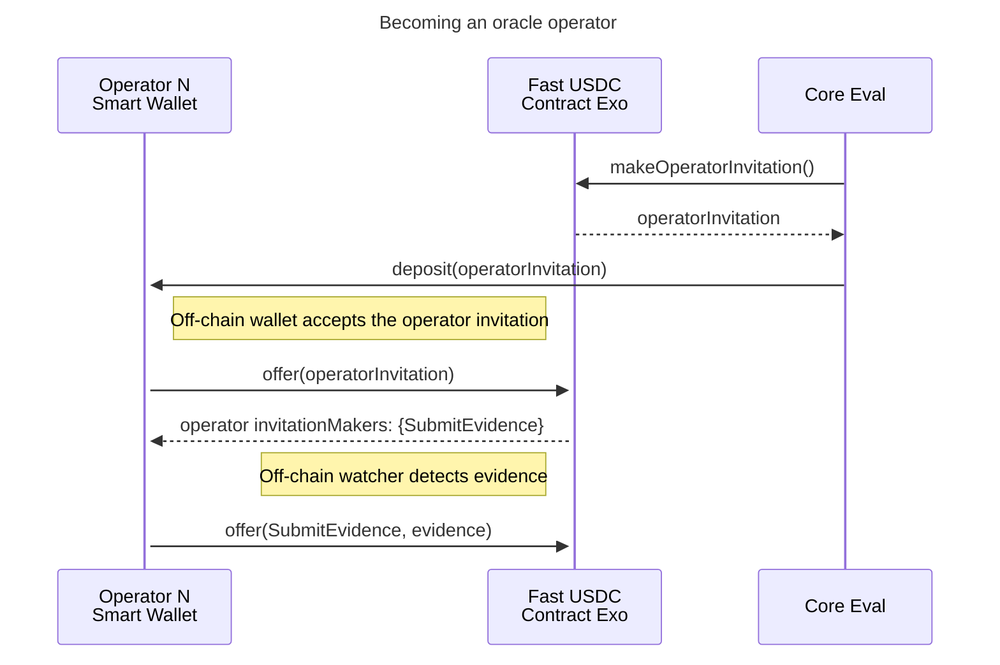

# Fast USDC

Contracts for the Fast USDC product. Here in agoric-sdk as a convenience for
integration testing and iterating on the SDK affordances required for the product.

# Transaction feed

## Oracles interface

Oracles run off-chain and interact with the contract via an Agoric smart wallet bridge.

```mermaid
sequenceDiagram
    title Receiving evidence
    participant W as Operator N<br/>Smart Wallet
    participant A as Operator N<br/>Admin Oexo
    participant TF as Transaction<br/>Feed

    W->>A: offer(SubmitEvidence, evidence)

    Note left of A: Once 3 operators push the same…

    A->>TF: notify(evidence)
```




# Status Manager

### State Diagram

*Transactions are qualified by the OCW and TransactionFeed before being
delivered to the Advancer.*

The transactionFeed receives attestations from Oracles, records their
evidence, and when enough oracles agree, (if no risks are identified)
it publishes the results for the advancer to act on.

The Advancer subscribes (via `handleTransactionEvent`) to events published by
the transactionFeed. When notified of an appropriate opportunity, it is
responsible for advancing funds to fastUSDC payees.

The Settler is responsible for monitoring (via `receiveUpcall`) deposits to the
settlementAccount. It either `disburse`s funds to the Pool (if funds were
`advance`d to the payee), or `forwards` funds to the payee (if pool funds
were not `advance`d).

```mermaid
stateDiagram-v2
  state Forwarding <<choice>>
  state AdvancingChoice <<choice>>

  Observed --> AdvanceSkipped : Risks identified
  Observed --> Advancing : No risks, can advance
  Observed --> Forwarding : No risks, Mint deposited before advance

  Forwarding --> Forwarded : settler.forward() succeeds
  Advancing --> AdvancingChoice
  AdvancingChoice --> Advanced : advancer's transferHandler detects success
  Advanced --> Disbursed : settler.disburse()
  AdvanceSkipped --> Forwarding : Mint deposited
  AdvanceFailed --> Forwarding : Mint deposited
  AdvancingChoice --> AdvanceFailed : advancer's transferHandler detects failure
  Forwarding --> ForwardFailed : settler.forward() fails
 ```
