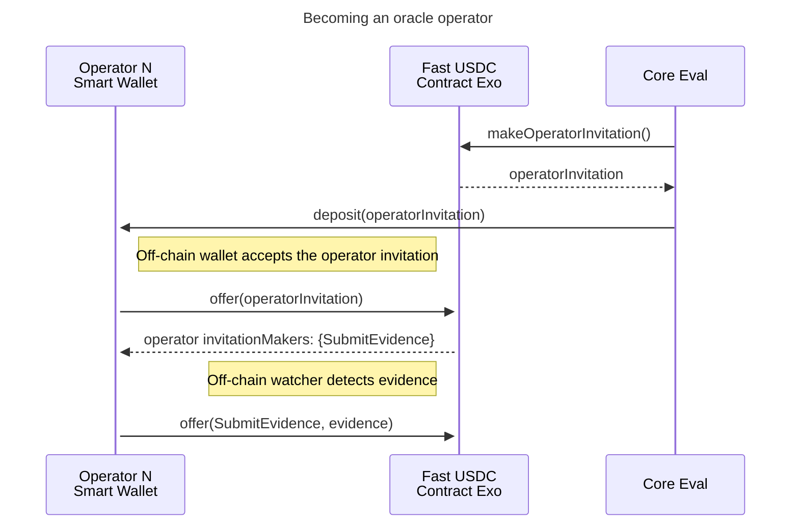
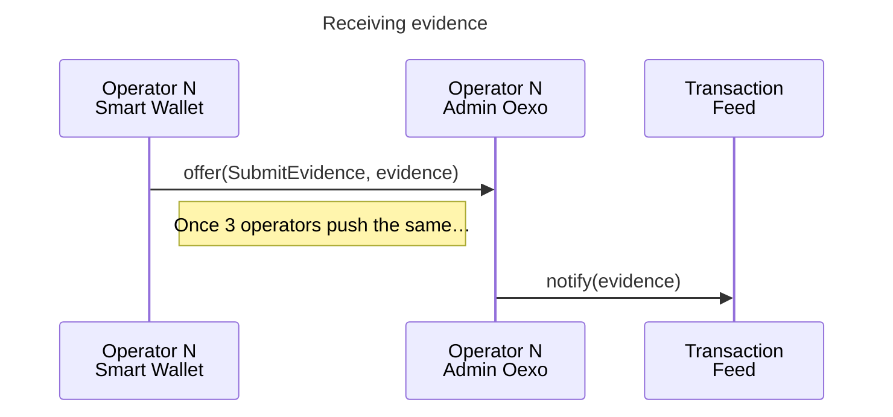
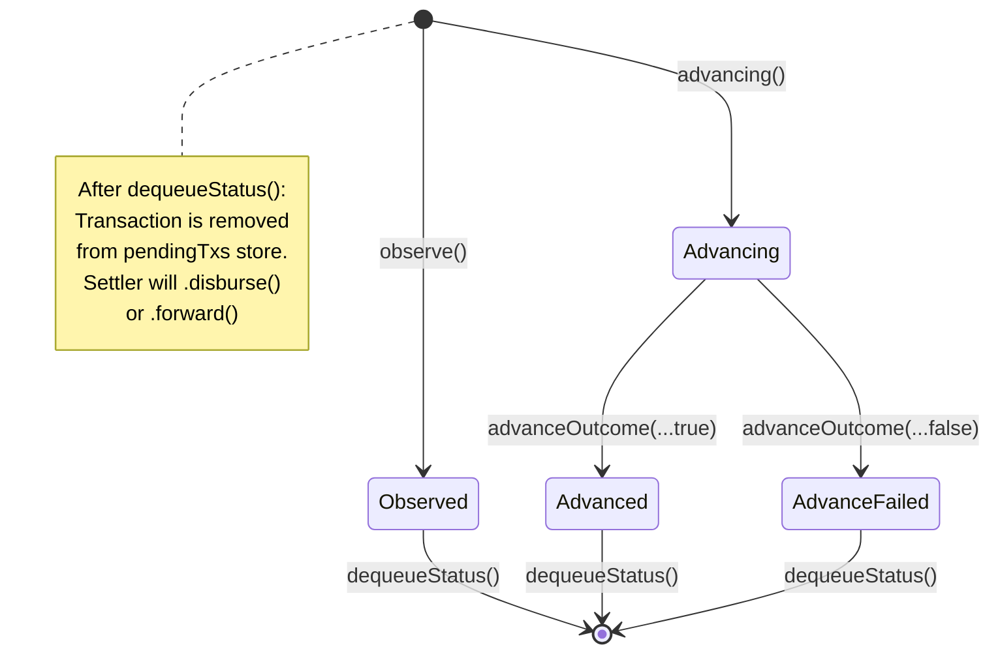
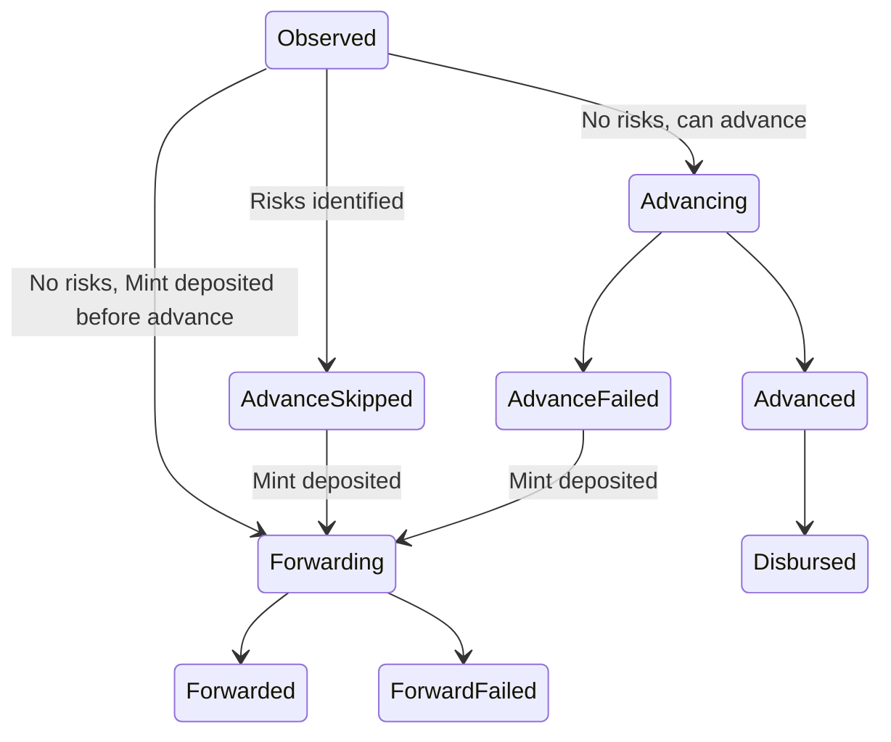

# Fast USDC

Development package for the Fast USDC product.
Here in agoric-sdk as a convenience for integration testing and iterating on the SDK affordances required for the product.

# Factoring

This package is meant to contain all the code for the Fast USDC product. However there are some constraints:

- a3p integration tests are in the `a3p-integration` top-level package, separate from this workspace
- the proposal builders are in `@agoric/builders` to work with the a3p-integration `build:submissions` script
- the RunUtils tests are in `@agoric/boot` to test running them atop a fresh bootstrapped environment

Over time we can update our tooling to decouple this more from the `packages` directory.

1. Make a3p-integration `build:submissions` script work with arbitrary builder paths, allowing this to be above `@agoric/builders` in the package graph
2. Export bootstrap testing utilities from `@agoric/boot`, allowing this to be above `@agoric/boot` in the package graph
3. Update CI to support packages that aren't under `packages/`, eg. a top-level `dapps` directory
4. Move this package out of agoric-sdk

# Transaction feed

## Oracles interface

Oracles run off-chain and interact with the contract via an Agoric smart wallet bridge.

# Status Manager

### Pending Advance State Diagram

*Transactions are qualified by the OCW and EventFeed before arriving to the Advancer.*

### Complete state diagram (starting from Transaction Feed into Advancer)

