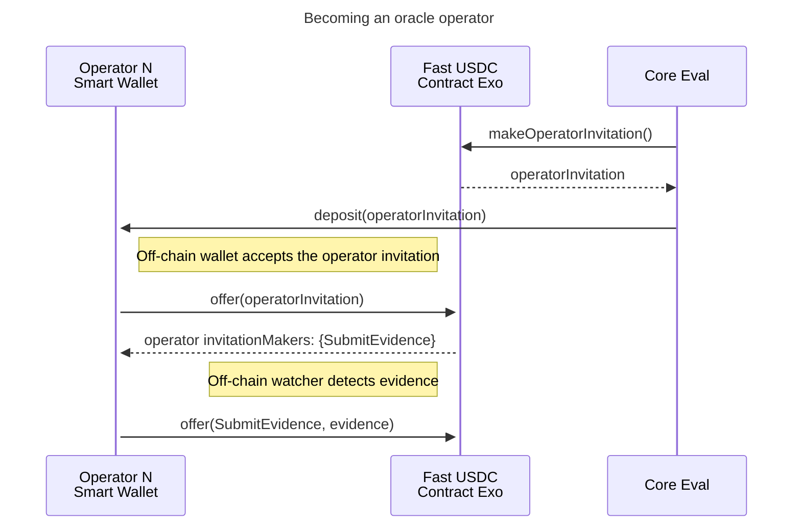
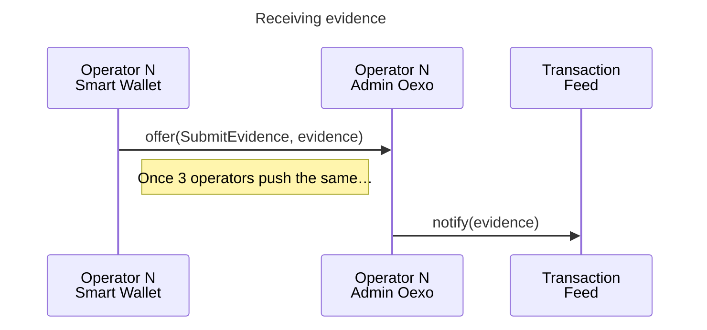

# Fast USDC

Development package for the Fast USDC product.
Here in agoric-sdk as a convenience for integration testing and iterating on the SDK affordances required for the product.

# Factoring

This package is meant to contain all the code for the Fast USDC product. However there are some constraints:

- a3p integration tests are in the `a3p-integration` top-level package, separate from this workspace
- the proposal builders are in `@agoric/builders` to work with the a3p-integration `build:submissions` script
- the RunUtils tests are in `@aglocal/boot` to test running them atop a fresh bootstrapped environment

Over time we can update our tooling to decouple this more from the `packages` directory.

1. Make a3p-integration `build:submissions` script work with arbitrary builder paths, allowing this to be above `@agoric/builders` in the package graph
2. Export bootstrap testing utilities from `@aglocal/boot`, allowing this to be above `@aglocal/boot` in the package graph
3. Update CI to support packages that aren't under `packages/`, eg. a top-level `dapps` directory
4. Move this package out of agoric-sdk

# Transaction feed

## Oracles interface

Oracles run off-chain and interact with the contract via an Agoric smart wallet bridge.




# Status Manager

### State Diagram

*Transactions are qualified by the OCW and TransactionFeed before being
delivered to the Advancer.*

The transactionFeed receives attestations from Oracles, records their
evidence, and when enough oracles agree, (if no risks are identified)
it publishes the results for the advancer to act on.

The Advancer subscribes (via `handleTransactionEvent`) to events published by
the transactionFeed. When notified of an appropriate opportunity, it is
responsible for advancing funds to fastUSDC payees.

The Settler is responsible for monitoring (via `receiveUpcall`) deposits to the
settlementAccount. It either `disburse`s funds to the Pool (if funds were
`advance`d to the payee), or `forwards` funds to the payee (if pool funds
were not `advance`d).

```mermaid
stateDiagram-v2
  [*] --> AdvanceSkipped : Risks identified
  [*] --> Advancing : No risks, can advance
  [*] --> Forwarding* : No risks, Mint deposited before advance

  state Advancer  {
    Advanced
    AdvanceFailed
    AdvanceSkipped
    Advancing
  }
  state Settler {
    Forwarded
    ForwardFailed
    Disbursed
  }

  Forwarding* --> Forwarded : settler.forward() succeeds
  Advancing --> Advanced : advancer's transferHandler detects success
  Advanced --> Disbursed : settler.disburse()
  AdvanceSkipped --> Forwarding* : Mint deposited
  AdvanceFailed --> Forwarding* : Mint deposited
  Advancing --> AdvanceFailed : advancer's transferHandler detects failure
  Forwarding* --> ForwardFailed : settler.forward() fails
 ```

* There is no actual state for **Forwarding**. It is used here to represent the
transition from Advancer to Settler
