# Fast USDC

Development package for the Fast USDC product. Here in agoric-sdk as a
convenience for integration testing and iterating on the SDK affordances
required for the product.

# Factoring

This package is meant to contain all the code for the Fast USDC product.
However, there are some constraints:

- a3p integration tests are in the `a3p-integration` top-level package, separate
    from this workspace
- the proposal builders are in `@agoric/builders` to work with the
    a3p-integration `build:submissions` script
- the RunUtils tests are in `@aglocal/boot` to test running them atop a fresh
    bootstrapped environment

Over time we can update our tooling to decouple this more from the `packages` directory.

1. Make a3p-integration `build:submissions` script work with arbitrary builder
    paths, allowing this to be above `@agoric/builders` in the package graph
2. Export bootstrap testing utilities from `@aglocal/boot`, allowing this to be
    above `@aglocal/boot` in the package graph
3. Update CI to support packages that aren't under `packages/`, eg. a top-level
   `dapps` directory. `multichain-testing` does this now but not organized per contract.
4. Move this package out of agoric-sdk

# Transaction flow

```mermaid
%%{init: {
  'theme': 'base',
  'themeVariables': {
    'primaryColor': '#f0f8ff',
    'primaryTextColor': '#2c3e50',
    'primaryBorderColor': '#7fb2e6',
    'lineColor': '#7fb2e6',
    'secondaryColor': '#f6f8fa',
    'tertiaryColor': '#fff5e6'
  }
}}%%
sequenceDiagram
    title Fast USDC Transaction Process
    autonumber
    actor User
    %% [Where it runs]
    participant NEA as Noble Express app<br/>[Browser]
    participant ETH as CCTP Contract<br/>[Ethereum]
    participant NFA as Noble Forwarding Account<br/>[Noble]
    participant NC as Noble Chain<br/>[Noble]
    participant OCW as Eth Watcher<br/>[Off-chain]
    participant FUC as Fast USDC Contract<br/>[Agoric]
    participant P as Pool<br/>[Agoric]
    participant SA as Settlement Account<br/>[Agoric]
    participant CFA as Contract Fee Account<br/>[Agoric]
    participant EUD as End User Destination<br/>[User]

    %% Notation: --> for async, ->> for sync
    rect rgb(240, 248, 255)
        Note over User,OCW: User request
        Note over NEA: App looks up fees and SettlementAccount address
        User->>NEA: Input desired MintAmount and EUD
        NEA->>User: Display fees and AdvanceAmount
        Note over NEA: Calculate VirtualRecipient from (SettlementAccount, EUD)
        Note over NEA: Calculate NFA address from (VirtualRecipient) using Signerless forwarding
        %% Getting from here to the burn is mostly up to Noble
        User->>NEA: Initiate transfer
        NEA-->>NC: Register NFA
        NEA->>User: Request signature
        User->>NEA: Sign transaction<br/>(MintAmount, to NFA) 
        NEA->>ETH: Submit USDC Burn Txn via CCTP
        Note over ETH: Burn succeeds,<br/>implying mint to NFA will happen
        OCW->>ETH: Query CCTP transactions to Noble
        ETH-->>OCW: 1 block confirmed
        OCW->>NC: Look up recipient of NFA<br/>by account query
        NC->>OCW: RPC replies with account including `recipient` (LCA+EUD)
    end

    Note over OCW: Continue if recipient is over the Noble-Agoric channel
    rect rgb(200, 255, 230)
        Note over NC,EUD: Advancement Process
        Note over OCW: Log proof of each confirmation
        Note over OCW,FUC: Provide info needed by policy to make a decision
        OCW->>FUC: Notify of each confirmation<br/>(dest=agoric1 recipient, amount,<br/>metadata=transaction-nonce,chain,block,timestamp)
        Note over FUC: MM's policy decides whether to advance (e.g. 2 confirmations from Ethereum, 5 from Polygon)
        Note over FUC: Syslog with sufficient detail to debug
        Note over FUC: calculate AdvanceAmount = (MintAmount – PoolFee - ContractFee)<br/>based on fee rates at this moment, and record for future lookup
        FUC->>P: Initiate PFM transfer(AdvanceAmount, EUD) from pool<br/>of Noble-Agoric tokens to EUD Chain
        P->>NC: PFM transfer(AdvanceAmount of Agoric USDC denom) to EUD
        NC->>EUD: deliver AdvanceAmount as final USDC denom
        %% TODO do need epsilon tolerance on MintAmount for if Noble takes a small cut of the minted amount
        %% TODO map out the event handling for these states: START: only-observed,advance-started,received-minted-unobserved, END: done
        Note over SA: Wake up the settlement process to handle observed (key=EUD,MintAmount)

    end
    Note over User,EUD: User got their AdvanceAmountof IBC USDC<br/>UX COMPLETE

    rect rgb(255, 200, 200)
        Note over ETH,SA: Minting Process
        Note over ETH: ~12 minutes for Ethereum finality
        Note over NC: 1-6 minutes for CCTP<br/>to Mint on Noble
        NC->>NFA: Noble CCTP contract mints USDC<br/> into Noble Forwarding Address
        NFA->>SA: Forward MintAmount (as Agoric USDC Denom) to FU Account
    end

    rect rgb(255, 245, 230)
        Note over FUC,CFA: Settlement Process
        Note over FUC,SA: Tap on account reads MintAmount,<br/>parses EUD from virtual address recipient<br/>and looks up AdvanceAmount,PoolFee,ContractFee.<br/>Matches against an unsettled transaction (by EUD and approx amount).
        %% Treat starting the advance as an atomic action. Assume it will complete once started.
        alt Advance was started:
            FUC->>SA: Initiate transfers out of settlement
            SA->>P: Deposit the AdvanceAmount + PoolFee (= MintAmount - ContractFee)
            SA->>CFA: Deposit ContractFee
        else Advance for matched transaction that has not yet started:
            P->>NC: PFM transfer(MintAmount of Agoric USDC denom) to EUD
            NC->>EUD: deliver MintAmount as final USDC denom
        else Settlement for unknown transaction:
            %% Have not received notification of this Amount,EUD from the watcher
            Note over SA: Leave funds in SettlementAccount.
            Note over SA: Wait for observation from watcher
        end
    end
```

