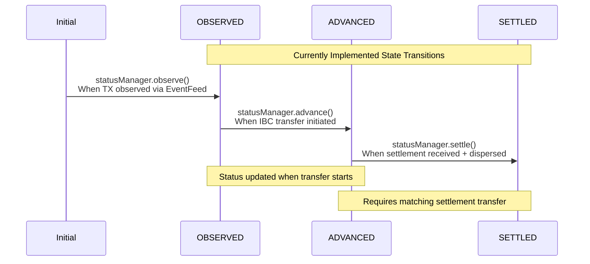
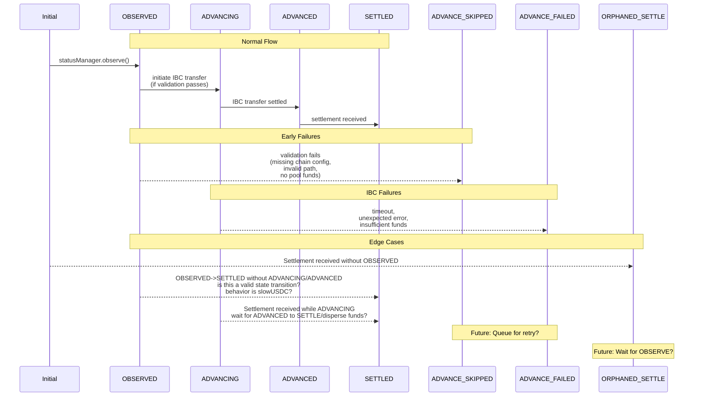

##   **StatusManager** sequence diagram, showing `TxStatus` state transitions

### Current Implementation

```mermaid
sequenceDiagram
  participant I as Initial
  participant O as OBSERVED
  participant A as ADVANCED 
  participant S as SETTLED

  Note over O,S: Currently Implemented State Transitions
  
  I->>O: statusManager.observe()<br/>When TX observed via EventFeed
  O->>A: statusManager.advance()<br/>When IBC transfer initiated
  A->>S: statusManager.settle()<br/>When settlement received + dispersed
  
  Note over O,A: Status updated when transfer starts
  Note over A,S: Requires matching settlement transfer
```

### Additional States to Consider (Not Implemented)

```mermaid
sequenceDiagram
  participant I as Initial
  participant O as OBSERVED
  participant AG as ADVANCING
  participant A as ADVANCED
  participant S as SETTLED
  participant AS as ADVANCE_SKIPPED
  participant AF as ADVANCE_FAILED
  participant OS as ORPHANED_SETTLE
  
  Note over O,S: Normal Flow
  I->>O: statusManager.observe()
  O->>AG: initiate IBC transfer<br/>(if validation passes)
  AG->>A: IBC transfer settled
  A->>S: settlement received
  
  Note over O,AS: Early Failures
  O-->>AS: validation fails<br/>(missing chain config,<br/>invalid path,<br/>no pool funds)
  
  Note over AG,AF: IBC Failures
  AG-->>AF: timeout,<br/>unexpected error,<br/>insufficient funds
  
  Note over O,OS: Edge Cases
  I-->>OS: Settlement received without OBSERVED
  O-->>S: OBSERVED->SETTLED without ADVANCING/ADVANCED<br/>is this a valid state transition?<br/>behavior is slowUSDC?
  AG-->>S: Settlement received while ADVANCING<br/>wait for ADVANCED to SETTLE/disperse funds?
  
  Note over AS,AF: Future: Queue for retry?
  Note over OS: Future: Wait for OBSERVE?
```
