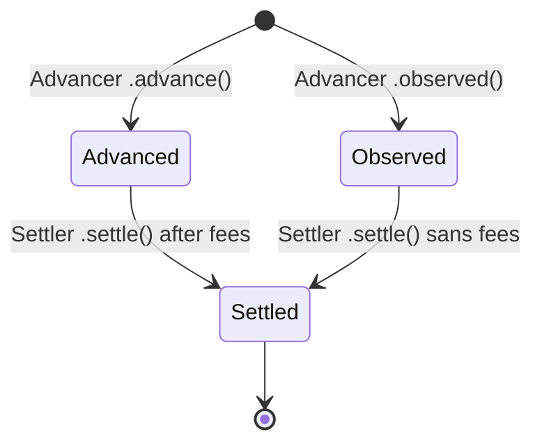
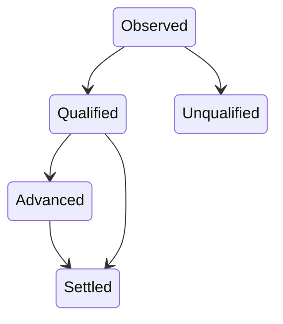

##   **StatusManager** state diagram, showing different transitions

### Contract state diagram

*Transactions are qualified by the OCW and EventFeed before arriving to the Advancer.*

### Complete state diagram (starting from OCW)

