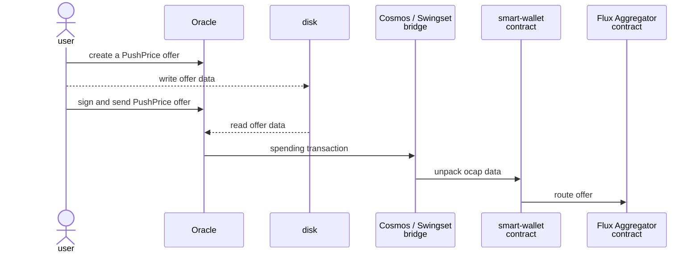
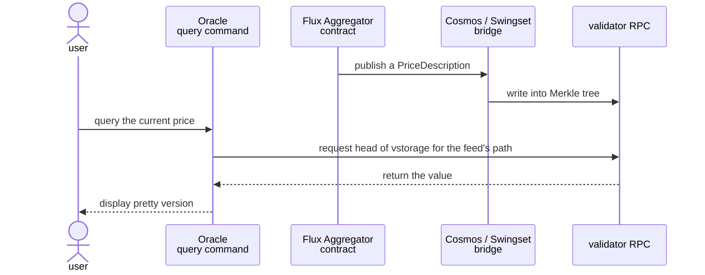

# Price oracles

This directory contains the `fluxAggregator.js` contract which takes prices as
input and outputs a best known price. There are multiple ways to get the price,
including a PriceAuthority interface.

## Usage

See the [Smart Wallet integration test](/packages/inter-protocol/test/smartWallet/test-oracle-integration.js) for how it's used.

Oracle operates can make PushPrice offers in the CLI. There is no GUI.

### CLI

See [oracle.js command file](/packages/agoric-cli/src/commands/oracle.js) and its [integration test script](/packages/agoric-cli/test/agops-oracle-smoketest.sh).

### Reading feed

Once a new price has been determined, it's published on the aggregator's public topics.

