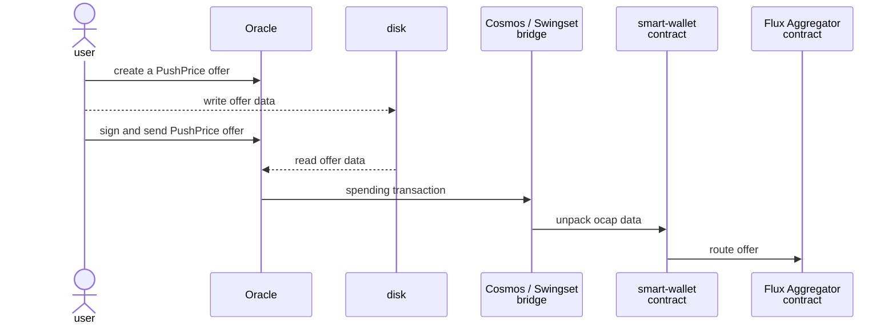
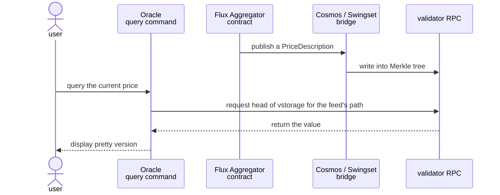

# Price oracles

This directory contains the `fluxAggregatorKit.js` contract which takes prices as
input and outputs a best known price. There are multiple ways to get the price,
including a PriceAuthority interface.

## Design

The authorities are hierarchical. Many authorities can be registered in the priceAuthorityRegistry.

For oracles, there must be two: the negotiable brand and the _oracle_ brand (an inert one).

The intended flow is that:
1. a negotiable brand is created (e.g. ATOM)
2. a price provider says “i can give you quotes for that” and runs price-feed-proposal. That makes “oracleBrands” (which are inert and have a separate identity so that they don’t have the authority to say they’re the real quote for it).
3. Some higher authority (eg EC, Stakers) decides that should be the quote source for negotiable brand so it registers it under the real brand identity in the registry (with a new instance of a scaledPriceAuthority ).

In practice we do these all in one core proposal. And each vault manager is started with a limit on minting to the EC has another way to gate transactions.

## Usage

See the [Smart Wallet integration test](/packages/inter-protocol/test/smartWallet/test-oracle-integration.js) for how it's used.

Oracle operates can make PushPrice offers in the CLI. There is no GUI.

### CLI

See [oracle.js command file](/packages/agoric-cli/src/commands/oracle.js) and its [integration test script](/packages/agoric-cli/test/agops-oracle-smoketest.sh).

### Reading feed

Once a new price has been determined, it's published on the aggregator's public topics.

