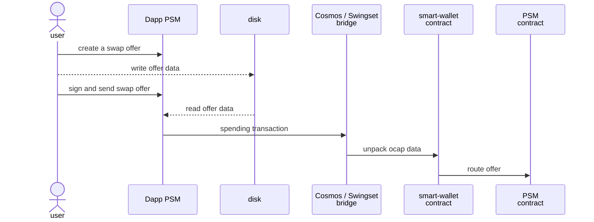
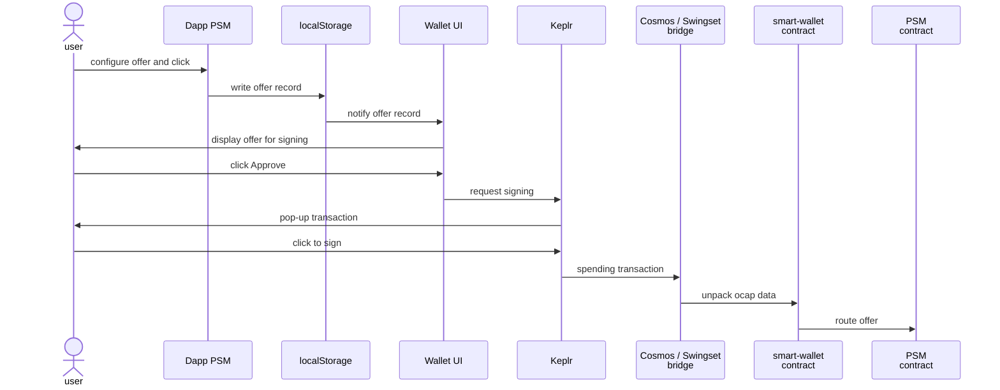

# Parity Stability Module

The Parity Stability Module supports efficiently minting/burning a stable token
at a specified fixed ratio to a reference stable token, which thereby acts as an
anchor to provide additional stability. For flexible economic policies, the fee
percentage for trading into and out of the stable token are specified
separately.

## Usage

See the [Smart Wallet integration test](/packages/inter-protocol/test/smartWallet/test-psm-integration.js) for how it's used.

End users can make swap offers in the CLI or GUI.

### CLI

See [psm.js command file](/packages/agoric-cli/src/commands/psm.js) and its [integration test script](/packages/agoric-cli/scripts/).

### GUI

The GUI is in https://github.com/Agoric/dapp-psm

It introduces another layer of communication (between the dapp and Wallet UI):

