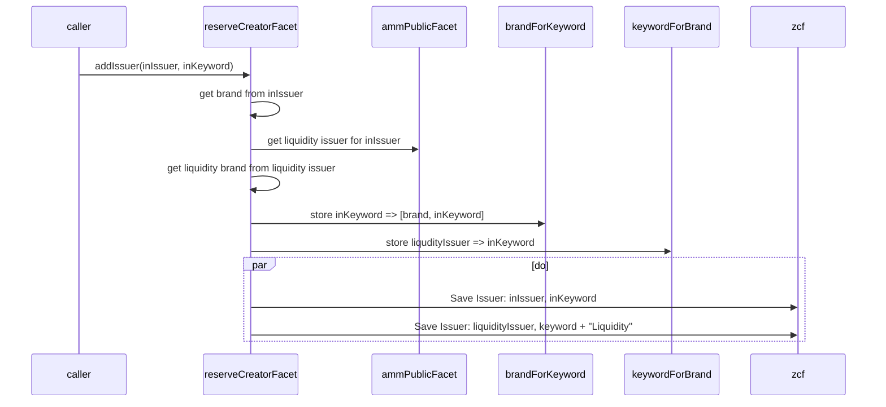
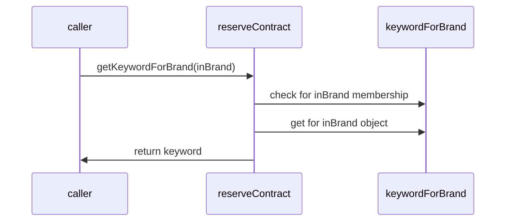
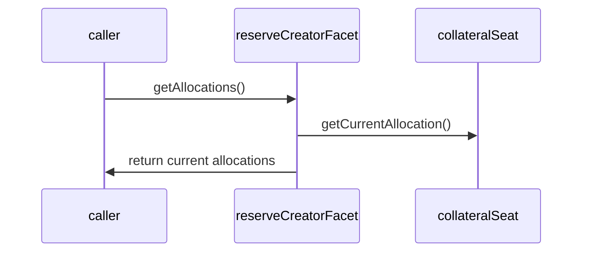
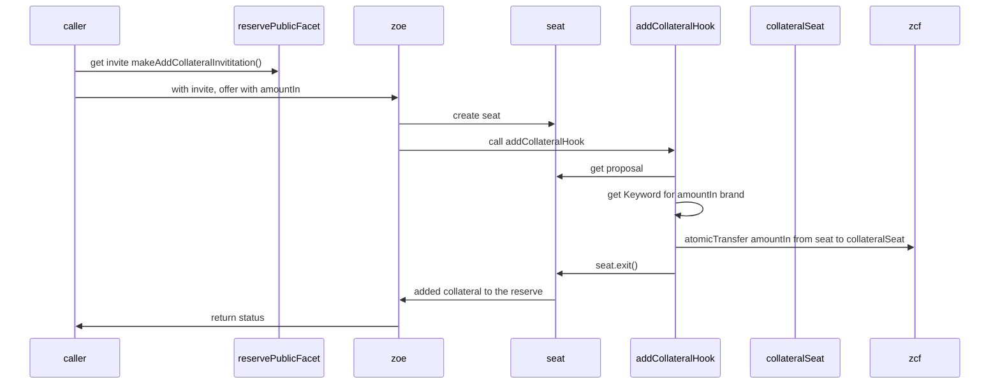

# Reserve 

### addIssuer

```mermaid
sequenceDiagram

participant caller
participant reserveCreatorFacet
participant ammPublicFacet
participant brandForKeyword
participant keywordForBrand
participant zcf


caller ->> reserveCreatorFacet: addIssuer(inIssuer, inKeyword)
reserveCreatorFacet ->> reserveCreatorFacet: get brand from inIssuer
reserveCreatorFacet ->> ammPublicFacet: get liquidity issuer for inIssuer
reserveCreatorFacet ->> reserveCreatorFacet: get liquidity brand from liquidity issuer
reserveCreatorFacet ->> brandForKeyword: store inKeyword => [brand, inKeyword]
reserveCreatorFacet ->> keywordForBrand: store liqudityIssuer => inKeyword
par do
reserveCreatorFacet ->> zcf: Save Issuer: inIssuer, inKeyword
reserveCreatorFacet ->> zcf: Save Issuer: liquidityIssuer,  keyword + "Liquidity"
end
```

### getKeywordForBrand

```mermaid
sequenceDiagram

participant caller
participant reserveContract
participant keywordForBrand


caller ->> reserveContract: getKeywordForBrand(inBrand)
reserveContract ->> keywordForBrand: check for inBrand membership
reserveContract ->> keywordForBrand: get for inBrand object
reserveContract ->> caller: return keyword
 
```

### collateralSeat

```mermaid
sequenceDiagram
participant caller 
participant reserveCreatorFacet
participant collateralSeat

caller ->> reserveCreatorFacet: getAllocations()
reserveCreatorFacet ->> collateralSeat: getCurrentAllocation()
reserveCreatorFacet ->> caller: return current allocations
```

### addCollateralHook + makeAddCollateralInvititation

```mermaid
sequenceDiagram

participant caller
participant reservePublicFacet
participant zoe
participant seat
participant addCollateralHook
participant collateralSeat
participant zcf

caller ->> reservePublicFacet: get invite makeAddCollateralInvititation()
caller ->> zoe: with invite, offer with amountIn
zoe ->> seat: create seat
zoe ->> addCollateralHook: call addCollateralHook
addCollateralHook ->> seat: get proposal

addCollateralHook ->> addCollateralHook: get Keyword for amountIn brand
addCollateralHook ->> zcf: atomicTransfer amountIn from seat to collateralSeat
addCollateralHook ->> seat: seat.exit()
seat ->> zoe: added collateral to the reserve
zoe ->> caller: return status
```
