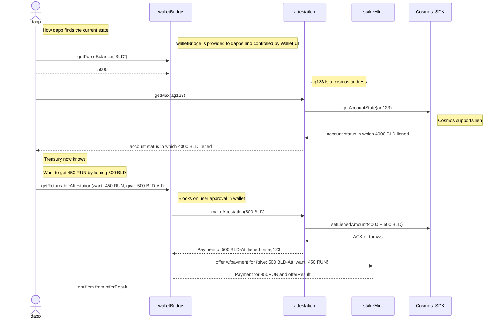

# stakeMint design notes

The stakeMint contract provides loans on the basis of
staked assets that earn rewards.

The following sequence diagram shows an interaction between stakeMint and:
  - dapp: with rich interaction but low privilege
  - walletBridge: with high privilege and constrained interaction
  - attestation: a service within the stakeMint contract
  - Cosmos_SDK: the Cosmos SDK layer, including the `x/lien` module

Before this interaction, an `ag123` account has been provisioned,
which provides an `AttestationMaker` for that account to the wallet.

Note that the account already has 4000 BLD liened before this interaction.

## Components

In addition to the `stakeMint.js` module with the contract `start` function:

 - `params.js`: utilities for governance parameters
 - `stakeKit.js`: `makeStakeMintKit` is called once per loan
 - `stakeManager.js`: handles interest etc. for all loans
 - `attestation.js`: minting tokens that attest to liens,
      and wrapping them in per-user attestation maker authorities.
