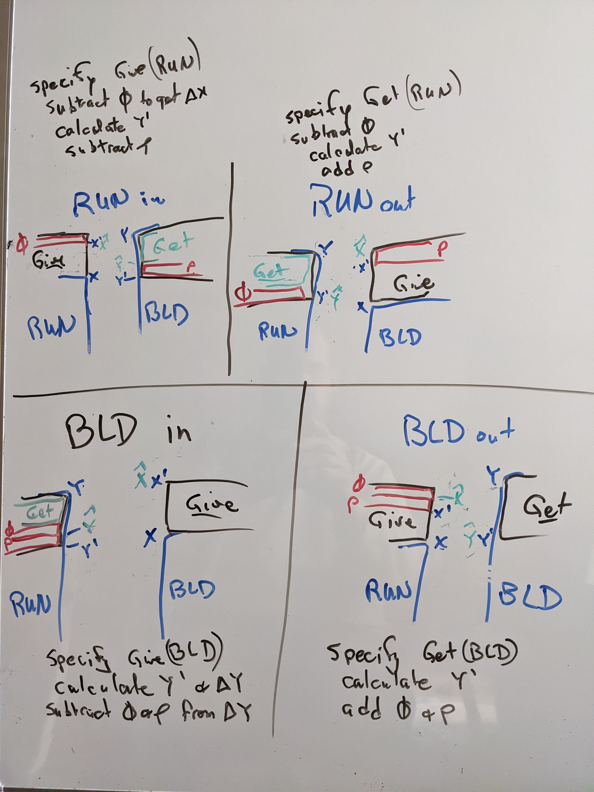

# Constant Product AMM

A constant product automatic market maker based on our Ratio library. It charges
two kinds of fees: a pool fee remains in the pool to reward the liquidity
providers and a protocol fee is extracted to fund the economy. The external
entry point is a call to `pricesForStatedInput()` or `pricesForStatedOutput()`.

This algorithm uses the x*y=k formula directly, without fees. Briefly, there are
two kinds of assets, whose values are kept roughly in balance through the
actions of arbitrageurs. At any time a trader can trade with the pool by
offering to deposit one of the two assets. They will receive an amount
of the complementary asset that will maintain the invariant that the product of
the balances doesn't decrease. (Rounding is done in favor of the
pool.)

The user can specify a maximum amount they want to pay or a minimum amount they
want to receive. Unlike Uniswap, this approach will charge less than the user
offered or pay more than they asked for when appropriate. By analogy, if a user
is willing to pay up to $20 when the price of soda is $3 per bottle, it would
give 6 bottles and only charge $18. (We refer to these as "improved" prices.)
Uniswap doesn't adjust the provided price, so it would charge $20 in that trade.
This matters whenever the values of the smallest unit of the currencies are
significantly different, which is common in DeFi.

The rules that drive the design include

* When the user specifies an input (or output) price, they shouldn't pay more
  (or receive less) than they said.
* The pool fee is charged against the side not specified by the user (the
  "computed side"). This increases the pool balance without impacting the amount
  that the user specified.
* The protocol fee is always charged in IST.
* The fees are calculated based on the pool balances before the transaction.
* Computations are rounded in favor of the pool.

We start by estimating the exchange rate, and calculate fees based on that. Once
we know the fees, we add or subtract them directly to the amounts added to and
extracted from the pools to adhere to those rules.

## Calculating fees

In these tables BLD represents any collateral. The user can specify how much
they want or how much they're willing to pay. We'll call the value they
specified **sGive** or **sGet** and bold it. We'll always refer to the currency
being added as X and the currency the user gets as Y. X and Y are the amounts
used to maintain the constant product invariant. On every transaction the pool
balance will also increase on one side or the other by the pool fee, and the
protocol fee will be extracted outside the pool. So the amount produced is less
(or the amount paid is more) because the invariant is maintained on the amounts
remaining after fees have been charged. 

In the final table, we'll see what the user pays or gets (sGet, sGive), how much
the pool balances change (xIncr, yDecr) and the changes that impact the constant
product calculation(&Delta;X, &Delta;Y). The amount paid and received by the
trader and changes to the pool are calculated relative to &Delta;X and &Delta;Y
so that the pool grows by the poolFee and the protocolFee can be paid from the
proceeds.

This table shows which brands the amounts each have, as well as what is computed
vs. given. The PoolFee is computed based on the calculated amount (BLD in rows 1
and 2; IST in rows 3 and 4). The Protocol fee is always in IST.

|          | In (X) | Out (Y) | PoolFee | Protocol Fee | Specified | Computed |
|---------|-----|-----|--------|-----|------|-----|
| **IST in** | IST | BLD | BLD | IST | **sGive** | sGet |
| **IST out** | BLD | IST | BLD | IST | **sGet** | sGive |
| **BLD in** | BLD | IST | IST | IST | **sGive** | sGet |
| **BLD out** | IST | BLD | IST | IST | **sGet** | sGive |

We'll calculate how much the pool balances would change in the no-fee, improved
price case using the constant product formulas. We call these results &delta;X,
and &delta;Y. This table uses lower case &delta; to distinguish estimates from
final values, which use capital &Delta;.

The fees are based on &delta;X, and &delta;Y. &rho; is the poolFee (e.g., 30
basis points). &phi; is the protocol fee (e.g., 6 basis points). The pool fee
will be &rho; times whichever of &delta;X and &delta;Y was calculated. The
protocol fee will be &phi; * &delta;X when IST is paid in, and &phi; * &delta;Y
when BLD is paid in. (&alpha; and &beta; in this table are the no-fee versions.)

|          | &delta;X | &delta;Y | PoolFee | Protocol Fee |
|---------|-----|-----|--------|-----|
| **IST in**  | **sGive** | y * &alpha; / (1 + &alpha;) | &rho; &times; &delta;Y | &phi; &times; **sGive** (= &phi; &times; &delta;X) |
| **IST out** | x * &beta; / (1 - &beta;) | **sGet** | &rho; &times; &delta;X | &phi; &times; **sGet** (= &phi; &times; &delta;Y) |
| **BLD in**  | **sGive**  | y * &alpha; / (1 + &alpha;) | &rho; &times; &delta;Y | &phi; &times; &delta;Y |
| **BLD out** | x * &beta; / (1 - &beta;) | **sGet** | &rho; &times; &delta;X | &phi; &times; &delta;X |

In rows 1 and 3, **sGive** was specified and sGet will be calculated. In rows 2
and 4, **sGet** was specified and sGive will be calculated. Once we know the
fees, we can add or subtract the fees and calculate the pool changes.

The next table shows how the amount added to and subtracted from the pool (xIncr
and yIncr) differs from what the trader gives or gets and the change in the pool
values. While X' and Y' are the values resulting from the constant product
formula, xHat and yHat are the new values in the pool, reflecting the
contribution of the pool fee. From the diagram, xIncr is the difference between
X and xHat, while yIncr is the difference between Y and yHat.

The protocol fee (&phi;) is always charged on the IST side, and doesn't go in
the pool. The pool fee (&rho;) is charged on the amount that is calculated
(&Delta;X or &Delta;Y) and is included in yHat. 

We use the estimate of the amount in or out to calculate improved values of
&Delta;X and &Delta;Y. These values tell us how much the trader will pay, the
changes in pool balances, and what the trader will receive. As before, &Delta;X
reflects a balance that will be growing, and &Delta;Y one that will be
shrinking.



When IST is specified (in or out), we adjust by the protocol Fee to get the
change to the IST balance (which gives X' or Y'); use that to calculate the
BLD component of the constant product, and then adjust &delta; by the pool fee.
When BLD is specified, the entire amount will affect the pool balance (so the
value in the constant product formula is the final BLD balance.) Both the pool
and protocol fees are charged in IST so they respectively reduce sGet or
increase sGive. 

This table shows how the pool's growth and trader's values differ from the
amounts that match the constant product formula. X is in IST on lines 1 and 4,
and BLD on lines 2 and 3. 

|          | xIncr | yDecr | pay In (sGive) | pay Out (sGet) |
|---------|-----|-----|-----|-----|
| **IST in**  | &Delta;X | &Delta;Y - PoolFee | &Delta;X + protocolFee | &Delta;Y - PoolFee |
| **IST out**  | &Delta;X + PoolFee | &Delta;Y | &Delta;X + protocolFee + PoolFee | &Delta;Y |
| **BLD in**  | &Delta;X | &Delta;Y - PoolFee | &Delta;X + ProtocolFee | &Delta;Y - PoolFee |
| **BLD out**  | &Delta;X + PoolFee | &Delta;Y | &Delta;X + PoolFee + ProtocolFee | &Delta;Y |

In the two right columns the protocolFee is either added to the amount the
trader pays, or subtracted from the proceeds. The poolFee does the same on the
left side, and it is either added to the amount deposited in the pool (xIncr)
or deducted from the amount removed from the pool (yDecr).


* line 1: the trader provides **sGive** IST; the pool will gain that minus
  the protocol fee in IST. The value in the IST pool after (X') will be used to
  calculate Y'.  The pool fee is calculated from &delta;Y and the trader gets
  &deltaY; - poolFee
* line 2: the trader asked for **sGet** IST; the pool will be reduced by that
  amount plus the protocol fee. Y' will be used to calculate X'. The trader
  must provide &deltaX; plus poolFee
* Line 3: the trader pays **sGive** BLD; the pool will increase by that minus
  both fees
* line 4: the trader specified **sGet** BLD; the pool will be reduced by that
  plus the protocol fee.


## Example

For example, let's say the pool has 40,000,000 IST and 3,000,000 BLD. Alice
requests a swapIn with inputAmount of 30,000 IST, and outputAmount of 2000 BLD.
(SwapIn means the inputValue is the basis of the computation, while outputAmount
is treated as a minimum). To make the numbers concrete, we'll say the pool fee
is 25 Basis Points, and the protocol fee is 5 Basis Points.

The first step is to compute the trade that would take place with no fees. 30K
will be added to 40M IST. To keep the product just above 120MM, the BLD will be
reduced to 2,997,752.

```
40,030,000 * 2,997,752 > 40,000,000 * 3,000,000 > 40,030,000 * 2,997,751
   120000012560000     >    120000000000000     >   119999972530000
```

But we get an even tighter bound by reducing the amount Alice has to spend

```
40,029,996 * 2,997,752 > 40,000,000 * 3,000,000 > 40,029,995 * 2,997,752
    120000000568992    >    120000000000000     >   119999997571240
```

The initial price estimate is that 29,996 IST would get 2248 BLD in a no-fee
pool. We base fees on this estimate, so the **protocol Fee will be 15 IST**
(always in IST, &lceil;29,996 * 0.0005&rceil;) and the **pool fee will be 6 BLD**
(in the computed side, &lceil;2248 * 0.0025&rceil;).  The "computed side" for
`swapIn` is output and for `swapOut` is input.

Now we calculate the actual &Delta;X and &Delta;Y, since the fees affect the
size of the changes to the pool. From the first row of the third table we see
that the calculation starts from &Delta;X of
`sGive - ProtocolFee (i.e. 30,000 - 15 = 29,985)`

```
40,029,985 * 2,997,753 > 40,000,000 * 3,000,000 > 40,029,985 * 2,997,752
```

and knowing that 2,997,753 BLD must remain in the pool, we refine the required
amount of IST:

```
40,029,983 * 2,997,753 > 40,000,000 * 3,000,000 > 40,029,982 * 2,997,753
```

**&Delta;X is 29,983, and &Delta;Y is 2247**.

 * Alice pays &Delta;X + protocolFee, which is 29,983 + 15  (29998 IST)
 * Alice will receive &Delta;Y - PoolFee which is 2247 - 6  (2241 BLD)
 * The IST in the pool will increase by &Delta;X   (29983 IST)
 * The BLD in the pool will decrease by &Delta;Y   (2247 BLD)

The Pool grew by 6 BLD more than was required to maintain the constant product
invariant. 15 IST were extracted for the protocol fee.

