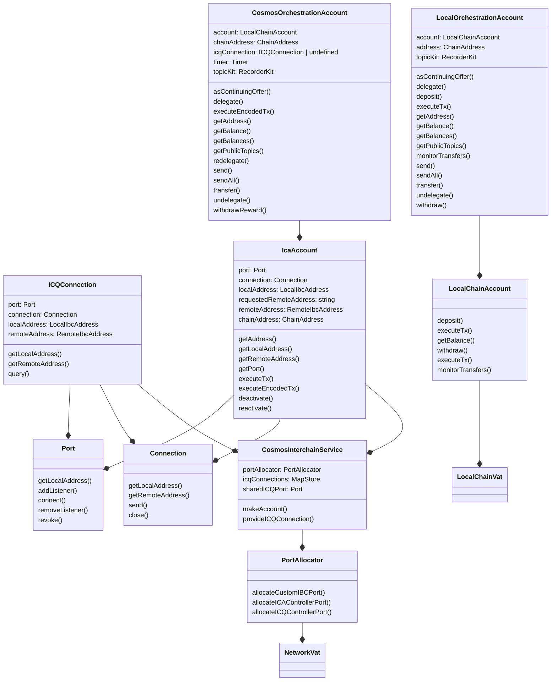

# Exo structure

Last verified 2024-09-06

```mermaid
classDiagram

%% Orchestration vat business logic (Zoe)
    ICQConnection --* Port
    ICQConnection --* Connection
    IcaAccount --* Port
    IcaAccount --* Connection
    IcaAccount --* CosmosInterchainService
    ICQConnection --* CosmosInterchainService
    CosmosInterchainService --* PortAllocator
    PortAllocator --* NetworkVat
    LocalChainAccount --* LocalChainVat

    class IcaAccount {
      port: Port
      connection: Connection
      localAddress: LocalIbcAddress
      requestedRemoteAddress: string
      remoteAddress: RemoteIbcAddress
      chainAddress: ChainAddress
      getAddress()
      getLocalAddress()
      getRemoteAddress()
      getPort()
      executeTx()
      executeEncodedTx()
      deactivate()
      reactivate()
    }
    class ICQConnection {
      port: Port
      connection: Connection
      localAddress: LocalIbcAddress
      remoteAddress: RemoteIbcAddress
      getLocalAddress()
      getRemoteAddress()
      query()
    }

    class CosmosInterchainService {
      portAllocator: PortAllocator
      icqConnections: MapStore<ConnectionVersionKey, ICQConnection>
      sharedICQPort: Port
      makeAccount()
      provideICQConnection()
    }

%% In other vats
    class Port {
      getLocalAddress()
      addListener()
      connect()
      removeListener()
      revoke()
    }

    class Connection {
      getLocalAddress()
      getRemoteAddress()
      send()
      close()
    }

    class PortAllocator {
      allocateCustomIBCPort()
      allocateICAControllerPort()
      allocateICQControllerPort()
    }

    class LocalChainAccount {
      deposit()
      executeTx()
      getBalance()
      withdraw()
      executeTx()
      monitorTransfers()
    }

%% In api consumer vats
  
    LocalOrchestrationAccount --* LocalChainAccount
    CosmosOrchestrationAccount --* IcaAccount
    
    class LocalOrchestrationAccount {
      account: LocalChainAccount
      address: ChainAddress
      topicKit: RecorderKit<OrchestrationAccountNotification>
      asContinuingOffer()
      delegate()
      deposit()
      executeTx()
      getAddress()
      getBalance()
      getBalances()
      getPublicTopics()
      monitorTransfers()
      send()
      sendAll()
      transfer()
      undelegate()
      withdraw()
    }

    class CosmosOrchestrationAccount {
      account: LocalChainAccount
      chainAddress: ChainAddress
      icqConnection: ICQConnection | undefined
      timer: Timer
      topicKit: RecorderKit<OrchestrationAccountNotification>
      asContinuingOffer()
      delegate()
      executeEncodedTx()
      getAddress()
      getBalance()
      getBalances()
      getPublicTopics()
      redelegate()
      send()
      sendAll()
      transfer()
      undelegate()
      withdrawReward()
    }
```
