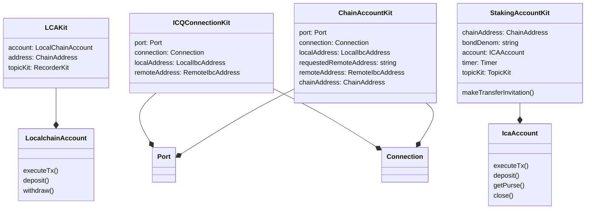

# Exo structure

As of 2024-05-29…

```mermaid
classDiagram

%% Orchestration vat business logic (Zoe)
    LCAKit --* LocalchainAccount
    ICQConnectionKit --* Port
    ICQConnectionKit --* Connection
    ChainAccountKit --* Port
    ChainAccountKit --* Connection
    StakingAccountKit --* IcaAccount

    class ChainAccountKit {
      port: Port
      connection: Connection
      localAddress: LocalIbcAddress
      requestedRemoteAddress: string
      remoteAddress: RemoteIbcAddress
      chainAddress: ChainAddress
    }
    class ICQConnectionKit {
      port: Port
      connection: Connection
      localAddress: LocalIbcAddress
      remoteAddress: RemoteIbcAddress
    }
    class StakingAccountKit {
      chainAddress: ChainAddress 
      bondDenom: string 
      account: ICAAccount 
      timer: Timer
      topicKit: TopicKit
      makeTransferInvitation()
    }

%% In other vats
    class LCAKit {
        account: LocalChainAccount
        address: ChainAddress
        topicKit: RecorderKit<LocalChainAccountNotification>
    }
    class LocalchainAccount {
        executeTx()
        deposit()
        withdraw()
    }
    class IcaAccount {
        executeTx()
        deposit()
        getPurse()
        close()
    }
```
