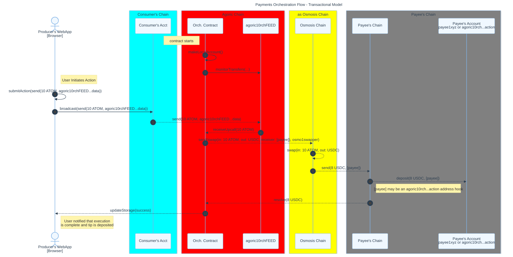

```mermaid
%%{init: {
  'theme': 'base',
  'themeVariables': {
    'primaryColor': '#f0f8ff',
    'primaryTextColor': '#2c3e50',
    'primaryBorderColor': '#7fb2e6',
    'lineColor': '#7fb2e6',
    'secondaryColor': '#f6f8fa',
    'tertiaryColor': '#fff5e6'
  }
}}%%
sequenceDiagram
    title Payments Orchestration Flow - Transactional Model
    autonumber
    actor webUA as Producer's WebApp<br/>[Browser]
    %% [Where it runs]
    box Aqua Consumer's Chain
    participant acctOrig as Consumer's Acct
    end
    box Red Agoric Chain
    participant myOrch as Orch. Contract
    participant orchLCA1 as agoric10rchFEED
    end
    box Yellow as Osmosis Chain
    participant chainDex as Osmosis Chain
    end
    box Grey Payee's Chain
    participant chainPay as Payee's Chain
    participant acctDest as Payee's Account<br />payee1xyz or agoric10rch...action
    end

    %% Notation: ->> for initial message, -->> for consequences

    note left of myOrch: contract starts
    myOrch ->> myOrch: makeLocalAccount()
    myOrch ->> orchLCA1: monitorTransfers(...)
    
    note right of webUA: User Initiates Action
    webUA ->> webUA: submitAction(send(10 ATOM, agoric10rchFEED...data))
    webUA ->> acctOrig: broadcast(send(10 ATOM, agoric10rchFEED...data))
    acctOrig -->> orchLCA1: send(10 ATOM, agoric10rchFEED...data)
    orchLCA1 -->> myOrch: receiveUpcall(10 ATOM)
    myOrch -->> chainDex: send(swap(in: 10 ATOM, out: USDC, receiver: [payee]), osmo1swapper)
    chainDex -->> chainDex: swap(in: 10 ATOM, out: USDC)
    chainDex -->> chainPay: send(8 USDC, [payee])

    chainPay -->> acctDest: deposit(8 USDC, [payee])
    note right of chainPay: [payee] may be an agoric10rch...action address hook

    chainPay -->> myOrch: resolve(8 USDC)
    myOrch -->> webUA: updateStorage(success)
    note right of webUA: User notified that execution<br/> is complete and tip is deposited
```
