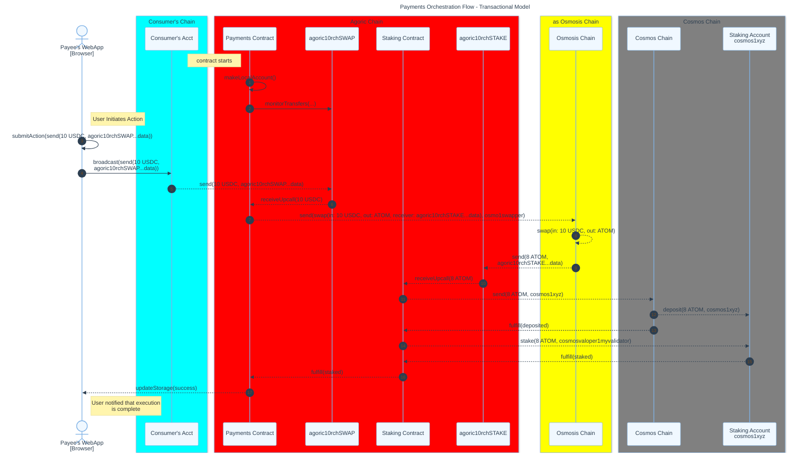

```mermaid
%%{init: {
  'theme': 'base',
  'themeVariables': {
    'primaryColor': '#f0f8ff',
    'primaryTextColor': '#2c3e50',
    'primaryBorderColor': '#7fb2e6',
    'lineColor': '#7fb2e6',
    'secondaryColor': '#f6f8fa',
    'tertiaryColor': '#fff5e6'
  }
}}%%
sequenceDiagram
    title Payments Orchestration Flow - Transactional Model
    autonumber
    actor webUA as Payee's WebApp<br/>[Browser]
    %% [Where it runs]
    box Aqua Consumer's Chain
    participant acctOrig as Consumer's Acct
    end
    box Red Agoric Chain
    participant myOrch as Payments Contract
    participant orchSWAP as agoric10rchSWAP
    participant myAction as Staking Contract
    participant orchAction as agoric10rchSTAKE
    end
    box Yellow as Osmosis Chain
    participant chainDex as Osmosis Chain
    end
    box Grey Cosmos Chain
    participant chainStake as Cosmos Chain
    participant acctICA as Staking Account<br />cosmos1xyz
    end

    %% Notation: ->> for initial message, -->> for consequences

    note left of myOrch: contract starts
    myOrch ->> myOrch: makeLocalAccount()
    myOrch ->> orchSWAP: monitorTransfers(...)
    
    note right of webUA: User Initiates Action
    webUA ->> webUA: submitAction(send(10 USDC, agoric10rchSWAP...data))
    webUA ->> acctOrig: broadcast(send(10 USDC,<br/>  agoric10rchSWAP...data))
    acctOrig -->> orchSWAP: send(10 USDC, agoric10rchSWAP...data)
    orchSWAP -->> myOrch: receiveUpcall(10 USDC)
    myOrch -->> chainDex: send(swap(in: 10 USDC, out: ATOM, receiver: agoric10rchSTAKE...data), osmo1swapper)
    chainDex -->> chainDex: swap(in: 10 USDC, out: ATOM)
    chainDex -->> orchAction: send(8 ATOM,<br/> agoric10rchSTAKE...data)

    orchAction -->> myAction: receiveUpcall(8 ATOM)
    myAction -->> chainStake: send(8 ATOM, cosmos1xyz)
    chainStake -->> acctICA: deposit(8 ATOM, cosmos1xyz)
    chainStake -->> myAction: fulfill(deposited)
    myAction -->> acctICA: stake(8 ATOM, cosmosvaloper1myvalidator)
    acctICA -->> myAction: fulfill(staked)

    myAction -->> myOrch: fulfill(staked)
    myOrch -->> webUA: updateStorage(success)
    note right of webUA: User notified that execution<br/>is complete
```
