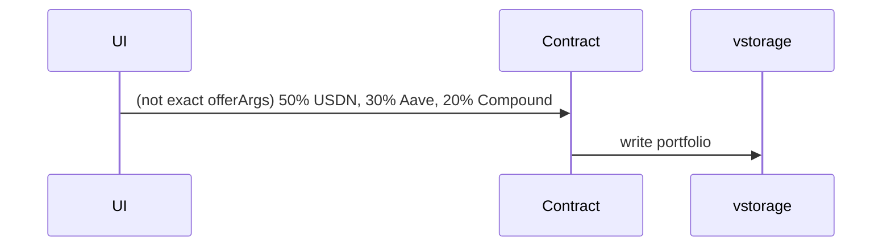
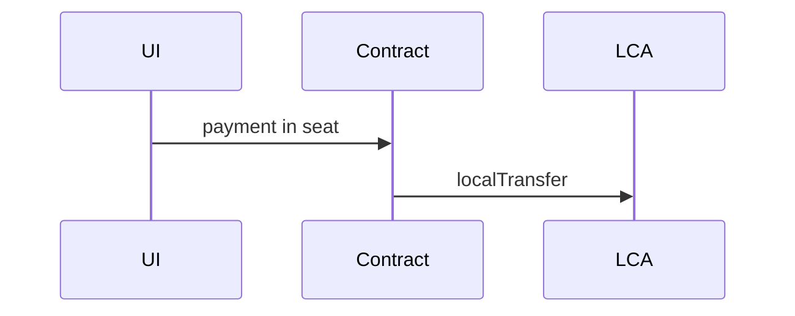
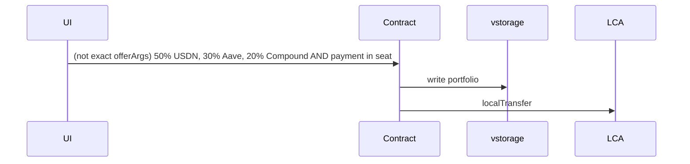
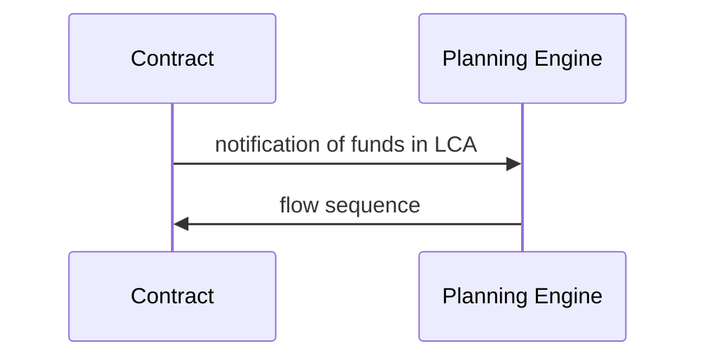
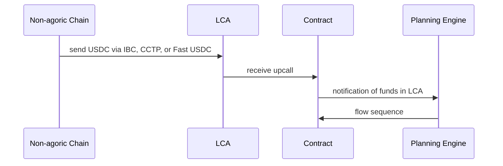
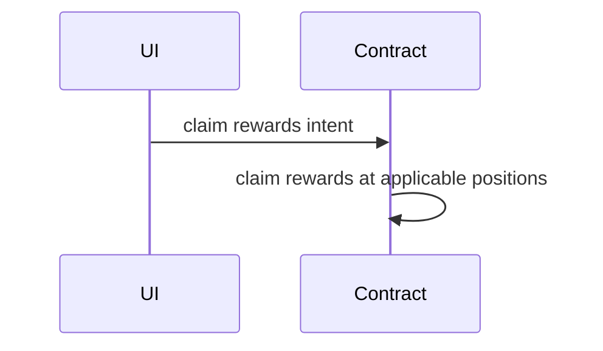
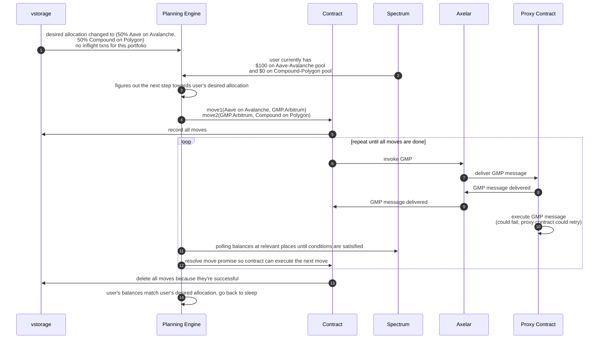

This file contains WIP design for ymax MVP product

## Design

### User stories
Each user story below is one smart contract offer

1. new/edit portfolio

2. deposit from Agoric chain into existing portfolio

3. 1 + 2

4. automatic rebalance

5. deposit from Fast USDC source chains into existing portfolio via address hook

6. claim bonus

#### Planning Engine

##### Move from Aave to Compound

#### Eng Tasks
- [EVM]
  - Aave + Compound + USDN [M0]
  - Remaining protocols/pools [M1]
- [contract]
  - accept flow as sequence of moves [M0]
  - portfolio facet
    - update portfolio
    - deposit into LCA
    - withdraw from LCA
    - claim rewards intent
      - claim rewards operation (triggered by user for now, could move to by
        planning engine in the future)
  - planning engine facet
    - can only move tokens between LCA and positions
  - notify planning engine
- [planning engine]
  - [poller]
    - being able to poll and notify
      - portfolio changes
      - balance changes on LCA, ICAs, and ICA-equivalents
  - [planner]
    - given
      - portfolio
      - current balances in various positions
      - current inflight txns
    - produce
      - moves to rearrange user's balances to their desired portfolio allocation
  - [executor]
    - take steps produced by planner and send to portfolio contract

#### NOT in scope for MVP
1. deposit from Fast USDC source chains and create a new portfolio via address hook
2. connect with existing positions on Aave, Compound, etc

#### changelog
1. add claim rewards user story
1. make it so deposit = intent to rebalance
1. add an example for planning engine and break down eng tasks further
