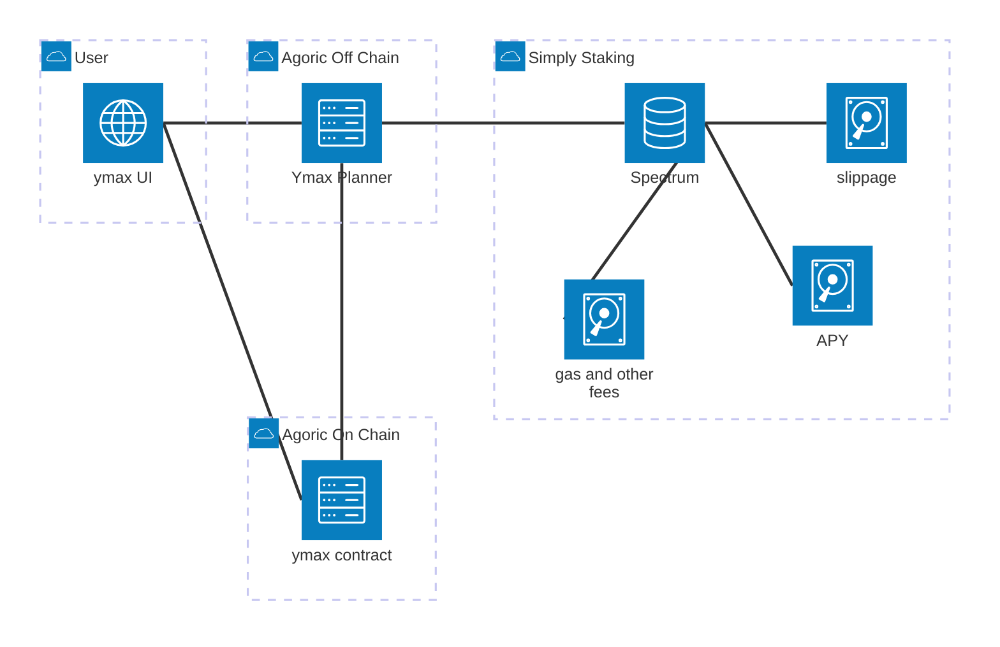
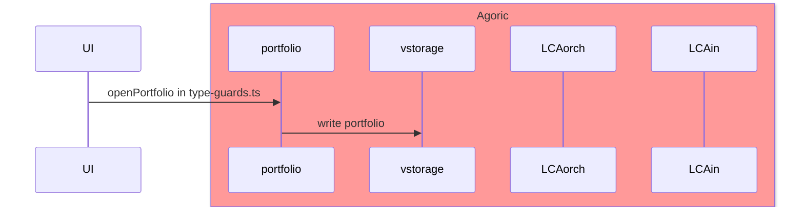
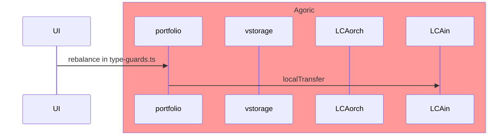
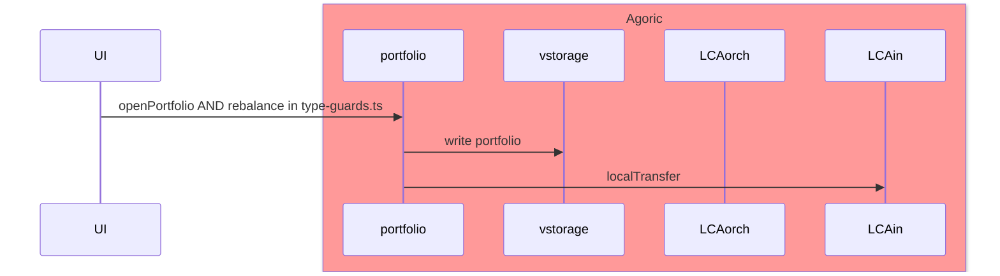
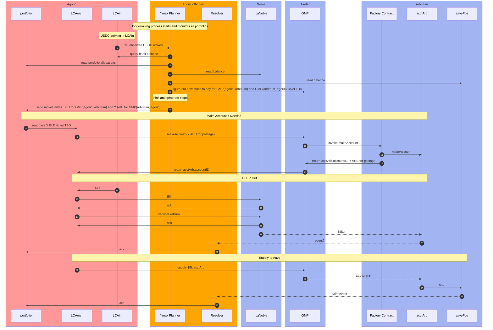
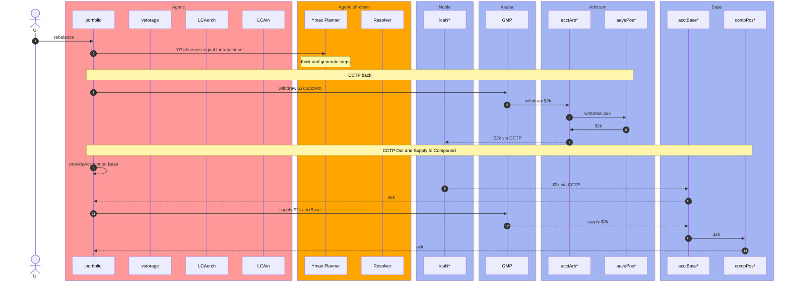

This file contains WIP design for ymax MVP product

## Design

### Operations
1. new/edit portfolio

2. deposit from Agoric chain into existing portfolio

3. new/edit portfolio and deposit from Agoric chain

4. deposit-triggered distribution

5. manually-triggered rebalance

### User stories

1. tiger would like to open a portfolio with allocations in percentages
    1. operation 1: new/edit portfolio
2. tiger would like to edit their existing portfolio to different allocations
    1. operation 1: new/edit portfolio
3. tiger already has an existing portfolio, and tiger sign a txn to deposit USDC into their portfolio
    1. operation 4: deposit triggered distribution
3. tiger would like to open a portfolio and deposit USDC to it
    1. operation 3: new/edit portfolio and deposit from Agoric chain
    2. operation 4: deposit triggered distribution
4. tiger would like to edit their existing portfolio and deposit USDC to it
    1. operation 3: new/edit portfolio and deposit from Agoric chain
    2. operation 4: deposit triggered distribution
5. tiger would like to manually trigger a rebalance
    1. operation 5: manually-triggered rebalance

#### NOT in scope for now
1. deposit from Fast USDC source chains and create a new portfolio via address hook
2. connect with existing positions on Aave, Compound, etc
3. automatic/scheduled rebalance or claim rewards
