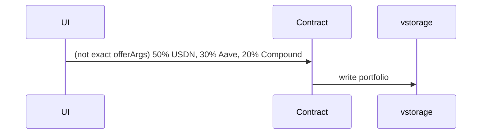
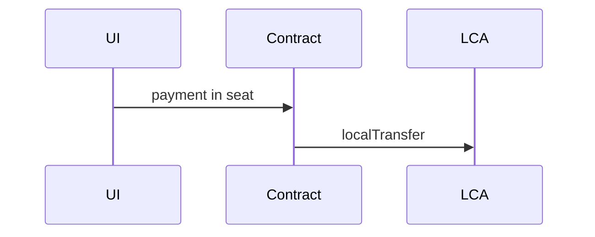
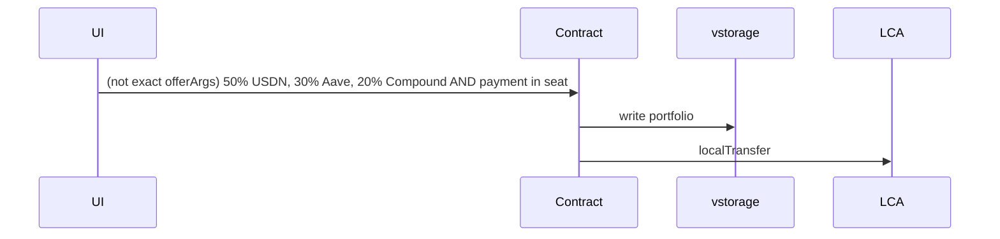
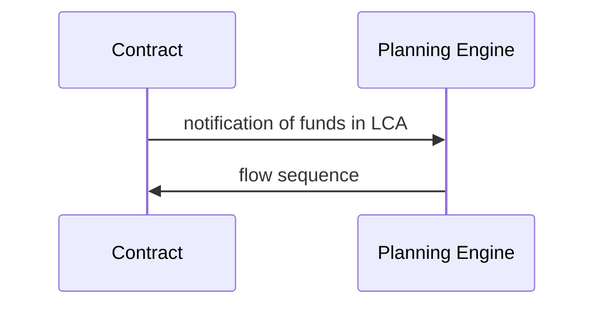
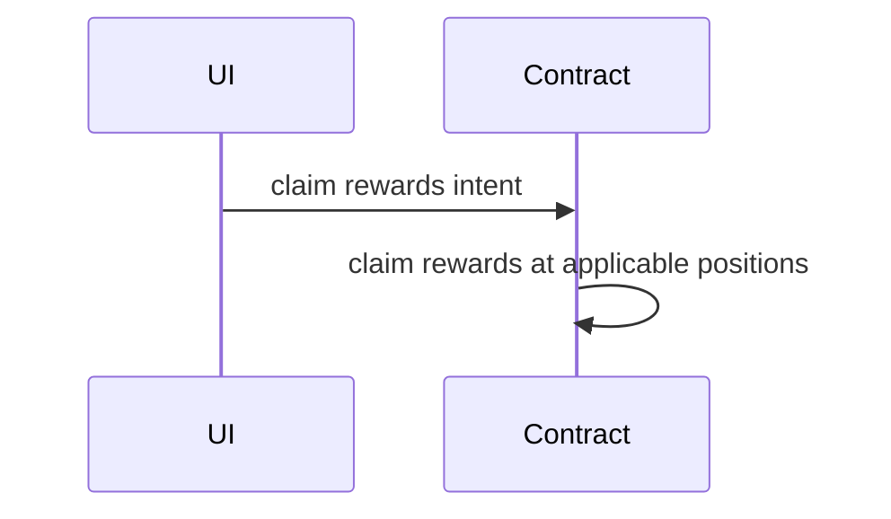

This file contains WIP design for ymax MVP product

## Design

### User stories
Each user story below is one smart contract offer

1. new/edit portfolio

2. deposit from Agoric chain into existing portfolio

3. 1 + 2

4. update portfolio (allocation)
  Mermaid diagram same as 1
  [Will be deleted if agreed]
5. rebalance (move tokens according to portfolio allocation)
  [Will be deleted if agreed]
6. 4 + 5
  [Will be deleted if agreed]
7. automatic rebalance

8. deposit from Fast USDC source chains into existing portfolio via address hook

9. claim bonus

#### Eng Tasks

  - [EVM]
    - Aave + Compound + USDN [M0]
    - Remaining protocols/pools [M1]
  - [contract]
    - accept flow as sequence of moves [M0]
    - administrative facet
      - update portfolio
      - deposit into LCA
      - withdraw from LCA
      - claim rewards intent
        - claim rewards operation (triggered by user for now, could move to by
          planning engine in the future)
    - planning engine facet
      - can only move tokens between LCA and positions
    - notify planning engine
  - [planning engine]
    - receive/subscribe to notifications
    - given portfolio, current positions, generate steps and make offer
      - errors out if it encounter a situation it can't generate steps

#### NOT in scope for MVP
1. deposit from Fast USDC source chains and create a new portfolio via address hook
2. connect with existing positions on Aave, Compound, etc

#### changelog
1. add claim rewards user story
1. make it so deposit = intent to rebalance
