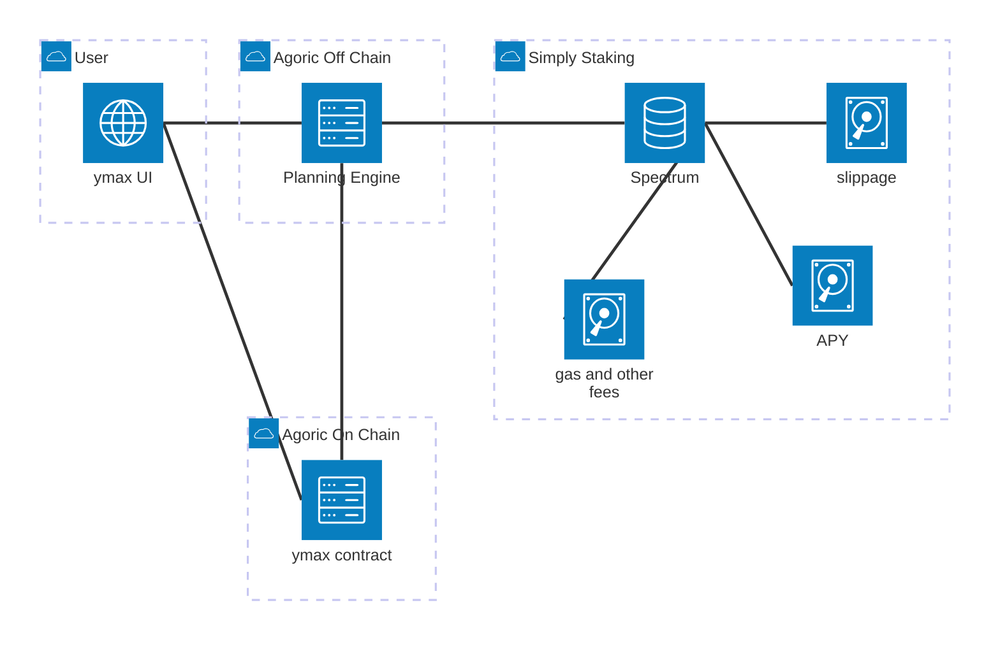
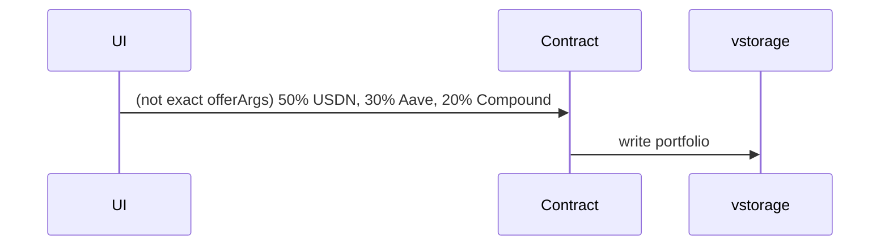
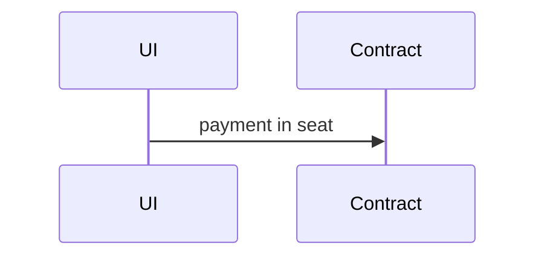
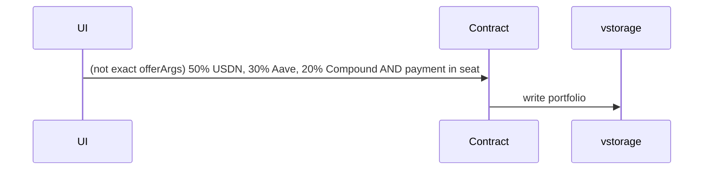
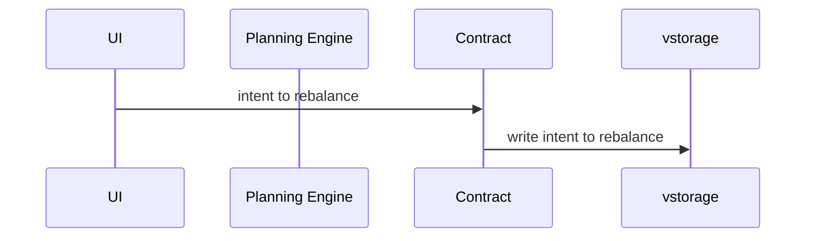
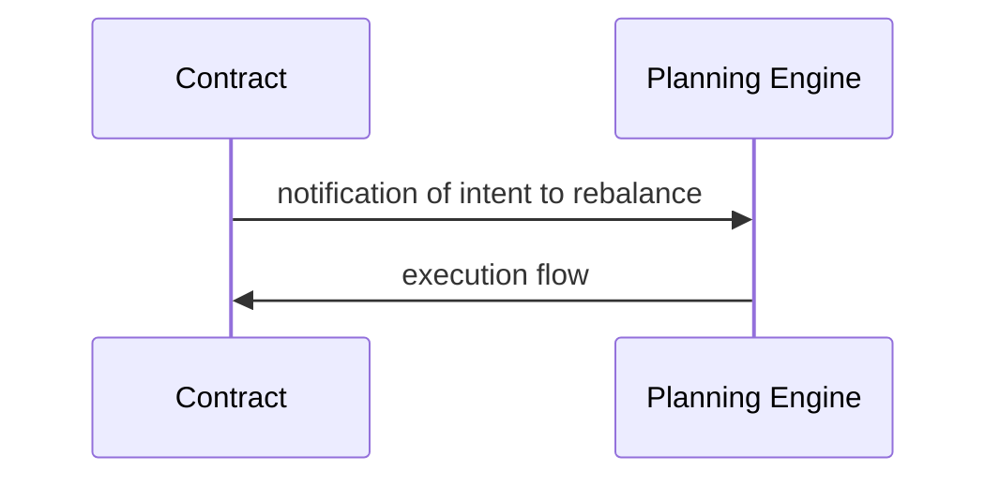
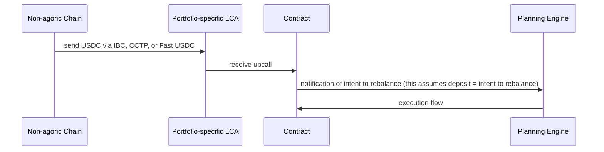

# Portfolio Contract

A smart contract for managing diversified stablecoin yield portfolios across multiple chains and protocols. Also known as YMax, this proof-of-concept enables portfolio rebalancing across different yield protocols.

## Overview

The YMax Portfolio Contract enables users to create and manage portfolios that deploy stablecoins across different yield-generating protocols. Users can rebalance their positions between USDN, Aave, and Compound (via cross-chain operations).

## Parties to the Contract

### Portfolio Holders
- **Create Portfolios**: Open new portfolios by providing USDC, Access tokens, and fees
- **Fund Positions**: Allocate capital across different yield protocols (USDN, Aave, Compound)
- **Portfolio Rebalancing**: Execute rebalancing operations by specifying desired asset movements
- **Multi-chain Operations**: Manage positions across Noble and EVM chains

### The Contract
- **Portfolio Orchestration**: Manages multiple independent portfolios
- **Cross-chain Coordination**: Handles asset transfers and position management across chains
- **Yield Protocol Integration**: Interfaces with USDN, Aave, and Compound protocols
- **Account Management**: Maintains accounts on different chains (Agoric Local Accounts, Noble ICAs)

### External Yield Protocols
- **USDN**: Noble Dollar based on the M^0 Protocol.
- **Aave**: Cross-chain lending protocol (via Axelar GMP to EVM chains)
- **Compound**: Cross-chain lending protocol (via Axelar GMP to EVM chains)

## Current Functionality

### Opening a Portfolio
Users can create a new portfolio by:
1. Making an `openPortfolio` offer
2. Specifying initial yield protocol allocations
3. Receiving a portfolio with rebalancing capabilities

### Rebalancing
Portfolio holders can:
- Move assets between different yield protocols by making rebalancing offers
- Specify exact amounts to transfer between USDN, Aave, and Compound positions
- Execute complex cross-chain operations seamlessly through the contract's orchestration

## Design

### User stories
Each user story below is one smart contract offer

1. new portfolio

2. deposit from Agoric chain into existing portfolio

3. 1 + 2

4. update portfolio (allocation)
  Mermaid diagram same as 1
5. rebalance (move tokens according to portfolio allocation)

6. 4 + 5
7. automatic rebalance (to recover from errors during rebalance)

8. deposit from Fast USDC source chains into existing portfolio via address hook

#### NOT in scope for MVP
1. deposit from Fast USDC source chains and create a new portfolio via address hook
2. connect with existing positions on Aave, Compound, etc

## Client Queries and Offers

For details on making offers and querying vstorage, see

 - `src/type-guards.ts` - types and pattern guards
 - `test/portfolio-agents.ts` - example client code
 - `test/snapshots/*.md` - example vstorage data
