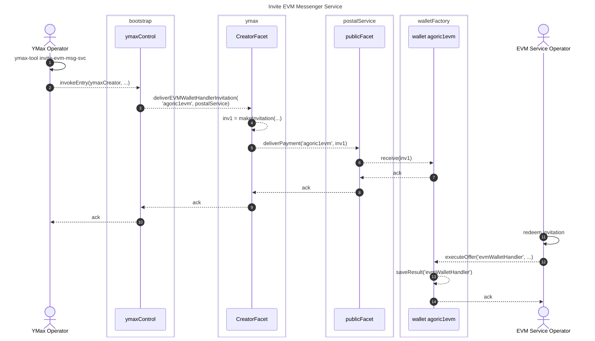
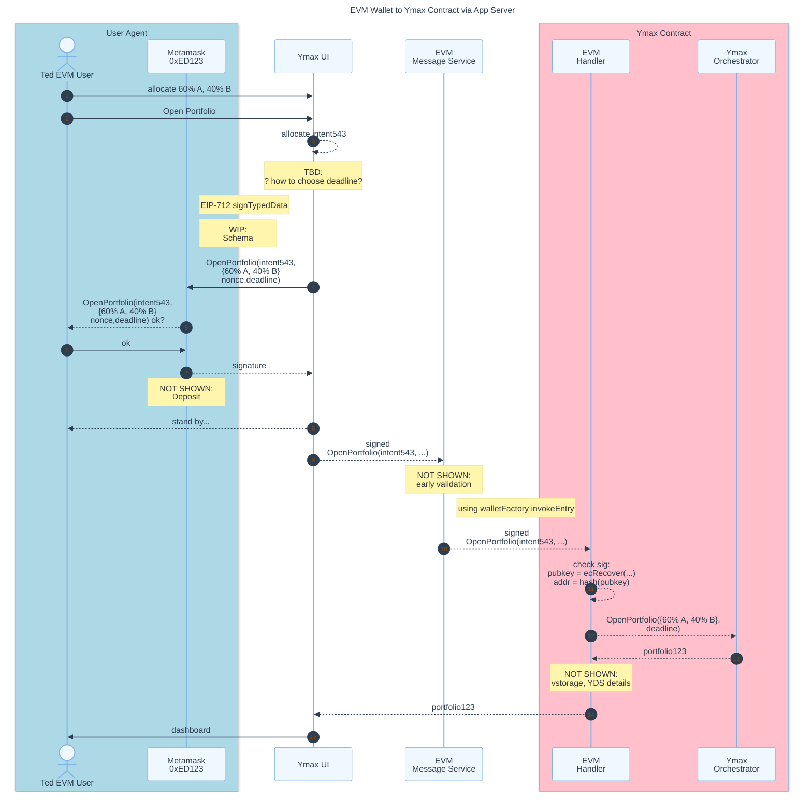
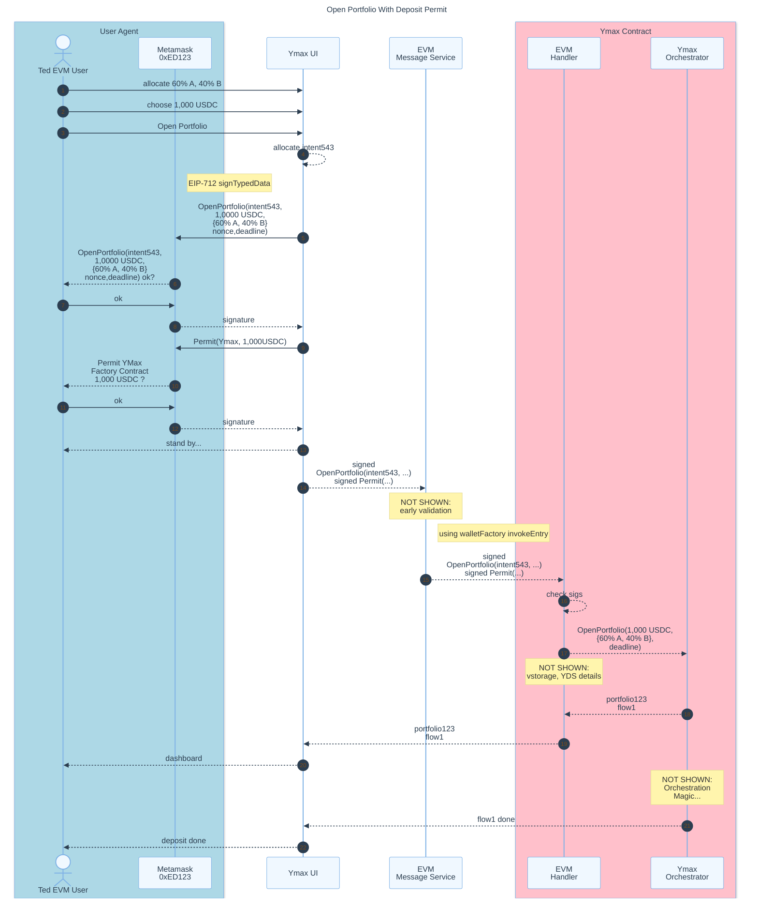
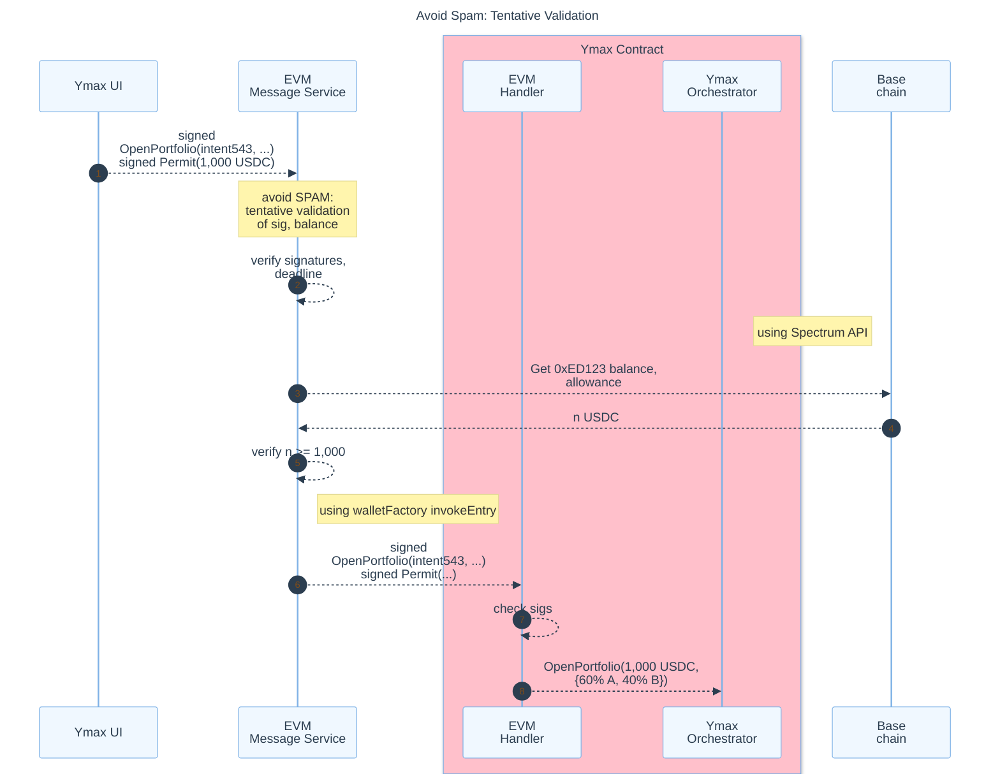
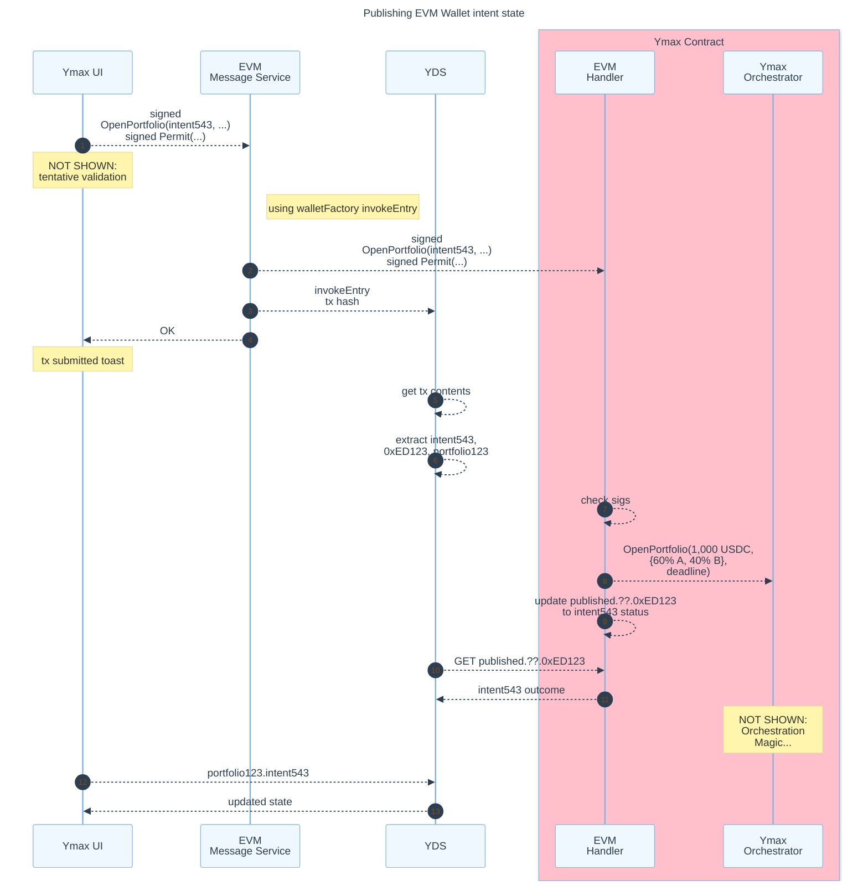
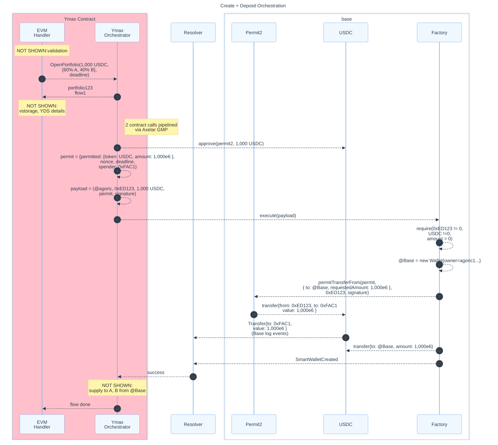

## Preface: Invite EVM Messenger Service

Much like we invite the Planner and Resolver, we start by inviting the EVM Messenger Service, and redeeming the invitation.

Sequence Diagram: Invite EVM Messenger Service

## EVM Wallet to Ymax Contract via App Server

Using a pattern established by across, 1inch, etc., Ted, who owns `0xED123`, opens `portfolio123` using his EVM Wallet, MetaMask. MetaMask doesn't submit to any chain; rather: it displays the data to be signed according to EIP-712, and gives a signature back to the UI, which POSTs to an app server that we'll call the EVM Message Service:

## Open Portfolio with Deposit Permit

The established pattern involves not just the intent to open a portfolio but also a permit to withdraw funds from Ted's account, `0xED123`, and deposit them into the portfolio:

## Early Validation

The EVM Message Service spends gas to put messages on the Agoric chain -- messages that cause the Ymax contract to spend EVM execution fees. To mitigate spam/DOS risks,
it does early validation of signatures and balance:

## Publishing EVM Wallet intent state to VStorage

The UI and YDS follow the intent state via vstorage, much like they do from `published.wallet.agoric1...`.

## Create + Deposit Orchestration

based on exploratory prototype...

- https://github.com/agoric-labs/agoric-to-axelar-local/pull/48
  - [Factory.sol](https://github.com/agoric-labs/agoric-to-axelar-local/blame/dc-permit2-actors/packages/axelar-local-dev-cosmos/src/__tests__/contracts/Factory.sol)
- https://github.com/agoric-labs/agoric-to-axelar-local/pull/49
  - [createAndDeposit.ts](https://github.com/agoric-labs/agoric-to-axelar-local/blob/dc-permit2-actors/integration/agoric/createAndDeposit.ts)

