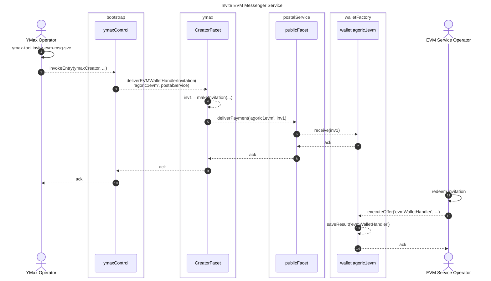
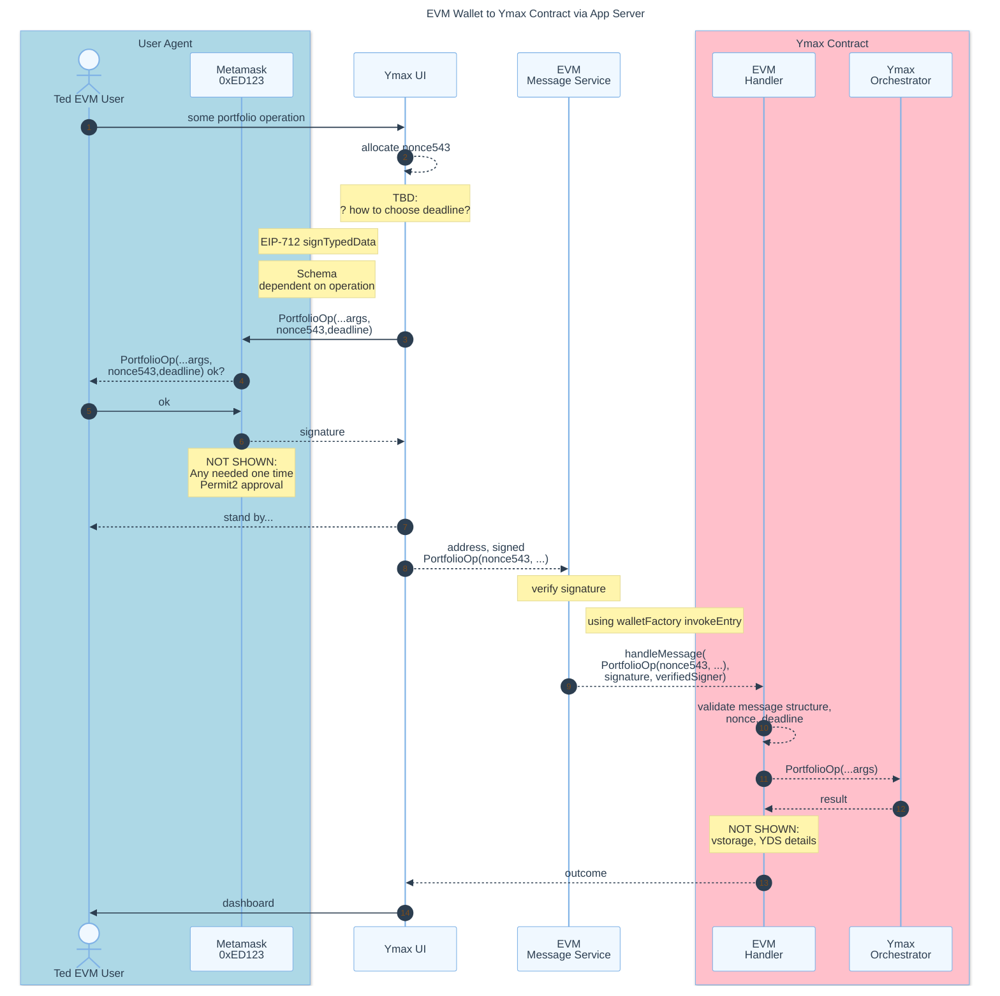
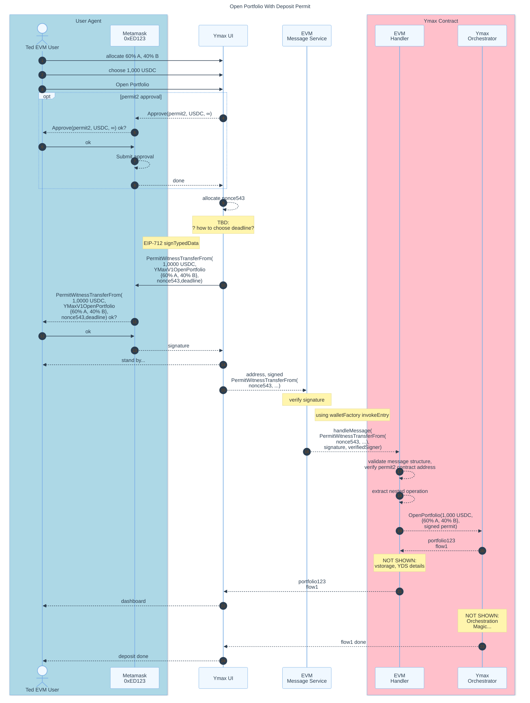
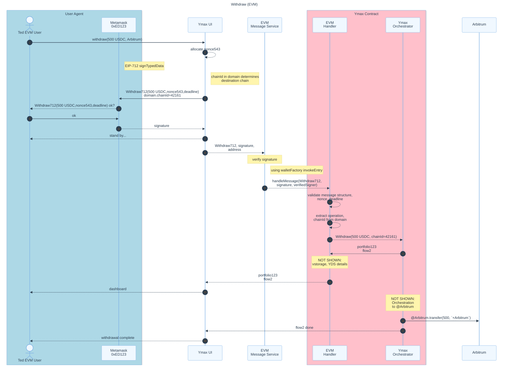
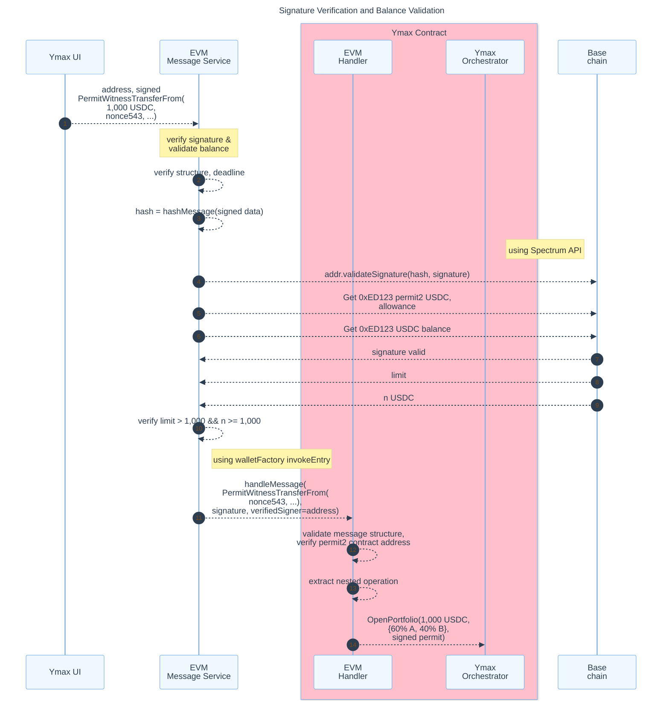
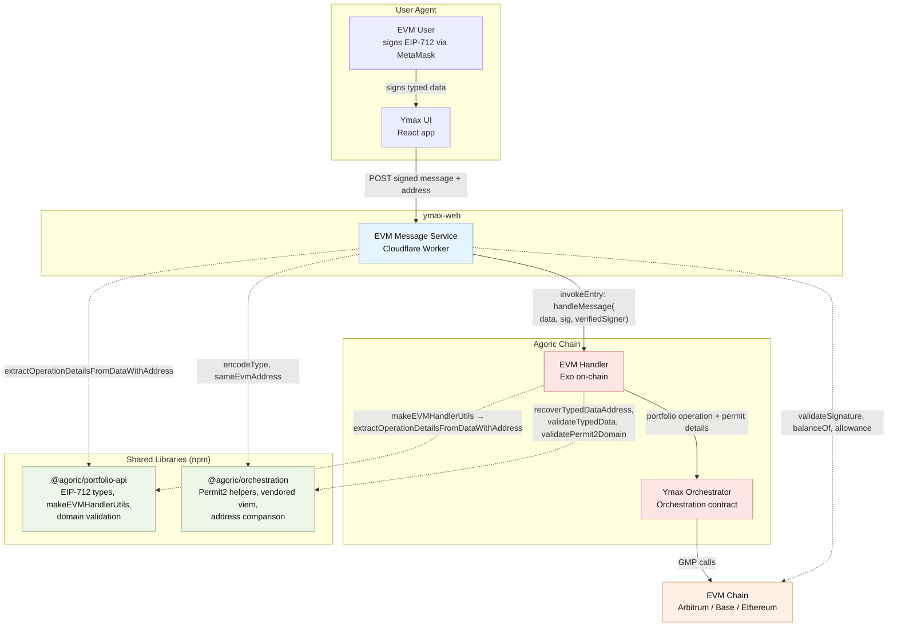
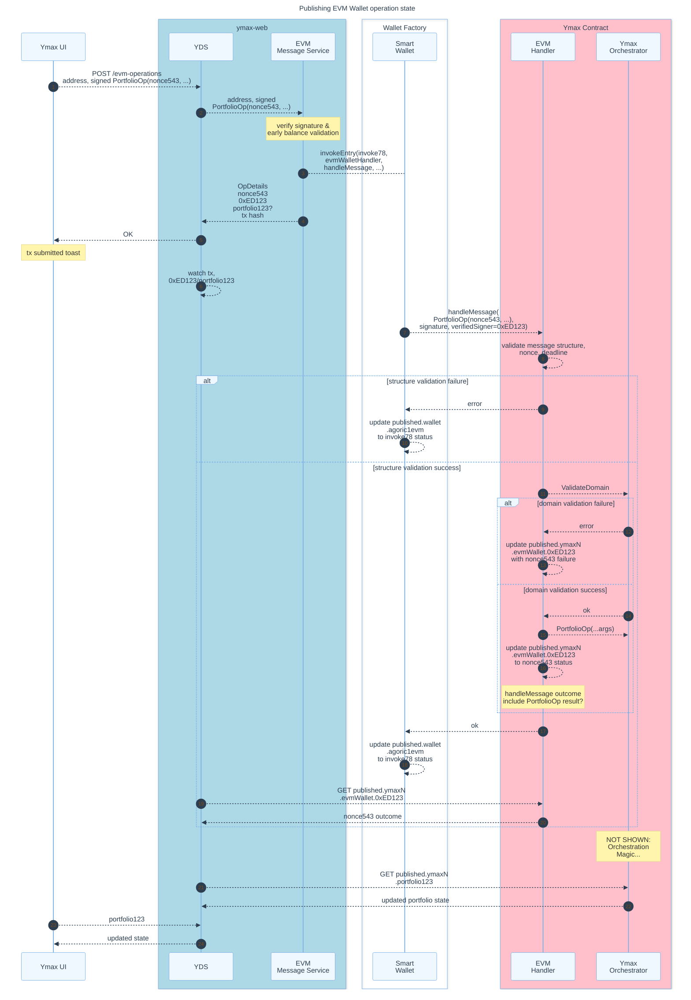
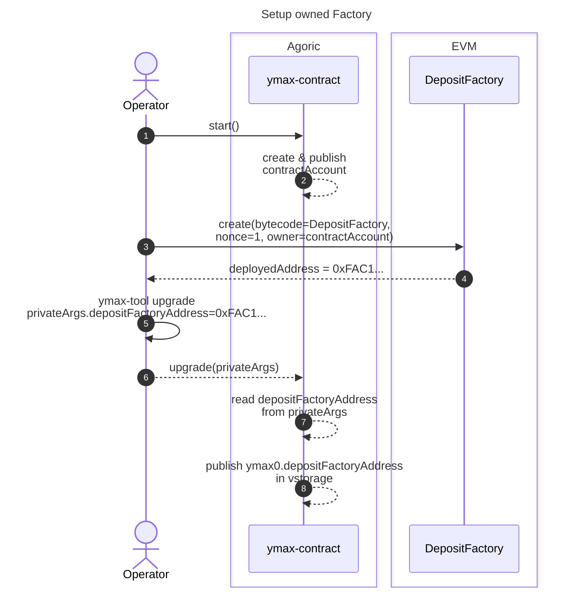
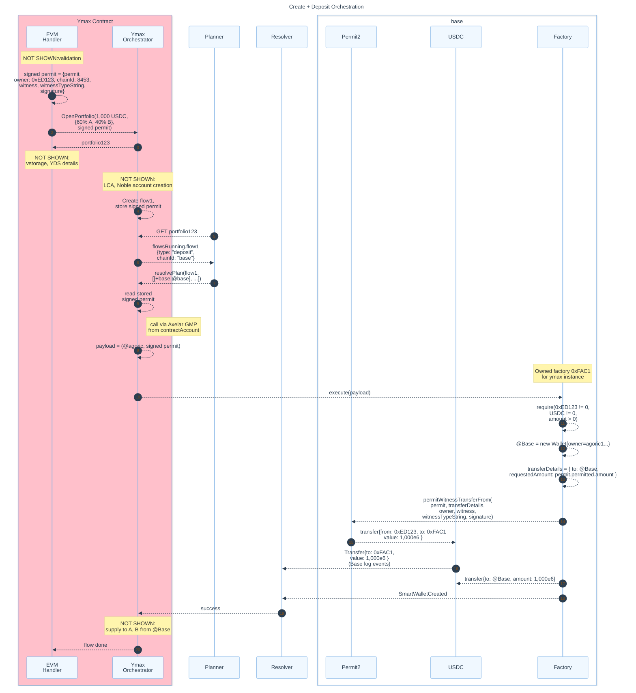

## Preface: Invite EVM Messenger Service

Much like we invite the Planner and Resolver, we start by inviting the EVM Messenger Service, and redeeming the invitation.

Sequence Diagram: Invite EVM Messenger Service

```mermaid
sequenceDiagram
  title: Invite EVM Messenger Service

  %% Conventions:
  %% - use `box` for vats / contracts
  %% - `->>` denotes a spontaneous action (initiating cause)
  %% - `-->>` denotes a consequence of a prior message

  autonumber
  actor op as YMax Operator
  box bootstrap
    participant YC as ymaxControl
  end
  box ymax
    participant CF as CreatorFacet
  end
  box postalService
    participant PS as publicFacet
  end
  box walletFactory
    participant W as wallet agoric1evm
  end
  actor evm as EVM Service Operator

  op->>op: ymax-tool invite-evm-msg-svc
  op-->>YC: invokeEntry(ymaxCreator, ...)
  YC-->>CF: deliverEVMWalletHandlerInvitation(<br/>'agoric1evm', postalService)
  CF-->>CF: inv1 = makeInvitation(...)
  CF-->>PS: deliverPayment('agoric1evm', inv1)
  PS-->>W: receive(inv1)
  W-->>PS: ack
  PS-->>CF: ack
  CF-->>YC: ack
  YC-->>op: ack

  evm->>evm: redeem invitation
  evm-->>W: executeOffer('evmWalletHandler', ...)
  W-->>W: saveResult('evmWalletHandler')
  W-->>evm: ack
```

## EVM Wallet to Ymax Contract via App Server

Using a pattern established by across, 1inch, etc., Ted, who owns `0xED123` uses his EVM Wallet, MetaMask. MetaMask doesn't submit to any chain; rather: it displays the data to be signed according to EIP-712, and gives a signature back to the UI, which POSTs to an app server that we'll call the EVM Message Service:

```mermaid

%%{init: {
  'theme': 'base',
  'themeVariables': {
    'primaryColor': '#f0f8ff',
    'primaryTextColor': '#2c3e50',
    'primaryBorderColor': '#7fb2e6',
    'lineColor': '#7fb2e6',
    'secondaryColor': '#f6f8fa',
    'tertiaryColor': '#fff5e6'
  }
}}%%
sequenceDiagram
  title EVM Wallet to Ymax Contract via App Server
  autonumber
  box lightblue User Agent
    actor U as Ted EVM User
    participant MM as Metamask<br/>0xED123
  end
  participant D as Ymax UI
  participant EMS as EVM<br/> Message Service
  %% [Where it runs]
  box Pink Ymax Contract
    participant EMH as EVM<br/>Handler
    participant YC as Ymax<br/>Orchestrator
  end

  %% Notation: ->> for initial message, -->> for consequences

  U->>D: some portfolio operation
  D-->>D: allocate nonce543
  note over D: TBD:<br/>? how to choose deadline?
  note right of MM: EIP-712 signTypedData
  note right of MM: Schema<br/>dependent on operation
  D->>MM: PortfolioOp(...args,<br/>nonce543,deadline)
  MM-->>U: PortfolioOp(...args,<br/>nonce543,deadline) ok?
  U->>MM: ok
  MM-->>D: signature
  note over MM: NOT SHOWN:<br/>Any needed one time<br/>Permit2 approval
  D-->>U: stand by...

  D -->> EMS: address, signed<br/>PortfolioOp(nonce543, ...)
  note over EMS: verify signature
  note right of EMS: using walletFactory invokeEntry
  EMS -->> EMH: handleMessage(<br/>PortfolioOp(nonce543, ...),<br/>signature, verifiedSigner)
  EMH -->> EMH: validate message structure,<br/>nonce, deadline
  EMH -->> YC: PortfolioOp(...args)
  YC -->> EMH: result
  note over EMH: NOT SHOWN:<br/>vstorage, YDS details
  EMH -->> D: outcome
  D ->> U: dashboard
```

### Open Portfolio with Deposit Permit

To open a portfolio, YMax requires a deposit to be made. Unlike with a cosmos based wallet where the funds can be included in the Zoe offer (withdrawn from the cosmos account), Ted signs a permit to withdraw funds from their EVM account, `0xED123`.

To reduce the number of signatures and transactions needed, we use permit2, which supports custom payloads for the dApp's usage, where we include the Open Portfolio details. This is akin to Circle's CPN Transactions v2.

This requires to prompt Ted for a one time approval of the permit2 contract if they haven't previously approved it in any dApp.

```mermaid

%%{init: {
  'theme': 'base',
  'themeVariables': {
    'primaryColor': '#f0f8ff',
    'primaryTextColor': '#2c3e50',
    'primaryBorderColor': '#7fb2e6',
    'lineColor': '#7fb2e6',
    'secondaryColor': '#f6f8fa',
    'tertiaryColor': '#fff5e6'
  }
}}%%
sequenceDiagram
  title Open Portfolio With Deposit Permit
  autonumber
  box lightblue User Agent
    actor U as Ted EVM User
    participant MM as Metamask<br/>0xED123
  end
  participant D as Ymax UI
  participant EMS as EVM<br/> Message Service
  %% [Where it runs]
  box Pink Ymax Contract
    participant EMH as EVM<br/>Handler
    participant YC as Ymax<br/>Orchestrator
  end

  %% Notation: ->> for initial message, -->> for consequences

  U->>D: allocate 60% A, 40% B
  U->>D: choose 1,000 USDC
  U->>D: Open Portfolio

  opt permit2 approval
    D-->>MM: Approve(permit2, USDC, ∞)
    MM-->>U: Approve(permit2, USDC, ∞) ok?
    U->>MM: ok
    MM-->>MM: Submit approval
    MM-->>D: done
  end

  D-->>D: allocate nonce543
  note over D: TBD:<br/>? how to choose deadline?
  note right of MM: EIP-712 signTypedData
  D->>MM: PermitWitnessTransferFrom(<br/>1,0000 USDC,<br/>YMaxV1OpenPortfolio<br/>{60% A, 40% B},<br/>nonce543,deadline)
  MM-->>U: PermitWitnessTransferFrom(<br/>1,0000 USDC,<br/>YMaxV1OpenPortfolio<br/>{60% A, 40% B},<br/>nonce543,deadline) ok?
  U->>MM: ok
  MM-->>D: signature

  D-->>U: stand by...

  D -->> EMS: address, signed<br/>PermitWitnessTransferFrom(<br/>nonce543, ...)
  note over EMS: verify signature
  note right of EMS: using walletFactory invokeEntry
  EMS -->> EMH: handleMessage(<br/>PermitWitnessTransferFrom(<br/>nonce543, ...),<br/>signature, verifiedSigner)
  EMH -->> EMH: validate message structure,<br/>verify permit2 contract address
  EMH -->> EMH: extract nested operation
  EMH -->> YC: OpenPortfolio(1,000 USDC,<br/>{60% A, 40% B},<br/>signed permit)
  YC -->> EMH: portfolio123<br/>flow1
  note over EMH: NOT SHOWN:<br/>vstorage, YDS details
  EMH -->> D: portfolio123<br/>flow1
  D -->> U: dashboard
  note over YC: NOT SHOWN:<br/>Orchestration<br/>Magic...
  YC-->> D: flow1 done
  D -->> U: deposit done
```

### Permit2 Spender Address

The `spender` field in Permit2 messages identifies who is authorized to execute the `permitWitnessTransferFrom` call:

- **Open Portfolio with Deposit**: The spender is the **depositFactory** contract. The factory creates the portfolio's smart wallet and executes the permit2 transfer in one atomic transaction.

- **Deposit to Existing Portfolio (`depositFromEVM`)**: The spender is the **portfolio's smart wallet** on the target chain. Even if the wallet doesn't exist yet on that chain, we predict its CREATE2 address. The contract ensures the wallet exists before executing the permit2 transfer, using the same `provideEVMAccount` pathway as other EVM operations.

This distinction matters because:
1. The depositFactory can atomically create + deposit, avoiding race conditions during initial portfolio creation
2. For existing portfolios, the smart wallet address is deterministic (CREATE2) and can directly receive permit2 transfers
3. The spender must match what the user signed, so the UI must compute the predicted wallet address

### depositFromEVM Flow

The `depositFromEVM` flow (`+Arbitrum` → `@Arbitrum`) is parallel to `withdrawToEVM` (`@Arbitrum` → `-Arbitrum`):

1. **Planning Phase**: The planner includes a step with `src: '+Arbitrum'` and `dest: '@Arbitrum'`
2. **Wallet Provisioning**: `stepFlow` detects the EVM chain in the step and calls `provideEVMAccount` to ensure the smart wallet exists (same pathway as other EVM operations)
3. **Permit2 Execution**: A GMP call is sent to the smart wallet to execute `permitWitnessTransferFrom`, transferring tokens from the user's EOA to the wallet

The permit details are passed via `ExecutePlanOptions.evmDepositDetail` (not in `FlowDetail`, which is for planner info only).

### Withdraw (EVM)

```mermaid
%%{init: {
  'theme': 'base',
  'themeVariables': {
    'primaryColor': '#f0f8ff',
    'primaryTextColor': '#2c3e50',
    'primaryBorderColor': '#7fb2e6',
    'lineColor': '#7fb2e6',
    'secondaryColor': '#f6f8fa',
    'tertiaryColor': '#fff5e6'
  }
}}%%
sequenceDiagram
  title Withdraw (EVM)
  autonumber
  box lightblue User Agent
    actor U as Ted EVM User
    participant MM as Metamask<br/>0xED123
  end
  participant D as Ymax UI
  participant EMS as EVM<br/> Message Service
  %% [Where it runs]
  box Pink Ymax Contract
    participant EMH as EVM<br/>Handler
    participant YC as Ymax<br/>Orchestrator
  end
  participant A as Arbitrum
  %% Notation: ->> for initial message, -->> for consequences
  U->>D: withdraw(500 USDC, Arbitrum)
  D-->>D: allocate nonce543
  note right of MM: EIP-712 signTypedData
  note right of D: chainId in domain determines<br/>destination chain
  D->>MM: Withdraw712(500 USDC,nonce543,deadline)<br/>domain.chainId=42161
  MM-->>U: Withdraw712(500 USDC,nonce543,deadline) ok?
  U->>MM: ok
  MM-->>D: signature
  D-->>U: stand by...
  D -->> EMS: Withdraw712, signature,<br>address
  note over EMS: verify signature
  note right of EMS: using walletFactory invokeEntry
  EMS -->> EMH: handleMessage(Withdraw712,<br/>signature, verifiedSigner)
  EMH -->> EMH: validate message structure,<br/>nonce, deadline
  EMH -->> EMH: extract operation,<br/>chainId from domain
  EMH -->> YC: Withdraw(500 USDC, chainId=42161)
  YC -->> EMH: portfolio123<br/>flow2
  note over EMH: NOT SHOWN:<br/>vstorage, YDS details
  EMH -->> D: portfolio123<br/>flow2
  D -->> U: dashboard
  note over YC: NOT SHOWN:<br/>Orchestration<br/>to @Arbitrum
  YC->> A: @Arbitrum.transfer(500, `+Arbitrum`)
  YC-->> D: flow2 done
  D -->> U: withdrawal complete
```

## Signature Verification and Early Validation

The EVM Message Service is a an off-chain relay that the on-chain message handler relies on to verify EIP-712 signatures and other properties of the message before submission. When the EMS has verified the signature, it sends the signer address as `verifiedSigner` alongside the message data. In that case, the on-chain EVM Handler doesn't perform any signature verification itself, and relies on the integrity of the EMS checks. It does however validate message structure, nonce, deadline, and contract addresses (e.g. permit2 verifying contract). If the message includes a deposit permit, the signature will ultimately be validated by the permit2 contract on the EVM chain when the permit is redeemed during the deposit operation.

If `verifiedSigner` is not provided, the EVM Handler falls back to on-chain ECDSA recovery from the signature, which only works for EOA accounts.

The EMS also spends gas to put messages on the Agoric chain -- messages that cause the Ymax contract to spend EVM execution fees. To mitigate spam/DOS risks, besides signature validation, it also does early validation of message structure like the on-chain contract, as well as check for current availability of a deposit balance:

```mermaid

%%{init: {
  'theme': 'base',
  'themeVariables': {
    'primaryColor': '#f0f8ff',
    'primaryTextColor': '#2c3e50',
    'primaryBorderColor': '#7fb2e6',
    'lineColor': '#7fb2e6',
    'secondaryColor': '#f6f8fa',
    'tertiaryColor': '#fff5e6'
  }
}}%%
sequenceDiagram
  title Signature Verification and Balance Validation
  autonumber
  participant D as Ymax UI
  participant EMS as EVM<br/> Message Service
  %% [Where it runs]
  box Pink Ymax Contract
    participant EMH as EVM<br/>Handler
    participant YC as Ymax<br/>Orchestrator
  end
  participant B as Base<br/>chain

  %% Notation: ->> for initial message, -->> for consequences

  D -->> EMS: address, signed<br/>PermitWitnessTransferFrom(<br/>1,000 USDC,<br/>nonce543, ...)

  note over EMS: verify signature &<br/>validate balance
  EMS-->>EMS: verify structure, deadline
  EMS-->>EMS: hash = hashMessage(signed data)
  note left of B: using Spectrum API
  EMS-->>B: addr.validateSignature(hash, signature)
  EMS-->>B: Get 0xED123 permit2 USDC,<br/>allowance
  EMS-->>B: Get 0xED123 USDC balance
  B-->>EMS: signature valid
  B-->>EMS: limit
  B-->>EMS: n USDC
  EMS-->>EMS: verify limit > 1,000 && n >= 1,000

  note right of EMS: using walletFactory invokeEntry
  EMS -->> EMH: handleMessage(<br/>PermitWitnessTransferFrom(<br/>nonce543, ...),<br/>signature, verifiedSigner=address)
  EMH -->> EMH: validate message structure,<br/>verify permit2 contract address
  EMH -->> EMH: extract nested operation
  EMH -->> YC: OpenPortfolio(1,000 USDC,<br/>{60% A, 40% B},<br/>signed permit)
```

## EVM Message Handling — Component Composition

The EVM message handling pipeline is shared between the off-chain EVM Message Service (EMS) and the on-chain EVM Handler. Both use the same `@agoric/portfolio-api` and `@agoric/orchestration` modules for message parsing and structure validation, ensuring consistent behavior. The EMS additionally performs RPC-based signature verification and balance checks that the on-chain handler cannot easily perform.

### Container Diagram

```mermaid
graph TB
    classDef offchain fill:#e6f4ff,stroke:#4b88a2,color:#111
    classDef onchain fill:#ffe6e6,stroke:#c66,color:#111
    classDef shared fill:#eef6e8,stroke:#6f8a63,color:#111
    classDef external fill:#fff0e6,stroke:#c99246,color:#111

    subgraph "User Agent"
        U[EVM User<br/>signs EIP-712 via MetaMask]
        UI[Ymax UI<br/>React app]
    end

    subgraph "ymax-web"
        EMS[EVM Message Service<br/>Cloudflare Worker]
    end

    subgraph "Agoric Chain"
        EMH[EVM Handler<br/>Exo on-chain]
        YC[Ymax Orchestrator<br/>Orchestration contract]
    end

    subgraph "Shared Libraries (npm)"
        PA["@agoric/portfolio-api<br/>EIP-712 types, makeEVMHandlerUtils,<br/>domain validation"]
        ORCH["@agoric/orchestration<br/>Permit2 helpers, vendored viem,<br/>address comparison"]
    end

    EVM_CHAIN[EVM Chain<br/>Arbitrum / Base / Ethereum]

    U -->|signs typed data| UI
    UI -->|POST signed message + address| EMS
    EMS -->|"invokeEntry: handleMessage(<br/>data, sig, verifiedSigner)"| EMH
    EMH -->|portfolio operation + permit details| YC
    YC -->|GMP calls| EVM_CHAIN

    EMS -.->|extractOperationDetailsFromDataWithAddress| PA
    EMS -.->|encodeType, sameEvmAddress| ORCH
    EMS -.->|validateSignature, balanceOf, allowance| EVM_CHAIN
    EMH -.->|"makeEVMHandlerUtils →<br/>extractOperationDetailsFromDataWithAddress"| PA
    EMH -.->|"recoverTypedDataAddress,<br/>validateTypedData, validatePermit2Domain"| ORCH

    class EMS offchain
    class EMH,YC onchain
    class PA,ORCH shared
    class EVM_CHAIN external
```

### Component Diagram — Shared Validation Pipeline

This diagram details how the EMS and on-chain EVM Handler compose the same modules to validate EIP-712 messages. `makeEVMHandlerUtils` from `@agoric/portfolio-api` accepts injected viem functions as powers, since viem as a whole uses ambient I/O capabilities which are unavailable on-chain.

```mermaid
graph TB
    classDef offchain fill:#e6f4ff,stroke:#4b88a2,color:#111
    classDef onchain fill:#ffe6e6,stroke:#c66,color:#111
    classDef shared fill:#eef6e8,stroke:#6f8a63,color:#111

    subgraph "EVM Message Service (off-chain)"
        emsEntry["submitPermit()<br/>Worker entrypoint"]
        emsPermitData["permit-data<br/>Validation orchestrator"]
        emsPermitValidation["permit-validation<br/>balance checks"]
        emsSigVerify["Signature verification<br/>RPC"]
        emsRepValidation["validateMessageDomain()<br/>Representative contract check"]
        viem["viem package"]
        ydsHook["YDS DB check hook"]
    end

    subgraph "EVM Handler (on-chain)"
        handleMessage["handleMessage()<br/>Exo method"]
        addressResolve["Address resolution<br/>verifiedSigner or ECDSA recovery"]
        nonceManager["Nonce Manager<br/>Zone MapStore"]
        handleOperation["handleOperation()<br/>Vow-based router"]
    end

    subgraph "Portfolio contract"
        validateEVMDomain["validateEVMMessageDomain()"]
        validateOpen["validateOpenMessageRepresentativeInfo()<br/>New portfolio"]
        validateExisting["validateRepresentativeInfo()<br/>Existing portfolio"]
    end

    subgraph "@agoric/portfolio-api"
        handlerUtils["makeEVMHandlerUtils(powers)<br/>Factory"]
        eip712Messages["eip712-messages<br/>Type definitions"]
        extractOp["extractOperationDetailsFromDataWithAddress()<br/>Pure function"]
        domainValidation["validateYmaxDomain()<br/>Pure function"]
    end

    subgraph "@agoric/orchestration"
        permit2["signatureTransferFrom<br/>Type definitions"]
        permit2Utils["permit2 utils<br/>validatePermit2Domain,<br/>extractPermitDetails"]
        viemVendored["vendored viem<br/>Hardened subset"]
        addressUtils["sameEvmAddress()<br/>Case-insensitive comparison"]
    end

    %% EMS flow
    emsEntry -->|"[1] delegates validation"| emsPermitData
    emsPermitData -->|"[2] extractOperationDetails"| extractOp
    emsPermitData -->|"[3] verify signature"| emsSigVerify
    emsPermitData -->|"[4] allowance, balance"| emsPermitValidation
    emsPermitData -->|"[5] representative<br/>contract check"| emsRepValidation
    emsEntry -->|"[6] duplicate checks"| ydsHook
    emsRepValidation -.->|sameEvmAddress| addressUtils
    emsPermitValidation -.->| uses | viem
    emsSigVerify -.->| uses | viem
    handlerUtils -.->| powers off-chain | viem

    %% On-chain handler flow
    handleMessage -->|"[1] resolve wallet owner"| addressResolve
    handleMessage -->|"[2] extractOperationDetails"| extractOp
    handleMessage -->|"[3] insertNonce /<br/>removeExpiredNonces"| nonceManager
    handleMessage -->|"[4] route operation"| handleOperation
    handleOperation -->|"[5] validate<br>representative contract"| validateEVMDomain
    validateEVMDomain -->|"no portfolio"| validateOpen
    validateEVMDomain -->|"has portfolio"| validateExisting
    validateOpen -.->|sameEvmAddress| addressUtils
    validateExisting -.->|sameEvmAddress| addressUtils
    extractOp -.->|validate Ymax domain| domainValidation
    extractOp -.->|"validatePermit2Domain,<br/>extractPermitDetails"| permit2Utils
    addressResolve -.->|"recoverTypedDataAddress<br/>(ECDSA fallback)"| viemVendored
    handlerUtils -.->|powers on-chain| viemVendored

    %% Generic flow
    extractOp -.->|provided by| handlerUtils

    class emsEntry,emsPermitData,emsPermitValidation,emsSigVerify,emsRepValidation,ydsHook offchain
    class handleMessage,addressResolve,nonceManager,handleOperation,validateEVMDomain onchain
    class validateOpen,validateExisting onchain
    class handlerUtils,eip712Messages,extractOp,domainValidation,permit2,permit2Utils,viemVendored,addressUtils shared
```

**Key Components**:

- **submitPermit()**: EMS Worker entrypoint that receives signed EIP-712 data from the UI
- **permit-data**: Multi-step off-chain validation performing pure and RPC based checks that would be performed on-chain (Agoric or EVM)
- **Signature verification**: Off-chain RPC based `isValidSignature` (ERC-1271/6492) for all messages. Would only be performed on-chain for processing EVM deposit
- **YDS hook**: Off-chain state based duplicate checks
- **handleMessage()**: On-chain entry point that receives signed and verified EIP-712 data from EMS. Relies on EMS to perform signature validation.
- **Nonce Manager**: On-chain state based duplicate checks
- **Representative check**: On-chain and off-chain checks that the EIP-712 message is tied to Ymax contract instance through its EVM representative contract address.
- **extractOperationDetailsFromDataWithAddress()**: Shared pure function that validates typed data structure and extracts operation + permit details.

### Representative Contract Verification

After initial detail extraction, both environments verify that the message's `verifyingContract` matches an expected representative address. For standalone messages, this is the EIP-712 domain verifying contract. For permit2 messages, the verified address is the `spender` field (the Permit2 contract address is the verifying contract in the domain).

The representative contract verification ensures that the message was intended for the corresponding ymax contract instance.

When redeeming a deposit permit, the representative EVM contract enforces that its configured ymax contract is initiating the operation, ensuring that the permit is only used as expected, aka for the benefit of the user that signed the permit.

The accepted representative contracts depend on the remote account type, and multiple values may be supported (e.g. the remote account itself, or the deposit factory / router for the account).

## Publishing EVM Wallet operation state to VStorage

The UI and YDS follow the operation state via vstorage, much like they do from `published.wallet.agoric1...`.

```mermaid

%%{init: {
  'theme': 'base',
  'themeVariables': {
    'primaryColor': '#f0f8ff',
    'primaryTextColor': '#2c3e50',
    'primaryBorderColor': '#7fb2e6',
    'lineColor': '#7fb2e6',
    'secondaryColor': '#f6f8fa',
    'tertiaryColor': '#fff5e6'
  }
}}%%
sequenceDiagram
  title Publishing EVM Wallet operation state
  autonumber
  participant D as Ymax UI
  box lightblue ymax-web
    participant YDS
    participant EMS as EVM<br/> Message Service
  end
  %% [Where it runs]
  box Wallet Factory
    participant W as Smart<br/>Wallet
  end
  box Pink Ymax Contract
    participant EMH as EVM<br/>Handler
    participant YC as Ymax<br/>Orchestrator
  end

  %% Notation: ->> for initial message, -->> for consequences

  D -->> YDS: POST /evm-operations<br/>address, signed PortfolioOp(nonce543, ...)
  YDS -->> EMS: address, signed<br/>PortfolioOp(nonce543, ...)

  note over EMS: verify signature &<br/>early balance validation
  EMS --> W: invokeEntry(invoke78,<br/>evmWalletHandler,<br/>handleMessage, ...)
  EMS -->> YDS: OpDetails<br/>nonce543<br/>0xED123<br/>portfolio123?<br/>tx hash
  YDS -->> D: OK
  note over D: tx submitted toast

  YDS -->> YDS: watch tx,<br/>0xED123/portfolio123

  W -->> EMH: handleMessage(<br/>PortfolioOp(nonce543, ...),<br/>signature, verifiedSigner=0xED123)
  EMH -->> EMH: validate message structure,<br/>nonce, deadline
  alt structure validation failure
    EMH -->> W: error
    W -->> W: update published.wallet<br/>.agoric1evm<br/>to invoke78 status
  else structure validation success
    EMH -->> YC: ValidateDomain
    alt domain validation failure
      YC -->> EMH: error
      EMH -->> EMH: update published.ymaxN<br/>.evmWallet.0xED123<br/>with nonce543 failure
    else domain validation success
      YC -->> EMH: ok
      EMH -->> YC: PortfolioOp(...args)
      EMH -->> EMH: update published.ymaxN<br/>.evmWallet.0xED123<br/>to nonce543 status
      note over EMH: handleMessage outcome<br/>include PortfolioOp result?
    end
    EMH -->> W: ok
    W -->> W: update published.wallet<br/>.agoric1evm<br/>to invoke78 status
    YDS -->> EMH: GET published.ymaxN<br/>.evmWallet.0xED123
    EMH -->> YDS: nonce543 outcome
  end

  note over YC: NOT SHOWN:<br/>Orchestration<br/>Magic...

  YDS -->> YC: GET published.ymaxN<br/>.portfolio123
  YC -->> YDS: updated portfolio state

  D -->> YDS: portfolio123
  YDS -->> D: updated state
```

## Create + Deposit Orchestration

based on exploratory prototype...

- https://github.com/agoric-labs/agoric-to-axelar-local/pull/48
  - [Factory.sol](https://github.com/agoric-labs/agoric-to-axelar-local/blame/rs-spike-permit2-with-witness/packages/axelar-local-dev-cosmos/src/__tests__/contracts/Factory.sol)
- https://github.com/agoric-labs/agoric-to-axelar-local/pull/51
  - [FactoryFactory.sol](https://github.com/agoric-labs/agoric-to-axelar-local/blame/rs-spike-permit2-with-witness/packages/axelar-local-dev-cosmos/src/__tests__/contracts/FactoryFactory.sol)
  - [createAndDeposit.ts](https://github.com/agoric-labs/agoric-to-axelar-local/blob/rs-spike-permit2-with-witness/integration/agoric/createAndDeposit.ts)

### Preface: YMax specific Factory instance

To ensure that the signed permit cannot be used by another call from the Agoric chain, the YMax instance needs an owned instance of the Factory contract. Users will sign the permits
with that instance designated as spender.

Sequence Diagram: Setup owned Factory

```mermaid
sequenceDiagram
  title: Setup owned Factory

  %% Conventions:
  %% - `->>` denotes a spontaneous action (initiating cause)
  %% - `-->>` denotes a consequence of a prior message

  autonumber
  actor op as Operator

  box Agoric
    participant Y as ymax-contract
  end

  box EVM
    participant DF as DepositFactory
  end

  %% 1) Start YMax contract
  op ->> Y: start()
  Y -->> Y: create & publish<br/>contractAccount

  %% 2) Deploy DepositFactory
  op->>DF: create(bytecode=DepositFactory,<br/>nonce=1, owner=contractAccount)
  DF-->>op: deployedAddress = 0xFAC1...

  %% 3) Operator manually wires address into ymax-contract
  op->>op: ymax-tool upgrade<br/>privateArgs.depositFactoryAddress=0xFAC1...
  op-->>Y: upgrade(privateArgs)
  Y-->>Y: read depositFactoryAddress<br/>from privateArgs
  Y-->>Y: publish ymax0.depositFactoryAddress<br/>in vstorage
```

### Orchestration details

The signed permit must be stored by the YMax contract on the flow until the planner resolves the plan including using the deposit from the EVM account.
To inform the planner that the deposit is from an EVM account, an optional "chainId" is added to flow details. To let the planner  designating non-agoric deposit accounts in plans, we expand `+` refs: `+base` means the user's EOA on base, for which a permit must exist.

```mermaid

%%{init: {
  'theme': 'base',
  'themeVariables': {
    'primaryColor': '#f0f8ff',
    'primaryTextColor': '#2c3e50',
    'primaryBorderColor': '#7fb2e6',
    'lineColor': '#7fb2e6',
    'secondaryColor': '#f6f8fa',
    'tertiaryColor': '#fff5e6'
  }
}}%%
sequenceDiagram
  title Create + Deposit Orchestration
  autonumber
  box Pink Ymax Contract
    participant EMH as EVM<br/>Handler
    participant YC as Ymax<br/>Orchestrator
  end
  participant P as Planner
  participant R as Resolver
  box base
    participant P2 as Permit2
    participant USDC as USDC
    participant F as Factory
  end

  %% Notation: ->> for initial message, -->> for consequences

  Note over EMH: NOT SHOWN:validation

  EMH -->> EMH: signed permit = {permit,<br/>owner: 0xED123, chainId: 8453,<br/>witness, witnessTypeString,<br/>signature}
  EMH -->> YC: OpenPortfolio(1,000 USDC,<br/>{60% A, 40% B},<br/>signed permit)
  YC -->> EMH: portfolio123
  note over EMH: NOT SHOWN:<br/>vstorage, YDS details

  note over YC: NOT SHOWN:<br/>LCA, Noble account creation
  YC -->> YC: Create flow1,<br/>store signed permit

  P -->> YC: GET portfolio123
  YC -->> P: flowsRunning.flow1<br/>{type: "deposit",<br/>chainId: "base"}
  P -->> YC: resolvePlan(flow1,<br/>[[+base,@base], ...])
  YC -->> YC: read stored<br/>signed permit

  note right of YC: call via Axelar GMP<br/>from contractAccount
  YC-->>YC: payload = (@agoric, signed permit)
  note over F: Owned factory 0xFAC1<br/>for ymax instance
  YC-->>F: execute(payload)
  F-->>F: require(0xED123 != 0,<br/>USDC != 0,<br/>amount > 0)
  F-->>F: @Base = new Wallet{owner=agoric1...}
  F-->>F: transferDetails = { to: @Base,<br/>requestedAmount: permit.permitted.amount }
  F-->>P2: permitWitnessTransferFrom(<br/>permit, transferDetails,<br/>owner, witness,<br/>witnessTypeString, signature)
  P2-->>USDC: transfer{from: 0xED123, to: 0xFAC1<br/>value: 1,000e6 }
  USDC-->>R: Transfer{to: 0xFAC1,<br/>value: 1,000e6 }<br/>(Base log events)
  F-->>USDC: transfer{to: @Base, amount: 1,000e6}
  F-->>R: SmartWalletCreated
  R -->> YC: success
  note over YC: NOT SHOWN:<br/>supply to A, B from @Base
  YC -->> EMH: flow done
```
