## Preface: Invite EVM Messenger Service

Much like we invite the Planner and Resolver, we start by inviting the EVM Messenger Service, and redeeming the invitation.

```mermaid
sequenceDiagram
  title: Invite EVM Messenger Service

  %% Conventions:
  %% - use `box` for vats / contracts
  %% - `->>` denotes a spontaneous action (initiating cause)
  %% - `-->>` denotes a consequence of a prior message

  autonumber
  actor op as YMax Operator
  box bootstrap
    participant YC as ymaxControl
  end
  box ymax
    participant CF as CreatorFacet
  end
  box postalService
    participant PS as publicFacet
  end
  box walletFactory
    participant W as wallet agoric1evm
  end
  actor evm as EVM Service Operator

  op->>op: ymax-tool invite-evm-msg-svc
  op-->>YC: invokeEntry(ymaxCreator, ...)
  YC-->>CF: deliverEVMWalletHandlerInvitation(<br/>'agoric1evm', postalService)
  CF-->>CF: inv1 = makeInvitation(...)
  CF-->>PS: deliverPayment('agoric1evm', inv1)
  PS-->>W: receive(inv1)
  W-->>PS: ack
  PS-->>CF: ack
  CF-->>YC: ack
  YC-->>op: ack

  evm->>evm: redeem invitation
  evm-->>W: executeOffer('evmWalletHandler', ...)
  W-->>W: saveResult('evmWalletHandler')
  W-->>evm: ack
```

Sequence Diagram: Invite EVM Messenger Service

## EVM Wallet to Ymax Contract via App Server

Using a pattern established by across, 1inch, etc., Ted, who owns `0xED123` uses his EVM Wallet, MetaMask. MetaMask doesn't submit to any chain; rather: it displays the data to be signed according to EIP-712, and gives a signature back to the UI, which POSTs to an app server that we'll call the EVM Message Service:

### Open Portfolio with Deposit Permit

To open a portfolio, YMax requires a deposit to be made. Unlike with a cosmos based wallet where the funds can be included in the Zoe offer (withdrawn from the cosmos account), Ted signs a permit to withdraw funds from their EVM account, `0xED123`.

To reduce the number of signatures and transactions needed, we use permit2, which supports custom payloads for the dApp's usage, where we include the Open Portfolio details. This is akin to Circle's CPN Transactions v2.

This requires to prompt Ted for a one time approval of the permit2 contract if they haven't previously approved it in any dApp.

### Withdraw (EVM)

## Early Validation

The EVM Message Service spends gas to put messages on the Agoric chain -- messages that cause the Ymax contract to spend EVM execution fees. To mitigate spam/DOS risks,
it does early validation of signatures and balance:

## Publishing EVM Wallet operation state to VStorage

The UI and YDS follow the operation state via vstorage, much like they do from `published.wallet.agoric1...`.

## Create + Deposit Orchestration

based on exploratory prototype...

- https://github.com/agoric-labs/agoric-to-axelar-local/pull/48
  - [Factory.sol](https://github.com/agoric-labs/agoric-to-axelar-local/blame/rs-spike-permit2-with-witness/packages/axelar-local-dev-cosmos/src/__tests__/contracts/Factory.sol)
- https://github.com/agoric-labs/agoric-to-axelar-local/pull/51
  - [FactoryFactory.sol](https://github.com/agoric-labs/agoric-to-axelar-local/blame/rs-spike-permit2-with-witness/packages/axelar-local-dev-cosmos/src/__tests__/contracts/FactoryFactory.sol)
  - [createAndDeposit.ts](https://github.com/agoric-labs/agoric-to-axelar-local/blob/rs-spike-permit2-with-witness/integration/agoric/createAndDeposit.ts)

### Preface: YMax specific Factory instance

To ensure that the signed permit cannot be used by another call from the Agoric chain, the YMax instance needs an owned instance of the Factory contract. Users will sign the permits
with that instance designated as spender.

Sequence Diagram: Setup owned Factory

### Orchestration details

The signed permit must be stored by the YMax contract on the flow until the planner resolves the plan including using the deposit from the EVM account.
To inform the planner that the deposit is from an EVM account, an optional "chainId" is added to flow details. To let the planner  designating non-agoric deposit accounts in plans, we expand `+` refs: `+base` means the user's EOA on base, for which a permit must exist.

