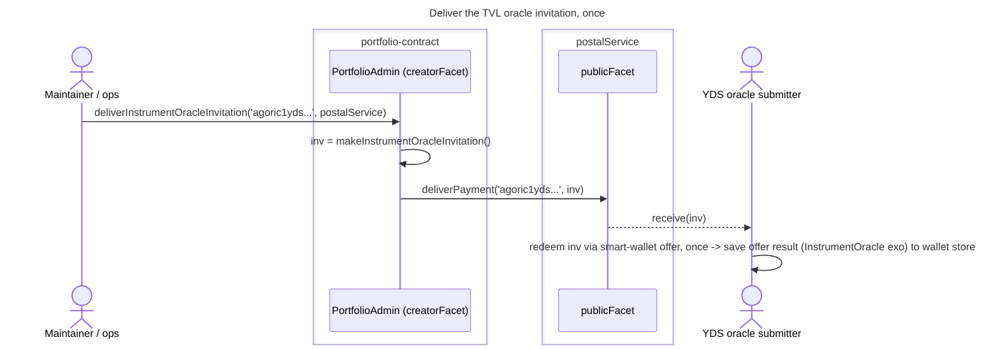
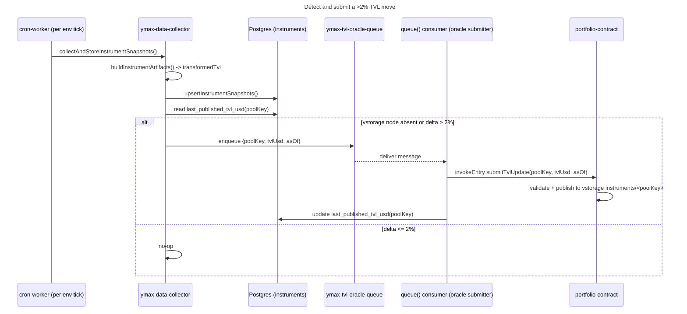

# Instrument Oracle Service

Answers [Linear AGO-1039](https://linear.app/agoric/issue/AGO-1039/tvl-oracle-service)
via [igoricbot/garden#8](https://github.com/igoricbot/garden/issues/8) (maintainer:
dckc): a lightweight, threshold-triggered on-chain oracle for per-instrument TVL.

## Implementation challenges

- **The submitter is a signing service, not just a queue consumer.** A
  Cloudflare Worker cannot call `invokeEntry` from the saved wallet-store entry
  without a narrowly-held Agoric signing capability, transaction submission,
  sequence management, and a reliable way to confirm inclusion. That boundary
  does not exist in YDS today and should not be added to the public request
  worker by accident.
- **Queue delivery and database updates are not atomic.** Cloudflare Queue,
  Agoric submission, and Postgres cannot share a transaction. The consumer must
  be idempotent across crashes before submission, after submission, and after
  chain inclusion but before updating `last_published_*`. The contract's
  monotonic `asOf` check makes duplicate delivery safe only if the consumer can
  distinguish "already accepted" from a permanent rejection.
- **Bootstrap and recovery need reconciliation.** Absence of
  `` ymax${'0'|'1'}.instruments.<poolKey> `` is the bootstrap signal: enqueue
  the first valid YDS observation immediately. If vstorage has a value but
  YDS's `last_published_*` fields are missing, recover the baseline from
  vstorage rather than treating the instrument as new.
- **The off-chain/on-chain numeric conversion must be explicit.** Spectrum and
  YDS use binary numbers, while the contract uses an exact `Nat` in whole USD.
  The producer must apply the agreed rounding rule before
  submission; threshold detection should remain in one representation.
- **`asOf` provides ordering, with a trusted operator clock.** The oracle
  supplies a suitable `asOf` time, and the contract requires each instrument's
  `asOf` value to increase. Mandate enforcement relies on the oracle to provide
  timely TVL updates; it does not apply a separate on-chain age bound or
  receipt timestamp.
- **Revocation changes operational state immediately.** Minting a replacement
  invitation revokes the active operator; explicit revocation also invalidates
  every previously minted, unredeemed invitation. Operations must therefore
  deliver and redeem replacements promptly during key rotation.
- **Instrument registries can drift.** YDS derives IDs from Spectrum while the
  contract accepts only its build-time `PoolPlaces`. A deployment order or
  compatibility check is needed when either registry changes.
- **Current collection is reference-first, not per-environment.** YDS computes
  instrument snapshots once in the reference database and replicates them to
  each environment. Oracle threshold detection must run after replication for
  each target environment because `ymax0`/`ymax1` have separate vstorage nodes,
  baselines, operators, and delivery outcomes.

## Questions to reduce risk

No unresolved design questions currently block this service. The operational
details called out under *Implementation challenges* still require tests and
runbooks.

## Problem

`yds/DESIGN.md` in `ymax-web` already flags the gap this closes:
`instrument_snapshots.totalValueLocked` is populated with a placeholder in its
"Open Questions" section, and "Enrich instrument snapshots with TVL... when
reliable upstream data is available" is listed under "Future Work". YDS's cron
collector (`yds/src/ymax-data-collector.ts`) in fact already computes a real
per-instrument TVL number every tick (`transformedTvl.amountUsd`/`amountUsdc`,
built in `buildInstrumentArtifacts` from Spectrum/Aave/Compound/Morpho data) and
stores it in Postgres. None of that reaches the chain: the portfolio-contract has
no on-chain notion of instrument TVL today, so nothing on-chain (or reading
vstorage) can see it.

AGO-1039's idea is a lightweight, threshold-triggered on-chain oracle: invite an
off-chain party the same way the contract already invites the planner and the EVM
Message Service (EMS), and have that party push an update only when an
instrument's TVL has moved more than 2%, rather than on every tick.

The deeper motivation is enforcement, not just visibility: per review feedback
on this design, the underlying want is for the contract itself to be able to
enforce a mandate such as "my position should be no more than X% of the vault
TVL". That requires TVL to be a value the contract's own control flow can read
and act on, not merely a number a UI displays; publishing to vstorage (Goals
below) is one way to make that value reachable, not the goal itself.

## Goals

- On-chain knowledge of each instrument's (`PoolKey`) latest `{tvl, asOf}`, fed
  by a trusted off-chain party holding a contract-issued invitation, following
  the same `makeXInvitation`/`deliverXInvitation` pattern the contract already
  uses for the planner, resolver, and EVM wallet handler. This is what a later
  TVL-relative mandate (for example, capping a position at some percentage of
  instrument TVL) would read; vstorage is the mechanism that gets the value
  there and makes it available to off-chain readers (the UI) too, not a goal
  in its own right.
- Push-based and threshold-gated (>2% change), to keep on-chain writes and gas
  cost bounded rather than proportional to YDS's per-minute cron cadence.
- Reuse YDS's existing Spectrum-ingestion cron and its existing Cloudflare Queue
  pattern (`ymax-email-queue`/`ymax-email-dlq`) for detection and submission,
  rather than standing up a new ingestion pipeline.

## Non-goals

- Replacing YDS's own Postgres `instrument_snapshots` history: the on-chain
  oracle carries only the latest value per instrument, not a time series.
- General collateral price-oracle infrastructure (agoric-sdk's older
  price-oracle/`fluxAggregator` machinery is retired); this is an advisory TVL
  signal, not a liquidation price feed.
- Changing planner/solver rebalancing policy, or enforcing any TVL-relative
  mandate (for example, capping a position at some percentage of instrument
  TVL), in response to a TVL delta. This design only gets the value on-chain;
  mandate enforcement is a separate code boundary and is not wired here, even
  when it ships in the same coordinated rollout.

## Components

### portfolio-contract (`agoric-sdk` `packages/portfolio-contract`)

Adds an `InstrumentOracle` exo next to the existing `Resolver` and `Planner`
exos in `portfolio.contract.ts`, redeemed once and then driven by direct
`invokeEntry` wallet actions rather than a continuing invitation per update
(per [maintainer feedback](https://github.com/igoricbot/garden/issues/8#issuecomment-5195701953)
on an earlier draft of this section; see Alternatives). The closest existing
analog is `deliverDelegation` in `portfolio.contract.ts`: its offer handler
returns the target object itself (`client`) as the offer result, rather than
an `invitationMakers` facet whose methods mint further invitations, so the
grantee redeems once and saves that offer result into its wallet store
(`client-utils`'s `reflectWalletStore`); every subsequent call is then a
direct `invokeEntry` bridge action against the saved entry, with no new
invitation or offer per call. The new `PortfolioAdmin` creatorFacet methods
`makeInstrumentOracleInvitation` / `deliverInstrumentOracleInvitation` still
mirror `makePlannerInvitation` / `deliverPlannerInvitation` (mint via
`zcf.makeInvitation`, deliver via the existing `PostalService` instance
already used for planner/resolver/EVM wallet handler delivery); only the
offer handler's result changes, from an `invitationMakers` object to the
`InstrumentOracle` exo instance itself.

Unlike the planner, resolver, or EVM wallet handler, whose delivered offer
results have no way to be cut off once redeemed, the single-operator trust
this design places in the oracle submitter (see Open questions) needs a way
to revoke that trust without a contract upgrade.
`deliverInstrumentOracleInvitation`'s offer handler wraps the
`InstrumentOracle` exo with `prepareRevocableMakerKit`'s `makeRevocable`
(`packages/base-zone/src/prepare-revocable.js`, the same helper Zoe's
ownable-object support uses in
`packages/zoe/src/contractSupport/prepare-ownable.js`) before returning it as
the offer result: the oracle submitter's saved wallet-store entry is that
revocable forwarder, not the exo instance directly. `PortfolioAdmin` keeps
its own reference to the same forwarder and gains a `revokeInstrumentOracle()`
creatorFacet method that calls the kit's `revoke(revocable)`; once revoked,
every subsequent `invokeEntry submitTvlUpdate` against the submitter's saved
entry fails, and YDS's queue consumer treats it like any other rejected
submission (retry, then dead-letter).

The creator facet maintains an oracle generation number. Minting a replacement
invitation advances it and revokes the active forwarder; explicit revocation
does the same. Each invitation captures its generation at mint time and can be
redeemed only while that generation remains current, so an unredeemed
invitation cannot restore authority after revocation or key rotation.

The `InstrumentOracle` exo exposes one method, `submitTvlUpdate(poolKey, tvlUsd,
asOf)`, where `tvlUsd` is an exact `Nat` in whole USD,
called directly via `invokeEntry` rather than through a fresh
per-submission invitation and offer (`poolKey` is the existing
`PoolKey`/`InstrumentId` type from `@agoric/portfolio-api`, the same
identifier YDS already derives via `deriveInstrumentComponents`). On each
invocation it:

- Rejects a `poolKey` outside the currently-registered `PoolPlaces` (no ad hoc
  instruments).
- Rejects `asOf` older than or equal to the last stored value for that
  `poolKey` (monotonic timestamp, protects against replayed/out-of-order queue
  messages).
- Writes `{tvlUsd, asOf}` to a new instance-scoped vstorage node,
  `E(storageNode).makeChildNode('instruments')` / `.makeChildNode(poolKey)`,
  via the same bespoke `publishStatus`/path-maker convention the contract
  already uses (`type-guards.ts`'s `makePortfolioPath`/`makeFlowPath`,
  `portfolio.exo.ts`'s `providePathNode`) rather than the smart-wallet's
  generic `offerToPublicSubscriberPaths` helper, which this package does not
  use. Concretely this means adding an `instruments` entry (and a new
  `StatusFor['instrument']` member) to `PortfolioPublishedPathTypes` in
  `portfolio-api/src/types.ts`, following its existing
  `` ymax${'0'|'1'}.<segment>... `` naming (`.portfolios`, `.pendingTx`,
  `.evmWallets`, and so on), for example `` ymax0.instruments.<instrumentId> ``.
  `TVL`/`totalValueLocked` and any notion of instrument value do not exist
  anywhere on the contract side today (`portfolio-api`'s existing
  `InstrumentId` is just a mnemonic pool identifier, and
  `StatusFor['position']` carries only cumulative `totalIn`/`totalOut`, not a
  current valuation): this design introduces the concept fresh rather than
  extending an existing field.
- On the deploy side, `portfolio-deploy/src/ymax-deliver-invitation.ts`
  extends its `InvitationKind` union (today `'planner' | 'resolver' |
  'ownerProxy'`, where `'ownerProxy'` is the deploy-script name for the EMS/
  EVM-wallet-handler invitation) with a new `'instrumentOracle'` entry, and
  `portfolio-deploy/src/invite-ems.ts` gets an `instrumentOracle`-flavored sibling
  script for the one-time operational delivery to YDS's oracle-submitter
  address.

The 2% threshold decision itself is made off-chain (below); the contract does
not re-derive it, only validates `asOf` ordering and instrument identity.

Every later update reuses that one saved entry via `invokeEntry` (see the YDS
sequence diagram below); there is no second diagram for "submit an update"
that mints another invitation.

### YDS (`ymax-web` `yds/`)

No new ingestion pipeline: the cron worker already computes `transformedTvl`
per instrument in `buildInstrumentArtifacts`, writes it to the reference
Postgres database, and then `replicateReferenceData` copies snapshots to each
environment database. After replication, run threshold detection once per
target environment: diff the latest replicated value against the last value
that environment published on-chain (tracked in a new Postgres column, e.g.
`instruments.last_published_tvl_usd`/`last_published_at`, not
`instrument_snapshots`, since that table is the append-only history). If the
pool's vstorage node is absent, enqueue the first valid observation immediately.
Otherwise, when `abs(new - lastPublished) / lastPublished > 0.02`, enqueue
`{poolKey: instrumentId, tvlUsd, asOf: takenAt}` onto a new Cloudflare Queue,
`ymax-tvl-oracle-queue` (with a `ymax-tvl-oracle-dlq` dead-letter queue),
mirroring the existing `EMAIL_QUEUE` producer/consumer split in `src/index.ts`.
YDS applies `Math.round` before threshold comparison; the queue carries that
whole-dollar `Nat` as a base-10 string, and the signer converts it to a bigint
before wallet marshalling.
The threshold is symmetric and strict: publish when
`abs(new - previous) / previous > 0.02`. No hysteresis is added. When the
previous value is zero, publish any different value and skip zero-to-zero.

Queue production is gated by durable per-environment oracle lifecycle state in
Postgres. Deploying YDS code or configuring the queue does not enable
production. An operational delivery records the invitation as issued; only
after the submitter has redeemed it and saved the `instrumentOracle` wallet
entry does YDS record `acceptedAt` and permit enqueueing. Revocation or the
start of key rotation disables enqueueing before the old grant is revoked;
successful redemption of the replacement re-enables it. Threshold detection
may continue while disabled, but it must not enqueue messages.

A new `queue()` consumer (either a handler on the same worker, matching the
email-queue precedent, or a small dedicated worker if the signing key should be
isolated from the public-facing request worker) is the "invited party" from the
issue: on startup it redeems the delivered invitation once and holds the
resulting wallet-store entry for the `InstrumentOracle` offer result, then turns each
queue message into an `invokeEntry` call against that saved entry, not a fresh
smart-wallet offer. Failed submissions retry with backoff (same shape as the
email queue) before landing in the dead-letter queue; `last_published_tvl_usd`
only updates after observing vstorage, so a dropped submission is retried on
the next >2% check rather than silently lost. Confirmation reads
`` ymax${'0'|'1'}.instruments.<poolKey> `` until its `asOf` is at least the
submitted `asOf`. Equality also requires the submitted `tvlUsd`; a greater
`asOf` means a newer update superseded this message and confirms it without
allowing the database baseline to move backward. RPC/follower lag is handled by
bounded polling followed by queue retry. Transaction inclusion and wallet
invocation results remain useful diagnostics, but are not the success
criterion.

The submitter follows EMS's existing private-worker precedent: YDS reaches a
narrow `WorkerEntrypoint` through a service binding; the private worker selects
an environment-specific mnemonic and RPC endpoint, marshals an `invokeEntry`
bridge action as smallcaps capdata, wraps it in `MsgWalletSpendAction`, and uses
`makeStargateClientKit` to sign and broadcast it. The oracle method is a narrow
`submitTvlUpdate` API targeting the saved `instrumentOracle` wallet entry; it
does not reuse EMS's public `submitPermit` method or its EIP-712 validation path.

### UI (`ymax-web` `ui/`)

Today's `/instruments` view is entirely YDS/Postgres/Spectrum-derived. Once the
on-chain node exists, `/instruments` can add `onChainTvlUsd`/`onChainAsOf`
sourced from vstorage (the same way other UI-facing status already reads
vstorage), giving the user a chain-verifiable figure alongside YDS's richer,
continuously-updated Spectrum-derived number. This is additive; no existing
field changes shape.

### planner (`services/ymax-planner` + on-chain `Planner` exo)

Unaffected in v1. The planner already pulls TVL/APY directly from Spectrum via
its own GraphQL client for the solver's edge capacities
(`plan-solve.ts`/`solver-approach-design.md`), and its on-chain `Planner` exo
(`preparePlanner` in `planner.exo.ts`) is scoped per-portfolio
(`getPortfolioPlanner(portfolioId)`), not per-instrument, so it cannot host a
contract-instance-global oracle write without changing that scoping (see
Alternatives). Once the on-chain instrument TVL exists, the planner could
cross-check a just-dropped TVL as a signal to cap allocation into that pool.
This is flagged as a follow-on, not required for v1.

### EMS (EVM Message Service)

Out of scope. EMS verifies EIP-712 signatures and relays EVM-wallet operations
(deposits, withdrawals, permits); it has no relationship to instrument TVL.
Named here only because the issue asked every component be addressed.

## Testing obligations

Per [review](https://github.com/igoricbot/agoric-sdk/pull/5#discussion_r3723281146),
testing obligations per repo, mirroring the *Components* breakdown above:

### portfolio-contract (`agoric-sdk`)

- `submitTvlUpdate` validation, alongside `resolver.exo.test.ts` and
  `planner.exo.test.ts` as the nearest existing precedent for exo-method
  tests: rejects a `poolKey` outside `PoolPlaces`; rejects `asOf` older than
  or equal to the last stored value for that `poolKey`; accepts a valid
  `{poolKey, tvlUsd, asOf}` and publishes it to
  `` ymax${'0'|'1'}.instruments.<poolKey> ``.
- invitation delivery, mirroring `delegation.test.ts` /
  `portfolio.contract.planner.test.ts`: `makeInstrumentOracleInvitation` /
  `deliverInstrumentOracleInvitation` mint and deliver correctly, the
  grantee's redeemed offer result is the `prepareRevocableMakerKit`-wrapped
  forwarder (not the `InstrumentOracle` exo directly), and that saved wallet
  entry accepts repeated `invokeEntry submitTvlUpdate` calls with no new
  invitation or offer.
- revocation: after `PortfolioAdmin.revokeInstrumentOracle()`, a subsequent
  `invokeEntry submitTvlUpdate` against the submitter's previously-saved
  entry fails.
- published-type coverage: `StatusFor['instrument']` and the new
  `instruments` entry in `PortfolioPublishedPathTypes` (`portfolio-api/src/types.ts`)
  round-trip through the contract's existing type guards.
- upgrade compatibility: an existing contract instance with no `instruments`
  vstorage node remains valid until the first `submitTvlUpdate`.
- deploy-side: `portfolio-deploy`'s `instrumentOracle` `InvitationKind` and its
  `invite-ems.ts`-sibling delivery script exercise the one-time operational
  delivery path (matching however the existing `'planner'`/`'resolver'`/
  `'ownerProxy'` kinds are covered there today).

### YDS (`ymax-web` `yds/`)

- threshold detection: the new diff-against-`last_published_tvl_usd` step
  enqueues on `abs(new - lastPublished) / lastPublished > 0.02` and is a
  no-op at or below it. The first valid observation is enqueued when the
  pool's vstorage node is absent; if vstorage is present but the database
  baseline is missing, YDS restores the baseline from vstorage.
- queue behavior mirroring the existing `EMAIL_QUEUE` producer/consumer
  tests in `src/index.ts`: `ymax-tvl-oracle-queue` message shape
  (`{poolKey, tvlUsd, asOf}`), the `queue()` consumer's `invokeEntry
  submitTvlUpdate` call against its saved wallet-store entry, retry-with-backoff
  on failure, and eventual delivery to `ymax-tvl-oracle-dlq`.
- durability: `last_published_tvl_usd`/`last_published_at` update only after
  the `invokeEntry` call confirms, so a crash or dropped submission between
  enqueue and confirmation is retried (re-diffed and re-enqueued) rather than
  silently marked published.

### UI (`ymax-web` `ui/`)

- `/instruments` renders the new `onChainTvlUsd`/`onChainAsOf` fields
  (sourced from vstorage) alongside the existing YDS/Postgres/Spectrum-derived
  figure, and existing fields on that view are unchanged in shape (regression
  coverage for the additive change called out in *Components* above).

### planner (`services/ymax-planner`)

None. Unaffected in v1 (*Components* above); no new tests are implied until
the flagged follow-on (using on-chain TVL as a solver signal) is itself
designed and scheduled.

### EMS

None. Out of scope (*Components* above).

## Alternatives considered

- **On-chain interchain query of the underlying protocols directly**, skipping
  an off-chain relay. Rejected: Spectrum already aggregates TVL across many
  protocols and chains; re-deriving that on-chain via ICQ would duplicate work
  YDS already does, and the issue explicitly asks for an invited off-chain
  party subscribing via YDS, not a new on-chain query path.
- **Have the planner submit TVL updates itself**, since it already talks to
  Spectrum. Rejected: the on-chain `Planner` exo is minted once per portfolio
  (`getPortfolioPlanner(portfolioId)`) and, after a one-time invitation
  redemption, is driven by direct `invokeEntry` wallet actions
  (`resolvePlan`/`rejectPlan`/`rebalance`) whose validation
  (`vetNoNewPositions`) assumes portfolio-scoped writes. TVL is a
  contract-instance-global fact, not a per-portfolio one; conflating the two
  would require loosening that scoping for an unrelated purpose. A new,
  contract-instance-global `InstrumentOracle` exo is the closer structural fit; it is
  redeemed once and then driven by `invokeEntry` the same way the `Planner`
  exo itself is (see Components above).
- **Continuing invitation per submission**, following the resolver's
  `invitationMakers` + per-update-offerArgs pattern (`SettleTransaction()`, a
  fresh single-use continuing invitation minted per call, validated against a
  declared `TypedPattern`). This is how `submitTvlUpdate` was originally
  drafted here. Rejected on
  [review](https://github.com/igoricbot/garden/issues/8#issuecomment-5195701953):
  the oracle submitter is a single long-lived off-chain party pushing a
  periodic value update, not a one-shot counterparty settling a transaction;
  minting and redeeming a fresh invitation (with its own payment/exit
  handling) for every push adds ceremony the resolver's use case needs but
  this one does not. `invokeEntry` against a once-redeemed offer result,
  matching the `Planner` and delegation-grantee precedent, fits better.
- **Publish on every cron tick instead of gating on 2%.** Rejected per the
  issue's explicit threshold ask, to bound on-chain write/gas cost.

## Open questions

- Exact units: `tvlUsd` as a plain number (as YDS already computes it) versus a
  `Nat`. Resolved: an unbranded `Nat` in whole USD. It is
  exact and does not incorrectly claim an ERTP brand for Spectrum's
  USD-denominated aggregate. YDS must explicitly round and convert its source
  number before submission.
- Single-operator trust for v1 (matching how the resolver, planner, and EMS
  already each run as a single off-chain key) versus a multi-operator/median
  design from day one. Resolved: single-operator for v1 is appropriate, on the
  condition that the grant be revocable; see *Components* above for the
  `prepareRevocableMakerKit`-wrapped offer result and the new
  `revokeInstrumentOracle()` creatorFacet method this adds.
- Whether every `PoolKey` in `PoolPlaces` gets an on-chain node, or only a
  maintainer-curated subset, given per-instrument vstorage cost. Resolved:
  every currently-registered `PoolKey` — data submitted about any valid key
  should get published. `submitTvlUpdate`'s existing "reject an unregistered
  `poolKey`" check (*Components* above) is the only gate; there is no separate
  curation list.
- Whether the planner integration (using on-chain TVL as a solver signal) is
  worth a follow-on design once this ships, or the UI-only signal is
  sufficient on its own. Resolved: no, not worth a follow-on design; the
  planner section above ("Unaffected in v1") stands without a flagged future
  step.
- `TvlOracle` versus `InstrumentOracle` as the facet/invitation name: dckc noted
  other per-instrument data besides TVL may be worth carrying through the same
  invitation in due course
  ([comment](https://github.com/igoricbot/garden/issues/8#issuecomment-5195664986)).
  Resolved: `InstrumentOracle`, applied throughout *Components* above.
  `submitTvlUpdate` keeps its TVL-specific name for v1's only supported
  update; a future non-TVL update would add a sibling `submit*Update` method
  to the same exo rather than renaming this one.
- Method casing: why `SubmitTvlUpdate` and not `submitTvlUpdate`, per
  [review](https://github.com/igoricbot/agoric-sdk/pull/5#discussion_r3723276827).
  No particular reason; the capitalized form was a holdover from drafting
  this method alongside `SettleTransaction()` (the resolver's
  invitationMakers-style continuing-invitation method; see *Alternatives*).
  Once `submitTvlUpdate` moved to the redeem-once/`invokeEntry` pattern
  instead, the closer precedent became `resolvePlan`/`rejectPlan`/`rebalance`
  (the `Planner` exo and `deliverDelegation`'s client, both driven by
  `invokeEntry`), which are all lowercase-first. Resolved: `submitTvlUpdate`,
  applied throughout this document.

## References

- `packages/portfolio-contract/src/portfolio.contract.ts`:
  `makePlannerInvitation`/`deliverPlannerInvitation`, `PortfolioAdmin`
  creatorFacet, `publishStatus`.
- `packages/portfolio-contract/src/resolver/resolver.exo.ts`: `prepareResolverKit`
  (the continuing-invitation-per-update pattern this design no longer follows;
  kept as a reference for contrast, see Alternatives).
- `packages/portfolio-contract/src/portfolio.contract.ts`: `deliverDelegation`
  (the redeem-once, offer-result-is-the-object pattern `submitTvlUpdate`
  follows instead).
- `packages/client-utils/src/wallet-store.ts`: `reflectWalletStore`,
  `WalletStoreEntryProxy` (client-side shape of a saved offer result driven by
  `invokeEntry`).
- `packages/portfolio-contract/src/planner.exo.ts`: `preparePlanner` (shows why
  the per-portfolio scoping doesn't fit a contract-instance-global oracle, and
  is itself driven by `invokeEntry` after a one-time redemption).
- `packages/portfolio-deploy/src/ymax-deliver-invitation.ts`,
  `invite-ems.ts`: deploy-side `InvitationKind` union and the one-time
  operational delivery scripts this design extends with an `instrumentOracle` kind.
- `packages/base-zone/src/prepare-revocable.js`: `prepareRevocableMakerKit`
  (`makeRevocable`/`revoke`), the revocation mechanism
  `deliverInstrumentOracleInvitation` wraps its offer result in.
- `packages/zoe/src/contractSupport/prepare-ownable.js`: existing consumer of
  `prepareRevocableMakerKit`, the precedent for wrapping a delivered exo in a
  revocable forwarder.
- `packages/portfolio-api/src/types.ts`: `StatusFor`,
  `PortfolioPublishedPathTypes` (the existing `` ymax${'0'|'1'}.<segment> ``
  vstorage path convention the new `instruments` node follows).
- `packages/portfolio-contract/docs-design/evm-wallet.md`,
  `agent-delegation.md`: existing invitation-delivery design style this
  document follows.
- `yds/DESIGN.md`: Open Question 2 and the Future Work item this design
  answers; the existing `ymax-email-queue`/`ymax-email-dlq` Cloudflare Queue
  pattern this design's `ymax-tvl-oracle-queue` mirrors.
- `yds/src/ymax-data-collector.ts`: `buildInstrumentArtifacts`,
  `upsertInstrumentSnapshots`, `collectAndStoreInstrumentSnapshots` (the
  existing per-tick TVL computation this design hooks into rather than
  replacing).
