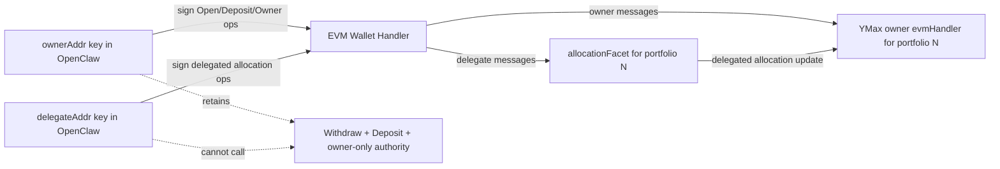
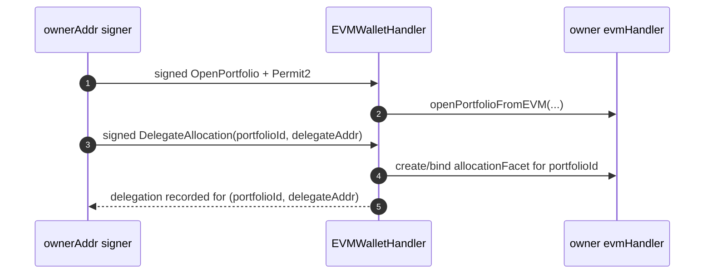
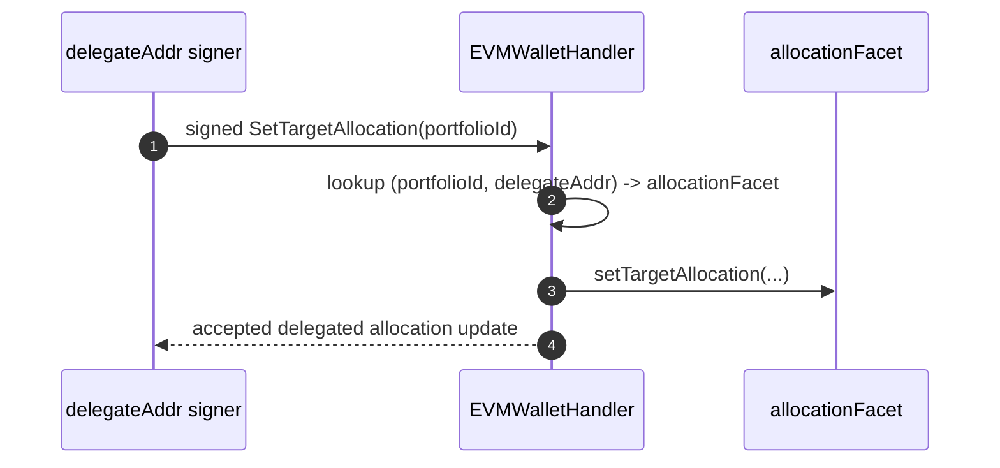
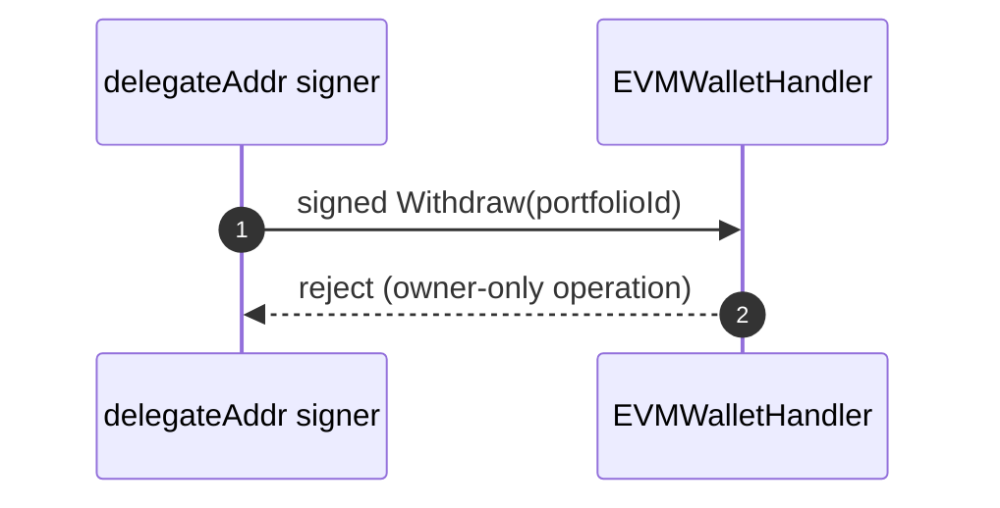

# OpenClaw YMax Delegated Rebalancing Plan

Status: Draft sketch
Audience: operator using OpenClaw keys for both owner and delegate addresses

## 1. Goal

Set up a YMax portfolio, fund it, choose instruments, and delegate rebalancing authority to a separate address controlled by OpenClaw, while keeping withdrawal/admin authority with the owner.

## 2. Current Design

### 2.1 Scope

In scope:
- Open a portfolio and seed initial funds
- Establish target allocation and rebalance policy
- Delegate allocation/rebalance control to a separate address
- Validate delegated permissions with dry runs
- Upgrade/deploy required components on devnet for alpha testing
  - `@agoric/portfolio-api` operation support
  - delegated-operation submission path via either:
    - YDS/EMS backend support for delegated operations, or
    - direct operator submission in a `ymax-tool` style flow (tool acts as EMS)
  - chain-side handler/contract support

Out of scope:
- Mainnet rollout planning/execution
- New protocol integrations
- Offchain strategy optimization logic

### 2.2 Assumptions

- OpenClaw can sign transactions for both:
  - `ownerAddr` (portfolio owner)
  - `delegateAddr` (rebalance executor)
- YMax instance is already deployed and reachable via EIP-712 message flow.
- Operator can invoke:
  - `openPortfolioFromEVM`
  - `evmHandler` operations (`Deposit`, `SetTargetAllocation`, `Rebalance`, `Withdraw`, `DelegateAllocation`, `RevokeAllocation`)
  - message relay via `EVMWalletMessageHandler.handleMessage(...)`

### 2.3 Authority Model

### 2.4 Core Sequences

#### 2.4.1 Open Portfolio and Delegate

#### 2.4.2 Delegated SetTargetAllocation

#### 2.4.3 Delegated Withdraw Fails

### 2.5 Design Constraints

- Delegated authority is portfolio-scoped.
- Delegate cannot add new positions/instruments via delegated allocation updates.
- Owner-only operations remain unavailable to delegated signers.

### 2.6 Cardinalities

1. `ownerAddress -> many portfolioIds` (0..N).
2. `portfolioId -> exactly one ownerAddress` (assuming IDs are never reused).
3. `portfolioId -> many allocator addresses`.
4. `allocatorAddress -> many portfolioIds`.

### 2.7 Code Surfaces

1. `src/portfolio.exo.ts`
- Contains owner and delegated capability surfaces.
- Keeps delegated behavior constrained relative to owner behavior.

2. `src/evm-wallet-handler.exo.ts`
- Handles `DelegateAllocation` and `RevokeAllocation` operations.
- Binds/revokes delegated `allocationFacet` capability for `(portfolioId, agentAddress)`.
- Routes delegated signer operations via bound delegated capability.

3. `tools/portfolio-actors.ts`
- Provides helpers for owner delegate-management messages and delegated allocation updates.

4. `tools/submit-evm-allocation.ts`
- OpenClaw-oriented CLI to submit signed allocation updates to EMS `/evm-operations`.

## 3. Target Goals

### 3.1 Functional Goals

- [ ] Portfolio exists, funded, and holds selected instruments.
- [x] `delegateAddr` can update target allocation on delegated portfolio.
- [x] `delegateAddr` can trigger delegated rebalance-start flow as designed.
- [x] `delegateAddr` cannot invoke owner-only operations.
- [x] Owner can still execute full-authority operations.

### 3.2 Operational Goals

- [x] OpenClaw can run setup + delegated updates repeatably via CLI.
- [ ] End-to-end delegated submission path works in target env (via EMS/YDS or direct operator-as-EMS tooling).
- [ ] `ymax-tool`-style direct delegated submission tooling (operator acts as EMS) is implemented and validated.
- [ ] Delegation metadata and outcomes are observable/auditable.

## 4. Plan

### Phase 0: Address and policy prep
- Confirm and record:
  - `ownerAddr`
  - `delegateAddr`
  - funding source and initial USDC amount
- Pick 2-4 instruments for initial rollout (example: USDN, Aave, Compound).
- Define policy:
  - target weights
  - rebalance tolerance bands
  - max size per rebalance operation
  - cooldown and fail-safe thresholds

### Phase 1: Open and fund portfolio
- From `ownerAddr`, submit signed `OpenPortfolio` via EVM wallet handler.
- Fund via Permit2 deposit at open, then additional signed `Deposit` ops as needed.
- Verify published portfolio state and balances.

### Phase 2: Set initial allocation
- From `ownerAddr`, submit first rebalancing flow into selected instruments.
- Keep first allocation simple to validate plumbing.

### Phase 3: Delegate control
- From `ownerAddr`, submit signed `DelegateAllocation` for `portfolioId`.
- Verify `(portfolioId, delegateAddr)` resolves delegated capability.
- Record delegation metadata.

### Phase 4: Permission validation
- Positive:
  - delegated `SetTargetAllocation`
  - delegated rebalance-start
- Negative:
  - delegated `Withdraw` must fail
- Confirm owner retains full-authority actions.

### Phase 5: Integration validation
- Validate end-to-end delegated path using one of:
  - signer -> EMS `/evm-operations` -> handler -> contract behavior
  - signer -> operator tool (acts as EMS) -> handler -> contract behavior
- Validate revoke path using signed `RevokeAllocation`.
- Validate operator tooling (`tools/submit-evm-allocation.ts`) against target env.

### Phase 6: Production operation
- Increase capital only after Phase 5 passes.
- Run delegated target updates on cadence and/or drift thresholds.
- Monitor:
  - failed target update attempts
  - failed rebalance attempts
  - allocation drift
  - unexpected delegation changes

## 5. Dependencies and Risks

### 5.1 Upgrade Dependency

- `DelegateAllocation` requires a delegated-operation submission path plus chain-side support.
- Two supported integration paths:
  1. EMS/YDS path:
     - `@agoric/portfolio-api` operation/schema updates
     - YDS/EMS rebuild + deploy against updated API
     - chain-side EVM handler / contract support deployment
  2. Direct operator path (`ymax-tool` style, tool acts as EMS):
     - chain-side EVM handler / contract support deployment
     - operator tooling capable of submitting validated signed operations directly
- Expected symptom on EMS/YDS path when backend is not upgraded: EMS `400` with `Unknown Ymax operation type: DelegateAllocation`.

### 5.2 Risks and Mitigations

- Risk: delegate receives broader authority than intended.
  - Mitigation: keep delegated capability surface constrained; keep owner-only paths separate.
- Risk: rebalance flow complexity causes failed transactions.
  - Mitigation: start with small size and minimal instrument set.
- Risk: drift accumulates between rebalance windows.
  - Mitigation: combine cadence-based and threshold-based triggers.

## 6. Runbook Checklist

- [ ] Wallet context switched to `ownerAddr`
- [ ] Signed `OpenPortfolio` confirmed
- [ ] Initial funding tx confirmed
- [ ] Initial allocation rebalance confirmed
- [ ] Signed `DelegateAllocation` confirmed for `delegateAddr`
- [ ] Wallet context switched to `delegateAddr`
- [ ] Delegate `SetTargetAllocation` smoke test passed
- [ ] Delegate rebalance-start smoke test passed
- [ ] Delegated `Withdraw` negative test passed
- [ ] Wallet context switched to `ownerAddr`
- [ ] Owner rebalance smoke test passed
- [ ] Signed `RevokeAllocation` smoke test passed
- [ ] Monitoring alerts configured
