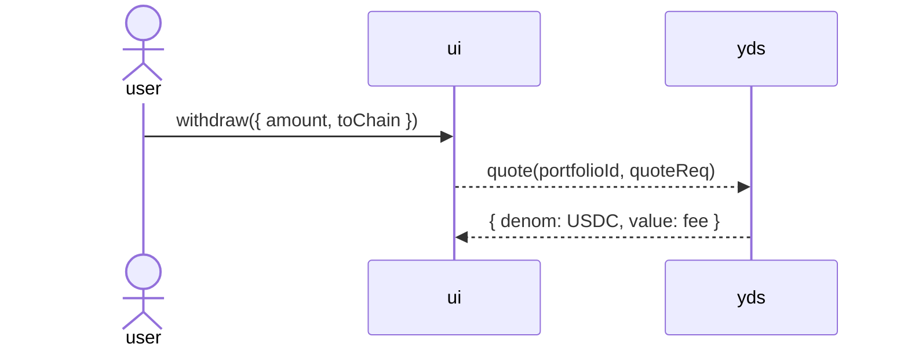
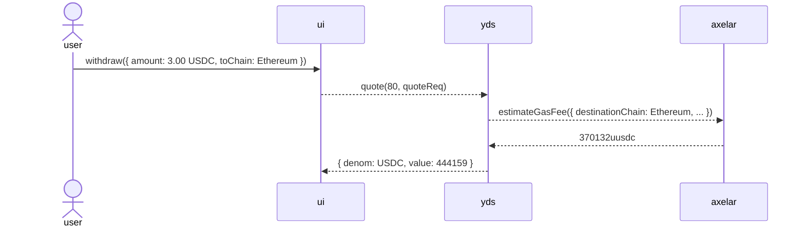
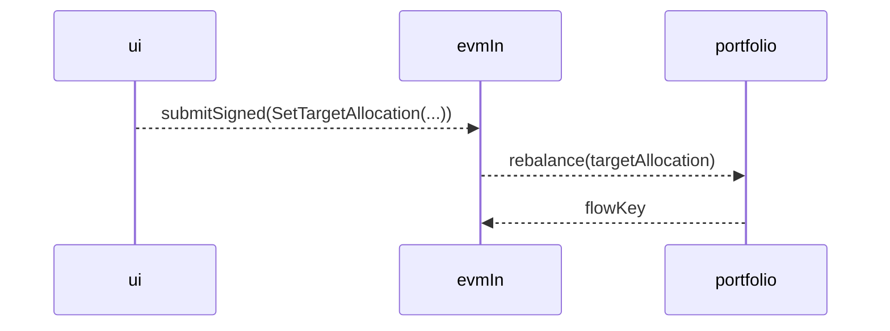

# Sequence-diagram actor simulations

## Pattern

> Each diagram arrow is represented as a method call on the receiving object.

A sequence diagram can be made executable by representing each participant as a
small JavaScript object, usually produced by a `make...` closure. The object's
methods are the messages that the participant can receive. Closed-over state
models the participant's local knowledge.

For example, this Mermaid:



corresponds to an object graph shaped like:

```ts
const makeUI = (yds, portfolioId) =>
  harden({
    async withdraw({ amount, toChain }) {
      const quoteReq = { type: 'withdraw', amount, toChain };
      const fee = await yds.quote(portfolioId, quoteReq);
      return { denom: 'USDC', value: fee };
    },
  });
```

The important correspondence is:

- `user->>ui: withdraw(...)` becomes `ui.withdraw(...)`.
- `ui-->>yds: quote(...)` becomes `yds.quote(...)`.
- The return arrow is normally the JavaScript return value.
- Each actor derives messages only from its local state and values received in
  earlier messages. Scenario knowledge should not be smuggled into a downstream
  actor.

This is more than using mocks to isolate a unit. The actor objects collectively
form an executable model at the same abstraction level as the sequence diagram.
The model is useful for discovering missing participants, misplaced
responsibilities, underspecified messages, and incorrect ordering before those
decisions are embedded in contract or service code.

## Semantic decompilation

An actor simulation can also serve as a _semantic decompilation_ of a protocol
design. Rather than reproduce the wire representation, it asks what each
endpoint, identifier, bearer artifact, and signed message means in terms of
designation and authority, then reconstructs an object-capability graph with
those semantics.

In this perspective:

- an endpoint or public identifier designates an object that accepts the
  corresponding messages;
- a bearer artifact becomes a reference to a facet exposing only the authority
  represented by possession of that artifact;
- an unforgeable, single-use artifact becomes a one-shot continuation;
- a signed statement becomes an object whose provenance a separate verifier
  facet can recognize;
- protocol data stays explicit when it binds exchanges or constrains authority,
  but routing data already expressed by the destination reference can disappear.

Each non-return diagram arrow is consequently a method call on the receiving
object. The arrow head carries the destination designation, while the label
describes the message and security-relevant data. Return arrows normally remain
language-level return values.

This change of representation makes authority flow directly reviewable: which
actor creates an authority, who receives it, what operations it permits, and
whether it can be replayed or widened. It can expose a design that accidentally
places authority on a public facet, trusts input that should only select among
already authorized choices, or gives a callee more capability than it needs.

Semantic decompilation is not a claim that a URL or token is literally an
object capability, nor that the simulation is wire-compatible. A simulation
may use object identity in place of production cryptography and direct calls in
place of transport. It should preserve the protocol's intended authority and
information flow while stating such substitutions explicitly.

## Recording the diagram

The stronger form of the pattern records each send as Mermaid-compatible text:

```ts
const makeSequenceDiagram = () => {
  const arrows: string[] = [];
  return harden({
    as(from: string) {
      return harden({
        cont(to: string, label: string) {
          arrows.push(`${from}-->>${to}: ${label}`);
        },
      });
    },
    snapshot: () => harden([...arrows]),
  });
};
```

A sender records the arrow immediately before calling the receiver:

```ts
const makeUI = (viz, yds) =>
  harden({
    async openPendleDiscovery() {
      viz.cont('yds', 'getInstrumentCatalog()');
      const catalog = await yds.getInstrumentCatalog();
      return catalog;
    },
  });
```

Snapshotting the resulting lines makes diagram drift reviewable:

```text
ui-->>yds: getInstrumentCatalog()
yds-->>pendleApi: getMarketData(0xPendleMarket)
pendleApi-->>yds: marketData1
```

The recorder is intentionally small. It is not an application tracing
framework; it is a test aid for keeping a design model and its diagram mutually
derivable.

## Portfolio-contract examples

The excerpts below omit type annotations and incidental validation for
readability. The linked commit paths are the exact sources.

### User-fee withdraw

[PR #12544, `spike: ymax user fees`](https://github.com/Agoric/agoric-sdk/pull/12544)
is the clearest portfolio-contract example of the pattern.

At commit
[`d64753617115db39a89be6db46d0d12f834c2f1a`](https://github.com/Agoric/agoric-sdk/commit/d64753617115db39a89be6db46d0d12f834c2f1a),
the simulation in
[`packages/portfolio-contract/test/user-fees-sim.test.ts`](https://github.com/Agoric/agoric-sdk/blob/d64753617115db39a89be6db46d0d12f834c2f1a/packages/portfolio-contract/test/user-fees-sim.test.ts)
models the user, UI, YDS, EMS, EVM handler, portfolio, planner, orchestration,
EVM wallet, Permit2, and USDC as objects made by closures.

The design diagram includes:



The corresponding closures call the receiving APIs:

```ts
const makeYDS = vstorage =>
  freeze({
    async quoteWithdraw({ owner, amount, toChain }) {
      const portfolioId = vstorage.getPortfolioId(owner);
      // Run the planning algorithm in preview mode and return its fee.
      return sumUserFees(plannerAlgorithm({ amount, toChain }, 'yds'));
    },
  });

const makeUI = (yds, ems) =>
  freeze({
    connectWallet(owner) {
      return freeze({
        quoteWithdraw(args) {
          return yds.quoteWithdraw({ owner, ...args });
        },
        submitWithdraw(t, signedMessage) {
          return ems.handleMessage(t, owner, signedMessage);
        },
      });
    },
  });
```

The associated diagram markup is in
[`packages/portfolio-contract/docs-design/user-fees.md`](https://github.com/Agoric/agoric-sdk/blob/d64753617115db39a89be6db46d0d12f834c2f1a/packages/portfolio-contract/docs-design/user-fees.md).
The simulation snapshots the same messages in
`packages/portfolio-contract/test/snapshots/user-fees-sim.test.ts.snap`.

### Pendle

[PR #12578, the Pendle USDC spike](https://github.com/Agoric/agoric-sdk/pull/12578)
makes the rule explicit in its file-level documentation:

> each diagram arrow is represented as a method call on the receiving actor
> object, except return arrows

The originating commit is
[`8adcd72b939ffae71773ae5d1a526ab7def53513`](https://github.com/Agoric/agoric-sdk/commit/8adcd72b939ffae71773ae5d1a526ab7def53513),
and the simulation is
[`packages/portfolio-contract/test/pendle-sim.test.ts`](https://github.com/Agoric/agoric-sdk/blob/8adcd72b939ffae71773ae5d1a526ab7def53513/packages/portfolio-contract/test/pendle-sim.test.ts).

It models UI, EVM ingress, YDS, the planner, Pendle's backend API, vstorage,
portfolio, and remote account actors. For example:

```ts
const makeEMSIngress = (viz, getPortfolio) =>
  harden({
    async submitSignedSetTargetAllocation(args) {
      const portfolio = getPortfolio(args.portfolio);
      viz.cont('portfolio', `rebalance(${viz.label(args.targetAllocation)})`);
      return portfolio.rebalance(args.targetAllocation);
    },
  });
```

This mirrors markup such as:



The test's `makeSequenceDiagram()` recorder snapshots Mermaid-style arrow lines
in
`packages/portfolio-contract/test/snapshots/pendle-sim.test.ts.snap`. The design
context is in
[`packages/portfolio-contract/docs-design/pendle-design.md`](https://github.com/Agoric/agoric-sdk/blob/bf5962df86777e92a5c1aeb29db9a199488a09a2/packages/portfolio-contract/docs-design/pendle-design.md),
added in commit
[`bf5962df86777e92a5c1aeb29db9a199488a09a2`](https://github.com/Agoric/agoric-sdk/commit/bf5962df86777e92a5c1aeb29db9a199488a09a2).

### Initial USDN position

The earlier, lighter-weight ancestor is
[PR #11439, `feat: open portfolio with USDN position`](https://github.com/Agoric/agoric-sdk/pull/11439).
Its review order starts with
`packages/portfolio-contract/test/open-pos-usdn.mmd`, followed by the
"actor/story style contract test" in
`packages/portfolio-contract/test/portfolio.contract.test.ts`.

Commit
[`3485344aaeaf40c9c3da71c3fdf4ba4ce92ce4a8`](https://github.com/Agoric/agoric-sdk/commit/3485344aaeaf40c9c3da71c3fdf4ba4ce92ce4a8)
factored out:

- `makeTrader()` in
  `packages/portfolio-contract/test/portfolio-actors.ts`;
- `makeWallet()` in
  `packages/portfolio-contract/test/wallet-offer-tools.ts`;
- `makeUSDNIBCTraffic()` in
  `packages/portfolio-contract/test/mocks.ts`.

For example:

```ts
export const makeTrader = (wallet, instance) => {
  let nonce = 0;
  return harden({
    openPortfolio(t, give) {
      return wallet.executeOffer({
        id: `openP-${(nonce += 1)}`,
        invitationSpec: {
          source: 'contract',
          instance,
          publicInvitationMaker: 'makeOpenPortfolioInvitation',
        },
        proposal: { give },
      });
    },
  });
};
```

That closure represents the diagram's trader actor, while the contract test
executes the story. Unlike the later user-fee and Pendle simulations, it does
not reify every participant or generate Mermaid arrow snapshots.

[PR #11522](https://github.com/Agoric/agoric-sdk/pull/11522), at commit
[`d04ee06264d07efa2d0c8f5ce37a1038429355ee`](https://github.com/Agoric/agoric-sdk/commit/d04ee06264d07efa2d0c8f5ce37a1038429355ee),
documents the relationship among:

- `packages/portfolio-contract/test/open-pos-usdn.mmd`;
- `packages/portfolio-contract/test/portfolio.flows.test.ts`;
- `packages/portfolio-contract/test/portfolio.contract.test.ts`;
- `packages/portfolio-contract/src/portfolio.flows.ts`.

It notes that the diagram arrows map to flow methods in the same sequence.

## Earlier Agoric precedents

The portfolio-contract lineage follows two earlier orchestration experiments.

### Fast USDC participants

[PR #10254](https://github.com/Agoric/agoric-sdk/pull/10254), commit
[`368cbeb7de10f4e70caa615d76c2d508bc997362`](https://github.com/Agoric/agoric-sdk/commit/368cbeb7de10f4e70caa615d76c2d508bc997362),
introduced
`packages/orchestration/test/examples/quickSend-tx.test.ts`. It reifies Fast
USDC sequence-diagram participants with closures including `makeUser`,
`makeNobleApp`, `makeNobleExpress`, and mocked chain/account APIs.

### Orchestration skeleton

[PR #11323](https://github.com/Agoric/agoric-sdk/pull/11323) turns the technique
into a scaffold:

1. draft `packages/orch-skel/test/my-orch-sequence.mmd`;
2. make one object per participant in
   `packages/orch-skel/test/my-orch-seq-sim.test.ts`;
3. refine the model into `packages/orch-skel/src/my.flows.ts`;
4. exercise the contract in
   `packages/orch-skel/test/my-orch-contract.test.ts`.

At commit
[`aa072de54d8bdf33d05f93fadd8abe5d3a1d6b95`](https://github.com/Agoric/agoric-sdk/commit/aa072de54d8bdf33d05f93fadd8abe5d3a1d6b95),
the simulation states the rule directly:

```ts
/**
 * For each (kind of) actor / participant in the diagram, we have a function
 * to make one.
 *
 * Each arrow in the diagram represents a method call on the receiving object.
 */
```

The pre-squash history of
[PR #11430, which scaffolded portfolio-contract](https://github.com/Agoric/agoric-sdk/pull/11430),
contains the same `my-orch-sequence.mmd` template before it was replaced by the
USDN diagram and the generic `my.*` files were renamed to `portfolio.*`.

## When to use it

Use an actor simulation when:

- a feature is naturally explained as messages among several participants;
- API ownership or ordering is still being designed;
- contract, off-chain service, UI, and remote-chain responsibilities must be
  considered together;
- a full contract integration test would obscure the intended protocol.

Keep the simulation narrow:

- Give each actor only its own state and received capabilities.
- Make actor APIs resemble the intended production APIs without reproducing
  platform machinery.
- Record sends at the call site; model returns as JavaScript results.
- Snapshot important arrow sequences.
- Add ordinary contract, flow, and service tests as the design becomes real.
- Treat the simulation as executable design, not proof that the production
  implementation has equivalent security, durability, or failure behavior.
