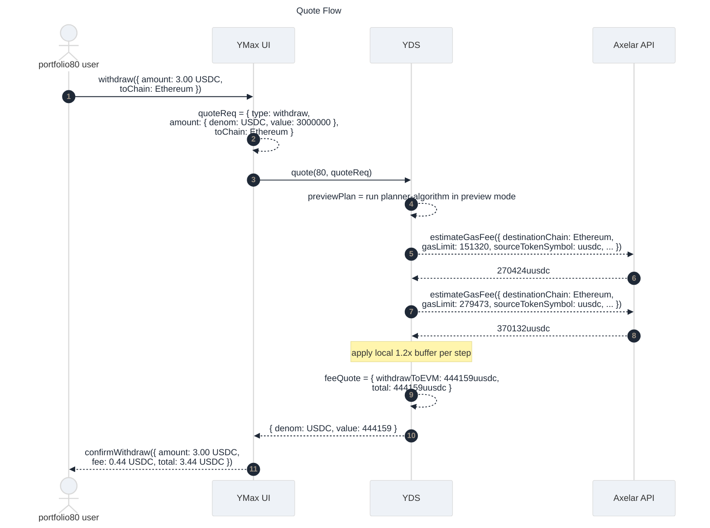
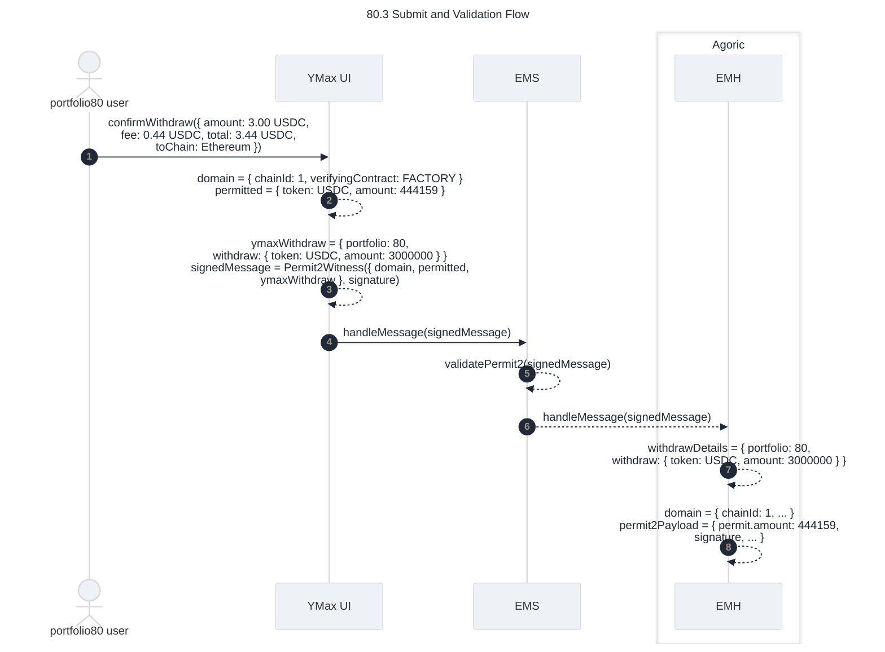
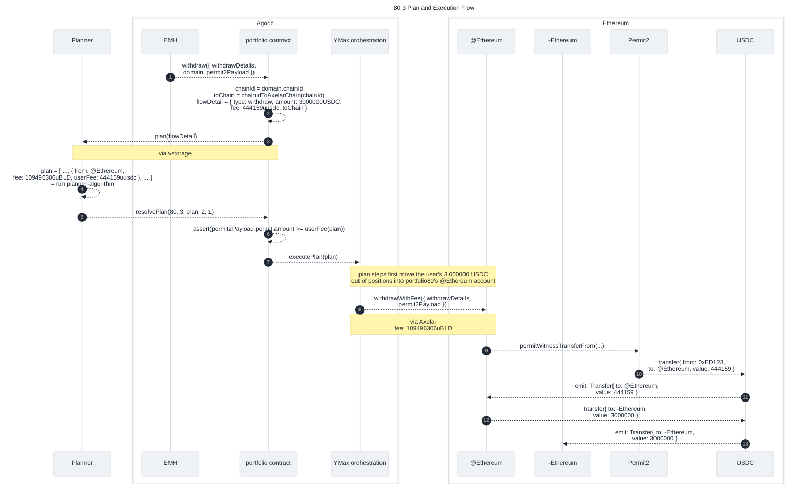
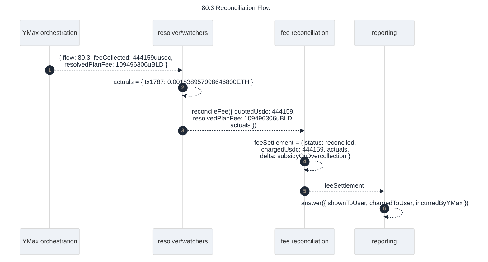

## YMax User Fees for Ethereum Mainnet Execution

### Terminology

- `ypr`: the privileged off-chain planner/resolver service from `DESIGN-BETA.md` that can resolve plans back into the contract.
- `planner-algorithm`: the unprivileged computation that reads portfolio state plus market/config inputs and produces a candidate plan plus fee estimates.
- `YDS quote endpoint`: a user-facing API surface that runs `planner-algorithm` in preview mode, but does not have authority to resolve plans on-chain.

### Working assumptions

- v1 should optimize for one user approval/signature, not post-hoc collection.
- v1 policy scope is steps whose execution costs are actually paid by YMax and recoverable through this product flow.
- UX should show one “Gas” number in USDC on the initiating-chain action, even if the underlying execution spans multiple fee-bearing Ethereum steps.
- Exact end-state reconciliation is still needed internally, but user charging should not wait for exact receipts.

### Proposed shape

1. Add a first-class fee quote alongside the existing plan.
   - `planner-algorithm` still computes step fees as it does today.
   - A new fee policy pass classifies which plan steps are user-chargeable for the active policy.
   - For MVP that policy is: include Ethereum-mainnet steps whose execution costs are actually paid by YMax.
   - The plan carries both:
     - step-level operational fee data for execution (`fee` in `uBLD`, `detail.evmGas`, etc.)
     - a user-facing `feeQuote` summary in USDC with step breakdown and a policy version.

2. Treat the user-facing gas number as a quoted hold/charge, not a best-effort display-only estimate.
   - For Agoric-initiated offers, the Zoe offer includes extra USDC for gas.
   - For EVM-initiated offers, the signed payload/permit includes `maxGasFee` or equivalent bound and authorizes transfer of deposit amount plus quoted gas.
   - Contract escrows that USDC immediately into a YMax-owned fee account on the initiating chain.

3. Leave execution funding paths mostly unchanged in MVP.
   - Planner still emits the operational `uBLD` fee values needed by current orchestration.
   - Contract / LCA / relayer paths continue paying the actual execution costs the same way they do today.
   - This minimizes change in cross-chain execution logic and localizes MVP work to quote, collection, and accounting.

4. Add a reconciliation record after execution finishes.
   - Resolver/watchers already join flow steps to remote tx outcomes.
   - Extend that path to produce a per-flow fee settlement record:
     - quoted amount in USDC
     - actual observed Ethereum gas costs by step
     - conversion inputs used for accounting
     - retained subsidy or over-collection delta
   - MVP can keep the user charge fixed at the upfront quote and use reconciliation for internal accounting only.

Expected code change for this design:
- extend the planner-facing `FlowDetail` for `withdraw` to carry the user-authorized fee amount alongside the principal amount, so live planning can treat the fee ceiling as part of the request rather than as out-of-band contract state.

### Why this design fits the current system

- It does not require exact-before-execution pricing, which current architecture cannot guarantee.
- It matches the requirement that the user pays as part of the initiating transaction.
- It preserves the current planner/contract split:
  - `planner-algorithm` computes step fees and policy classification
  - `ypr` remains the privileged actor that resolves live plans into the contract
  - YDS can expose preview/quote endpoints without receiving `ypr` authority
  - contract collects user funds and records fee state
  - resolver closes the loop with actuals
- It avoids a riskier redesign where execution accounts must directly spend user-sourced USDC across chains before MVP.

### Data model additions to plan toward

- `feeQuote.policyVersion`
- `feeQuote.portfolioPolicyVersion`
- `feeQuote.rebalanceCount`
- `feeQuote.initiatingChain`
- `feeQuote.quoteDenom = USDC`
- `feeQuote.total`
- `feeQuote.steps[]`
  - `stepId`
  - `chain`
  - `how`
  - `chargeable`
  - `quoteSource` (`walletEstimate`, `returnFeeEstimate`, etc.)
  - `operationalFee` (`uBLD` and/or `detail.evmGas`)
  - `quotedUsdc`
- `feeSettlement`
  - `quotedUsdc`
  - `chargedUsdc`
  - `actuals[]`
  - `deltaUsdc`
  - `status` (`quoted`, `collected`, `executed`, `reconciled`)

### Non-goals for MVP

- No attempt to charge non-Ethereum chains yet.
- No promise of exact pass-through to the cent at user settlement time.
- No requirement that remote execution accounts spend the exact USDC collected from the user.
- No refund/surcharge loop in the critical path; that can follow once reconciliation quality is proven.

## `80.3` Re-told With This Design In Place

Diagram notation in this section:
- `->>` fresh action initiated by that actor
- `-->>` consequence or follow-on action
- requests/commands read like method calls
- returned data is shown as data

### Quote Flow

The `portfolio80` user wants to withdraw `3.000000 USDC` to Ethereum. Before the UI asks the user to sign, it requests a quote from YDS and YDS runs the same planning logic in preview mode that live planning would use later.



### User-visible story

1. The `portfolio80` user starts a withdraw to Ethereum and enters `3_000_000` USDC base units (`3.000000 USDC`).
2. UI requests a quote for that exact withdraw before asking the user to sign it.
   - The UI sends `POST /portfolio/80/quote` to YDS with the same fields that `flowsRunning` uses for a withdraw flow.
   - Example request body:

   ```json
   {
     "type": "withdraw",
     "amount": {
       "denom": "USDC",
       "value": "3000000"
     },
     "toChain": "Ethereum"
   }
   ```
3. YDS runs `planner-algorithm` in preview mode.
   - This includes the same external estimation work used for live planning, especially Axelar gas-estimation calls for fee-bearing GMP/EVM steps.
   - Fee policy marks one plan step as chargeable in this preview plan:
     - `@Ethereum -> -Ethereum` (`withdrawToEVM`)
   - The preview still estimates the `@noble -> @Ethereum` (`CCTP`) leg for operational context, but MVP does not charge the user for it because Noble relayers, not YMax, pay that Ethereum cost in status quo.

   Step 3 detail for the `@Ethereum -> -Ethereum` preview step: once `planner-algorithm` has classified that leg as an EVM withdraw to Ethereum, it looks up the same configured gas-limit value used by live planning. For this path, that is `gasLimit = 279473`. For the user-facing quote, it asks Axelar for a fee quote in `uusdc` using Agoric as source chain and Ethereum as destination chain.

   ```http
   POST https://api.axelarscan.io/gmp/estimateGasFee
   Content-Type: application/json

   {
     "sourceChain": "agoric",
     "destinationChain": "Ethereum",
     "gasLimit": "279473",
     "sourceTokenSymbol": "uusdc",
     "gasMultiplier": "1"
   }
   ```

   Observed on `2026-03-09`, this request returns `370132 uusdc` for the `@Ethereum -> -Ethereum` preview step. The corresponding `@noble -> @Ethereum` estimate, using `gasLimit = 151320` and the same `sourceTokenSymbol = uusdc`, returns `270424 uusdc`, but MVP does not charge the user for that relayer-paid leg. Current `planner-algorithm` then applies the local 1.2x buffer to the chargeable step:
   - `@Ethereum -> -Ethereum`: `ceil(370132 * 1.2) = 444159 uusdc`
   - rolled-up `feeQuote.total = 444159 uusdc` (`0.444159 USDC`)

4. YDS returns `{ "denom": "USDC", "value": "444159" }`

5. UI shows the quote to the user before final confirmation:
   - withdraw amount: `3.000000 USDC`
   - gas line: `0.444159 USDC`
   - destination chain: `Ethereum`
   - if the UI shows a total charged line, it is `3.444159 USDC`
   - if the UI shows a net-received line, it remains `3.000000 USDC` on Ethereum because the gas charge is additive rather than deducted from the withdraw amount
   - tooltip/help text explaining that this is a YMax gas quote for Ethereum mainnet execution and is charged up front in USDC for the `withdrawToEVM` step

### Submit and Execution Flow

After the UI shows the quote, the user signs one Permit2 witness and submits it. `EMS` and `EMH` handle the signed message, `ypr` resolves the live plan, and YMax orchestration executes the withdraw with the fee-collection step included.





### Execution story

6. User confirms and signs one Permit2 witness message, and the client submits that signed payload to YDS.
   - This design uses the same Permit2 witness mechanism already used by deposit-style flows, but here the permitted transfer is the quoted gas charge instead of portfolio principal.
   - The signed Permit2 data authorizes transfer of `444159 uusdc` (`0.444159 USDC`) from the user's Ethereum wallet and binds that transfer to the specific `portfolio80` withdraw instruction.
   - HAZARD WARNING: Permit2 does not bind the fee recipient (`transferDetails.to`) in the signed message. The signature covers the permitted token/amount, spender, nonce, deadline, and witness, but not the ultimate recipient of the pulled funds. If YMax orchestration or the `@Ethereum` wallet supplies the wrong recipient to `permitWitnessTransferFrom(...)`, Permit2 will still transfer the funds to that wrong address. This must be treated as a critical integration hazard and reviewed accordingly. See Uniswap Permit2 issue [#250](https://github.com/Uniswap/permit2/issues/250).
   - Concretely, for this story the wallet signs a message shaped like:

   ```json
   {
     "domain": {
       "name": "Permit2",
       "chainId": 1,
       "verifyingContract": "0x000000000022D473030F116dDEE9F6B43aC78BA3"
     },
     "primaryType": "PermitWitnessTransferFrom",
     "types": {
       "PermitWitnessTransferFrom": [
         { "name": "permitted", "type": "TokenPermissions" },
         { "name": "spender", "type": "address" },
         { "name": "nonce", "type": "uint256" },
         { "name": "deadline", "type": "uint256" },
         { "name": "ymaxWithdraw", "type": "YmaxV1Withdraw" }
       ],
       "TokenPermissions": [
         { "name": "token", "type": "address" },
         { "name": "amount", "type": "uint256" }
       ],
       "YmaxV1Withdraw": [
         { "name": "withdraw", "type": "Asset" },
         { "name": "portfolio", "type": "uint256" },
         { "name": "portfolioPolicyVersion", "type": "uint256" },
         { "name": "rebalanceCount", "type": "uint256" }
       ],
       "Asset": [
         { "name": "token", "type": "address" },
         { "name": "amount", "type": "uint256" }
       ]
     },
     "message": {
       "permitted": {
         "token": "0xA0b86991c6218b36c1d19D4a2e9Eb0cE3606eB48",
         "amount": "444159"
       },
       "nonce": "220904985067852799362214874697040876082",
       "deadline": "1770327683",
       "spender": "0x9524EEb5F792944a0FE929bb8Efb354438B19F7C",
       "ymaxWithdraw": {
         "portfolio": "80",
         "portfolioPolicyVersion": "2",
         "rebalanceCount": "1",
         "withdraw": {
           "token": "0xA0b86991c6218b36c1d19D4a2e9Eb0cE3606eB48",
           "amount": "3000000"
         }
       }
     }
   }
   ```

   - The same signed Permit2 witness carries both:
     - fee authorization: transfer `444159 uusdc` on Ethereum
     - operation intent: withdraw `3000000` USDC from `portfolio80` to Ethereum
7. `EMS` receives the signed Permit2 witness from the client and performs the early validation described in [`EVM Wallet design`](../docs-design/evm-wallet.md):
   - verify signature shape and deadline
   - verify Permit2 allowance / approval state for the quoted USDC transfer
   - verify the user's USDC balance is sufficient for the quoted fee
8. `EMS` forwards the signed message to `EMH` via the wallet-handler path.
9. `EMH` performs the handler-side signature checks and extracts:
   - fee-transfer authority:
     - token `0xA0b86991c6218b36c1d19D4a2e9Eb0cE3606eB48`
      - amount `444159`
      - spender `0x9524EEb5F792944a0FE929bb8Efb354438B19F7C`
   - withdraw instruction:
      - portfolio `80`
      - amount `3000000`
      - token `0xA0b86991c6218b36c1d19D4a2e9Eb0cE3606eB48`
      - `portfolioPolicyVersion = 2`
      - `rebalanceCount = 1`
10. `EMH` starts the live withdraw workflow by calling `withdraw(signedMessage)`. The portfolio contract derives destination chain `Ethereum` from the signed message's `domain.chainId = 1` and carries the extracted Permit2 authority into execution as `permit2Payload`.
11. `ypr` resolves the live plan for `portfolio80` / `flow3`; in the observed production flow this was `resolvePlan(80, 3, ..., 2, 1)` in tx `72C1CBB7099BCE96F5B0352B8F697A58B14FF35C9C8077D20E36F8233CD0745F` at `2026-02-05T20:41:45Z`. In this design, the resolved plan is where both fee magnitudes first become explicit together:
   - user-facing fee to collect: `444159 uusdc`
   - operational Axelar fee to pay: `109496306 uBLD`
   The portfolio contract rejects the flow unless the signed Permit2 fee amount is greater than or equal to the YMax-paid fee policy applied to that resolved plan.
   - This resolved plan is where YMax orchestration learns the operational fee amounts it must send through the existing Axelar/GMP path.
   - In the current architecture those amounts live in each step's `move.fee` as `uBLD`.
   - For apples-to-apples comparison with the current operational fee path, the relevant YMax-paid step is `@Ethereum -> -Ethereum` with `gasLimit = 279473`:
     - raw estimate: `91246921 uBLD`
     - buffered estimate: `109496306 uBLD`
   - Using CoinGecko's current `BLD/USD = 0.00405638` on `2026-03-09`, that buffered YMax-paid amount is worth about `$0.444159`:
     - `109496306 uBLD` = `109.496306 BLD` ≈ `$0.444159`
   - For reference, the observed `80.3` resolved plan carried a much larger spike-day `uBLD` fee for that same YMax-paid step:
     - `@Ethereum -> -Ethereum`: `6350461608 uBLD`
   - The `@noble -> @Ethereum` step is still part of the flow, but Noble relayers, not YMax, pay that Ethereum gas in status quo.
12. YMax orchestration executes the withdrawal as it does in status quo, except that the resolved plan now includes a fee-collection step that moves `444159 uusdc` from the user's wallet into the YMax-controlled fee collection path on the initiating chain and records `feeSettlement.status = collected`; YMax orchestration funds the remaining YMax-paid steps the same way it does today:
   - existing `uBLD` / GMP funding paths pay for orchestration
   - YMax-controlled Ethereum execution path covers `withdrawToEVM`
13. Resolver/watchers observe completion and collect actual fee evidence for the executed form of the YMax-paid step, which in observed `80.3` was `tx1787`.

### Reconciliation Flow

After execution completes, resolver/watchers and reconciliation logic join the quote-time charge, the resolved-plan operational fee amounts, and the realized execution evidence into one fee-settlement record.



### Accounting story

14. Flow reconciliation writes a record roughly like:
   - quoted gas: the quoted `withdrawToEVM` preview step at quote time
   - operational fee magnitude from the resolved plan: the `uBLD` `move.fee` value attached to that YMax-paid step
   - actual gas: observed Ethereum cost for the executed form of that YMax-paid step (`tx1787` in observed `80.3`)
   - delta: internal subsidy or over-collection
15. MVP product logic keeps the user settlement at the quoted amount already charged up front.
16. Internal reporting can then answer, for `80.3`, both:
   - what the user was shown/charged on the “Gas” line
   - what YMax actually incurred on Ethereum mainnet

TODO: explain operator treasury loop. YMax collects gas reimbursement in USDC but currently pays operational fees from BLD in `contractAccount`, so viable long-term operation requires some process to convert collected USDC back into BLD and replenish `contractAccount`. That treasury-management design is out of scope for this document.

### Consequence for `80.3`

- Under status quo, `80.3` shows expensive Ethereum execution but no user-facing fee collection path.
- Under this design, `80.3` becomes a normal withdraw where the UI shows a single USDC gas quote before submission, the contract collects it immediately, and reconciliation later measures whether that quote fully covered the mainnet costs.

### Buffering alternatives

The status quo planner uses a local buffer computation after Axelar returns an estimate:

```text
padded = ceil(estimate * 1.2)
operationalFee = max(MINIMUM_GAS, padded)
```

Two plausible alternatives are to shift some or all of that buffering to Axelar's `gasMultiplier` input instead:

- `gasMultiplier: "1.2"`
  - treat Axelar as the source of the 20% execution buffer
  - likely remove the local `* 1.2` padding for those steps to avoid double-buffering
- `gasMultiplier: "auto"`
  - delegate buffer selection to Axelar's current chain-specific policy
  - likewise, avoid stacking the current local 20% buffer on top unless intentional

Observed on `2026-03-09` for the same `sourceChain=agoric`, `destinationChain=Ethereum`, `gasLimit=279473`, `sourceTokenSymbol=usdc` request:

```text
gasMultiplier: "1"    -> 355935
gasMultiplier: "1.2"  -> 396422
gasMultiplier: "auto" -> 412546
```

Implication for design:

- keep current design: Axelar at `"1"` (or equivalent neutral setting), then apply YMax local buffer/minimum rules
- Axelar-buffered alternative: use `"1.2"` or `"auto"` and simplify/remove the local 20% padding step
- avoid stacking Axelar buffering with the existing local 20% rule unless deliberate over-collection is desired

### Candidate YDS quote endpoint

- `POST /portfolio/:id/quote`
  - input: operation plus all quote-defining parameters in the request body
  - output: quote envelope plus `feeQuote`

This endpoint should be a thin wrapper around `planner-algorithm`, not an alternate planning implementation. The goal is one planning codepath with two callers:
- preview caller: YDS quote endpoint
- privileged execution caller: `ypr`
