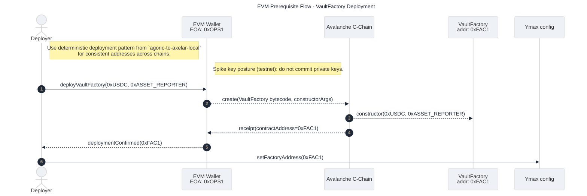
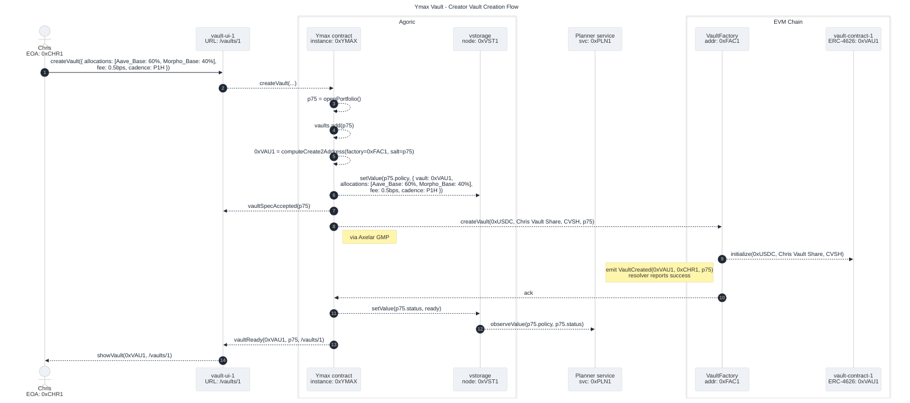
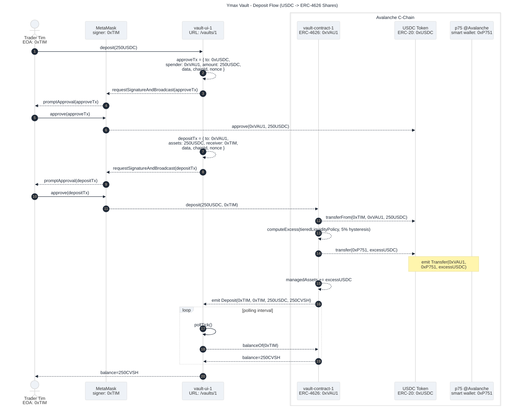
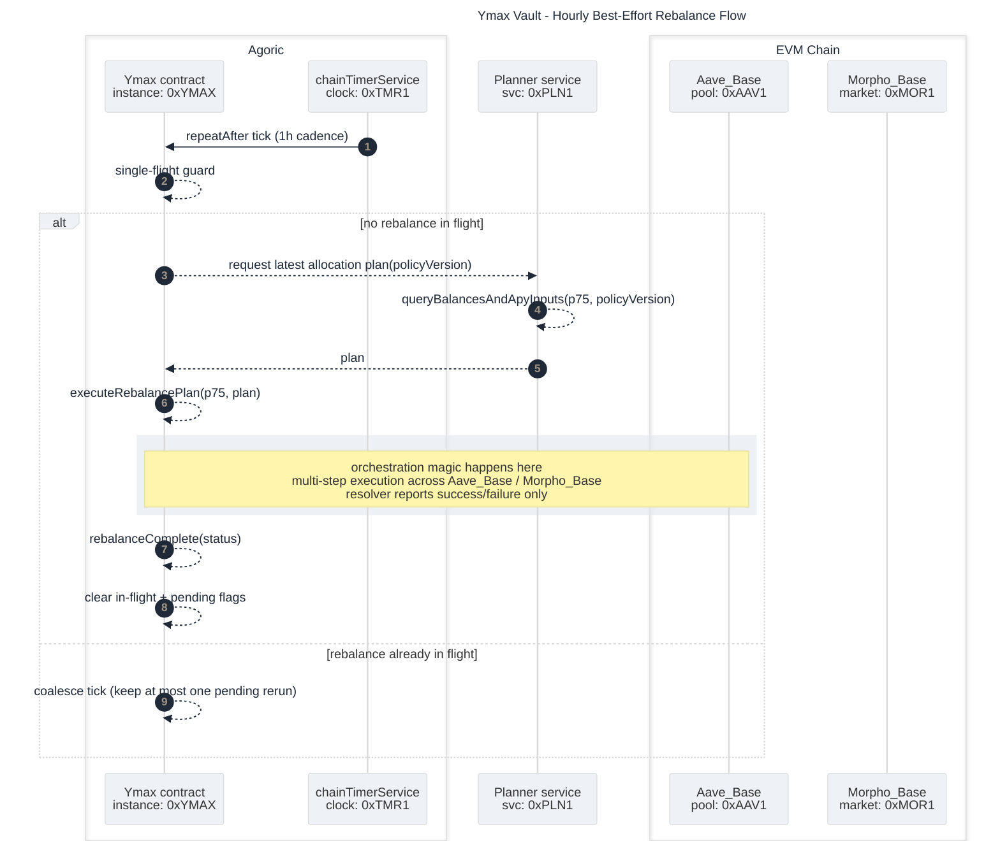
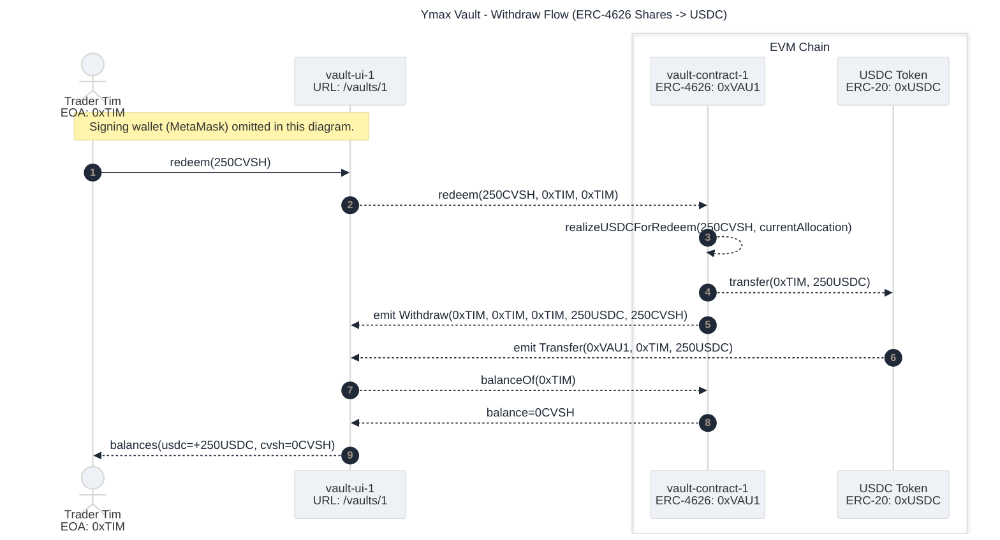

# Ymax Vaults Spike

Audience: Product + Engineering + Peers  
Scope: story clarity, approach decisions, prototype implementation, smoke evidence

---

# What's The Problem?

- We need to estimate cost/risk of adding creator vaults to Ymax.
- Product expectation: market-norm [ERC-4626](https://eips.ethereum.org/EIPS/eip-4626) UX for deposit/redeem.
- Core challenge: Ymax yield engine is cross-chain, but user vault UX is EVM-local.
- We need enough implementation to prove feasibility, not a full production launch.

---

# Tada! Vault Deposit On-Chain Smoke Test

- We got a real **vault deposit flow running end-to-end on a local chain**.
- Evidence: [Vault Smoke Evidence Gist](https://gist.github.com/dckc/94b7ff46a126e81b1786a84971c4a6f6) with signed calls, event tuples, and one-line accounting assertions.
- Implemented EVM vault + factory contracts with tests.
- Designed concrete flows (create, deposit, rebalance, withdraw, prereq deploy).
- Clarified story + assumptions + explicit TODO/risk plan.
- Key: `🧪` tested, `🧭` plan-only, `🚀` stretch, `🏭` product TODO

---

# Story + Scope Decisions

- Single-vault story for spike
  - 🏭 product can support one per creator/strategy.
- LP/share model explicitly [ERC-4626](https://eips.ethereum.org/EIPS/eip-4626).
- 🧭 End-user UI in scope ; creator UI stretch. 🚀
- 🧭 Rebalance is best-effort hourly.
- 🧭 Creator fee modeled as yield cut (performance fee).

---

# Challenge: APY Source + Decentralization 🏭

- APY source has decentralization concerns, but mostly orthogonal to spike feasibility.
- Decision for spike 🧭:
  - planner consumes YDS HTTP APY per instrument
  - contract boundary remains plan-only (no APY payload on-chain)
- Outcome:
  - kept spike focused on vault mechanics
  - left production TODO 🏭 for APY/decentralization trust hardening
  - on-chain oracle-backed APY source ❌ rejected for this spike

---

# Challenge: Cross-Chain Accounting 🏭

- 🧪 Vault token/share accounting is on one EVM chain.
- 🧭 Yield opportunities are cross-chain in Ymax.
- 🧪 Required a bridge between local vault liquidity and deployed cross-chain funds.

Working model 🧪:
- use privileged extension + managed-assets reporting path:
  - `reporter -> factory -> vault`
  - `totalAssets = localVaultBalance + managedAssets`

---

# Challenge: Rebalance Cadence vs Latency 🏭

- Plan execution, while normally 5-20min, can be longer than an hour.
- Hourly tick can overlap in-flight execution.

Spike Decision 🧭:
- single-flight lock
- coalesce pending ticks (at most one rerun)
- stale-plan/runtime guardrails

---

# Challenge: Redemption Semantics 🏭

- Need market-norm UX, but cross-chain liquidity may not be locally available.

Decision 🧪:
- spike default: sync redeem
- enforce liquidity + freshness checks
- `requestRedeem` kept as stretch goal 🚀, not implemented in spike

---

# Flow: EVM Prereq Deployment

---

# Flow: Creator Vault Creation

---

# Flow: Deposit

---

# Flow: Rebalance

---

# Flow: Withdraw

---

# Implementation Artifacts

- 🧪 `agoric-to-axelar-local` PR:  
  [spike: add Ymax vault/factory contracts and local deposit smoke evidence (PR #71)](https://github.com/agoric-labs/agoric-to-axelar-local/pull/71)
- 🧭 `agoric-sdk` PR:  
  [spike(portfolio-contract): vault flow design + creatorFacet createVault (PR #12513)](https://github.com/Agoric/agoric-sdk/pull/12513)
- 🧭 `ymax0-ui0` PR:  
  [spike(ui): add creatorFacet createVault action in admin UI (PR #27)](https://github.com/agoric-labs/ymax0-ui0/pull/27)

---

# Evidence: User Intent 🧪

- Aliases: `TIM=0x7099…79C8` `VAU1=0xCafa…052c` `P75A=0x90F7…b906`
- Tim signed:
  - `approve(spender=VAU1, amount=1000000)`
  - `deposit(assets=1000000, receiver=TIM)`
- Vault emitted:
  - `Deposit(caller=TIM, owner=TIM, assets=1000000, shares=1000000)`

---

# Evidence: Funds Movement 🧪

- USDC `Transfer` events in same deposit receipt:
  - `Transfer(from=TIM, to=VAU1, value=1000000)` (Tim -> vault1)
  - `Transfer(from=VAU1, to=P75A, value=800000)` (vault1 -> `@Avalanche`)
- Evidence bundle:
  - [Vault Smoke Evidence Gist](https://gist.github.com/dckc/94b7ff46a126e81b1786a84971c4a6f6)

---

# Open Risks / Product TODOs 🏭

- Reporter trust hardening and key custody model.
- Slippage protections (`minSharesOut` / `minAssetsOut`).
- Final permission model for `createVault`.
- Liquidity shortfall / redeem DoS mitigation.
- Production permit2 migration and replenishment logic.

---
