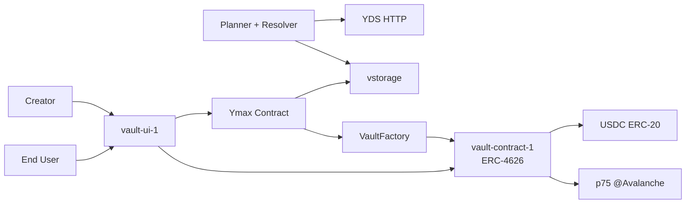
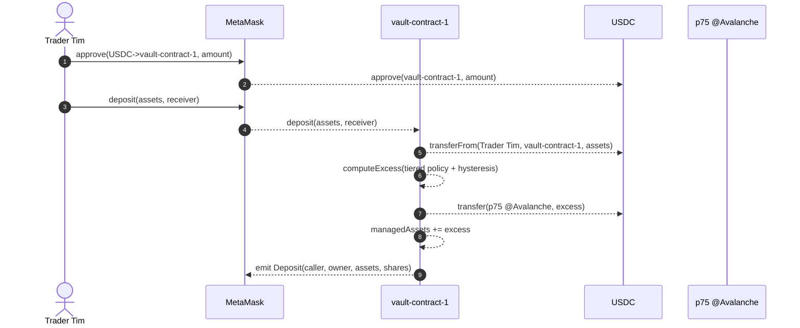
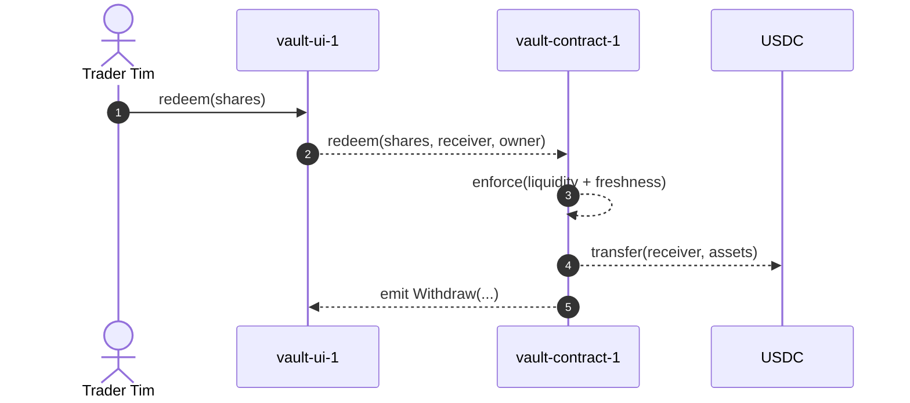

# Ymax Creator Vaults Design

Current Ymax target users are sophisticated cross-chain portfolio operators.
There's an existing market of vaults of various strategies with common vault UX patterns:

- Morpho: reported growth from `67,000` to `1.4M+` users during 2025 ([Morpho 2026](https://morpho.org/blog/morpho-2026/), January 16, 2026).
- Veda (BoringVault infrastructure): reported deposits from `100,000+` users and `$3.7B+` TVL ([CoinDesk](https://www.coindesk.com/business/2025/06/23/veda-raises-usd18m-to-expand-defi-vault-infrastructure-powering-over-usd3-7b-in-assets), June 23, 2025).
- Beefy: community-reported `131,887` active users and `485,827` unique accounts ([Outposts](https://outposts.io/explore/beefy), accessed February 27, 2026).
- Yearn v3: launch examples reached `$10M+ TVL` per new Base vault in under 24h ([Yearn post via Outposts](https://outposts.io/article/yearn-v3-launches-new-seamless-vaults-on-base-ff98a05c-8d40-478e-a074-fa8f307d2978), February 2025).

ERC-4626 is the EVM tokenized-vault standard that normalizes deposit/redeem/share behavior and makes vault UX/tooling more interoperable.

Opportunity:
- connect Ymax to this larger audience by packaging Ymax portfolio execution as the strategy back-end for ERC-4626 vaults.

## Purpose

Creator vaults should expose ERC-4626 vault UX on an EVM chain while earning yield from Ymax cross-chain strategy execution.

This document describes the target feature architecture first, then records the current spike cut and deferred items.

A creator vault is a vault instance configured by a creator strategy/policy and exposed at a dedicated UI route.
For a concrete running example, this doc uses `vault-ui-1` (the route/UI surface) paired with `vault-contract-1` (the EVM ERC-4626 vault contract).

## Feature Scope

In scope:
- One concrete creator vault flow (`vault-ui-1` + `vault-contract-1`) for end-user deposit/redeem.
- ERC-4626-style share accounting on an EVM vault contract.
- Cross-chain deploy path from vault local liquidity to portfolio smart wallet (`p75 @Avalanche`).
- Managed-assets reporting path (`assetReporter -> VaultFactory -> VaultContract`).

Deferred or alternative feature concerns:
- Production APY decentralization hardening (see [Appendix A.1](#appendix-a-alternatives-not-taken-brief)).
- Async redemption UX (`requestRedeem`) beyond stretch discussion (see [Appendix A.2](#appendix-a-alternatives-not-taken-brief)).
- Strategy adapter contract layer (see [Appendix A.3](#appendix-a-alternatives-not-taken-brief)).
- Overlapping rebalance execution policy alternatives (see [Appendix A.4](#appendix-a-alternatives-not-taken-brief)).
- Alternative local-liquidity policy variants (see [Appendix A.5](#appendix-a-alternatives-not-taken-brief)).

## Design Goals

- Preserve market-norm user semantics: EVM wallet signs `approve` + `deposit`/`redeem`.
- Keep vault share accounting coherent with cross-chain deployment of assets.
- Keep trust boundaries explicit and auditable.
- Produce implementation-level evidence for feasibility estimation.

## Architecture

Core components:
- End-user UI (`vault-ui-1`): builds tx payloads and reads balances/events.
- EVM vault (`vault-contract-1`): ERC-4626 surface + managed-assets accounting extension.
- EVM vault factory: creates vaults and gates managed-assets reporting authority.
- Ymax contract (Agoric): policy/state publication, create-vault orchestration hooks.
- Planner + resolver (off-chain): planning/execution/reporting pipeline.
- Portfolio smart wallet on vault chain (`p75 @Avalanche`): receives deployed excess liquidity. This is the owner portfolio account for the vault on Avalanche.

Key boundary:
- APY is consumed off-chain by planner from YDS HTTP (Ymax Data Service); APY values are not on-chain inputs for this spike (alternative in [Appendix A.1](#appendix-a-alternatives-not-taken-brief)).

### System Context (High Level)

## Data and Invariants

Vault state includes:
- `asset` (USDC ERC-20)
- `ownerPortfolioAccount` (for example, `p75 @Avalanche`, the vault's portfolio smart-wallet account on Avalanche)
- `managedAssets`
- local-liquidity policy params (`floor`, `%`, hysteresis)

Core invariant:
- `totalAssets = localVaultUsdc + managedAssets`

Implication:
- Transfers from vault local balance to `ownerPortfolioAccount` must be mirrored by managed-assets accounting.

## Core Flows

Source diagrams:
- [EVM prereq deployment](./vault-evm-prereq-deployment.mmd)
- [Creator vault creation](./vault-creation-flow.mmd)
- [Deposit](./vault-deposit-flow.mmd)
- [Rebalance](./vault-rebalance-flow.mmd)
- [Withdraw](./vault-withdraw-flow.mmd)

### 1) Prereq deployment

- Deploy `VaultFactory` with constructor args: `usdc`, `assetReporter`.
- Use deterministic deployment pattern for consistent addresses across chains.

### 2) Creator vault creation

- Creator initiates `createVault(...)` through UI/control path.
- Ymax opens portfolio (`p75`), computes deterministic vault address, and publishes policy.
- Ymax triggers EVM `factory.createVault(...)` (via Axelar General Message Passing (GMP) path in full architecture).
- Factory initializes vault with concrete share name/symbol (`Chris Vault Share`, `CVSH`) and owner portfolio account.

### 3) Deposit

- User signs `approve(USDC -> vault)` then `deposit(assets, receiver)`.
- Vault receives USDC, mints shares, computes excess local liquidity, and transfers excess to `ownerPortfolioAccount`.
- Vault updates managed-assets accounting consistent with transfer out.

Notation for sequence diagrams in this document:
- `->>` denotes a spontaneous trigger action.
- `-->>` denotes a consequence/follow-on action.

### 4) Rebalance

- Agoric timer triggers best-effort cadence.
- Single-flight guard prevents overlap.
- Busy ticks are coalesced (at most one pending rerun).
- Planner computes plan from balances + APY inputs and returns executable plan.

Alternative overlap policies are discussed in [Appendix A.4](#appendix-a-alternatives-not-taken-brief).

### 5) Withdraw (sync redeem)

- User signs `redeem(shares, receiver, owner)`.
- Vault succeeds only if local liquidity and report freshness gates pass.
- Async fallback (`requestRedeem`) is deferred to product follow-up (see [Appendix A.2](#appendix-a-alternatives-not-taken-brief)).

## Authority and Trust Model

Create-vault authority:
- Exposed via the Agoric creator facet (control path used by `ymaxControl`).

Managed-assets reporting authority:
- Planner controls the asset reporter key (`assetReporter`).
- `factory.reportManagedAssets(...)` requires `msg.sender == assetReporter`.
- Vault accepts managed-assets reports only from the factory (`assetReporter -> factory -> vault`).

## Current Spike Status

Implemented in spike:
- Testnet/local-chain-focused implementation posture.
- Avoid committing private keys.
- Local smoke validation for deposit path and accounting evidence.

Not implemented in spike:
- Production custody/rotation/separation-of-duties for reporter authority.
- Timer-driven periodic rebalance code path.
- Async redeem path (`requestRedeem`).

## Current Spike Parameterization

- Rebalance cadence target: `P1H` (best effort).
- Managed-assets freshness gate for sync redeem: `8h`.
- Local-liquidity control: tiered target + `5%` hysteresis.

Alternative local-liquidity policies are summarized in [Appendix A.5](#appendix-a-alternatives-not-taken-brief).

## Validation Strategy

- Solidity unit tests first for invariant and authority behavior.
- Local on-chain smoke run to prove concrete deposit path and event/accounting evidence.
- UI prototype quality bar: functional for demo, not production-polish.

## Open Product TODOs

- APY source decentralization/hardening.
- Permissioning finalization for `createVault`.
- Slippage protections for deposit/redeem.
- Liquidity shortfall / redeem DoS mitigation.
- Permit2 migration from approve-per-deposit flow.
- Replenishment strategy when local liquidity is low.

## Appendix A: Alternatives Not Taken (Brief)

A.1 APY from on-chain oracle aggregation (not chosen for spike)
- Why not now: orthogonal to main feasibility path; would add significant integration/ops work.
- Why later: improves decentralization/trust of APY inputs.

A.2 Async `requestRedeem` as primary redemption path (not chosen for spike)
- Why not now: higher UX and state-machine complexity for end users.
- Why later: needed when local liquidity constraints make sync redeem unreliable.

A.3 Strategy adapters per protocol (not chosen for spike)
- Why not now: single-contract approach is faster for proving core accounting and authority seams.
- Why later: better modularity/upgrade boundaries at product scale.

A.4 Allow overlapping rebalance executions (not chosen for spike)
- Why not now: overlap complicates correctness and conflict handling under long-running plans.
- Chosen instead: single-flight + coalesced pending tick.

A.5 Other local-liquidity policies (not chosen for spike default)
- Fixed absolute liquidity target only: simple, but less adaptive to TVL changes.
- Percent-only target: adaptive, but can under-buffer small vaults.
- Chosen instead: tiered (`max(floor, pct*assets)`) + hysteresis.
