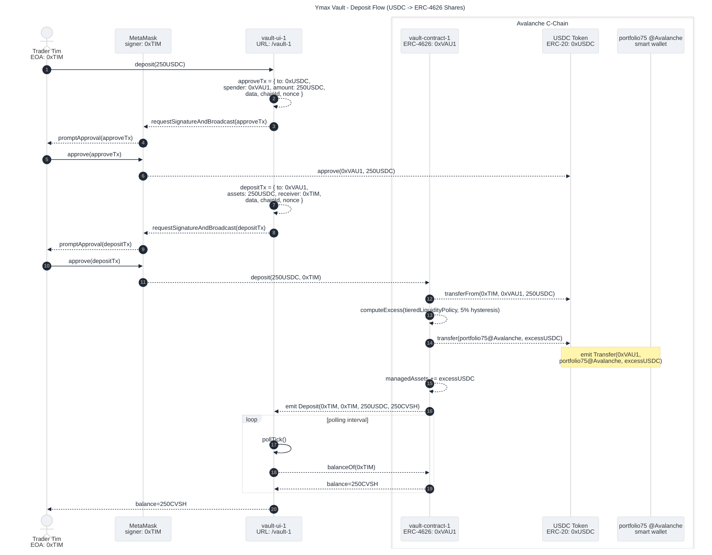

# Ymax Creator Vaults Design

Current Ymax target users are sophisticated cross-chain portfolio operators.
There's an existing market of vaults of various strategies with common vault UX patterns:

- Morpho: reported growth from `67,000` to `1.4M+` users during 2025 ([Morpho 2026](https://morpho.org/blog/morpho-2026/), January 16, 2026).
- Veda (BoringVault infrastructure): reported deposits from `100,000+` users and `$3.7B+` TVL ([CoinDesk](https://www.coindesk.com/business/2025/06/23/veda-raises-usd18m-to-expand-defi-vault-infrastructure-powering-over-usd3-7b-in-assets), June 23, 2025).
- Beefy: community-reported `131,887` active users and `485,827` unique accounts ([Outposts](https://outposts.io/explore/beefy), accessed February 27, 2026).
- Yearn v3: launch examples reached `$10M+ TVL` per new Base vault in under 24h ([Yearn post via Outposts](https://outposts.io/article/yearn-v3-launches-new-seamless-vaults-on-base-ff98a05c-8d40-478e-a074-fa8f307d2978), February 2025).

ERC-4626 is the EVM tokenized-vault standard that normalizes deposit/redeem/share behavior and makes vault UX/tooling more interoperable.

Opportunity:
- connect Ymax to this larger audience by packaging Ymax portfolio execution as the strategy back-end for ERC-4626 vaults.

## Deposit Flow

Suppose a Ymax-based vault contract, `0xVAU1` on Avalanche, with UI at `/vault-1`, has already been set up, based on `portfolio75` for strategy execution.  (see  [Vault Setup Prerequisite](#vault-setup-prerequisite-how-0xvau1-and-vault-1-exist)).

A trader, Tim (`EOA 0xTIM`), discovers `/vault-1` and wants to participate using familiar ERC-4626 deposit behavior.
Tim deposits USDC and receives vault shares (`CVSH`).

Some deposited USDC remains in `0xVAU1` as local liquidity; excess USDC moves to the `@Avalanche` account of `portfolio75` for strategy execution.

### Deposit Sequence Diagram

Source: [docs-design/vault-deposit-flow.mmd](./vault-deposit-flow.mmd)

Diagram notation in this doc:
- `->>` spontaneous trigger action.
- `-->>` consequence/follow-on action.

### Step-by-Step Walkthrough

1. Tim starts at `/vault-1`, enters 250 in an amount field, and hits Deposit (represented as a `deposit(250USDC)` method invocation on the UI).
2. The UI asks MetaMask to sign/broadcast an `approve` transaction so `0xVAU1` can pull USDC. _This approve-per-deposit path is a spike simplification; production should use Permit2 (see [Appendix B](#appendix-b-product-todos))_.
3. The UI asks MetaMask to sign/broadcast `deposit(250USDC, 0xTIM)` on `0xVAU1`.
4. `0xVAU1` pulls 250 USDC from Tim via `transferFrom`.
5. `0xVAU1` computes local-liquidity target and excess _(tiered policy with 5% hysteresis for this spike; production parameter tuning is a product TODO in [Appendix B](#appendix-b-product-todos))_.
6. `0xVAU1` transfers excess USDC to `portfolio75`'s `@Avalanche` account.
7. `0xVAU1` updates `managedAssets` to preserve `totalAssets` accounting.
8. `0xVAU1` emits `Deposit(...)`, and the UI reads `balanceOf(0xTIM)` until it shows the new share balance.

### Key Mechanics In This Flow

- Familiar vault UX: two wallet-signed transactions (`approve`, then `deposit`), no custom custody workflow for trader Tim.
- Cross-chain handoff seam: excess funds move immediately to the `@Avalanche` account of `portfolio75`.
- Accounting invariant: `totalAssets = usdc.balanceOf(0xVAU1) + managedAssets` remains true as excess is deployed.
- Evidence shape: deposit correctness is observable from `Deposit` and `Transfer` events plus post-state balances.

## Withdraw (Sync Redeem Path)

Continuing the same example, Tim now holds `CVSH` shares in `0xVAU1` and wants to redeem.
Tim uses `/vault-1` and submits a standard ERC-4626 `redeem(shares, receiver, owner)` request.

See diagram: [docs-design/vault-withdraw-flow.mmd](./vault-withdraw-flow.mmd)

### Freshness and Liquidity Gates

In this spike design, withdraw uses a synchronous redeem path _(`requestRedeem` async fallback is deferred; see [A.2](#a2-redemption-semantics-sync-redeem-vs-requestredeem))_:

Share value at redeem depends on `totalAssets`, which includes managed assets reported from cross-chain positions _(valuation source/trust model in [A.1](#a1-cross-chain-valuation-source-off-chain-reporting-vs-on-chain-oracle))_.

1. Tim requests redeem in the UI; MetaMask signing is implied (omitted from this diagram for brevity).
2. The UI calls `redeem(250CVSH, 0xTIM, 0xTIM)` on `0xVAU1`.
3. `0xVAU1` checks two gates before releasing USDC:
   - local-liquidity sufficiency
   - managed-assets report freshness
4. If both gates pass, `0xVAU1` transfers USDC to Tim and emits `Withdraw(...)`.
5. The UI refreshes balances (`CVSH` down, USDC up) and shows completion.

### Key Mechanics In This Flow

- User-facing behavior stays market-norm ERC-4626 (`redeem`) when local conditions allow.
- Freshness gate bounds risk from stale managed-assets reporting.
- Liquidity gate prevents over-promising local redemption when funds are deployed elsewhere.

## Vault Setup Prerequisite (How `0xVAU1` and `/vault-1` Exist)

### Prereq Deployment Diagram

### Creator Vault Creation Diagram

### Authority and Trust Notes (Woven Into This Setup)

## Rebalance (How Yield Strategy Updates Over Time)

### Rebalance Diagram

### Best-Effort Hourly Semantics

## Spike Status In This Design

## Appendix A: Alternatives Not Taken

### A.1 Cross-Chain Valuation Source: Off-Chain Reporting vs On-Chain Oracle

Chosen for spike:
- `0xVAU1` learns cross-chain deployed value via managed-assets reporting (`assetReporter -> factory -> vault`).
- This reported value is used in `totalAssets` accounting and therefore affects share-value outcomes during redeem.

Why this was chosen now:
- Keeps the spike focused on deposit/redeem mechanics and cross-chain liquidity/accounting seams.
- Reuses existing Ymax planner/resolver reporting operations.

Why on-chain valuation oracles are still relevant:
- Better decentralization and trust minimization for cross-chain value reporting.
- Better resilience against single operator/service failure modes.

What would be required to switch later:
- Select oracle source(s) and normalization for position value inputs.
- Define aggregation/confidence/freshness policy for reported valuation.
- Define redeem behavior under stale/missing/conflicting valuation data.

### A.2 Redemption Semantics: Sync Redeem vs `requestRedeem`

Chosen for spike:
- Sync redeem only: `redeem(...)` succeeds when local liquidity + freshness gates pass.

Why this was chosen now:
- Market-familiar ERC-4626 behavior for trader Tim when conditions are healthy.
- Simpler state machine for spike implementation and demo.

What `requestRedeem` would add:
- Async path when local liquidity is temporarily insufficient.
- Additional UX/state management (requested, pending, settled, failed).
- Additional policy/SLO definitions (target completion windows, escalation behavior).

Where this matters:
- High utilization periods when most assets are deployed and local liquidity is thin.

### A.3 Rebalance Overlap: Single-Flight vs Overlap

Chosen for spike:
- Single-flight execution with coalescing (at most one pending rerun).

Why this was chosen now:
- Reduces correctness risk from overlapping long-running plans.
- Makes execution state and failure recovery easier to reason about.

Rejected for now:
- Full overlap: higher throughput in theory, but significantly more conflict/ordering complexity.
- Queue-all-ticks: can accumulate stale work and amplify lag.

Operational interpretation:
- "Best-effort hourly" means attempt at most once per hour when idle; while busy, coalesce to one follow-up attempt.

### A.4 Liquidity Policy: Tiered vs Fixed vs Percent-Only

Chosen for spike:
- Tiered local-liquidity target with hysteresis:
  - `targetLocalLiquidity = max(localLiquidityFloorAssets, localLiquidityPct * totalAssets)`
  - Rebalance/deploy when deviation exceeds hysteresis threshold (`5%` in spike config).

Why this was chosen now:
- Better behavior across small and large vault sizes than fixed-only or percent-only alone.
- Limits churn from small oscillations.

Alternatives not chosen:
- Fixed-only target: simple, but can become too small or too large as vault size changes.
- Percent-only target: adapts to vault size, but may under-buffer smaller vaults.

Productization question:
- Tune floor, percent, and hysteresis from observed redemption/latency telemetry.

## Appendix B: Product TODOs

- Permit2 migration:
  - Replace approve-per-deposit with one-time Permit2 approval plus per-action permit signatures.
- Managed-assets reporting hardening:
  - Production key custody/rotation/separation-of-duties for `assetReporter`.
  - Explicit freshness/replay protections and operator runbooks.
- Redeem-path hardening:
  - Define/implement `requestRedeem` async fallback UX and contract flow.
  - Define low-liquidity degraded-mode behavior and user messaging.
- Liquidity policy tuning:
  - Set production defaults for floor/percent/hysteresis from telemetry.
  - Add replenishment policy/SLO when local liquidity falls below thresholds.
- Cross-chain valuation-source hardening:
  - Evaluate and, if justified, integrate decentralized oracle-backed valuation inputs.
  - Define behavior for stale or conflicting valuation data.
