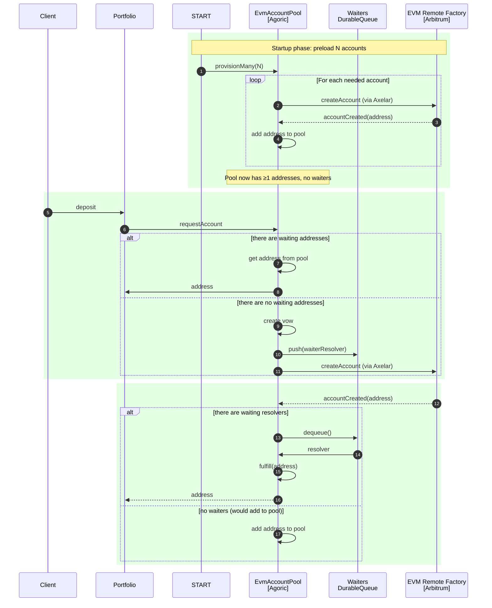
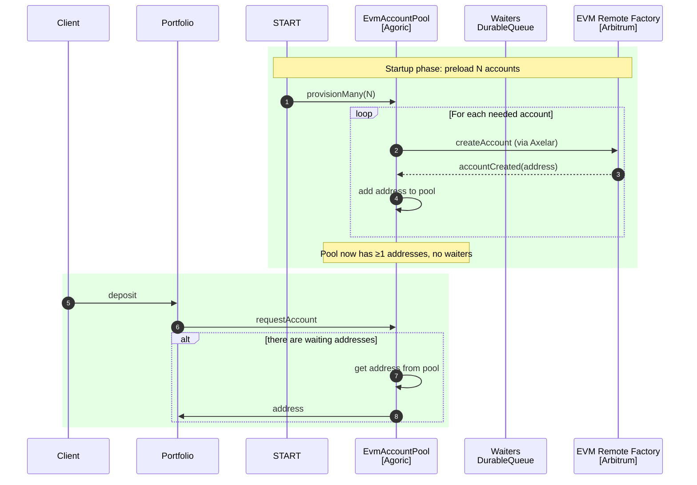
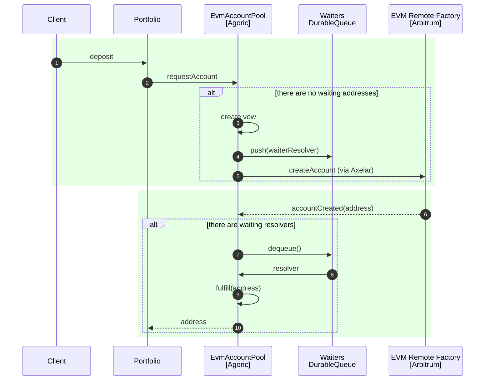

# Design: Abstract EVM makeAccount into the Orchestration API

## Summary

Today, orchestration accounts for Cosmos chains are created via `Chain.makeAccount()` from the orchestration API, but EVM accounts are made ad‑hoc inside `portfolio-contract` using Axelar GMP and a per‑chain Factory contract. This proposal defines an orchestration‑level EVM account abstraction so clients can write:

- `const eth = await orc.getChain('ethereum')`
- `const evmAcct = await eth.makeAccount()`

…with no dependency on `portfolio-contract`. Internally, the orchestration layer will encapsulate the Axelar GMP call to the per‑chain Factory contract, funding of the GMP fee, and readiness tracking of the remote smart wallet address. `portfolio-contract` will migrate to this API and drop its bespoke EVM account provisioning (`provideEVMAccount`, `sendMakeAccountCall`).

## Goals

- Add first‑class EVM `makeAccount` to the orchestration API for CAIP-2 `eip155:*` chains.
- Encapsulate Axelar GMP plumbing (memo construction, destination addresses, gas payload) within orchestration.
- Provide a typed EVM Account controller that can initiate GMP contract calls (for portfolio and other apps).
- Keep compatibility with Cosmos accounts and existing `Orchestrator` surface.
- Enable `portfolio-contract` to depend only on orchestration for EVM account provisioning.

## Non‑goals

- Implement generic EVM ERC‑20 balance/transfer over JSON-RPC (we only need GMP contract‑call capability in this iteration).
- Replace portfolio’s EVM protocol flows (Aave/Compound/Beefy) — only their account provisioning.

## Current state (as‑is)

- `packages/orchestration/src/orchestration-api.ts` exposes `Chain.makeAccount()` but is effectively Cosmos‑only. `packages/orchestration/src/ethereum-api.ts` is a placeholder.
- `packages/portfolio-contract/src/pos-gmp.flows.ts` implements EVM provisioning:
  - `provideEVMAccount(chain, gmp, lca, ctx, pk)`
  - `sendMakeAccountCall(dest, fee, lca, gmpChain, gmpAddresses, evmGas)`
  - Uses Axelar GMP memo to call a chain‑specific Factory contract that deploys a remote smart wallet for the source Agoric address.
- Portfolio maintains chain config for EVM: Axelar IDs, contract addresses, and Axelar Cosmos bech32 targets (`AXELAR_GMP`, `AXELAR_GAS`).

Problems:
- App‑specific code owns account creation and fee funding logic.
- No orchestration‑level EVM Account type; apps must build their own GMP calls.

## Proposed design (to‑be)

### API additions in orchestration

1) Introduce `EvmChainInfo` and `EvmAccountMethods` and make `Chain<...>.makeAccount` available for `namespace: 'eip155'`:

```ts
// packages/orchestration/src/ethereum-api.ts
export interface EvmChainInfo extends BaseChainInfo<'eip155'> {
  // Axelar routing metadata (from chain registry)
  axelarId: string; // e.g., 'Ethereum'
  // Contracts used for provisioning and CCTP
  contracts: {
    factory: `0x${string}`;
    usdc?: `0x${string}`;
    tokenMessenger?: `0x${string}`;
    // optional protocol addresses can remain app-level
  };
  // Cosmos-side Axelar bech32 addresses (on Agoric)
  gmpAddresses: { AXELAR_GMP: string; AXELAR_GAS: string };
}

export interface EvmAccountMethods {
  // 0x-address of the remote smart wallet
  getAddress(): Promise<`0x${string}`>;

  // Core primitive: send a batch of EVM contract calls via Axelar GMP
  gmpCall(calls: ContractCall[], opts?: { fee?: NatValue; evmGas?: bigint }): Promise<void>;

  // Optional helper: approve+call convenience can stay app-side initially
}
```

2) Extend `Chain<CI>.makeAccount()` to support EVM:

- For `CI extends EvmChainInfo`, return `Promise<OrchestrationAccountCommon & EvmAccountMethods>`.
- Keep Cosmos behavior unchanged.

3) Keep `OrchestrationAccountCommon` minimal for cross‑chain consistency. Do not retrofit Cosmos‑specific types (e.g., `Bech32Address`) into EVM; EVM account exposes `getAddress(): 0x…` and `gmpCall()` instead of `send/transfer`.

### Runtime behavior of EVM makeAccount

- Inputs (stable base context)
  - Chain info (from orchestrator’s ChainHub): `axelarId`, `contracts.factory`, `gmpAddresses`.
  - Local Chain Account (LCA) that can transfer funds on Agoric.
  - A fee funding account (may differ from LCA) – resolved lazily.
- Inputs (per attempt)
  - GMP fee `Amount<'nat'>` in configured denom supplied for each provisioning attempt.
  - EVM gas hint (`bigint`) supplied per attempt; can vary with network conditions.
  - (Retries reuse the last provided fee + gas automatically.)

- Steps
  1. Ensure LCA has sufficient fee funds. Optionally accept a `feeSource` option to top up LCA from another account when inside a contract.
   2. Build Axelar GMP memo each attempt:
     - `destination_chain = axelarId`
     - `destination_address = contracts.factory`
     - `payload = abi.encode(uint256 evmGas)` (attempt-specific gas hint)
     - `fee = { amount, recipient: AXELAR_GAS }` (attempt-specific fee)
  3. Transfer `fee` from LCA to `AXELAR_GMP` with memo.
  4. Derive or resolve the remote wallet 0x address:
     - If the factory uses a deterministic mapping from the CAIP‑10 Agoric account to a 0x address, compute and store it immediately.
     - Otherwise, return an account object with a promise that resolves the address when the return GMP confirms. Expose `getAddress()` that waits for readiness.
  5. Return an `EvmAccount` controller that encapsulates (4) and provides `gmpCall()` using the same fund‑and‑memo pattern, plus resolver integration.

- Failure modes and invariants
  - Insufficient funds for GMP fee: reject with a descriptive error including expected fee.
  - Chain unknown or disabled: reject.
  - Axelar routing error or timeout: reject or return a Vow that can be observed; align with “Always return vows rather than promises” in orchestration code where applicable.

### Configuration and data sources

- Move/centralize EVM chain metadata under orchestration:
  - Either consolidate into `packages/orchestration/src/cctp-chain-info.js` (already listed in tree) + a new `evm-contracts-info.js` or reuse a single registry that includes AxelarId and factory/usdc/tokenMessenger per chain.
  - Ensure this registry mirrors the set used by `services/ymax-planner` and is the single source of truth.

- Allow overrides via contract private args (similar to portfolio contract today) for testnets or custom deployments.

### Internal implementation components

- `exos/evm-orchestration-account.ts` (new): durable exo implementing `EvmAccountMethods` and storing stable chain metadata + fee funding account; does NOT store fee or gas, which are provided per attempt.

- `gmp.ts` utilities (already exist): reuse `buildGasPayload`, `buildGMPPayload` for memo and batching.

- `ethereum-api.ts` fleshed out: define types, and wire `Chain.makeAccount` to create/return the above exo.

### Type surface alignment

Current `OrchestrationAccountCommon` returns `CosmosChainAddress`. For EVM we’ll:
- Keep `OrchestrationAccountCommon` unchanged (Cosmos only).
- Provide `EvmAccountMethods.getAddress(): 0x…` and `getAccountId(): AccountId` as `eip155:<ref>:<0xaddr>` for CAIP‑10 parity. Consumers should prefer `getAccountId()` when cross‑chain routing is needed.

## Migration plan (incremental)

Phase 0 — groundwork
- Add EVM chain registry to orchestration (AxelarId, factory, gmpAddresses).
- Define `EvmChainInfo`, `EvmAccountMethods` types.

Phase 1 — orchestration implementation behind a feature flag
- Implement `Chain.makeAccount()` for `eip155` chains.
- Implement `exos/evm-orchestration-account.ts` with `gmpCall()` and memo construction.
- Provide defaults for fee amount and `evmGas` (configurable).

Phase 2 — adopt in portfolio‑contract
- Replace `provideEVMAccount` usages with:
  - `const chain = await orc.getChain(evmChainName)`
  - `const evmAcct = await chain.makeAccount()`
- Replace `sendMakeAccountCall()` with `await evmAcct.getAddress()` (to ensure readiness) and later `evmAcct.gmpCall(calls, { fee, evmGas })`.
- Keep protocol flows (Aave/Compound/Beefy) unchanged; they’ll call `sendGMPContractCall` replacement via the EVM account.

Phase 3 — deprecate bespoke helpers
- Remove `provideEVMAccount` and `sendMakeAccountCall`.
- Remove now‑duplicated EVM registry from portfolio, or point it at orchestration as the source of truth.

## Backwards compatibility and impacts

- `portfolio-contract`: internal refactor only; external behavior unchanged.
- Other apps relying on `portfolio-contract` EVM helpers can migrate at their pace; we’ll maintain both for one release behind a flag.
- No changes to Cosmos `makeAccount` semantics.

## Error handling and vows

- Orchestration code must return vows for long‑running operations. `makeAccount()` for EVM will:
  - Complete quickly by returning a controller that resolves its `getAddress()` when the remote wallet is confirmed (via the GMP return message), OR
  - Expose a public topic for readiness so UIs can reflect progress.

- `gmpCall()` will register a transaction (using resolver client when available) and return a promise/vow that settles when the on‑chain acknowledgement is received or scanned.

## Testing

- Unit
  - Memo construction: given inputs, verify built memo and payload encoding match expectations.
  - Fee funding path: error on insufficient funds.
  - Address derivation: if deterministic mapping exists, validate derivation against fixtures.

- Integration (multichain‑testing)
  - New scenario: `orchestrate(() => getChain('ethereum').makeAccount())` verifies:
    - GMP fee transfer posted on Agoric with expected memo.
    - Return GMP processed; `getAddress()` returns a valid 0x.
  - Update existing portfolio tests to use the new orchestration EVM account.

- Planner/service verification
  - Ensure `services/ymax-planner` continues to work; it should be unaffected (deals with watching EVM txs), but we’ll point it to the new chain registry source if necessary.

## Risks and mitigations

- Fee volatility: Supplying fee per attempt enables adapting to Axelar pricing changes; guard against too-low fees by preflight estimation.
- Gas mis-estimation: Per-attempt gas lets retries bump gas; include heuristic or exponential backoff strategy on failure.
- Fee funding inside orchestration may couple contracts to a fee source. Mitigation: accept an optional `feeSource` account or callback; default to the caller’s LCA.
- Chain registry drift between modules. Mitigation: single source of truth in orchestration, imported by portfolio and services.
- Non‑deterministic factory address derivation. Mitigation: expose readiness notifier; don’t assume immediate address availability.
- Watchers/resolver coupling. Mitigation: keep resolver client optional; fall back to event scanning where available.

## Open questions

- Is the remote wallet address deterministically derived from the Agoric account by the Factory? If yes, document and implement a pure derivation to avoid waiting.
- What default `evmGas` and GMP fee denomination should orchestration provide per chain? Can we compute from chain info (gas token pricing) or keep a static conservative default?
- Should orchestration expose higher‑level helpers for ERC‑20 approval and common protocols, or keep that at app level?

## Acceptance criteria

- `orchestration` exposes `Chain.makeAccount()` for `eip155` chains returning an `EvmAccount` with `getAddress()` and `gmpCall()` where `gmpCall(opts)` includes per-call fee/gas and provisioning uses per-attempt fee/gas, not static base context values.
- `portfolio-contract` switched to the orchestration API for EVM account provisioning; `provideEVMAccount` and `sendMakeAccountCall` are removed or deprecated.
- All unit and multichain integration tests pass, including the existing portfolio flows and new EVM makeAccount tests.

## Dean questions

- why is feeAccount a promise?


## References (code today)

- Portfolio EVM provisioning and calls:
  - `packages/portfolio-contract/src/pos-gmp.flows.ts`: `provideEVMAccount`, `sendMakeAccountCall`, `sendGMPContractCall`
  - `packages/portfolio-contract/src/portfolio.flows.ts`: EVM context construction and usage
  - `packages/portfolio-contract/src/evm-facade.ts`: type‑safe contract call batching
- Orchestration API and utils:
  - `packages/orchestration/src/orchestration-api.ts`: core types and `Chain`
  - `packages/orchestration/src/ethereum-api.ts`: placeholder for EVM
  - `packages/orchestration/src/utils/gmp.ts`: `buildGasPayload`, `buildGMPPayload`
- Services
  - `services/ymax-planner`: EVM providers, Axelar/CCTP watchers


## Full version




## Cached (preloaded pool path)


## Uncached (empty pool, deferred resolution via queue)


