# Resolver Service

## Overview

The resolver service monitors and resolves transactions between Agoric and remote EVM chains."Resolving" implies determining and reporting the transaction status (SUCCESS or FAILED) back to the ymax contract. It uses WebSocket connections to listen for specific events on EVM chains and automatically marks transactions as resolved when the expected events are detected.

## How It Works

The resolver:
- Maintains active WebSocket connections to EVM chains
- Listens for specific contract events based on transaction type
- Automatically resolves transactions when expected events are detected
- Sends alerts when transactions cannot be resolved automatically
- Never gives up on a transaction unless manually resolved

## Supported Transaction Types

### 1. MAKE_ACCOUNT

**Purpose:** Creates a remote EVM wallet for a user.

**How it resolves:**
- Listens for `SmartWalletCreated` events from the [Factory contract](https://github.com/agoric-labs/agoric-to-axelar-local/blob/c5b5b2892fe4fe3f822ba460dc9b35239a3fdc2e/packages/axelar-local-dev-cosmos/src/__tests__/contracts/Factory.sol#L155)
- Automatically resolves when event matches:
  - **Wallet address:** The created wallet address matches the expected address

**Limitations:**
- Cannot detect failures automatically
- Failures require manual resolution

---

### 2. CCTP_TO_EVM

**Purpose:** Transfers USDC from Agoric to a remote EVM wallet via CCTP (Cross-Chain Transfer Protocol).

**How it resolves:**
- Listens for ERC20 `Transfer` events from the USDC token contract
- Automatically resolves when a transfer matches all conditions:
  - **Recipient address:** Transfer TO the expected remote EVM wallet address
  - **Token contract:** Transfer FROM the USDC token contract (exact match)
  - **Amount:** Exact match of the expected USDC amount

**Limitations:**
- Cannot detect CCTP failures automatically
- Failures require manual resolution

---

### 3. GMP (General Message Passing)

**Purpose:** Deploys or withdraws funds from the remote EVM wallet to/from an EVM protocol.

**How it resolves:**
- Listens for `MulticallStatus` events from the [remote EVM wallet](https://github.com/agoric-labs/agoric-to-axelar-local/blob/c5b5b2892fe4fe3f822ba460dc9b35239a3fdc2e/packages/axelar-local-dev-cosmos/src/__tests__/contracts/Factory.sol#L82)
- Automatically resolves when event matches:
  - **Transaction ID:** The event's txId hash matches the expected transaction ID

**Failure detection:**
- After 30 minutes without resolution, checks [AxelarScan](https://axelarscan.io/) for transaction status
- If AxelarScan confirms failure, automatically marks transaction as "failed"
- If AxelarScan has no record, proceeds to alerting (see below)

---

## Alert System

### When Alerts Are Triggered

Alerts are sent when:
- **MAKE_ACCOUNT / CCTP_TO_EVM:** No expected event after 30 minutes
- **GMP:** No expected event after 30 minutes AND no status found on AxelarScan

### Alert Behavior

- Alerts are sent every 30 minutes until the transaction is resolved
- The resolver **continues processing** the transaction even after alerting
- WebSocket listeners remain active
- For GMP transactions, AxelarScan checks continue periodically
- The resolver never abandons a transaction

---

## Summary Matrix

| Transaction Type | Listens For | Contract Monitored | Auto-Resolve Success | Auto-Detect Failure |
|-----------------|-------------|-------------------|---------------------|---------------------|
| MAKE_ACCOUNT | `SmartWalletCreated` | Factory | ✅ | ❌ |
| CCTP_TO_EVM | ERC20 `Transfer` | USDC Token | ✅ | ❌ |
| GMP | `MulticallStatus` | Remote EVM Wallet | ✅ | ✅ (via AxelarScan) |

---

---

## Transaction Resolution Flow

```mermaid
flowchart LR
  Start([New Transaction]) --> TxType{Transaction<br/>Type?}

  TxType -->|MAKE_ACCOUNT| ListenMA[Listen: SmartWalletCreated Events<br/>Contract: Factory]
  TxType -->|CCTP_TO_EVM| ListenCCTP[Listen: ERC20 Transfer Events<br/>Contract: USDC Token]
  TxType -->|GMP| ListenGMP[Listen: MulticallStatus Events<br/>Contract: Remote Wallet]

  ListenMA --> Wait{Event Found in<br/>30 min?}
  ListenCCTP --> Wait
  ListenGMP --> Wait

  Wait -->|Yes| Success[✅ SUCCESS]
  Wait -->|No| NoEvent{Tx Type<br/>is GMP?}

  NoEvent -->|No| Alert[🔔 Alert Sent]
  NoEvent -->|Yes| Check{Check<br/>AxelarScan}

  Check -->|Error| Failed[❌ FAILED]
  Check -->|Unknown| Alert

  Alert --> Loop[Keep Listening<br/>Alert Every 30min]
  Loop -->|Event Found| Success

  %% 👇 Explicit manual step (very visible)
  Loop --> Manual[🧑‍💻 Manual Intervention]
  Manual --> Decide{Operator<br/>Decision}
  Decide -->|Success| Success
  Decide -->|Failed| Failed

  Success --> Done([Transaction Settled])
  Failed --> Done

  style Success fill:#90EE90
  style Failed fill:#FFB6C6
  style ListenMA fill:#E3F2FD
  style ListenCCTP fill:#E3F2FD
  style ListenGMP fill:#E3F2FD
  style Alert fill:#FFE4B5
  style Loop fill:#FFF4E0
  style Manual fill:#E6E6FA,stroke:#6A5ACD,stroke-width:2px

```

