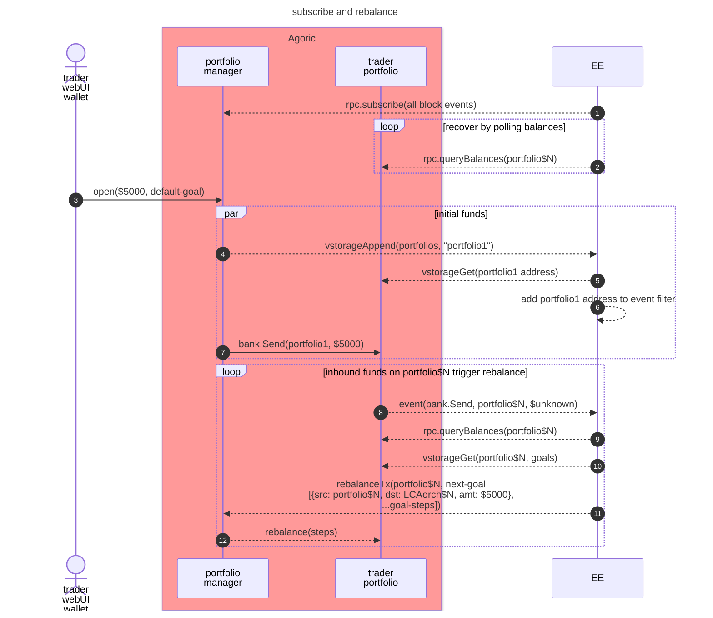

# Portfolio Planner

### Subscribe to portfolios and rebalance



## Development

### Prerequisites

- Node.js 20+
- yarn

### Setup

1. Install dependencies:
```bash
yarn install
```
2. Optionally run a local Docker version of the planner's dependencies:
```bash
npm run start:deps
```

### Local Development

```bash
npm run dev
```

This starts the development server with hot reloading.

### Testing

```bash
npm test
```

## Configuration

Environment variables:

- `AGD`: Executable for the Cosmos command-line interface (`agd`)
- `AGORIC_RPC_URL`: URL for the Agoric chain's RPC node (`http://localhost:26657`)
- `CHAIN_ID`: Chain ID for transactions to the Agoric chain (autodetect via RPC)
- `FROM`: Existing AGD key for sending transactions to Agoric (`planner`)
- `HOME`: Where AGD state is kept, namely `$HOME/.agoric`
- `REDIS_URL`: URL for Redis service
- `DOTENV`: Path to environment file containing defaults of above (`.env`)

## Architecture


## License

Apache-2.0
