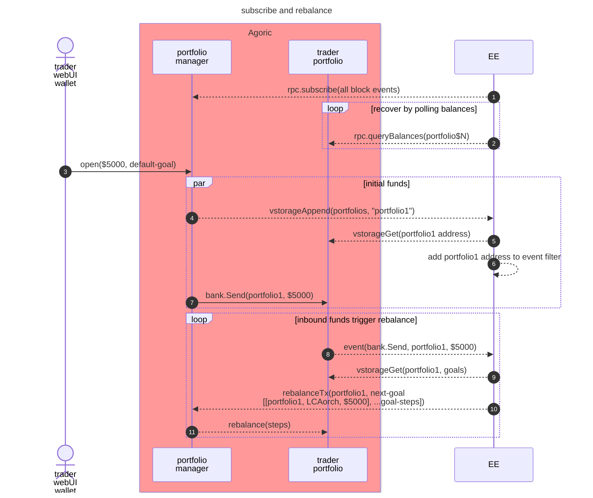

# Portfolio Planner

### Subscribe to portfolios and rebalance



## Development

### Prerequisites

- Node.js 20+
- yarn

### Setup

1. Install dependencies:
```bash
yarn install
```
2. Optionally run a local Docker version of the planner's dependencies:
```bash
npm run start:deps
```

### Local Development

```bash
npm run dev
```

This starts the development server with hot reloading.

### Testing

```bash
npm test
```

## Configuration

Environment variables:

- TODO: `HD_SEED`: BIP39 Seed/mnemonic to use for generating keys
- TODO: `HD_PATH`: Default BIP44 path (`m/44'/118'/0'/0/0`)
- `AGORIC_RPC_URL`: URL for the Agoric chain's RPC node (`http://localhost:26657`)
- `REDIS_REST_URL`: URL for `@upstash/redis` (including explicit port number)
- `REDIS_REST_TOKEN`: API token for `REDIS_REST_URL`

## Architecture


## License

Apache-2.0
